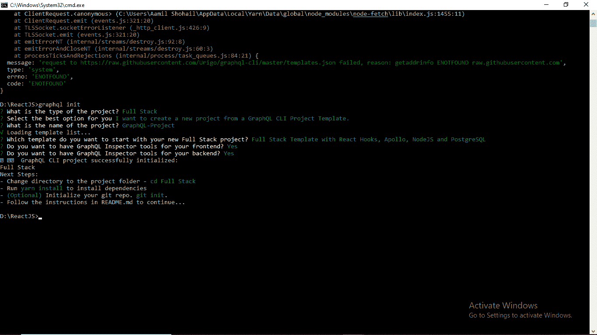

# 2020 年前六大 GraphQL 客户端

> 原文：<https://javascript.plainenglish.io/top-six-graphql-clients-for-2020-666a7bc00e73?source=collection_archive---------7----------------------->


Photo by [Ilaya Pavlov](http://unsplash.com/@ilayapavlov) on [Unsplash](https://unsplash.com/)

这是一篇关于 2020 年绝对新手顶级 GraphQL 客户端的全新文章。在转到内容之前，建议接受 GraphQL 方面的培训，并至少对服务器端和客户端有一个基本的了解。

# **什么是 GraphQL？**

GraphQL 是一种令人困惑的技术和架构风格。GraphQL 是一种强大的查询语言，由 Facebook.inc 开发，用于在客户端(浏览器)和服务器之间进行通信。它允许我们以比 RESTful 方法更灵活、更直观的语法和更高效的方式构建数据驱动的应用程序。GraphQL 只处理一个端点，post 请求总是到达这个端点。GraphQL 可以在任何服务器端语言框架中实现，也可以在任何前端语言框架中实现。

## **graph QL 的优点**

GraphQL 允许查询数据并得到他们想要的东西。

使用 GraphQL，可以在单个工作表中查询多个相关资源。换句话说，可以跨关系进行查询。

它为查询相关的对象提供了灵活性，并得到与查询本身完全相同的响应。

# **1。阿波罗客户端**

阿波罗客户端是一个完整的数据管理解决方案，适用于任何客户端。由于 Apollo 客户端是一个全功能的缓存 GraphQL，它允许从 GraphQL 服务器获取数据。这是一个社区驱动的努力，以建立一个易于理解，灵活和强大的 GraphQL 客户端。它还是一个全面的状态管理库，能够使用 GraphQL 管理本地和远程数据。

Apollo 客户机包括 React 钩子和 GraphQL 请求处理。

Apollo 客户端的缓存更加灵活，性能更高。

最新版本的 Apollo 支持垃圾收集，存储规范化和非规范化数据。此外，它还可以使用 TypePolicy 和 FieldPolicy APIs 定制缓存数据。

## **React 应用程序中的阿波罗客户端**

让我们安装最新版本的阿波罗客户端和所需的软件包，

```
npm install @apollo/client graphql
```

创建名为 apolloClient.js 的组件

在 apolloClient.js 组件中创建一个客户端。

现在已经安装了所有的依赖项，让我们初始化一个 ApolloClient 实例。

导入 ApolloClient 和 InMemoryCache。

```
import { ApolloClient, InMemoryCache, gql } from “@apollo/client”;
```

让我们将导出函数定义如下:

```
export const ApolloClientExapmle = () => {}
```

现在，在函数中添加以下代码片段。

可以注意到，uri 是一个正在运行的 GraphQL 服务器的 URL。即 CodeSandbox。

现在，客户端已经准备好获取数据。

让我们定义一个查询字符串如下，建议导入 gql 函数解析查询字符串(已经导入)。

连接客户端以做出反应

打开 ApolloClient.js 组件并导入 ApolloProvider，如下所示，

```
import { ApolloProvider } from “@apollo/client”;
```

将代码片段添加到 return 语句中，如下所示:

现在让我们运行代码，

这可以从一份声明中观察到。

打开控制台并检查结果对象。显然，我们可以观察到一个数据属性，其速率与负载和网络状态相关联。

输出:


# **2** 。**graph QL-请求**

它被称为同构，因为它既适用于节点又适用于浏览器。它是一个最小的 GraphQL 客户端，支持脚本和简单应用程序的节点和浏览器。它包括几个特征。这是一个轻量级的简单的 GraphQL 客户端。它还可以与 async 和 await 一起工作。值得注意的是，它支持 Typescript。

## **graph QL-React 应用程序中的请求**

让我们创建一个简单的 GraphQL 查询。

让我们使用节点包管理器(npm)安装最新版本的 graphql-request

```
npm install graphql-request
```

创建一个名为 graphqlRequest.js 的组件

按如下方式导入 graphql-request:

```
import request from “graphql-request”;
```

让我们将导出函数定义如下:

```
export const GraphqlRequest = () => {}
```

在函数中添加以下内容

现在让我们创建一个查询

它是从电影中检索数据。

让我们请求控制台日志中的相应数据，如下所示:

```
request(“https://api.graph.cool/simple/v1/movies", query).then((data) =>console.log(data));
```

添加以下 return 语句

最后，调用 graphqlRequest.js 组件和 App.js 组件中的相关函数，如下所示:

输出:


# **3。GraphQL-CLI**

它是一个用于通用 GraphQL 开发工作流的命令行工具。它具有重新格式化(缩进，修饰)查询语言和重新格式化模式定义语言的特性。因为它有一个强大的插件系统，它可以用自定义命令扩展 graphql-cli。GraphQL 的主要目的是为社区提供一个默认的入口点，使用成熟的技术来构建和部署支持 GraphQL 的应用程序，同时与供应商无关。

在 GraphQL CLI 的最新版本中，可以观察到几个特性。

它有重要和有用的命令，以改善日常工作流程，从开始到长期维护。

它拥有丰富的生态系统，并且兼容库、编辑器和 ide。

使用命令行界面(CMD)使用 npm 安装 CLI

```
npm install graphql-cli@canary
```

让我们通过在 CMD 中执行以下命令，使用 GraphQL CLI 创建一个新项目:

```
graphql init
```

GraphQL CLI 将通过询问几个问题进行如下指导:

```
? What is the type of the project? Full Stack? Select the best option for you I want to create a new project from a GraphQL CLI Project Template.? What is the name of the project? GraphQL-Project√ Loading template list...? Which template do you want to start with your new Full Stack project? Full Stack Template with React Hooks, Apollo, NodeJS and PostgreSQL? Do you want to have GraphQL Inspector tools for your frontend? Yes? Do you want to have GraphQL Inspector tools for your backend? Yes🚀 GraphQL CLI project successfully initialized:Full StackNext Steps:- Change directory to the project folder - cd Full Stack- Run yarn install to install dependencies- (Optional) Initialize your git repo. git init.
```

将目录更改为项目文件夹，即 cd 全栈

安装依赖项

```
yarn install
```

将目录切换到项目文件夹，即 GraphQL-Project，并执行以下命令

启动数据库

```
docker-compose up -d
```

生成资源(模式和解析器)并创建数据库

纱线图生成—后端

```
yarn graphql generate –backendyarn graphql generate — db
```

为数据库模式和解析程序生成类型

```
yarn schemats generateyarn graphql codegen
```

启动服务器

```
yarn start: server
```

为客户端项目生成查询、变更和订阅

```
yarn graphql generate — client
```

生成反应组分

```
yarn graphql codegen
```

启动 React 应用程序

```
yarn start:client
```

输出:



# **4。GraphQL-Compose**

对于在 Node.js 上生成复杂的 GraphQL 模式，这是一个非常好的工具包。

它包括编辑 GraphQL 输出/输入类型(添加/删除/字段/参数/接口)的方法。引入了 graphql fieldConfigs，即 Resolver，可用于搜索、更新和删除记录。

它提供了一个从 OutputType 到 InputType 的转换器和一个从 AST 的投影解析器。graph QL-composite 提供了一个类型注册表，其中包含一系列用于编程模式构建的方法。

它具有 GraphQL 模式语言的一个特征，用于定义简单类型。

**顶置式发电机。**

*   graph QL-composite-JSON
*   GraphQL-const-mongose
*   graph QL-composite-elastics search
*   graph QL-composite-AWS

**实用插件**

*   graph QL-合成-继电器
*   graph QL-撰写-连接
*   graph QL-composite-DataLoader

```
npm install graphql-compose
```

让我们导入所需的模块:

```
import { schemaComposer } from “graphql-compose”;
```

让我们如下创建一些模拟数据。作者和文章的两个数组:

构建 GraphQL 模式从复杂的类型声明开始。它们的名称必须唯一。让我们创建如下两种不同的类型:

让我们在上述两种类型之间建立关系。

让我们构建一个模式

我们刚刚建立了两种类型，这些类型是链接的，能够获取数据。现在，建议使用刚刚从上面的模块导入的 schemaComposer 初始化模式。

在这里，它请求将哪些读取数据放入查询。

修改数据的请求被放入突变

在根类型定义之后，我们准备构建一个必须传递给 express-graphql 的模式。

```
export const schema = schemaComposer.buildSchema();
```

让我们创建一个 HTTP 服务器

我们已经成功构建了模式；它需要实现一个服务器。如上所述，让我们导入 express-graphql 和所需的依赖项。

```
import express from ‘express’;import graphqlHTTP from ‘express-graphql’;
```

最终，我们成功地开发了 graph QL-composite。

# **5 .@octokit/GraphQL**

它是一个用于浏览器和节点的 GitHub GraphQL API 客户端。它提供了几个优点，

发送简单的查询

简单的身份验证方式

它可以与 GitHub 企业版一起使用

利用自定义@octokit/request 实例

Octokit。GraphQL 提供了对. Net 中的 GitHub GraphQL API 的访问。它还将 GitHub GraphQL API 公开为一种强类型语言集成查询，类似于旨在尽可能遵循 GraphQL 查询语法的 API，这提供了强类型化的好处。Net 语言。

```
npm install @octokit/graphql
```

从 octokit 库中导入 graphql，如下所示:

```
import { graphql } from “@octokit/graphql”;
```

让我们发送一个简单的查询如下:

这里建议对请求进行身份验证。因此，最简单的身份验证方法是设置授权头。

如上所述，需要生成 PAT(个人访问令牌)并使用授权头中的密钥。

可通过[生成 PAT，此处为](https://github.com/settings/tokens)

# **6。继电器**

这是一个由 GraphQL 支持的 JavaScript 框架，用于构建数据驱动的 React 应用程序。继电器耦合 React 和 GraphQL。使用 Relay 的最大好处是，relay-compiler 不包含在前端包中，使用户不必下载整个 GraphQL 解析器——它在构建时“预编译”GraphQL 查询。

不幸的是，每当任何 GraphQL 查询或模式中有修改时，都需要运行中继编译器。

为了在客户端运行中继，必须遵循以下规范。

建议在**中插入一个继电器插件。babelrc** 配置

将中继编译器设置为 yarn 脚本

设置中继环境，即本质上获取实用程序以将数据传递到中继环境

QueryRenderer 的实现

让我们使用 npm 安装反应继电器

```
npm install react-relay
```

让我们创建一个名为 ReactRelay.js 的组件

中继环境

让我们设置中继环境。这是因为该环境将中继运行所需的配置、高速缓存和网络处理捆绑在一起。

让我们安装所需的模块来配置环境。

```
npm install relay-runtime
```

让我们按如下方式导入继电器时间模块:

```
import { Environment, Network, RecordSource, Store } from “relay-runtime”;
```

让我们获取查询。

让我们将查询呈现如下:

环境的配置

```
const environment = new Environment({network: Network.create(fetchQuery),store: new Store(new RecordSource()),});
```

让我们创建一个 ReactRelay 导出函数，如下所示:

```
export const Example = () => {}
```

将以下代码片段添加到上述函数的 return 语句中

打开 App.js 文件并导入 ReactRelay，如下所示:

```
import { ReactRelay} from “./graphql/ReactRelay”;
```

**结论**

GraphQL 基本上是一种查询语言。GraphQL 查询是发送给运行时的字符串，它将 JSON 返回给客户机。随着 GraphQL 越来越多地被采用，一个丰富活跃的生态系统开始围绕它成长。它不依赖于任何数据库或存储，由代码和数据提供支持。GraphQl 不处理专用资源。相反，一切都被视为一个图形，暗示它是连接的。GraphQL 库使前端的快速产品迭代成为可能，因为它允许开发人员在客户端进行更改，而无需对服务器进行任何改动。

GraphQL 允许查询数据并得到他们想要的东西。

使用 GraphQL，可以在单个工作表中查询多个相关资源。换句话说，可以跨关系进行查询。

它为查询相关的对象提供了灵活性，并得到与查询本身完全相同的响应。