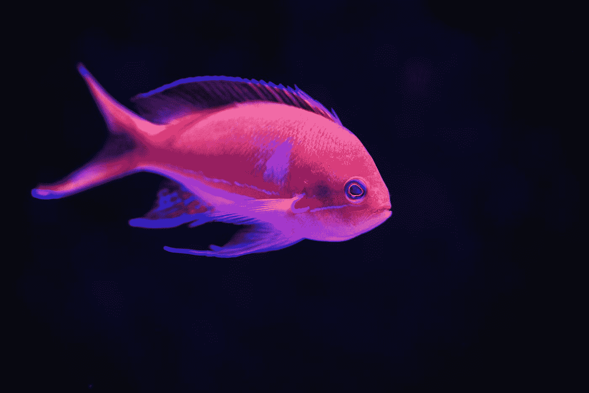
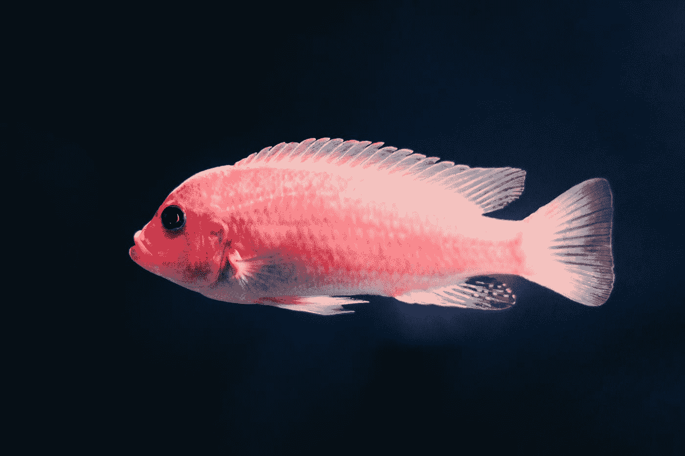

# 用于添加头像、幻灯片和工具提示的顶级 Vue 包

> 原文：<https://javascript.plainenglish.io/top-vue-packages-for-adding-avatar-slides-and-tooltips-2d2f04a90410?source=collection_archive---------7----------------------->



Photo by [David Clode](https://unsplash.com/@davidclode?utm_source=medium&utm_medium=referral) on [Unsplash](https://unsplash.com?utm_source=medium&utm_medium=referral)

Vue.js 是一个易于使用的 web 应用框架，我们可以用它来开发交互式前端应用。

在这篇文章中，我们将看看添加头像、滑动和工具提示的最好的软件包。

# 虚拟化身

vue-avatar 让我们可以轻松地在 vue 应用程序中添加头像。

为了使用它，我们运行:

```
npm i vue-avatar
```

然后我们可以通过导入`Avatar`组件来使用它:

```
<template>
  <div class="demo">
    <avatar username="Jane Smith"></avatar>
  </div>
</template>

<script>
import Avatar from "vue-avatar";export default {
  name: "app",
  components: {
    Avatar
  }
};
</script>
```

我们只是将名称设置为`username`属性的值，以显示一个带有首字母的圆圈。

要添加图像，我们可以使用`src`道具:

```
<template>
  <div class="demo">
    <avatar src="http://placekitten.com/200/200"></avatar>
  </div>
</template>

<script>
import Avatar from "vue-avatar";export default {
  name: "app",
  components: {
    Avatar
  }
};
</script>
```

它还支持改变许多其他选项，如颜色、背景、大小、圆形、自定义样式等等。

# vue-awesome-swiper

vue-awesome-swiper 组件允许我们添加一个滑块，我们可以滑动到我们的 vue 应用程序。

它非常适合创建旋转木马和幻灯片。

要安装它，我们运行:

```
npm i vue-awesome-swiper
```

然后我们可以通过注册插件和导入样式来使用它:

`main.js`

```
import Vue from "vue";
import App from "./App.vue";
import "swiper/css/swiper.css";
import VueAwesomeSwiper from "vue-awesome-swiper";
Vue.use(VueAwesomeSwiper);Vue.config.productionTip = false;new Vue({
  render: h => h(App)
}).$mount("#app");
```

然后，我们可以通过编写以下代码在组件中使用它:

```
<template>
  <swiper ref="mySwiper" :options="swiperOptions">
    <swiper-slide v-for="n in 10" :key="n">Slide {{n}}</swiper-slide>
    <div class="swiper-pagination" slot="pagination"></div>
  </swiper>
</template>

<script>
export default {
  name: "carrousel",
  data() {
    return {
      swiperOptions: {
        pagination: {
          el: ".swiper-pagination"
        }
      }
    };
  },
  computed: {
    swiper() {
      return this.$refs.mySwiper.$swiper;
    }
  },
  mounted() {
    this.swiper.slideTo(3, 1000, false);
  }
};
</script>
```

`swiper-slide`有幻灯片。

`swiperOptions`有选项。我们设置了用于改变幻灯片的按钮，使其具有类别`swiper-pagination`。

swiper 对象在`this.$refs.mySwiper.$swiper`属性中可用。

然后我们可以调用类似于`slideTo`方法的方法来滑动到给定索引的幻灯片。

1000 是延迟。

第三个参数表明我们不想运行回调。

或者，我们可以把它作为一个指令。

例如，我们可以写:

```
<template>
  <div v-swiper:mySwiper="swiperOptions">
    <div class="swiper-wrapper">
      <div class="swiper-slide" :key="n" v-for="n in 10">
        
        <p>slide {{n}}</p>
      </div>
    </div>
    <div class="swiper-pagination"></div>
  </div>
</template>

<script>
export default {
  name: "carrousel",
  data() {
    return {
      swiperOptions: {
        pagination: {
          el: ".swiper-pagination"
        }
      }
    };
  }
};
</script>
```

我们使用了`v-swiper:mySwiper`指令来创建带有`swiperOptions`对象的 swiper。

现在我们得到了相同的滑块，但是没有自动滑动到给定的幻灯片。

必须设置这些类，以便我们在幻灯片上找到正确的项目。

它可以处理许多事件，如单击边、过渡等等。

# 垂直工具提示

要向我们的 Vue 应用程序添加工具提示，我们可以使用 v-tooltip 组件。

要安装它，我们运行:

```
npm i v-tooltip
```

然后我们可以通过写来使用它:

```
import Vue from "vue";
import App from "./App.vue";
import VTooltip from "v-tooltip";Vue.use(VTooltip);Vue.config.productionTip = false;new Vue({
  render: h => h(App)
}).$mount("#app");
```

注册组件和指令。

然后在我们的组件中，我们可以写:

```
<template>
  <div>
    <button v-tooltip="`You have ${count} messages`">click me</button>
  </div>
</template>

<script>
export default {
  data() {
    return { count: 100 };
  }
};
</script>
```

当鼠标悬停在按钮上时显示工具提示。

`v-tooltip`组件让我们添加工具提示。

我们也可以用一些修饰语来改变位置:

```
<template>
  <div>
    <button v-tooltip.right="`You have ${count} messages`">click me</button>
  </div>
</template>

<script>
export default {
  data() {
    return { count: 100 };
  }
};
</script>
```

我们还可以添加类，以便我们可以设置工具提示的样式:

```
<template>
  <div>
    <button
      v-tooltip.right="{ content: `You have ${count} messages`, classes: ['a', 'b'] }"
    >click me</button>
  </div>
</template>

<script>
export default {
  data() {
    return { count: 100 };
  }
};
</script>
```

我们在对象中有`classes`属性。`content`有内容。



Photo by [Paweł Czerwiński](https://unsplash.com/@pawel_czerwinski?utm_source=medium&utm_medium=referral) on [Unsplash](https://unsplash.com?utm_source=medium&utm_medium=referral)

# 结论

vue-avatar 包让我们可以轻松地添加头像。

v-tooltip 包是一个在我们的应用程序中添加工具提示的很棒的包。

vue-awesome-swiper 允许我们在应用程序中添加幻灯片。

## 简单英语的 JavaScript

你知道我们有四份出版物和一个 YouTube 频道吗？在 [**plainenglish.io**](https://plainenglish.io/) 和 [**找到他们订阅我们的 YouTube 频道**](https://www.youtube.com/channel/UCtipWUghju290NWcn8jhyAw) **！**