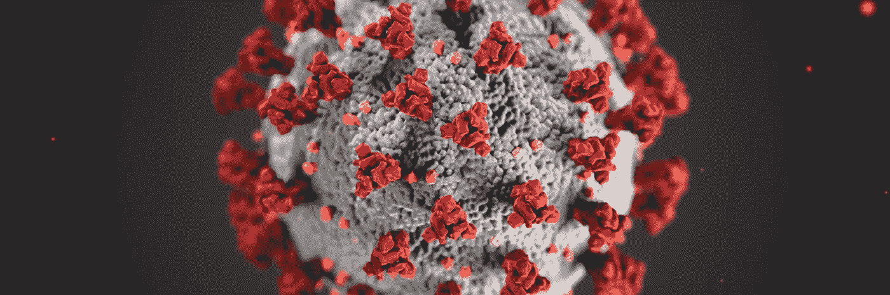
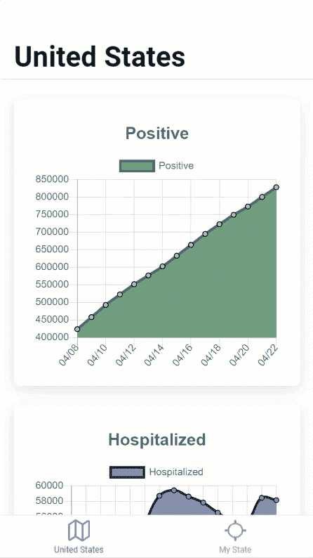

# 使用移动应用跟踪新冠肺炎

> 原文：<https://javascript.plainenglish.io/tracking-covid-19-with-a-mobile-app-using-ionic-react-js-and-chart-js-e8e27b2acf2e?source=collection_archive---------12----------------------->



COVID-19

在我的上一篇文章中，我写了一篇关于如何使用 Vue.js 和 Chart.js 创建一个仪表板的教程。这个教程很受欢迎，但是我觉得移动应用会更方便。在本教程中，我们将介绍如何使用[离子](https://ionicframework.com/)、[reactor . js](https://reactjs.org/)和 [Chart.js](https://www.chartjs.org/) 创建新冠肺炎跟踪应用程序。

# 离子命令行界面

要生成离子应用程序，我们需要安装离子 CLI。打开您的终端并运行以下命令:

```
npm install -g @ionic/cli
```

# 项目设置

我们要做的第一件事是创建一个基本的离子键应用程序，并指定 React.js 的语言。打开您的终端，cd 到所需的目录中，然后运行以下命令:

```
ionic start covid-app tabs --type=react
```

项目生成完成后，在您的首选代码编辑器中打开它。我将使用 VS 代码。然后，在项目的根目录下打开一个终端(在 VS 代码中，终端= >新终端)，并运行以下命令:

```
npm i axios moment chart.js react-chartjs-2
```

# App.tsx

CLI 生成我们的应用程序后，在您的首选代码编辑器中打开该项目(我将使用 VS 代码)。然后，打开 src/App.tsx。在文件的顶部，您会看到这个导入:

```
*import* { ellipse, square, triangle } *from* 'ionicons/icons';
```

我们将用以下内容替换该行:

```
*import* { locateOutline, mapOutline } *from* "ionicons/icons";
```

接下来，我们将从应用程序中删除第三个选项卡。找到并删除这些线条:

```
*import* Tab3 *from* "./pages/Tab3";<Route *path*="/tab3" *component*={Tab3} /><IonTabButton *tab*="tab3" *href*="/tab3">
  <IonIcon *icon*={square} />
  <IonLabel>Tab 3</IonLabel>
</IonTabButton>
```

对于剩下的标签，我们将更改标签和图标。找到锂离子电池组件并更换为:

```
<IonTabBar *slot*="bottom">
  <IonTabButton *tab*="tab1" *href*="/tab1">
    <IonIcon *icon*={mapOutline} />
    <IonLabel>United States</IonLabel>
  </IonTabButton>
  <IonTabButton *tab*="tab2" *href*="/tab2">
    <IonIcon *icon*={locateOutline} />
    <IonLabel>My State</IonLabel>
  </IonTabButton>
</IonTabBar>
```

# 删除选项卡 3 文件

由于我们已经从 App.tsx 中删除了第三个标签，我们可以从项目中删除这些文件。在 src/page 中找到 Tab3.css 和 Tab3.tsx，并将其从项目中删除。

# 表 1

接下来，打开 page/tab 1，并在导入结束时添加以下内容:

```
import axios from "axios";
import moment from "moment";
```

在@离子键/反应键导入中，添加更高级的组件 withIonLifeCycle。您的导入应如下所示:

```
*import* { IonContent, IonHeader, IonPage, IonTitle, IonToolbar, withIonLifeCycle } *from* '@ionic/react';
```

为了使用离子生命周期钩子，我们需要用它包装我们的导出默认值:

```
*export* *default* *withIonLifeCycle*(Tab1);
```

为了在 reactor 中使用带有基于类的组件的 [Typescript](https://www.typescriptlang.org/) ，我们将在文件的顶部创建一个接口来保存我们的数据类型:

Interfaces

接下来，我们将把我们的组件从基于函数的更改为基于类的。这样，我们可以使用一个离子生命周期挂钩来获得用户的位置。为此，更换:

```
const *Tab1*: *React.FC* =()=>{
```

带:

```
class Tab1 *extends* React*.*Component<{}, MyState> {
```

然后，用渲染方法包装你的 JSX，并修复你的拖尾括号。

现在，在反应组件的顶部，我们将设置我们的状态来保存我们将用于图表的数据:

接下来，我们将在渲染方法上方添加一个离子生命周期钩子，以获取我们的数据并将其推入我们的数组中:

在 JSX，我们将从 IonTitle 标签中删除“Tab 1”并替换为“United States”。然后，移除浏览容器。您的功能组件返回语句将类似于:

```
<IonPage>
  <IonHeader>
    <IonToolbar>
      <IonTitle>*United States*</IonTitle>
    </IonToolbar>
  </IonHeader>
  <IonContent>
    <IonHeader *collapse*="condense">
      <IonToolbar>
        <IonTitle *size*="large">United States</IonTitle>
      </IonToolbar>
    </IonHeader>
  </IonContent>
</IonPage>
```

因为我们已经从选项卡中删除了 ExploreContainer，所以我们可以从组件目录(src/components/explore container . CSS & src/components/explore container . tsx)中删除它的文件。

# 图表组件

现在是制作图表组件的时候了。在组件目录中，我们将创建一个名为 Chart.tsx 的新文件。在文件的顶部，我们将导入我们需要的依赖项:

```
*import* React *from* 'react';
*import* { IonCard, IonCardContent } *from* '@ionic/react';
*import* { Line } *from* 'react-chartjs-2';
```

接下来，我们将声明我们的状态和道具的形状，我们将把它们传递给组件:

现在我们可以创建组件了:

接下来，在 render 方法之上，我们将使用一个名为 *componentDidMount 的生命周期钩子。*在这个方法中，我们将操作传入的数据，以便在图表中正确显示。我们还会将数组调整到最后 15 个数据点，这样图表在移动设备上看起来会更好。

最后，我们将把我们在文件顶部导入的折线图添加到我们的渲染方法中，并传递所需的道具。完成后的文件应该如下所示:

# 将组件导入表 1

现在，我们需要做的就是将我们的图表组件添加到 Tab1.tsx 中。您需要检查每个图表在其数组中都有数据，并且我们没有主动调用来获取数据(isLoading)。最终的 Tab1.tsx 文件应该如下所示:

# “完成”选项卡

现在，您应该看到类似这样的内容:



# 结论

我本来打算在第 2 部分中为用户的状态添加一个标签，但是我想看看你能想到什么。请在下面的评论中分享。如果你不想搞清楚，我会帮你搞定的😈。看看这个[比特桶回购](https://bitbucket.org/TheDiligentDev/covid-app/src/master/)。

如果您有任何问题、意见或顾虑，请在下面的评论区留下。下次见，编码快乐！

回购:【https://bitbucket.org/TheDiligentDev/covid-app/src/master/ 

## **用简单英语写的 JavaScript 笔记**

我们已经推出了三种新的出版物！请关注我们的新出版物:[**AI in Plain English**](https://medium.com/ai-in-plain-english)[**UX in Plain English**](https://medium.com/ux-in-plain-english)[**Python in Plain English**](https://medium.com/python-in-plain-english)**——谢谢，继续学习！**

**我们也一直有兴趣帮助推广高质量的内容。如果您有一篇文章想要提交给我们的任何出版物，请发送电子邮件至[**submissions @ plain English . io**](mailto:submissions@plainenglish.io)**，使用您的 Medium 用户名，我们会将您添加为作者。另外，请让我们知道您想加入哪个/哪些出版物。****