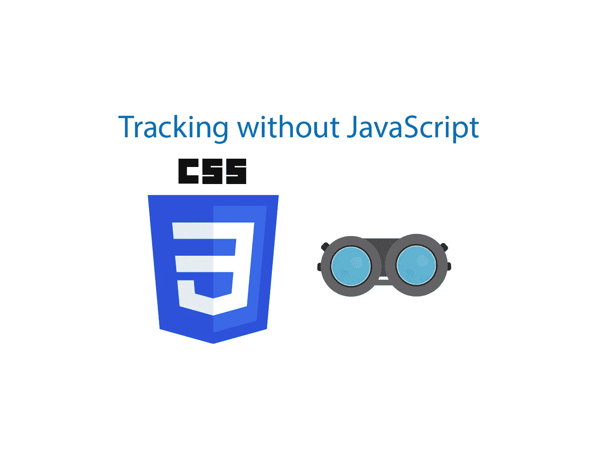
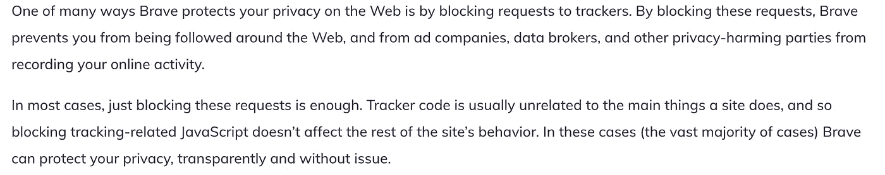

# 仅使用 CSS 进行用户跟踪

> 原文：<https://javascript.plainenglish.io/tracking-with-css-ec98e3d81046?source=collection_archive---------7----------------------->

## 设备类型、操作系统和网站上的动态

Source: The author

浏览器中的用户跟踪一次又一次地引起关于隐私和数据保护的讨论。谷歌分析(Google Analytics)这样的工具几乎可以找出一切——来源、语言、设备、保留时间等等。

但是要获得一些有趣的信息，你不需要任何外部跟踪器——甚至不需要 JavaScript。本文将向您展示如何跟踪用户行为，即使用户禁用了 JavaScript。

# 追踪器通常如何工作

因此，规则是 JavaScript 用于这种分析工具——所以大多数信息非常容易阅读，并且可以立即发送到服务器。

这也是为什么浏览器中屏蔽追踪器工具的方式越来越多的原因。像 Brave Browser 这样的浏览器或某些 chrome 扩展会阻止 google analytics 这样的追踪器的加载。
诀窍在于，例如，Google Analytics 总是在外部集成，因此 JavaScript 来自 Google CDN。用于嵌入的 URL 几乎总是相同的，因此很容易被屏蔽。

Source: [Brave Browser](https://brave.com/whats-brave-done-for-my-privacy-lately-episode1/#:~:text=One%20of%20many%20ways%20Brave,from%20recording%20your%20online%20activity.)

所以跟踪几乎总是与 JavaScript 有关。即使你通过 URL 屏蔽了追踪器，网站所有者也可能在页面上嵌入了 JavaScript 代码。最强的保护是停用 JavaScript——即使你为此付出的代价非常高。

最后，我们仍然可以在没有 JavaScript 的情况下跟踪一些东西——使用一些 CSS 技巧，当然不是为了这个目的。让我们开始吧。

# 找出设备类型

每个 web 开发人员都应该知道媒体查询。有了它们，我们可以只在特定的屏幕条件下激活 CSS 代码。因此，我们可以为智能手机或平板电脑编写自己的查询。

我们所有 CSS 跟踪器背后的全部魔力是我们可以将 URL 作为值调用的属性。一个很好的例子是背景图像属性，它允许我们为元素设置背景图像。图像是从一个 URL 中检索的——在执行过程中第一次被请求，因此一个 GET 请求被发送到 URL: `background-image: url('/dog.png');`

但是最后，没有人强迫我们确保 URL 后面真的有图像。例如，服务器甚至不需要响应请求，但是我们仍然可以创建一个数据库条目来响应 GET 请求。

作为后端，我在这里使用 Express.js 服务器。它提供了一个简单的 HTML 网站；如果设备是智能手机，则调用/mobile-route。所以我们的后端是唯一使用 JavaScript 的地方。

在我们的 index.html 中，我们有上面的 CSS 代码。只有当用户的设备与媒体查询相匹配时，才会请求背景图像。

如果智能手机现在调用页面，则执行媒体查询，请求背景图像，服务器输出它是智能手机——完全没有 JavaScript。

由于我们没有回复图片，网站上的任何内容都不会改变。

# 了解操作系统

现在变得更疯狂了——我们可以用用户操作系统支持的字体大致找出用户的操作系统。在 CSS 中，我们可以创建回退，即指定多种字体。如果第一个在系统上不工作，浏览器将尝试第二个。

`font-family: BlinkMacSystemFont, "Arial";` —当我将这段代码嵌入我们的网站时，我的 Macbook 使用了第一种字体——苹果标准字体，这种字体只在 Mac OS 上可用。在我的 Windows PC 上，使用 Arial。

有了字体外观，我们可以定义一个自定义字体，并为它指定一个源。Google Fonts 的工作方式是一样的——如果我们在某个地方使用了已定义的字体，它必须首先从服务器加载。我们可以再用这个。

这里我们为整个主体设置字体。从逻辑上讲，你只能使用一种字体。所以在 Macbook 上，使用的是第一种字体，系统自带的字体。在像 Windows 这样的所有其他系统上，我们检查字体是否存在。当然，这失败了，所以尝试下一种字体——我们自己定义的字体。它仍然需要从服务器加载，所以我们的 CSS 代码再次触发一个 GET 请求。

因为 *Font2* 当然不是真正的字体，我们继续尝试——将使用 Arial。尽管如此，我们仍然可以使用合理的字体——用户不会注意到任何事情。

# 跟踪元素

到目前为止，我们所做的是在用户一到达网站就对信息进行评估。当然，我们也可以用 CSS 对个别事件做出反应。

为此，我们可以使用例如悬停或活动事件。

当按钮悬停时，它再次尝试设置背景图像。再次发送 GET-request。

当点击按钮时，我们可以做同样的事情。在 CSS 中，这是活动事件。

还有一系列其他事件。例如，悬停事件对几乎每个元素都有效。所以理论上，我们可以跟踪用户的几乎每一个动作。

## 犹豫计数器

只要多一点代码，我们还可以组合事件，了解更多信息，而不仅仅是发生了哪些事件。

对于许多网站所有者来说，有趣的是看到用户在看到或悬停在某个元素上后犹豫了多长时间才点击它。通过下面的代码，我们可以测量用户悬停后点击所用的时间。

用户一悬停，计数器就开始计时。最后，我们花了几秒钟，直到点击。

您可能认为因为它嵌入在 CSS 代码中，所以可能不精确——但事实并非如此。请求很小，因此会立即到达服务器。我测试了几次，测量了时间——服务器最终给出的结果非常精确。

很可怕，不是吗？

# 让整个事情变得更美丽

为了不被发现，使用不太明显的 URL 是有意义的。
最后完整的前端代码大家都看得见。

除了为单个路由使用如此明显的术语，您还可以使用自己想到的关键字—最终，只有前端的 URL 和后端的 URL 必须匹配。

对于上面的例子，我总是为 GET 请求使用我自己的路由。简单以便更容易理解。一种更优雅的方式是使用 URL 参数或查询，这在 CSS 中也适用。

有关 Express.js 中查询和 URL 参数的详细教程，您可以在这里找到:

 [## Express.js 中的查询与 URL 参数

### 区别以及何时使用

medium.com](https://medium.com/javascript-in-plain-english/query-strings-url-parameters-d1a35b9a694f) 

[**加入我的简讯保持联系**](http://eepurl.com/hacY0v)