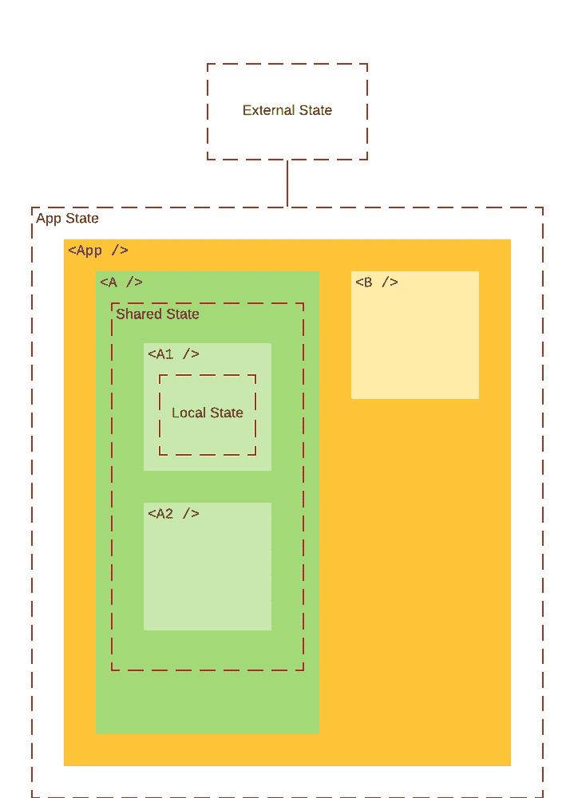
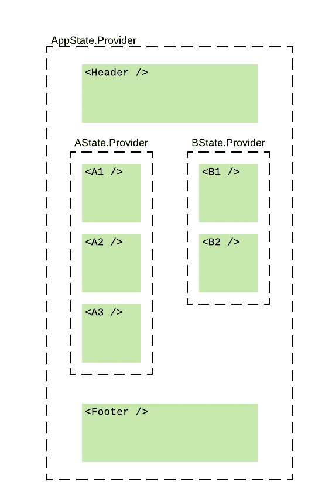

# 反应状态管理中的权衡

> 原文：<https://javascript.plainenglish.io/trade-offs-in-react-state-management-1f9944582cb?source=collection_archive---------10----------------------->

Photo by [Roman Kraft](https://unsplash.com/@romankraft?utm_source=unsplash&utm_medium=referral&utm_content=creditCopyText) on [Unsplash](/s/photos/scale?utm_source=unsplash&utm_medium=referral&utm_content=creditCopyText)

自从过去的好时光[流量](https://facebook.github.io/flux/)和[骨干](https://backbonejs.org/) MVC 以来，我一直在试验 React 的状态管理策略。我已经看到项目采用了 [Redux](https://redux.js.org/) ，将一些状态迁移到基于 [GraphQL-client](https://www.apollographql.com/docs/react/) 的工具上，并且有时转移到 [Observables](https://mobx.js.org/README.html) 路线或者更多的[新颖的](https://github.com/immerjs/immer)方式来管理状态。

有了这么多的解决方案，我觉得也许是时候退一步，稍微详细地分析一下这个问题，看看我们可以有意识地做出什么样的权衡。

# 客户端状态问题

我参与的前端工作越多，我就越觉得我们真的在努力解决 3 个不同的问题:

1.  应用程序状态与外部状态同步。(例如，服务器端状态)
2.  组件的本地状态。
3.  组件之间的共享状态。

# 1.外部状态与应用程序状态同步

您已经有了一个 REST/GraphQL API，其中一些状态驻留在服务器上。或者你已经通过`localStorage`在用户的计算机中获得了一些状态。无论采用哪种方式，在应用程序运行时，它都必须转换成可跨应用程序访问的可查询数据。

如果您的应用程序不随时间改变这种状态，那么问题就稍微简单一些，因为您总是可以查询数据以获得最新的副本。如果它真的改变了，那么它将变得更具挑战性:

1.  外部(也许是服务器端)如何？)相同数据的拷贝是否与数据的客户端拷贝保持同步？
2.  我们应该等到外部状态得到更新来反映客户端的变化吗？如果是这样的话，它的可用性意味着什么？(例如:缓慢的服务器调用会让你的客户端显得拖沓)
3.  如果你乐观地更新客户端，服务器拒绝你的更新怎么办？您如何“回滚”到以前的状态并确保客户端数据不会丢失？

## 解决方法

这里没有放之四海而皆准的解决方案。这完全取决于你想要做出的不同的取舍。

*   像 apollo-client 这样的 GraphQL 客户端库通过为您的应用程序提供一个统一的接口来读取和更新数据，就像它是“本地状态”一样，从而解决了大多数问题。但是通过引入 GraphQL 层和其他 GraphQL 类型，您增加了后端应用程序的复杂性。
*   带有一些客户端状态管理的 REST API 给了您很多控制，但是随着项目的增长，您最终要编写和维护很多代码。为了控制副作用，你可以引入一些类似[的故事。](https://redux-saga.js.org/)

# 2.地方州

本地状态是 React 组件的本地状态。我认为这是一个已经解决的问题。几年前我们不得不用遍布代码库的`onChange={this.onTextUpdated}`来做`this.setState`和“处理程序疲劳”时，情况并非如此。

这部分软件的问题是不同的:

1.  由于本地状态被大量使用，并且独立于每个组件，如何确保开发人员按照一致的规则进行编码？
2.  你如何有效地建模你的状态，这样你就不会浪费渲染周期？
3.  由于本地状态会随着时间的推移而膨胀，我可以使用什么抽象来编写简洁的代码呢？

## 解决方法

正确使用功能组件和 react 钩子无疑已经解决了这些问题中的大部分，但是绝对值得注意的是，了解 react 钩子如何操作的内部原理不会有什么坏处，因为这有点像[泄漏的抽象](https://reactjs.org/docs/hooks-rules.html)。也就是说，在某种程度上，你不能把它们仅仅理解为神奇地为你管理状态的函数。

*   每当我不得不在我的代码库中引入像 react hooks 这样的“聪明”构造时，我总是依赖于[静态分析](https://www.npmjs.com/package/eslint-plugin-react-hooks)工具，因为误用的代价将意味着浪费数小时的开发时间。
*   为了保持钩子用法的一致性，并尽可能影响使用钩子编写的代码，我推荐使用一个将副作用抽象到钩子中的[库。](https://github.com/streamich/react-use)

# 3.组件之间的共享状态

在我看来，这是最难建模的状态，纯粹是因为:

1.  它非常依赖于你的应用程序的具体用例。
2.  代码的变化率非常高。

因此，在这个问题上工作了几年后，我确信这里永远不会有“放之四海而皆准”的解决方案。

# 解决方法

## 一个应用，一个状态

一种选择是在你的应用程序中有一个顶层组件(姑且称之为`<App />`，并在那里使用`useState`声明你所有的共享状态。

An example

这并不是世界上最糟糕的想法，如果你的相当简单，你的组件层次很浅。但是随着应用程序变得越来越复杂，越来越难确定哪些组件在什么时候修改了哪些数据，因为应用程序中的所有组件都可以访问状态的所有部分。由于 React 在`prop`改变后渲染事物的方式，你的`TodoHeader`的改变将触发`TodoStats`的重新渲染，即使它与`TodoStats`消耗的数据无关。

现在，管理这种复杂性并避免重新渲染的一种方法是:

**1。对于状态突变要非常明确。**

*   也就是说，不要直接从组件内部改变状态，而是激发一个事件，该事件将触发某种改变状态的功能。
*   在您的应用程序中重用事件，而无需复制变异逻辑，并将变异状态的函数集中在一个集中的托管位置。

**2。非常明确地询问状态。**

*   不要消耗组件中的整个状态，而是监听它的一个子集。
*   这将降低组件的“道具足迹”，并避免不必要的渲染。(渲染不会对组件的 JSX 输出产生有意义的变化)

## Redux 和 redux 变体

如果你熟悉 redux，你可能会注意到这正是 redux 所做的。试试把“变异函数”换成“减速器”。此外，组件只触发事件，并且“监听”状态变化确保了单向数据流。

事实上，我认为大多数应用程序发现 Redux 非常麻烦和难以管理的原因是因为 reducer 函数和状态树被过早地分离和抽象。这只是我的观点，但我认为在许多应用程序中发生的原因是由于多年来，我们试图用 redux 解决的核心问题——应用程序中的`appState`和`setAppState`的混杂——被我们遗忘了。

Redux、MobX 及其变体都基于单向数据流的相同原理。

## 使用 React 上下文

React Context 为开发人员提供了一种方便的机制，将状态“提升”到应用程序的顶部，以便在整个应用程序中共享。许多流行的库，如 react-router，使用上下文 API 来提供关于应用程序“全局状态”的信息——如哪个路由是活动的，等等。

如果我们有办法定义独立的可变的`appState`片段，并使用 React Context 在整个应用程序中访问它，那将非常方便。如果我们使用已经存在的状态管理工具(如`useState`和其他钩子)来建模这种状态，建立这种状态的成本将会相当低，并且我们不会像在 Redux 中那样为尽早分离状态而付出更高的代价。

另外，如果我们使用 React 上下文提供者，我们可以用信号通知应用程序的哪些部分使用状态的哪些部分。如果我们保持这些状态片段的独立性和小规模，我们就不需要担心定义许多样板代码来管理复杂性，比如动作、动作创建者、缩减者和订阅者。

我和 [constate](https://github.com/diegohaz/constate) 在某一类应用程序中正是这样做的，并取得了很大的成功。

它优化了从较小的独立共享状态片段开始的过程，这些片段可以随着应用程序的增长而合并，也可以进一步拆分。但是，如果没有类型系统(我使用 Typescript)和一些测试来断言运行时行为，这些独立的状态片段的可维护性就变得具有挑战性。组件是否可以访问被选中的上下文取决于组件是否有初始化`ReactContext.Consumer`的祖先。

再一次，这是对开发人员来说稍微多一点认知负荷(由于 React 的使用)之间的权衡。组件层次结构中的上下文)，以及需要维护的代码量(或者在这种情况下缺少代码)。

# 更广阔的前景

我们问题的“共享状态”部分的更广泛的情况是，有两种方式可以继续下去。您是在一致的单向数据流方面进行权衡，还是在独立状态的更小的可管理部分方面进行权衡？

我的理由如下:随着应用程序变得越来越大，如果状态的足迹与您必须交付的特性相关联，您将开始收获单向数据流的好处。我认为，随着状态变得越来越大，管理状态的一致约定比减少代码量的抽象更有吸引力。