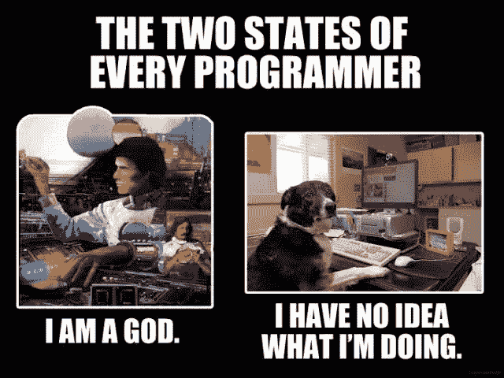
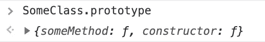
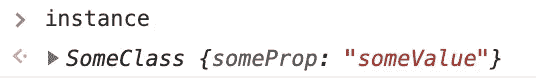
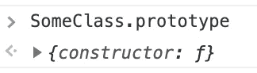
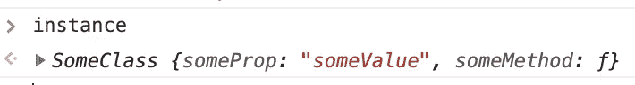

# JavaScript 类中的传统函数与箭头函数

> 原文：<https://javascript.plainenglish.io/traditional-versus-arrow-functions-in-javascript-classes-35f958b1a492?source=collection_archive---------1----------------------->

## 怎么了？哦，没什么，只是做这做那。



Source: [Programmer Humor](https://programmerhumour.tumblr.com/image/633387776634732544)

这是[这篇文章](https://suhanwijaya.medium.com/a-method-destructured-from-an-object-loses-its-original-context-21e73cf1451f)的精神续篇。

使用传统函数创建一个类，如下所示。让我们称这种**方法为**。

```
// APPROACH Aclass SomeClass {
    constructor() {
        this.someProp = 'someValue';
    } someMethod() { // Traditional function
        console.log(this.someProp);
    }
}
```

创建该类的一个实例。在实例上调用方法时，`this`指的是实例。到目前为止，它的行为符合预期。

```
let instance = new SomeClass();instance.someMethod(); // logs 'someValue'
```

但是，一旦我们将方法赋给一个变量，并调用这个函数变量，这个方法就失去了它的上下文，你就得到了`Uncaught TypeError: Cannot read property ‘someProp’ of undefined.`

```
let instance = new SomeClass();let funcVariable = instance.someMethod;
funcVariable(); // logs error
```

好的。

现在，让我们用一个使用箭头函数的方法来创建这个类，如下所示。让我们称之为**方法 b。**

```
// APPROACH Bclass SomeClass {
    constructor() {
        this.someProp = 'someValue';
    } someMethod = () => { // Arrow function
        console.log(this.someProp);
    }
}
```

这现在起作用了。

```
let instance = new SomeClass(); let funcVariable = instance.someMethod;
funcVariable(); // logs 'someValue' const { someMethod } = instance; // destructuring also works!
someMethod(); // logs 'someValue'
```

# 为什么，JavaScript，为什么？


Source: [Programmer Humor](https://programmerhumour.tumblr.com/image/633251914676600832)

根据 [MDN 文档](https://developer.mozilla.org/en-US/docs/Web/JavaScript/Inheritance_and_the_prototype_chain)，*“*`*class*`*关键字是 ES2015 中引入的，但在语法上是糖，JavaScript 仍然是基于原型的。”*所以如果我们用 ES6 之前的语法来写，**方法和**看起来是这样的。

```
// Equivalent to APPROACH A'use strict';var SomeClass = function() {
    this.someProp = 'someValue';
}SomeClass.prototype.someMethod = function() {
    console.log(this.someProp);
}var instance = new SomeClass();
```

属性`someMethod`定义在构造函数的`prototype`上。



Chrome Dev Console

但不是在`instance`上。



Chrome Dev Console

您可以通过[原型继承](https://developer.mozilla.org/en-US/docs/Web/JavaScript/Inheritance_and_the_prototype_chain)访问`instance.someMethod`。

**但是当你把** `**instance.someMethod**` **赋给另一个变量的时候，函数变量就失去了上下文。**

此外，由于[](https://developer.mozilla.org/en-US/docs/Web/JavaScript/Reference/Classes#Class_body_and_method_definitions)*`[*class*](https://developer.mozilla.org/en-US/docs/Web/JavaScript/Reference/Classes#Class_body_and_method_definitions)`[*主体的语法边界内的代码总是以严格模式执行*](https://developer.mozilla.org/en-US/docs/Web/JavaScript/Reference/Classes#Class_body_and_method_definitions) ，`this`将是未定义的，而不是默认为`window`或`global`。*

*好的。*

*现在，**方法 B** 在 ES6 之前看起来是这样的:*

```
*// Equivalent to APPROACH B'use strict';var SomeClass = function() {
    this.someProp = 'someValue'; var _that = this; this.someMethod = function() {
        console.log(_that.someProp);
    }
}var instance = new SomeClass();*
```

*属性`someMethod`是在构造函数的`prototype`上定义的*而不是*。*

**

*Chrome Dev Console*

*而是在`instance`上定义。*

**

*Chrome Dev Console*

*此外，默认情况下，Arrow 函数[绑定到其周围的词法上下文](https://developer.mozilla.org/en-US/docs/Web/JavaScript/Reference/Functions/Arrow_functions#Description)(它实际上位于代码中)，这似乎相当于传统函数可以访问指向`this`的外部函数变量(即[闭包](https://developer.mozilla.org/en-US/docs/Web/JavaScript/Closures))。*

***因此，即使你将** `**instance.someMethod**` **赋值给另一个变量，该函数变量仍然绑定到** `**instance**` **上下文。***

*注意:我不是 100%确定箭头函数派生出`this`的实际“幕后”机制，所以如果你知道，请随意评论。*

*无论如何，我进入了这个兔子洞，因为我一直使用箭头函数来编写经典 React 组件中的方法，而不是在`constructor`中绑定传统函数(即`this.someMethod.bind(this)`)或将其作为 prop 传递。*

```
*import React from 'react';class SomeComponent extends React.Component {
    constructor(props) {
        super(props); this.state = { /* some state */ };
    } someMethod = () => { // Arrow function
        // will have access to `this.state`
    } render() {
        // may attach `this.someMethod` as an event handler or 
        // pass it down as a prop to child components
    }
}*
```

*不认可一种或另一种方法，只是描述不同之处。哦，猜猜[哪个浏览器](https://developer.mozilla.org/en-US/docs/Web/JavaScript/Reference/Classes#Browser_compatibility)与整个讨论完全无关。*

*📫*点击*[领英](https://www.linkedin.com/in/suhanwijaya/) *或* [*发邮件*](mailto:suhanw@gmail.com) *！**