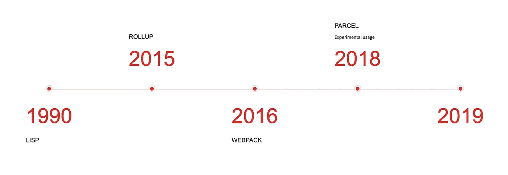
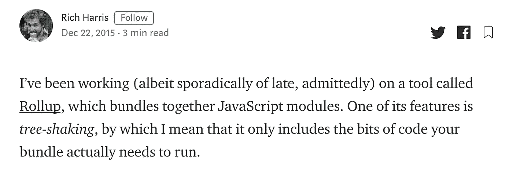
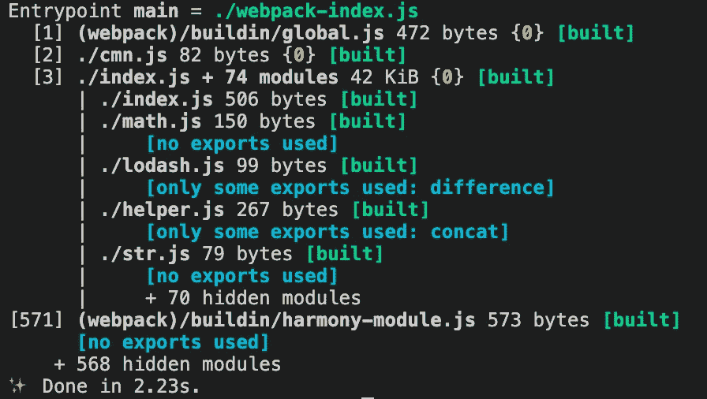
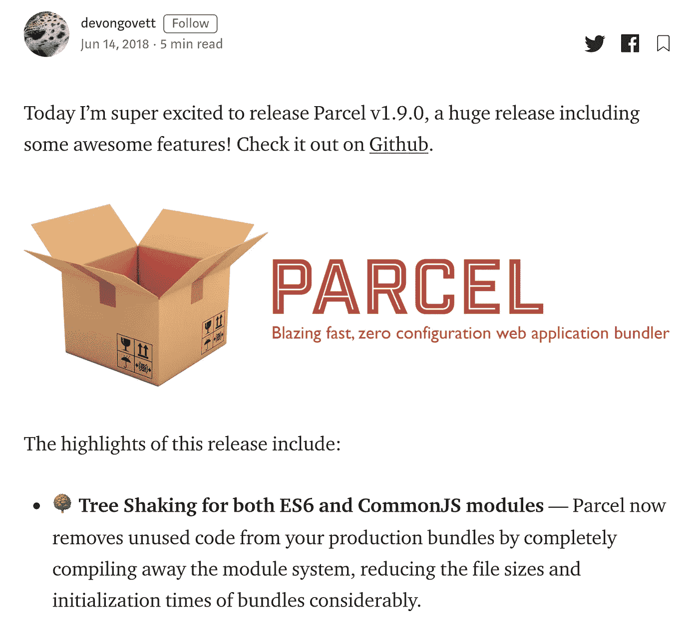

# JavaScript 绑定器中的树抖动是如何工作的

> 原文：<https://javascript.plainenglish.io/tree-shaking-in-javascript-bundlers-cf5c9583b13d?source=collection_archive---------6----------------------->



Timeline of Tree-shaking Process

树抖动是在**死代码消除**中使用的一种技术，旨在通过移除未使用的函数、导入和语句来减少包的大小。它也被称为**活代码包含**。它是由 RollupJS 推广的，但是这个想法来自于 20 世纪 90 年代的 LISP。

## 定义问题

由于 JavaScript 等动态脚本的性质，在语句级或文件级找到未使用的代码块一直是一个挑战。您可以在运行时动态地更改应用程序的流程，这会影响全局范围，这可以通过 CommonJS 的特性来实现。

…这意味着什么？摇树不能应用到 CommonJS 吗？

是的，它也可以应用于 CommonJS，但是很难找到未使用的代码块而不是 ES6 模块，所以树摇不如 ES6 模块好。

…但是为什么呢？

ES6 模块导入和导出是静态的，您不能有条件地导入文件。我们来举个例子；

```
// CommonJS require which is a valid statement
if(smth === 61){
 var lodash = require(‘lodash’);
 lodash.difference();
}// ES6 import which will give error
if(smth === 61){
 import {difference} from ‘lodash’;
 difference();
}
```

在上面的代码块中，当 CommonJS 实现有效时，ES6 实现将抛出错误。如果您可以动态导入某个东西，您如何确定该文件是否被使用？首先，您必须确信 if 语句(第 2 行)不会在任何时候执行。如果你能确定这一点，那么你就可以安全地从整个 If 块中移除。然而，要对 if 语句做出决定并不容易。

当您能够动态导入文件时，这是确定未使用的导入时最难的一点，这就是为什么 ES6 模块是树抖动的，因为您不能动态导入文件。

## 它是如何工作的

正如我上面提到的，根据 ES6 的本质，通过分析更容易找到未使用的代码块。摇树过程从一个**切入点**开始。每个导入语句都被添加为一个树的叶子，包括它的依赖项以及它的“依赖项”依赖项。每一片有参考的叶子都被标记为绿色，没用的被标记为灰色，然后剪掉灰色的就可以食用了。

让我们尝试为 Rollup、Webpack 和 package 配置树抖动。

知识库:[https://github.com/muratcatal/tree-shaking-comparision](https://github.com/muratcatal/tree-shaking-comparision)

下面的代码是我们示例的入口点，它在 ES6 模块和 CommonJS 类型中导入。

```
// index.jsimport * as math from "./math";
import * as lodash from "./lodash";
import { concat } from "./helper";require("./cmn");concat("Hello");
lodash.difference([1, 2, 3]);
const helloVar = "hello-var";
console.log('Hello world!');
```

# 卷曲

RollupJS 的创建者 Rich Harris 写了一篇关于其新项目 Rollup 的博客，并提到了其令人敬畏的功能树摇动。它还提到了移除动态语言中未使用的代码块有多困难，以及树抖动中的一些特性的缺乏，但它是第一个实现树抖动思想的 bundler，所以其他库如 Webpack 也受到了启发。



> 要在 Rollup 中启用树抖动，我们必须将输出格式设置为 ESM

让我们配置我们的汇总；

```
import resolve from 'rollup-plugin-node-resolve';export default {
    input: './index.js',
    output: {
        file: './dist/rollup-main.js',
        format: 'esm'
    },
    plugins: [
        resolve()
    ]
};
```

这就是你必须做的全部工作。除非您使用 CommonJS，否则您的代码将被导入到树抖动过程中，并且您将得到一个很好的输出。

> 在该示例中，我将节点模块捆绑到应用程序中，并让 Rollup 如何操作节点模块由 rollup-plugin-node-resolve 插件管理。

当我运行 **yarn build:rollup** 时，它按预期完成工作，所有未使用的导入和语句都将从 bundle 中移除，require()语句除外。

# 网络包

在 Webpack 的 2.2 版本中实现了摇树功能，并在版本 4 中进行了改进。与 Rollup 不同，你必须在**生产**模式下运行 Webpack，让它对你的代码进行树抖动。除此之外；您可以使用以下两个配置标志来覆盖三次摇动过程的行为方式。

默认情况下，当 webpack 在生产模式下运行时，sideEffects 和 usedExports 在默认情况下都为 true。因为 usedExports 是真的，您的 webpack 将收集关于您未使用的导出的数据，并将该信息提供给 terser 或任何其他 tree-shake 插件。通常，对于生产配置，您不需要将其设置为 true。

> 当你用 **— display-used-exports** 运行你的 Webpack 时，它会给你一个很好的输出，显示关于 import 语句的信息



— display-used-exports output

**副作用**

```
import 'math.js';
```

在上面的例子中，我只是导入了一个 math.js 文件，并没有在任何地方使用它，但是你能保证它不会对你的项目或者导入它的 javascript 文件产生任何副作用吗？

为了说明 Webpack 未使用的导出没有副作用，并且如果不使用它们，它们可以安全地从树中移除，使用了 sideEffects 标志。您可以在 package.json 文件中将它设置为 false，以便在整个项目中禁用它，或者您可以给出一个数组来指示哪些文件有副作用。

将 sideEffects 设置为 false 将会增加你的构建过程，但是你将会获得树抖动，这将会减少你的包的大小。

```
// package.json 
{
  sideEffects: false,
  sideEffects: ['./math']
}
```

> 使用其中一个用例。你可以说你的 bundler 不要接触数学库，因为它有副作用，或者你可以说你的 bundler 项目没有副作用，所以它可以安全地删除未使用的导出

**使用导出**

这有助于删除未使用的语句，并依靠 terser 来检测未使用的语句。您可以在 webpack 的配置中启用它。

```
module.exports = {
  //...
  optimization: {
    usedExports: true
  }
};
```

> sideEffects 更有效，因为它跳过了整个导入文件。

利用 Webpack 中的树抖动；

*   在生产模式下构建代码
*   使用 ES6 模块(导入和导出)
*   如果你使用 babel 的@babel/preset-env，它会把你的 ES6 转换成 CommonJS，这样就不可能使用树抖动了。但是你可以给你的宝贝一个支持 ESM 的选项。

```
{
  "presets": [
    [
      "[@babel/preset-env](http://twitter.com/babel/preset-env)",
      {
        "targets": {
          "esmodules": true
        }
      }
    ]
  ]
}
// alternative way to tell babel not to transpile ESM modules into CommonJS{
  "presets": [
    ["env",
      {
        "modules": false
      }
    ]
  ]
}
```

当我运行 **yarn build:webpack** 时，结果将类似于 Rollup。

# 帕塞尔



Parsel 基于零配置 bundler，这使得采用您的项目变得非常容易。1.9 版本中提供了树抖动功能，但是它仍然是一个实验性的特性，所以在构建项目时，您必须使用 flag 来让 Parsel 运行它的树抖动算法。

```
parcel build index.js --experimental-scope-hoisting
```

> 正如在第一节中提到的，CommonJS 模块的树抖动真的很难，但是 Parcel 内置了这个很好的特性。

当我运行 yarn build:parcel 时，它显示了它的差异，并且 **console.log** 语句和 **concat('Hello')** 将被删除。然而，每当我将 concat('Hello ')赋给一个变量时，parcel 就会将它包含到包中。

# 那么下一步是什么？

树抖动是一个很好的强大的特性，只要它被有效地使用，因为它减少了你的包的大小，也节省了你意想不到的代码运行。(您可以考虑该语句是否不可达，以及在这种状态下应用程序流如何下降，但不要忽略您的 JavaScript 可以在客户端未经您的允许由外部对等方运行)

在不同的捆绑器中，处理树抖动的过程是不同的，但是最终你如何编写你的代码会显著地影响这个过程。

# 参考

*   [https://medium . com/@ Rich _ Harris/tree-shaking-vs . dead-code-elimination-d 3765 df 85 c 80](https://medium.com/@Rich_Harris/tree-shaking-versus-dead-code-elimination-d3765df85c80)
*   [https://medium . com/web pack/web pack-and-roll up-the-same-but-different-a41ad 427058 c](https://medium.com/webpack/webpack-and-rollup-the-same-but-different-a41ad427058c)
*   [https://medium . com/@ devongovett/parcel-v1-9-0-tree-shaking-2x-fast-watcher-and-more-87 F2 E1 a 70 f 79](https://medium.com/@devongovett/parcel-v1-9-0-tree-shaking-2x-faster-watcher-and-more-87f2e1a70f79)
*   [https://developers . Google . com/web/fundamentals/performance/optimizing-JavaScript/tree-shaking](https://developers.google.com/web/fundamentals/performance/optimizing-javascript/tree-shaking)
*   [https://blog . jakoblind . no/how-web pack-decision-what-to-bundle/](https://blog.jakoblind.no/how-webpack-decides-what-to-bundle/)