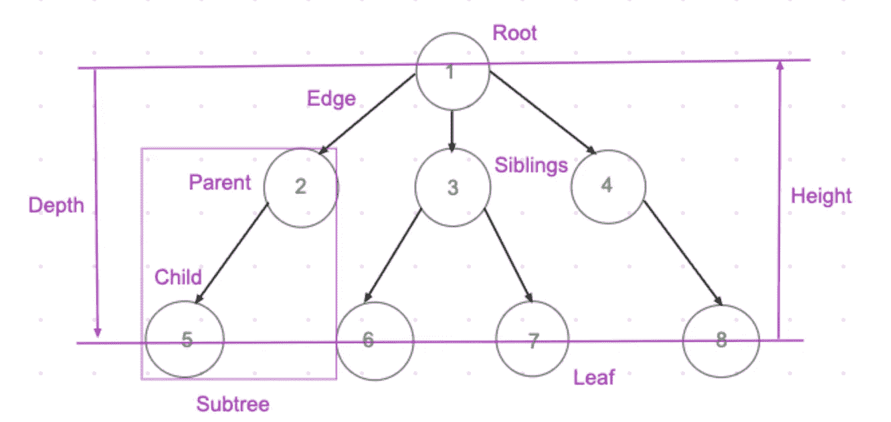
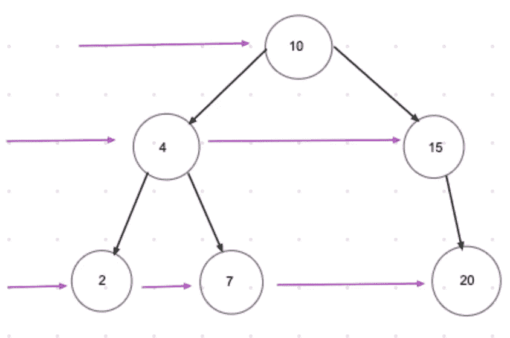
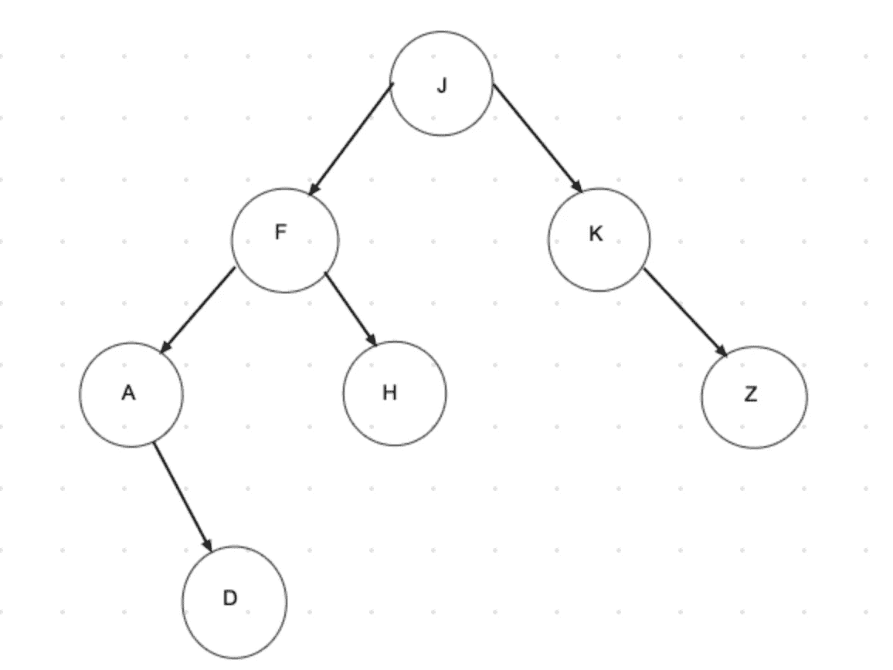

# JavaScript 中的树遍历

> 原文：<https://javascript.plainenglish.io/tree-traversal-in-javascript-9b1e92e15abb?source=collection_archive---------2----------------------->

## 呼吸优先搜索 vs 深度优先搜索

Tree example

树是一种非线性数据结构——由有向(或无向)边连接的节点的集合。每个节点包含一个**值**和**节点之间的连接称为**边**。最顶层的节点叫做**根**，没有子节点的节点叫做**叶**节点。具有相同父节点的节点称为**兄弟节点**。节点**的**深度是从根到节点的边数，节点**的**高度是从节点到最深叶子的边数。**

我们如何访问树中的每个节点？常见的遍历树的算法有**广度优先搜索** (BFS)和**深度优先搜索** (DFS)。

# 广度优先搜索

在 BFS，我们逐层访问节点。在更深入之前，我们探索广度，即在给定级别的树的全部宽度。

BFS example

通常，我们会遇到二叉树，所以我们在下面的例子中使用二叉树实现广度优先搜索。

# **深度优先搜索**

该算法从根节点开始，在回溯之前沿着每个分支尽可能远地探索。

有三种常见的方式:

*   按顺序(左、根、右): **A、D、F、H、J、K、Z**
*   前序(根，左，右): **J，F，A，D，H，K，Z**
*   后置顺序(左，右，根): **D，A，H，F，Z，K，J**

Tree example for DFS

在 DFS 中，我们使用递归来实现。

## **按顺序:**

[https://gist.github.com/GAierken/d1b33f93d2818ada2810932805b2ffa1](https://gist.github.com/GAierken/d1b33f93d2818ada2810932805b2ffa1)

## **预购:**

[https://gist.github.com/GAierken/57ebd4b81ee568c803a5f45fbe7129e8](https://gist.github.com/GAierken/57ebd4b81ee568c803a5f45fbe7129e8)

## **后期订单:**

[https://gist.github.com/GAierken/4f68be6f8e413d055eac1aa7ef514223](https://gist.github.com/GAierken/4f68be6f8e413d055eac1aa7ef514223)

我们如何决定使用哪一个？简单的答案是，这取决于树。在考虑了树的结构、时间和空间复杂度之后，我们可以选择一个。例如，对于长的单侧单个树，使用 DFS 是合适的，因为我们只是根据深度而不是宽度来存储节点；如果我们有很多级别，要跟踪的兄弟姐妹，BFS 会做得更好。

树遍历可能很有挑战性，我希望这篇文章能有所帮助😉

*参考文献:*

 [## 树形数据结构

### 有许多基本的数据结构可以用来解决应用问题。数组是一个很好的静态数据…

www.cs.cmu.edu](https://www.cs.cmu.edu/~clo/www/CMU/DataStructures/Lessons/lesson4_1.htm)  [## JavaScript (JS)算法和数据结构大师班

### 嗨！我是柯尔特。我是一名热爱教学的开发人员。过去几年我一直在教人们…

www.udemy.com](https://www.udemy.com/course/js-algorithms-and-data-structures-masterclass/)  [## 数据结构和算法-树遍历

### 遍历是一个访问树的所有节点的过程，也可以打印它们的值。因为，所有的节点都是…

www.tutorialspoint.com](https://www.tutorialspoint.com/data_structures_algorithms/tree_traversal.htm) 

## **简单英语的 JavaScript**

喜欢这篇文章吗？如果是这样，通过 [**订阅解码获得更多类似内容，我们的 YouTube 频道**](https://www.youtube.com/channel/UCtipWUghju290NWcn8jhyAw) **！**