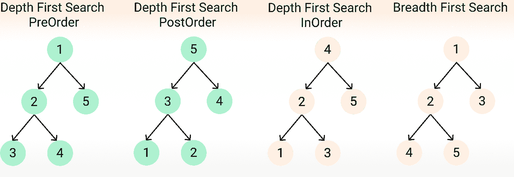
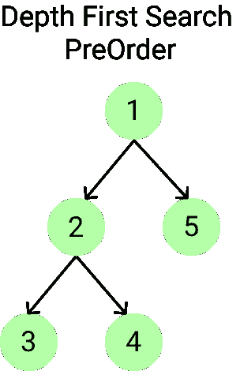
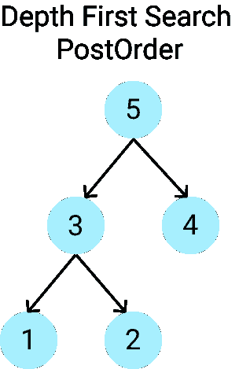
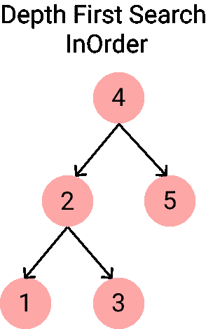
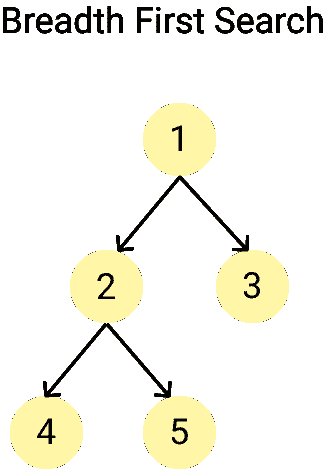

# 用 JavaScript 遍历树

> 原文：<https://javascript.plainenglish.io/tree-traversal-with-javascript-29b57d61d486?source=collection_archive---------7----------------------->

## JavaScript 数据结构系列的第 6 部分


Photo by [Dmitry Schemelev](https://unsplash.com/@enioku?utm_source=medium&utm_medium=referral) on [Unsplash](https://unsplash.com?utm_source=medium&utm_medium=referral)

在本文中，我们将介绍树遍历。如果你错过了我们学习树、二叉树和二分搜索法树的系列文章的最后一部分，一定要先看看下面的文章。

[](https://medium.com/javascript-in-plain-english/binary-search-trees-with-javascript-715df954b33) [## 使用 JavaScript 的二分搜索法树

### JavaScript 数据结构系列的第 5 部分

medium.com](https://medium.com/javascript-in-plain-english/binary-search-trees-with-javascript-715df954b33) 

# 什么是树遍历？

树遍历是访问树中的每个节点一次。与只有一条线性路径来访问所有节点的列表、数组、堆栈或队列相比，树没有特定的顺序。对于树遍历，有两种方法:

*   深度优先搜索——在回溯之前尽可能向下搜索一个分支。在深度优先搜索中，有三个主要的顺序；前序、后序和无序。
*   广度优先搜索—在移动到下一个深度级别之前，探索当前深度的所有邻居节点。

下图是我们将经历的快速总结。



我们将探索遍历我们的树的四种方法。对于本文，我们将使用二叉树作为例子。下面的代码是我们在上一篇文章中创建的二叉树。简单回顾一下，我们有一个节点类，用于在树中插入新节点，还有一个二叉树类，有两个方法，insert 和 find。

Binary Search Tree

# 深度优先搜索

深度优先搜索意味着在访问任何兄弟节点之前垂直遍历树。在横向移动(广度优先)之前，我们将在树中向下移动(深度优先)。请注意，我们将在解决方案中使用递归。如果你不熟悉递归，你可以在这里阅读更多关于它的内容。

在深度优先搜索中，我们需要采取三个步骤。我们执行这些步骤的顺序将决定输出和我们访问节点的顺序。

*   访问节点
*   探索左侧
*   探索右侧

## 预订

我们将首先看一看深度优先搜索前序。我们将从根开始，并将首先访问节点(这意味着我们将把它添加到我们的数据列表中，并且我们不会再访问它)。然后我们将遍历树的左侧，然后是右侧(我们将对每个节点都这样做)。下图显示了我们访问每个节点的顺序。我们将从 1 开始，并将其添加到列表中。然后检查 1 的左侧，这将我们移动到 2，并将 2 添加到列表中。然后，检查 2 的左侧，这将我们移动到 3，然后将 3 添加到列表中。由于 3 的左边没有，我们将返回到 2，然后检查 2 的右边，这将我们移动到 4，然后将 4 添加到列表中。然后，我们将沿着树向上移动到 1，并检查 1 的右侧，这将我们移动到 5，然后将 5 添加到列表中。



现在让我们写出我们的函数。我们将首先在 tree 类上创建一个新方法，并将其命名为 DFSPreOrder。我们需要在方法中创建一个数组来存储我们访问过的节点，我们称之为数据。

然后我们将使用递归并编写一个助手函数，称为 traverse。这个函数将接受一个节点作为参数。请记住，我们需要采取三个步骤(访问节点，探索左侧，探索右侧)。让我们首先将节点的值推送到我们的数据数组中(访问节点)。然后，我们将检查节点是否有左属性。如果是这样，我们将使用左边的节点再次调用 helper 函数。然后，我们将检查节点是否有正确的属性。如果是这样，我们将使用正确的节点调用 helper 函数。

最后，我们将使用根节点调用 helper 函数，最后返回数据数组。

```
DFSPreOrder() {
  let data = [];
  function traverse(node) {
    data.push(node.value);
    if(node.left) traverse(node.left);
    if(node.right) traverse(node.right);
  }
  traverse(this.root);
  return data;
}
```

## 后期订单

在后序中，我们将最后访问节点。这意味着在访问父节点之前，我们将首先访问所有子节点。

下图显示了我们访问每个节点的顺序。我们再次从根节点开始，但是注意到根节点是我们访问的最后一个节点。我们首先遍历树的左侧，这将我们带到 3，然后再到 1。既然没有 1 的左或右，我们就访问 1。然后，我们将遍历 3 的右侧，而不是访问 3，这将我们带到 2。由于 2 没有左右之分，我们访问 2，然后移回 3，访问 3。在访问 3 之后，我们向上移动到 5，但是在访问 5 之前，我们遍历 5 的右侧，这将我们移动到 4。由于 4 没有左和右，我们访问 4，然后最后回到 5，访问 5。



postOrder 的代码与 preOrder 的代码非常相似，除了我们在 helper 函数中采取的步骤有一个微小的变化。在 helper 函数中，我们不会在开始时推送节点值，而是在遍历了左右两边之后推送数据。就是这样！

```
DFSPostOrder() {
  let data = [];
  function traverse(node) {
    if(node.left) traverse(node.left);
    if(node.right) traverse(node.right);
    data.push(node.value);
  }
  traverse(this.root);
  return data;
}
```

## 中根次序

我们要看的最后一个深度优先搜索顺序是有序的。如果我们使用二叉查找树，这将给我们一个数组，数组中的值按升序排列，顾名思义。下图显示了我们访问每个节点的顺序。从根开始，我们将遍历树的左侧，移动到 2，然后到 1。因为 1 没有左或右，我们将访问 1，然后返回到 2。然后我们将参观 2。然后遍历 2 的右侧，将我们移动到 3，并访问 3。接下来，我们将沿着树向上回到 4，并访问 4。最后，我们将遍历 4 的右侧，这将我们移动到 5，我们将访问 5。



同样，inOrder 的代码类似于 preOrder 和 postOrder，除了在 helper 函数中有一处变化。我们首先遍历左侧，然后通过将值推入数据数组来访问节点，然后遍历右侧。

```
DFSInOrder() {
  let data = [];
  function traverse(node) {
    if(node.left) traverse(node.left);
    data.push(node.value);
    if(node.right) traverse(node.right);
  }
  traverse(this.root);
  return data;
}
```

# 广度优先搜索

现在让我们进入广度优先搜索。与我们在深度优先搜索中所做的沿树向下移动不同，广度优先搜索在向下移动之前首先沿树水平移动。下图显示了我们访问每个节点的顺序。如您所见，我们从根开始，然后向下一层，访问 2 和 3。然后向下移动到下一级，访问 4 和 5。



为此，我们将使用队列。如果您不熟悉队列，请查看下面的文章。

[](https://medium.com/javascript-in-plain-english/stacks-vs-queues-with-javascript-eeb33ae4c93c) [## 使用 JavaScript 的堆栈与队列

### JavaScript 数据结构系列的第 3 部分

medium.com](https://medium.com/javascript-in-plain-english/stacks-vs-queues-with-javascript-eeb33ae4c93c) 

让我们首先创建一个方法，并将其命名为 BFS。为了以一种简单的方式重新创建我们的队列(先进先出)，我们将使用数组的 push 和 shift 方法。我们将创建两个空队列，分别称为队列和数据。我们还将创建一个节点变量来跟踪我们正在检查的当前节点。然后，我们将从将根节点放入队列开始。

```
BFS() {
  let queue = [];
  let data = [];
  let node = this.root;
  queue.push(node);
}
```

接下来，我们将创建一个 while 循环，在队列中有数据时运行。在这个 while 循环中，我们将使用 shift 获取队列中的第一个数据，并将该值存储为节点变量。然后，我们将把这个节点的值推入我们的数据数组。接下来，我们将检查节点是否有 left 和 right 属性。如果有，我们将把这些值推到队列中。当队列中有数据时，while 循环将继续运行。一旦完成，我们将返回数据列表。

```
BFS() {
  let queue = [];
  let data = [];
  let node = this.root;
  queue.push(node);
  while(queue.length) {
    node = queue.shift();
    data.push(node.value);
    if(node.left) queue.push(node.left);
    if(node.right) queue.push(node.right);
  }
  return data;
}
```

最终的代码将如下所示。您现在可以创建一个新的树，并测试我们添加的不同的树遍历方法。根据我们使用的搜索顺序，返回的数组应该以不同的顺序列出树的值。

Depth-First Search and Breadth-First Search

# 包扎

现在，您应该对我们如何遍历树并访问每个节点有所了解了。如果您想知道何时应该使用一种方法而不是另一种方法，我推荐阅读关于[堆栈溢出](https://stackoverflow.com/questions/3332947/when-is-it-practical-to-use-depth-first-search-dfs-vs-breadth-first-search-bf)的一个线程来了解更多信息。

*感谢阅读！如果您错过了本系列的第 4 部分，在那一部分中，我们用 JavaScript 研究了双向链表，请查看下面的文章。*

[](https://medium.com/javascript-in-plain-english/doubly-linked-lists-with-javascript-9c20a9dc4fb3) [## 使用 JavaScript 的双向链表

### JavaScript 数据结构系列的第 4 部分

medium.com](https://medium.com/javascript-in-plain-english/doubly-linked-lists-with-javascript-9c20a9dc4fb3) 

*请关注本系列的第 7 部分，在那里我们将看到一种不同类型的树，二进制堆。*