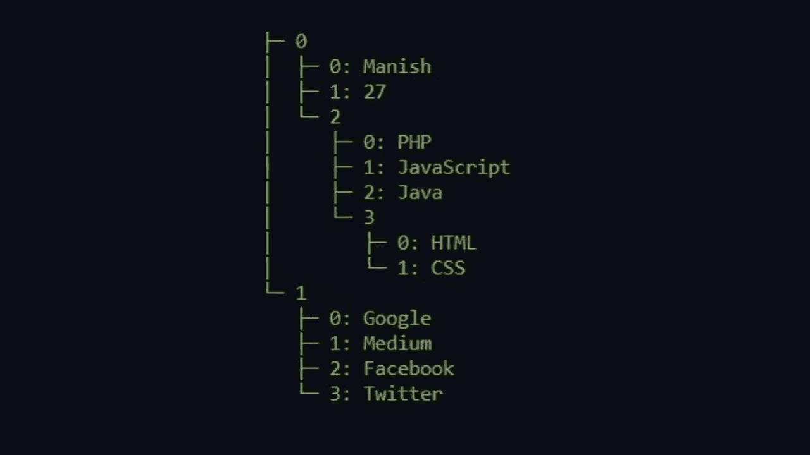
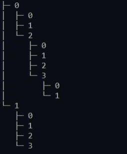
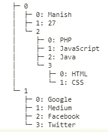
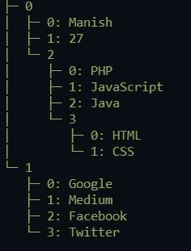
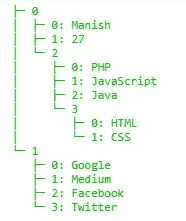

# JavaScript 中数组和对象的树形视图

> 原文：<https://javascript.plainenglish.io/tree-view-for-arrays-and-objects-in-javascript-6135aafbf91?source=collection_archive---------2----------------------->



你使用`conosle.log()`或`console.table()`来打印 JavaScript 项目中的数组和对象吗？是的，我们都使用它，但是我必须在控制台中打开多维数组或对象的方式对我来说有点无聊。我使用一个 npm 库来查看树状结构中所有数组和对象。这样，我可以清楚地看到我所有的数组和索引，以及对象的层次结构。因此，让我们在本教程中看看如何在下一个 JavaScript 项目中使用这个库。

本教程假设您正在使用 npm 包创建下一个 JavaScript 项目。比如 nodejs，React，Angular，Vue，WebPack，gulp，parcel 等。

1.  我们将从创建一个简单的节点项目开始。打开项目目录并运行下面的命令来初始化我们的项目并设置必要的文件。

```
npm init -y#or yarn init -y 
```

2.现在在该目录中创建一个 **index.js** 文件。

3.现在将**[**tree ify**](https://www.npmjs.com/package/treeify)**安装到您的项目中。****

```
**npm install treeify#oryarn add treeify**
```

****4.打开您的 **index.js** 文件并将 [treeify](https://www.npmjs.com/package/treeify) 导入到您的项目中。****

```
**const treeify = require('treeify');#or import treeify from 'treeify'**
```

****5.出于演示目的，我们将创建一个多维数组和对象。将下面的代码粘贴到你的 **index.js** 文件中****

****6.现在要打印树状结构中的数组或对象，我们需要像这样传递数组或对象。`console.log(treeify.asTree(arrayOrObject, true))`。现在，我只打印一个数组。****

```
**console.log(treeify.asTree(array, true))**
```

****7.现在运行`node index.js`检查结果****

********

****Terminal Output****

********

****Browser output for other projects****

****尽管如此，没有色彩的观赏还是很无聊。😐****

****我们将使用另一个库来查看不同颜色的结构。****

****8.现在，我们将安装另一个软件包，它将有助于以不同的颜色查看结构。所以运行下面的命令来安装这个包****

```
**npm install ololog#or yarn add ololog**
```

****9.导入该库****

```
**const log = require ('ololog').configure({time:false, locate:false});#or import ololog from 'ololog'; 
const log = ololog.configure({locate:false, time:false});**
```

****10.现在不用`console.log()`而是用`log.green(treeify.asTree(arrayOrObject, true))`来查看绿色的结构。****

```
**log.green(treeify.asTree(array, true))**
```

********

****Terminal Output****

********

****Bowser Tree output for other projects****

****好了，现在我们知道了一种在树状结构中查看数组和对象的方法，但是我们是否总是必须为每个文件的简单数组和对象视图导入所有这些库？这不是解决办法，这是一团糟😂。因此，让我们创建一个简单的函数，然后将它导出和导入到我们想要使用的文件中。****

1.  ****在项目中创建另一个名为 **utils** 的目录，并在该目录中创建一个名为 **treeView.js** 的文件，然后粘贴下面的代码。****

****这将创建一个名为 **treeView** 的默认函数，然后您可以将它导入到任何文件中，以树状结构查看数组和对象。****

****2.现在将 **treeView** 函数导入到您的 **index.js** 文件中，并在该函数中传递您的数组。****

```
**//import
import treeView from './utils/treeView.js'//passing array to function
treeView(array)**
```

****希望你会喜欢这个教程。下面我分享了我的项目 GitHub 资源库，供大家参考。****

****继续读****

****[](https://github.com/Mediumtutorial/tree-view) [## 媒体教程/树形视图

### JavaScript GitHub 中数组和对象的树形视图是超过 5000 万开发人员的家园，他们一起工作来托管…

github.com](https://github.com/Mediumtutorial/tree-view)****