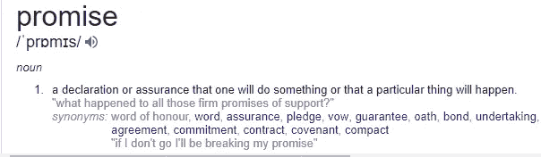
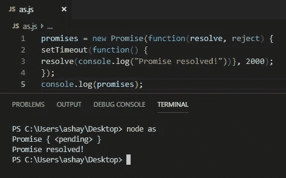

# 如何用 JavaScript 写承诺

> 原文：<https://javascript.plainenglish.io/truly-understanding-promises-in-javascript-cb31ee487860?source=collection_archive---------1----------------------->


Photo by [rawpixel](https://unsplash.com/@rawpixel?utm_source=medium&utm_medium=referral) on [Unsplash](https://unsplash.com?utm_source=medium&utm_medium=referral)

> [点击这里在 Linkedin 上分享这篇文章！](https://www.linkedin.com/sharing/share-offsite/?url=https%3A%2F%2Fwww.linkedin.com%2Fpulse%2Ftruly-understanding-promises-javascript-ashay-mandwarya%2F%3Fpublished%3Dt)

几乎所有使用过 JavaScript 的人都在某种程度上对它又爱又恨。JavaScript 就像那个有时令人沮丧的女朋友，但她身上有一些让我们好奇的东西。JavaScript 有大量有趣的主题和概念可以探索。先说其中一个——承诺。


Photo by [Judeus Samson](https://unsplash.com/@judeussamson?utm_source=medium&utm_medium=referral) on [Unsplash](https://unsplash.com?utm_source=medium&utm_medium=referral)

> 就像没有对话的蜘蛛侠电影是不完整的，强大的力量伴随着巨大的责任
> 
> 没有一篇基于承诺的文章是完整的，因为它没有声明承诺会让你免于被召回的痛苦。

但是承诺还不止这些，我将向你们展示。

JavaScript 是一种同步编程语言，但是因为有了回调函数，我们可以让它像异步编程语言一样工作。

# **承诺**

javascript 中的承诺与现实生活中的承诺非常相似。



Definition of promise -Google

1.  作出承诺后，我们会得到关于某事的保证，并据此制定计划。
2.  它们可以保留，也可以被破坏。
3.  我们不能立即采取行动。只有在承诺兑现之后。

根据 [MDN](https://developer.mozilla.org/en-US/docs/Web/JavaScript/Reference/Global_Objects/Promise) :

`**Promise**`对象表示异步操作的最终完成(或失败)及其结果值。

玩弄承诺有两个部分-

1.  承诺的产生
2.  承诺的处理

# 创造

承诺有基本的蓝图

```
new Promise( /* executor */ function(resolve, reject) { ... } );
                                                               --MDN
```

执行函数(executor)接受两个参数`resolve` 和`reject` ，这两个参数又是回调函数。承诺用于处理异步操作，也称为阻塞代码，例如 DB、I/O 或 API 调用，这些调用由 executor 函数执行。一旦完成，它要么在成功时调用 resolve 函数，要么在出错时调用 reject 函数。

简单的例子

```
let promise = new Promise(function(resolve, reject) {if(promise_kept)
  resolve("done");else
  reject(new Error("…"));

});
```

可以看出，*承诺不会立即返回值。它等待成功或失败，然后相应地返回。这使得异步方法像同步方法一样返回值。异步方法不是立即返回值，而是承诺返回值*。

上面一段说清楚了一件事，*它有状态！*

承诺可以是这些状态之一-

1.  ***待定—*** 这是承诺执行过程中的初始状态。既不满足也不拒绝。
2.  ***兑现了—*** 许诺成功了。
3.  ***拒绝—*** 许诺失败。

这些州是不言自明的，所以我就不赘述了。下面是截图，供参考。



# 处理和消费承诺

在上一节中，我们看到了承诺是如何产生的，现在让我们看看承诺是如何被消费的。

```
const isDone = new Promise()
//...

const checkIfDone = () => {
  isDone
    .then(ok => {
      console.log(ok)
    })
    .catch(err => {
      console.error(error)
    })
}
```

跑步。checkIfDone()将执行 isDone()承诺，并使用 then 回调等待它解决。如果有错误，将在 catch 块中处理。

# 连锁承诺

一个承诺可以转化为另一个承诺，形成一个承诺链。如果一个人辜负了所有其他人。链接与 Promise 结合起来非常强大，因为它让我们能够控制代码中事件的顺序。

```
new Promise(function(resolve, reject) {

  setTimeout(() => resolve(1), 1000); 

}).then(function(result) { 

  alert(result); 
  return result * 3;

}).then(function(result) { 

  alert(result); 
  return result * 4;

}).then(function(result) {

  alert(result); 
  return result * 6;

});
```

所有的操作都将结果返回给下一个`then()`函数，这个过程一直持续到链完成。链中的最后一个元素返回最终结果。

# 结论

这只是 JavaScript 承诺的一个基本要点。如果以正确的方式和在正确的地方使用，承诺可以做得更多。

希望你喜欢阅读。在推特上关注我

👏👏👏👏👏👏👏


Source: Google