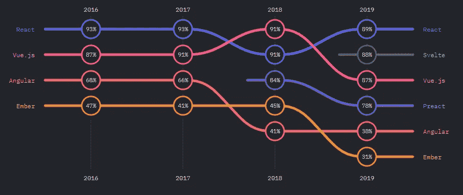
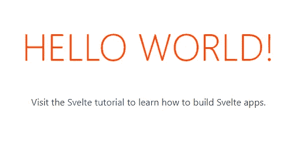
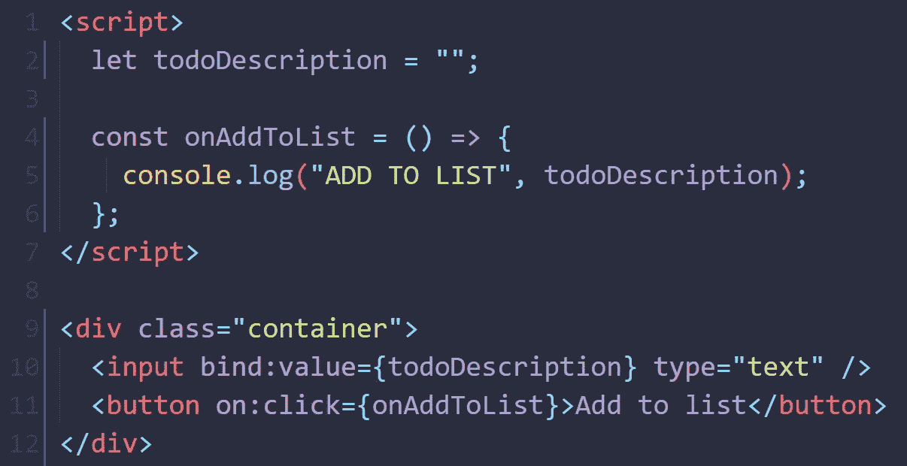
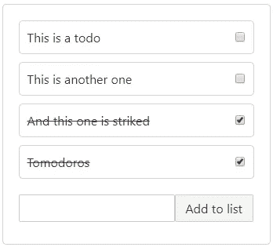

# 作为 React 开发者第一次尝试苗条

> 原文：<https://javascript.plainenglish.io/trying-svelte-for-the-first-time-as-a-react-developer-b83c47166e1e?source=collection_archive---------3----------------------->

Image by Mammiya from Pixabay

你好，这些是我对这个苗条框架的第一印象，我将把我在这里学到的一切都记录在介质上，所以我们开始吧。

我知道什么？每个人都在谈论它，这也是 reactjs 之后第二受欢迎的框架

Snapshot from StateOfJS 2019 statistics

所以，我将在这里跟随官方的苗条教程，我在这个帖子上的目标很简单，一个带有检查项目的待办事项列表，只是为了学习基础知识，我们将在未来更深入。

*请记住，我不是这个领域的专家，只是一个写博客的人，如果你已经知道苗条，好吧，玩得开心。*

# 我们开始吧

看起来 Svelte 是一个编译器，所以我必须在 REPL 或 degit 之间选择，我选择第二个，它看起来就像几个命令。

我得到了这个 hello world 屏幕，我正在快速阅读教程和源代码，看看这是关于什么的，然后我们就可以开始使用我们的 todo 应用程序了。

现在看起来它有一个真正简单的语法和文件夹结构，现在我想通过点击一个按钮来改变背景，以了解事件和状态管理是如何工作的。

与其他框架不同，这是一种切换背景的简单方法，不需要太多代码。我将尝试创建 todo 列表，为此我需要通过数组元素的某种映射，所以让我们继续。

> 有一个叫做 ***语句*** 的东西，我认为它可能很像 react 端的 useEffect，我喜欢这个框架的简单性。

我试图捕获 ***on:改变输入上的*** 事件，然后更新 ***的值，将输入的值设置为 ***的值，这就是 react 的方式，但这里我只需使用 ***bind:value*** ，酷😎******

这就是我的 ***todo-app*** 的样子，如果你想试试，点击[这里](https://todosvelte.alejov.dev/)。

而这就是代码的样子， ***50 行代码*** (我去掉了 CSS 的 40 行)

将类似的 todo-app 与 react 等其他框架进行比较，Svelte 的语法简单，易于习惯，我只是尝试了 Svelte 的一些东西，但它可能是 web 开发的未来，它创建于 2016 年，不是那么新，但也不是那么老。

为了知道我能否用 Svelte 制作现实生活中的网络应用程序(很可能，chess.com 就是用它制作的)，我至少需要使用它几个月才能掌握 Svelte。

Image is taken from the video below

自从在 JSConf EU 2018 上看到 Rick Harris 的视频[“电脑，给我建个 app”我就知道 Svelte 了。但直到今天我才尝试过，它很酷，我现在不会换，但我肯定会了解更多。](https://youtu.be/qqt6YxAZoOc)

还有很多关于 Svelte 的其他东西我没有用过，比如生命周期、存储、运动、过渡、动作、动画，我把所有东西都放在一个文件中，所以我需要创建“组件”，并使用外部 API 和库。