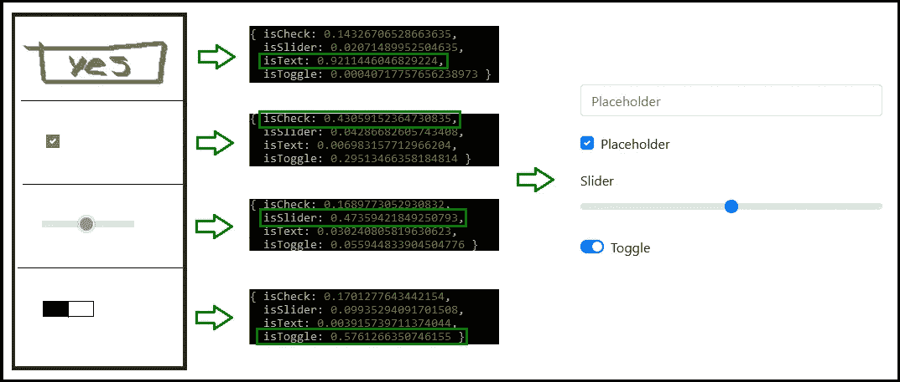
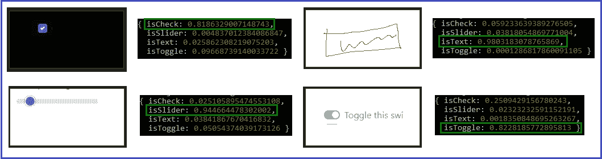
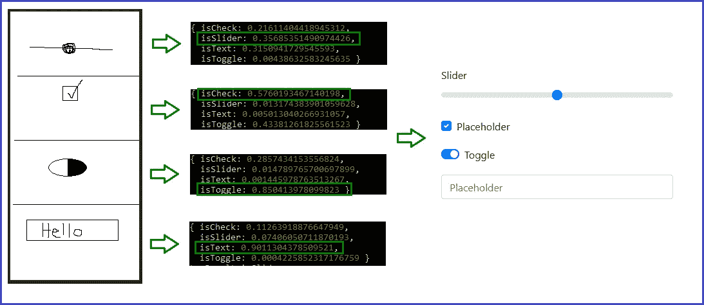

# 仅用 JavaScript 将模型转换成代码

> 原文：<https://javascript.plainenglish.io/turn-mockups-into-code-with-just-javascript-6e9cf1d9220?source=collection_archive---------2----------------------->

## 使用 Brain.js、Node 和 React 的简单机器学习概念验证

Original Photo by [Alex Knight](https://unsplash.com/@agkdesign?utm_source=medium&utm_medium=referral) on [Unsplash](https://unsplash.com?utm_source=medium&utm_medium=referral)

人工智能是未来，它将取代我们所有的工作。你可能已经听说过很多，因为机器学习系统取代了越来越多的传统、手工和重复性工作。你也会听到入门级编程工作不可避免地被我们的人工智能朋友抢走的呼声。但与此同时，大多数软件工程师会告诉你这永远不会发生，因为我们的工作对于计算机来说太抽象和复杂了。

就我个人而言，我欢迎一种快乐的媒介，在这种媒介中，我每天执行的许多重复任务都被自动化了，因此我可以将更多的精力放在业务逻辑和用户功能上。我们不应该将机器学习视为大规模失业的先兆，而应该将其视为帮助我们发展软件工程师定义的工具，这样我们就可以在产品中提供更多质量和价值。我日常工作的很大一部分是将 UX 模仿翻译成代码，这总是导致从现有页面复制大量代码，并修改布局、间距和颜色，直到看起来正确为止。然后，我最终可以专注于特定功能的特定业务需求。但是如果我有一个基于给定的 mock 生成组件布局的程序，我每周可以节省几个小时甚至几天的开发时间。那太棒了！

在谷歌上快速搜索一下，就会发现许多公司已经在努力实现这一目标。所以我创建了一个小型的概念验证应用程序，使用机器学习来翻译一个简单的图像，以反应代码，所有这些都使用 JavaScript。而且真的管用！如果像我这样几乎没有任何数据科学经验的人能够创造出这样的东西，这个领域的未来看起来确实很光明。

你可以在这里找到所有代码[。这是最终产品的预览:](https://github.com/MachineLlama/react-big-brain)

# 前提

我想让事情开始时尽可能简单，所以我训练了一个模型来理解 4 个表单组件之间的区别:文本输入、切换、复选框和滑块。一旦它能够区分这 4 个组件，我就用它来确定新绘制的 mock 中存在哪些组件以及它们的顺序，然后按照顺序将预先编写的 JSX 拼接在一起，以呈现一个基本的形式(还没有定义函数，只有一个基本的框架)。它远非完美，我只训练了大约一个小时的模型，但结果仍然令人印象深刻。

我将假设对 JavaScript、Node、React 和神经网络有基本的了解。当然，下面的所有概念都可以适用于任何编程语言，但我选择 Brain.js 和 JavaScript 是因为它们简单。如果下面的术语没有意义，我会强烈推荐一些在线教程或课程(我在 Coursera 上参加了一些很棒的深度学习课程，以了解基础知识)。

# 预处理

可以说是任何机器学习项目中最重要的(也是最耗时的)任务；拥有良好、丰富的数据至关重要。

对于这个概念验证，我绘制了每个组件的变体，并将其保存为 200 像素乘 100 像素的 JPEG 图像。然后我把一些来自不同网站的组件截图放进去，瞧，我有 120 张图片用于训练。为了减少训练噪声，我将所有图像转换为灰度，并创建更多的样本，我将每张图片水平翻转，因此我总共有 240 张跨 4 种不同类型的组成图片。

所有原始图像可在`/pics/component-pics`下的 [repo](https://github.com/MachineLlama/react-big-brain) 中找到，处理后的图像可在`/pics/training-data`中找到。

# 培养

将每个图像作为输入传递给卷积神经网络模型似乎是最明显的途径，但在撰写本文时，Brain.js 不支持 CNN 模型。因此，对于每张图片，我使用`hog-features`库来计算一个[梯度方向直方图](https://en.wikipedia.org/wiki/Histogram_of_oriented_gradients) (HOG)，这是一个介于 0 和 1 之间的数字数组，代表图像中的边缘方向。这让我们可以将图像转换成标准神经网络可以使用的东西，在某些情况下，可以像 CNN 模型一样工作，以检测图像中的特征。

参数:用不同的参数测试后，最终得到的是 sigmoid 激活，隐层[10，10]，学习率 0.2。

这就是在 Brain.js 中创建模型所需的全部内容。还有一些额外的代码用于获取 hog-feature 输入，跟踪迭代，并在之后保存模型。但这就是使用 Brain.js 的要领，超级简单。

根据 Brain.js 的数据，在我的桌面上对 240 张图像和大约 5000 次迭代进行训练大约需要一个小时才能达到 0.005 的错误率。以下是我看到的一些输入和结果的例子:

所有用于训练和预测的节点脚本都可以在`/scripts`中找到。

# 转换

一旦我们对训练数据的结果有了信心，我们就可以将一个给定的 mock 分成不同的组件，以查看模型可以识别它们的程度。我使用`split-images`库将一个 mock 分割成 200 像素乘 100 像素的部分来运行这个模型。对于可以识别的每种类型的组件，我定义了预先编写的 JSX，它用于根据 mock 中组件的顺序生成最终输出。从那里开始，复制到 React 页面进行渲染就非常简单了。

这是另一个使用一些新的(糟糕的)图片的例子:

在新的图纸上，模型的可信度没有那么高，我发现每个部分中组件的位置对结果有很大的影响。这可以通过创建更多具有动态大小(而不是仅仅 200x100)和不同位置的训练数据来改进。此外，增加隐藏层的数量和大小可以让模型获得更复杂的特征。

# 后续步骤

这是一个简单的实现，所以在未来的版本中还有很多可以改进的地方:

*   对更多数据进行训练，以更准确地识别更多组件类型
*   更多隐藏层以增加模型可以理解的内容(并输入不同大小的图像)
*   将模型应用于更大的模型，检测精确位置，并在最终组件中应用正确的定位
*   使用预写 JSX 的模板来创建潜在输出的库(并且可能训练模型来识别不同的风格和主题)
*   向最终输出添加更多功能，而不仅仅是骨架组件
*   构建一个 UI 界面来接受和预测任何图像；目前它是从节点脚本调用的，但是 Brain.js 也可以从前端使用

如果任何阅读的人想要在这些点上工作或者使用这个代码作为你正在工作的任何事情的基础，请随意！

# 结论

我花了大约一天的时间来创建训练数据，并编写生成结果尚可的模型所需的脚本，这意味着一个训练有素的数据科学家团队可以在该领域创造奇迹。如果这种技术在短短几年内变得普遍，我不会感到惊讶，因为用更强的计算能力实现基本框架和训练模型变得更容易。

你有什么想法？我非常期待接下来会发生什么。