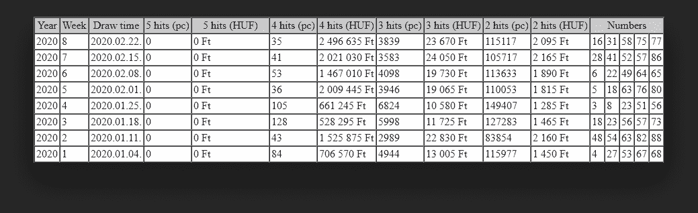
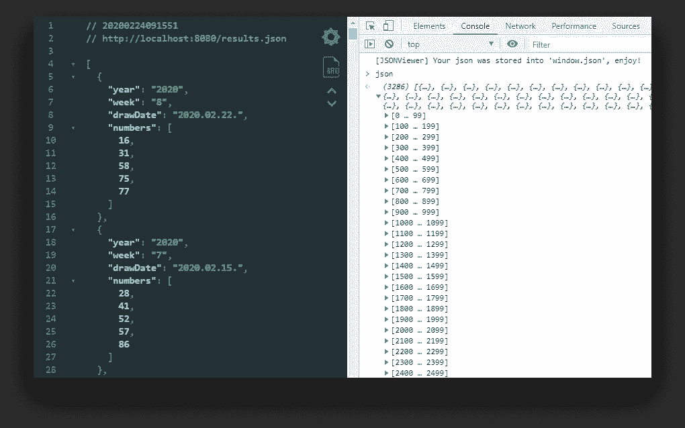
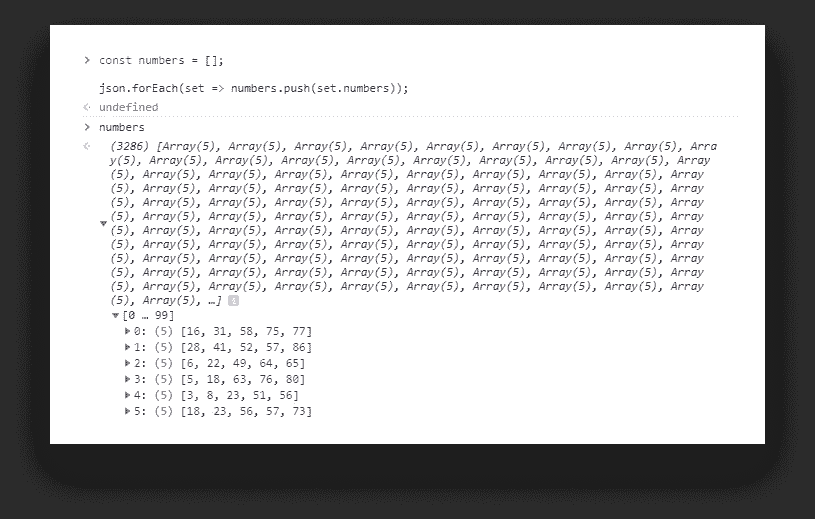
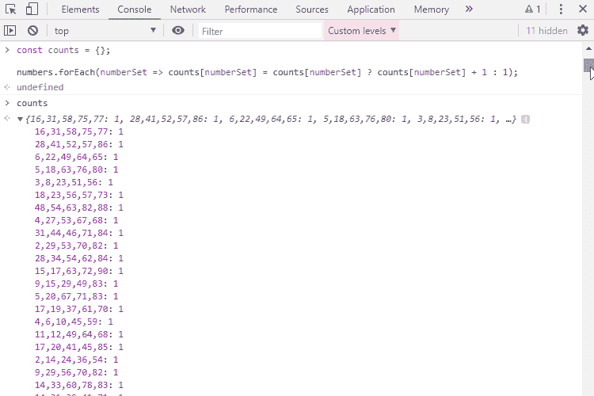
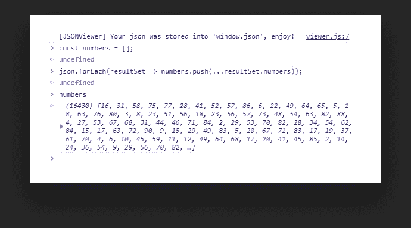
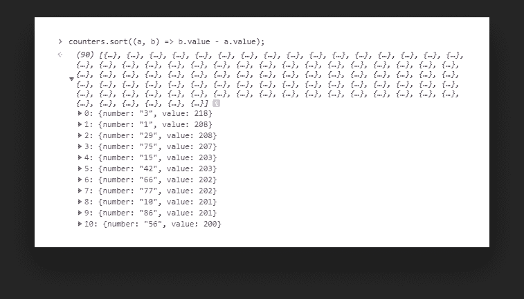
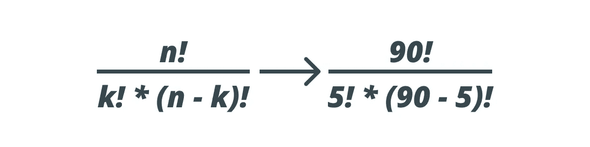
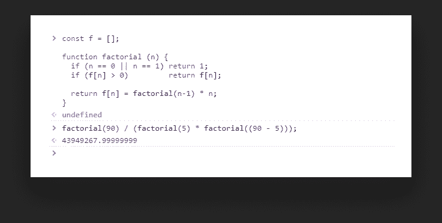
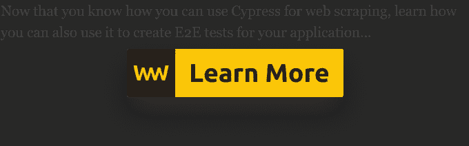

# 把 E2E 测试变成网络抓取

> 原文：<https://javascript.plainenglish.io/turning-e2e-tests-into-web-scraping-bd6a335ac2fb?source=collection_archive---------6----------------------->

## 使用 Cypress 在 REST API 不存在的地方检索数据

Photo by [Markus Spiske](https://unsplash.com/@markusspiske?utm_source=medium&utm_medium=referral) on [Unsplash](https://unsplash.com?utm_source=medium&utm_medium=referral)

每个人都有梦想。对我一个密友的祖父母来说，那就是中彩票。他们着迷并决心要赢，不管要花多长时间。这就是为什么他们试图破解这个秘密，日以继夜地工作来制定这些年来完美的中奖号码。他们最终成功做到了——至少他们认为是。自 1973 年以来，他们一直在玩这个游戏——40 多年来一直如此，希望赢得大奖，但仍在等待重大突破。

那时我就在想——为什么不试着收集有史以来的中奖号码并检查一下几率呢？所以我去了匈牙利国家彩票的官方网站，那里有:空前的中奖号码。

当然，手动收集它们会非常繁琐，而且据我所知，我也没有可以与之交互的 API，所以我转向了网络搜集:

> 一种不使用 API 从网站提取数据的方法。

# 这个概念

首先，我们将了解如何使用 Cypress 从 HTML 页面收集信息。问题中的页面如下所示:

游戏规则是:在 1 到 90 之间选 5 个不同的数字。对我们来说幸运的是，数据至少是预先格式化在表格中的。我重新命名了这些列，这样你就能理解我们所看到的。结果列表一直到 1957 年，总共有 3287 行。我们希望从每行的“*数字*”列中收集数字。

然后我们想用它创建一个对象，最后保存到一个 JSON 文件中供以后重用。最后，我们可以检查 5 个数字中的一个是否被抽了多次。我们还可以检查哪些数字被选中的次数最多。

因此，让我们从获取一切可以获取的东西并从中生成结构化数据开始。

# 生成内容

首先，您想通过运行`[npm i cypress --save-dev](https://www.npmjs.com/package/cypress)`来设置 Cypress。我还将启动脚本添加到我的`package.json`文件中，这样我们就可以运行它，而不必键入完整的`node_modules`路径:

如果你想了解更多关于 Cypress 本身的知识，我有一个更深入的教程，你可以通过上面的链接找到它。

完成这些之后，让我们创建一个新的测试文件，我们将在其中收集必要的信息:

首先，我们要访问我们想要收集数据的页面。

我已经创建了一个`results`数组，它将保存一个对象中的每一行以及我们需要的信息。然后我们遍历表格的每一行。我们想跳过第一行，因为它只包含`th`元素，这就是为什么我们需要在最开始使用 if 语句。之后，我创建了两个变量，因为我们要多次访问这个元素:

*   `$tr`是一个包装的 JQuery 对象，所以我们想用`get(0)`获得底层的 DOM 属性。
*   `rowElement.cells`是保存每列数据的`HTMLCollection`。

注意，因为没有我们可以选择的类，我们需要计算每一行的子元素。在此之后，我们应该得到以下结构化数据:

# 保存到 JSON

我们可以通过将`then`子句中的`console.log`改为下面一行来轻松保存这些数据，以供以后重用:

这将在项目根目录下`cypress.json`旁边创建一个文件。现在我们已经有了一切可用的东西，我们可以继续计算我们的赔率和破解秘密，以制定一套完美的中奖号码。

# 计算几率

首先，让我们看看抽出的数字是否有任何重复。让我们首先创建一个只包含中奖号码的新数组，然后我们可以创建一个计算唯一值的函数。

为此，我在 Chrome 中打开了生成的 JSON 文件，并使用控制台来获得结果:

我正在使用 [JSON Viewer](https://chrome.google.com/webstore/detail/json-viewer/gbmdgpbipfallnflgajpaliibnhdgobh?hl=hu) Chrome 扩展，所以我可以通过`window.json`访问 JSON 对象。

The set of winning numbers represented in arrays

首先，我们遍历结果，并为每组中奖号码创建一个新数组。然后我们可以创建一个函数来计算出现次数:

对于每一组选择，我们检查它是否已经存在于`counts`对象中。如果是，我们把它的值加 1，否则我们把它加到对象上。在控制台中运行它，我们会得到下面的数字列表以及它们被抽取的次数。

如你所见，在 63 年的时间里，甚至没有一组中奖号码被抽取过一次以上。那么被摘得最多的数字是什么呢？

同样，我们可以创建一个包含所有中奖号码的新数组，然后计算它们的出现次数:

我们可以像以前一样遵循相同的模式，只是这次我们可以使用 spread 操作符将数字数组分解为单个值。然后用同样的计数函数结合简单的`sort`算法，我们可以得出:被挑选最多的数字是: *3，1，29，75，15。*

但是如果我们向下滚动到最少被选中的数字，88，即使这个数字已经被选中了 145 次。

那么中彩票的几率有多大呢？我们知道，我们可以在 90 个不同的数字中进行选择，我们必须这样做 5 次。这给出了下面的公式:

其中`n`是我们可以选择的选项数量，`k`是我们可以选择的数量。这给我们留下了:

在控制台中创建阶乘函数后，我们可以计算出，用我们选择的号码，我们大约有 43，949，268 分之一的机会赢得这种类型的彩票，这可能与我们的中奖机会一样随机。

# 结论

那么彩票中奖的秘诀是什么呢？—一个也没有。如果有的话，人们会成为百万富翁，彩票公司明天就会破产。你最好把这些钱投资到你自己，你的未来，你的家庭。

正如我们所看到的，Cypress 使得交互和从网页上收集信息变得非常容易。网络抓取的其他一些使用案例是什么？

## **例如，您可以:**

*   从产品中收集信息进行比较
*   为机器学习收集训练数据
*   从社交媒体和论坛中提取数据进行情感分析

不胜枚举，前途无量。

你有网络抓取的经验吗？在没有 API 的情况下收集数据时，您有什么有价值的提示和技巧吗？请在评论中告诉我们。谢谢你的时间，祝你愉快。

## 进一步阅读

 [## 使用易于使用的浏览器扩展自动抓取网页

### 如何使用 Listly，一个初学者友好的无代码工具，轻松实现 web 抓取过程的自动化。

javascript.plainenglish.io](/automate-web-scraping-with-an-easy-to-use-browser-extension-cb6073f1e61d) 

*更多内容请看*[***plain English . io***](https://plainenglish.io/)*。报名参加我们的* [***免费周报***](http://newsletter.plainenglish.io/) *。关注我们关于*[***Twitter***](https://twitter.com/inPlainEngHQ)[***LinkedIn***](https://www.linkedin.com/company/inplainenglish/)*[***YouTube***](https://www.youtube.com/channel/UCtipWUghju290NWcn8jhyAw)*[***不和***](https://discord.gg/GtDtUAvyhW) *。***