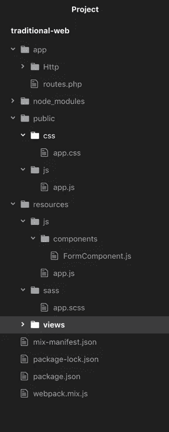
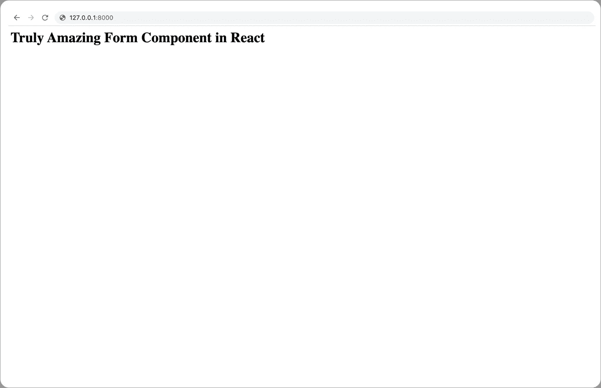

# 使用 React 将传统网站转变为渐进式单页面应用

> 原文：<https://javascript.plainenglish.io/turning-legacy-websites-into-progressive-single-page-apps-with-react-530c0830e0c1?source=collection_archive---------3----------------------->


大多数开发人员不喜欢从事遗留项目，原因有很多。最明显的一个事实是，与他们在最近精心制作的绿地项目中的工作相比，他们的生产率大幅下降。然而，管理层通常期望他们以相同的步调工作，而不管正在讨论的项目。

假设您的任务是在 Laravel 5.1 中创建一个复杂的工作申请表，这个 PHP 项目自从两年前前任首席开发人员离职去冰岛当导游以来就没人碰过了。

该表单应允许用户选择他们的工作领域，根据这一点，所有相关的工作清单将从服务器上提取。您知道，当一个输入字段的值依赖于另一个输入字段时，表单往往会变得复杂，更不用说当您可能需要处理异步代码以便从服务器加载更多数据时。你头脑中的声音告诉你，你只有三个选择:

1.  运行 create-react-app my-awesome-form，使用最热门的工具从头开始编写整个系统的代码(包括 Redux、TypeScript、Mongodb、Firebase 函数、微服务架构以及过去 6 个月在 YouTube 上观看教程时学到的所有东西)。
2.  继续当前的设置，并将表单分成两个独立的路径:choose_job_field 和 complete_application(后者可能会获得所选的 job 字段作为查询参数)。
3.  做两者的混合。

第一种选择几乎总是次优的，应该不惜一切代价避免。今天的 greenfield 项目在几年后将成为遗留项目，因此，最好将时间花在实现新特性上，而不是追逐最新的框架或库。

第二种选择更好，但代价是灾难性的用户体验。这在 15 年前是可以接受的，但现在已经不那么“酷”了。

您只剩下第三种选择，幸运的是，本文将向您展示如何做到这一点。

**渐进式单页面应用**(不要与渐进式 web 应用混淆)是传统的服务器端渲染网站，带有一些使用 React 等 SPA 技术创建的 UI 元素。如果您运行的是 Laravel 5.7，将 React 集成到您的项目中只是一个命令的问题:

```
php artisan preset react
```

这将在您的资源目录中创建一个示例组件。您可以通过运行以下命令来启动开发模式:

```
php artisan serve && npm run watch
```

如果你正在使用其他的框架(比如 Spring Boot)或者 Laravel 的旧版本，你仍然可以很容易地利用 laravel-mix 包。首先在项目的根目录下创建 **package.json** 和 **webpack.mix.js** 文件，内容如下:

package.json:

```
{
  "private": true,
  "scripts": {
    "dev": "npm run development",
    "development": "cross-env NODE_ENV=development node_modules/webpack/bin/webpack.js --progress --hide-modules --config=node_modules/laravel-mix/setup/webpack.config.js",
    "watch": "npm run development -- --watch",
    "watch-poll": "npm run watch -- --watch-poll",
    "hot": "cross-env NODE_ENV=development node_modules/webpack-dev-server/bin/webpack-dev-server.js --inline --hot --config=node_modules/laravel-mix/setup/webpack.config.js",
    "prod": "npm run production",
    "production": "cross-env NODE_ENV=production node_modules/webpack/bin/webpack.js --no-progress --hide-modules --config=node_modules/laravel-mix/setup/webpack.config.js"
  },
  "devDependencies": {
    "@babel/preset-react": "^7.0.0",
    "axios": "^0.19",
    "cross-env": "^5.1",
    "jquery": "^3.2",
    "laravel-mix": "^4.0.7",
    "lodash": "^4.17.13",
    "popper.js": "^1.12",
    "react": "^16.2.0",
    "react-dom": "^16.2.0",
    "resolve-url-loader": "^2.3.1",
    "sass": "^1.15.2",
    "sass-loader": "^7.1.0"
  }
}
```

webpack.mix.js:

```
// webpack.mix.jsconst mix = require(‘laravel-mix’);mix.react(‘resources/js/app.js’, ‘public/js’)
 .sass(‘resources/sass/app.scss’, ‘public/css’);
mix.disableNotifications();
```

现在运行:

```
npm install
```

然后在公共目录中创建 css 和 js 文件夹(如果它们还不存在的话)，并将 **js/app.js、sass/app.scss** 和**js/components/form component . js**文件添加到 resources 文件夹:

```
// resources/js/app.jsrequire('./components/FormComponent');
```

resources/sass/app.scss:

```
// resources/sass/app.scssbody {
  background-color: #fff;
}h1 {
  color: #000;
}
```

资源/js/components/form component . js:

```
// resources/js/components/FormComponent.js:import React from 'react';
import ReactDOM from 'react-dom';export const FormComponent = () => {
  return (
    <>
      <h1>Truly Amazing Form Component in React</h1> 
    </>
  );
};if (document.getElementById('form-component')) {
  ReactDOM.render( <FormComponent /> , document.getElementById('form-component'));
}
```

现在，您的文件夹结构应该如下所示:



您现在可以运行:

```
npm run watch
```

您已经准备好为表单添加一个路线和一个控制器。下一步将根据您使用的服务器框架而有所不同，但总体思路是将 **app.js** 和 **app.css** 加载到控制器呈现的视图中:

app/Http/表单控制器. php:

```
// app/Http/FormController.php<?phpnamespace App\Http\Controllers;
use App;
use Illuminate\Routing\Controller as BaseController;
class FormController extends BaseController {
  public function __construct()
  {
    parent::__construct();
  }

  public function main() {
    return view('complicated_form');
  }
}
?>
```

resources/views/complicated _ form . blade:

```
<!-- resources/views/complicated_form.blade -->
<html>
  <body>
    <div id="form-component"></div>
    <script type="text/javascript" src="/js/app.js?v={{filemtime(public_path().'/js/app.js')}}"></script>
    <link rel="stylesheet" href="/css/app.css?v={{filemtime(public_path().'/css/app.css')}}" type="text/css">
  </body>
</html>
```

别忘了在 app/Http/routes.php 中公开路由:

```
<?php
 // …
 Route::get(‘/form’, [‘as’ => ‘form’, ‘uses’ => ‘FormController@main’]);
 // …
?>
```

现在您可以运行您的 php / java / other 服务器来查看惊人的结果:



本文展示了一种使用 ReactJS 实现预期目的的简单技术——与现有项目集成。如果你还有任何问题，请在下面的评论区留下。