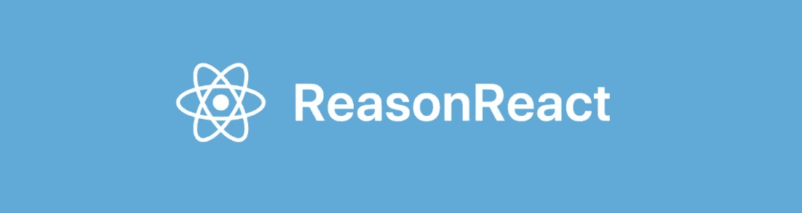

# ReasonReact 入门

> 原文：<https://javascript.plainenglish.io/tutorial-getting-started-with-reasonreact-984069b898ac?source=collection_archive---------13----------------------->



在这篇博文中，我们将使用 ReasonReact 构建一个小型 CRUD 应用程序。我们将在本教程中介绍以下内容:

*   使用 [bs-css](https://github.com/reasonml-labs/bs-css) 进行造型
*   用[@ glensl/bs-JSON](https://github.com/glennsl/bs-json)进行 JSON 编码/解码
*   本地存储操作
*   使用 **useReducer** 挂钩

对于那些想先看看代码的人，Github 链接在这里。

[](https://github.com/varunmulloli/reasonreact-example-list) [## varunmulloli/reason react-example-list

### 一个 ReasonReact 示例应用程序，它呈现 localstorage 中的项目列表，并对其执行基本操作。至…

github.com](https://github.com/varunmulloli/reasonreact-example-list) 

## 目录结构

```
reasonml-example-list/
|
|- public/
|  |- edit.png
|  |- delete.png
|- src/
|  |- apis/
|  |  |- ListAPI.re
|  |- components/
|  |  |- header/
|  |  |  |- Header.re
|  |  |  |- HeaderCSS.re
|  |  |- listItems/
|  |  |  |- ListItems.re
|  |  |  |- ListItemsCSS.re
|  |  |- modal/
|  |  |  |- Modal.re
|  |  |  |- ModalCSS.re
|  |- helpers/
|  |  |- JsonHelper.re
|  |- services/
|  |  |- ListService.re
|  |- theme/
|  |  |- Theme.re
|  |- types/
|  |  |- Types.re
|  |- App.re
|  |- Index.re
|
|- bsconfig.json
|- index.html
|- package.json
|- watcher.js
```

我知道文件组织对于这样一个基本的演示应用程序来说有点大材小用，但是我相信这将是构建更大的应用程序的良好起点，所以我没有费心去简化它。

## 装置

如果你的机器上还没有安装 [**Node.js**](https://nodejs.org/) ，你可以从[node . js 网站](https://nodejs.org/en/download/)下载安装。安装完成后，在命令行/终端上运行以下命令，安装负责将您的 [ReasonML](https://reasonml.github.io/) 代码编译成 Javascript 的 [Bucklescript](https://bucklescript.github.io/) 。

```
npm install --global bs-platform@6.2.1
```

一旦这些步骤成功完成，导航到您打算启动这个项目的文件夹并创建这两个文件—***package . JSON***和***bs config . JSON***。

> package.json

> bsconfig.json

确保您的当前工作目录与命令行中的相同，并通过运行以下命令安装所有依赖项

```
npm install
```

## 你好世界

现在，我们将设置从 ReasonReact 应用程序运行“Hello World”所需的文件。我使用的服务器设置与您运行`bsb -init`命令时得到的设置相同。

> index.html

> watcher.js

> src/Index.re

一旦创建了这些文件，返回命令行并运行

```
npm run start
```

该命令将编译代码，并监视更改。现在为命令行打开一个新的选项卡/窗口，确保您在同一个工作目录中并运行

```
npm run server
```

这将启动端口 8000 上的服务器。我们可以通过打开浏览器并导航到 [http://localhost:8000](http://localhost:8000) 来检查输出。如果一切顺利，你会在浏览器窗口看到“Hello World”。

## 用 [bs-css](https://github.com/reasonml-labs/bs-css) 造型

现在我们已经完成了设置阶段，我们将继续一步一步地构建应用程序。首先，我们将制作一个组件，并使用 ***bs-css*** 对其进行样式化。将 **src/Index.re** 的内容修改为:

> src/Index.re

> src/App.re

> src/theme/Theme.re

> src/components/header/header . re

> src/components/header/header CSS . re

请注意，我们已经将全局和公共样式分离到一个单独的主题文件中，这样它就可以很容易地在其他 CSS 模块之间共享。由于 watcher 正在运行，您的浏览器将在保存时自动刷新并加载我们新编写的代码的输出。如果一切顺利，浏览器窗口现在将显示我们新创建的标题。

## 用@glennsl/bs-json 进行 JSON 编码/解码

我们的应用程序旨在操作对象列表，我们计划通过在 Reason end 创建记录并将其作为 JSON 字符串存储在`localStorage`中来实现持久性。现在我们将定义记录类型，并为其编写 JSON 编码和解码函数。

> src/types/Types.re

> src/helpers/JsonHelper.re

## **本地存储操作**

现在我们将继续使用我们刚刚创建的 JSON 编码器和解码器为这些记录定义 localStorage CRUD 操作。

> src/services/ListService.re

> src/apis/ListAPI.re

ListService 的模块签名将控制所有方法通过其实现模块公开的内容。

## 使用 **useReducer** 挂钩

现在，我们将使用我们创建的 API 来连接应用程序。剩下的唯一部分是构建实际的 UI 本身，这是我们现在要做的。让我们回到我们之前创建的 **src/App.re** 并更新它的内容。

> src/App.re

> src/components/listitem/listitem . re

> src/components/listItems/listItems CSS . re

> src/components/modal/Modal.re

> src/components/modal/modal CSS . re

这就完成了我们的示例 ReasonReact 应用程序的代码。需要注意的一点是，`React.useEffect0(effect)`在初始渲染时只运行一次，因为它相当于在 React 中调用`React.useEffect(effect, [])`。所以`Fetch`不会在每次组件重新渲染时被调度。

希望这篇博文对你有帮助。欢迎所有建议/反馈/批评！:)

## **用简单英语写的 JavaScript 笔记**

我们推出了三种新的出版物！通过以下方式表达对我们新出版物的热爱:[](https://medium.com/ai-in-plain-english)**[**【UX】**](https://medium.com/ux-in-plain-english)[**【Python】**](https://medium.com/python-in-plain-english)**——谢谢您，继续学习！****

****我们也一直对帮助推广高质量内容感兴趣。如果您有文章想提交给我们的任何出版物，请用您的中用户名在[**submissions @ plain English . io**](mailto:submissions@plainenglish.io)**发邮件给我们，我们会将您添加为作者。另外，请告诉我们您想添加到哪个出版物中。******