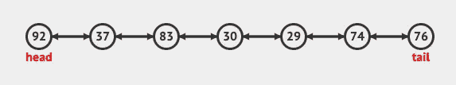

# 双向链表:好两倍

> 原文：<https://javascript.plainenglish.io/twice-as-nice-doubly-linked-lists-c7421b9e4f16?source=collection_archive---------14----------------------->

Photo by [Robert Anasch](https://unsplash.com/@diesektion?utm_source=medium&utm_medium=referral) on [Unsplash](https://unsplash.com?utm_source=medium&utm_medium=referral)

我一直在研究数据结构，并在其上实现通用方法，以帮助我的理解，并通过 Chrome 开发工具使它们变得更加有趣。上周我研究了单链表。如果您没有检查它，您可以在这里进行检查。

我一点也不知道我已经使用了一个很好的双向链表的例子有一段时间了…浏览器历史。每个网页(节点)都有一个指向上一页或下一页的指针(除非它是列表/当前页面的尾部)。

让我们描述一下这个 DS 的形状，然后我们可以为它添加一些方法来获得*乐趣*。

双向链表是节点的集合。它们中的每一个都有一段与之相关的数据(数字、字符串、对象)。每个`node`还有两个属性，帮助我们遍历列表，并显示与节点的关系。

`.next`

节点的`.next`属性将我们指向列表中的下一个`node`。我们可以用它来遍历列表并访问列表中的每一项。

`.prev`

一个`node`的`.prev`属性指向列表中的前一个`node`。这是双向链表的关键部分，它允许我们从`tail`开始遍历链表。(这是我们不能用单链表做的事情)

在纸上画出来，它可能看起来像这张来自 [Visualgo](https://visualgo.net/en/list) 的图片

screenshot from visualgo.net

数字代表我们的数据(本例中是数字)，箭头代表我们的`.prev`和`.next`属性。

让我们给双向链表添加一些功能

## `push(val)`

`push()`添加到双向链表的末尾。这非常类似于单链表中的实现，但是我们不能忘记我们的新朋友 `.prev`属性

伪代码！

> //定义一个名为 push(val)的函数，它接受一个值作为参数
> //使用作为参数传递的值创建一个新节点
> //如果列表为空，则将头和尾设置为新创建的节点
> //否则将当前尾的 next 属性设置为新节点
> //将新节点的 prev 属性设置为当前尾
> //将尾设置为新创建的节点
> //增加列表的长度并返回整个列表。

花些时间考虑一下，看看你是否能让它工作。

Photo by [Nathan Dumlao](https://unsplash.com/@nate_dumlao?utm_source=medium&utm_medium=referral) on [Unsplash](https://unsplash.com?utm_source=medium&utm_medium=referral)

你表现如何？

这是我的实现

在我看来，这里最容易出错的地方是`else`街区。在将`this.tail`重新分配给`newNode`之前，你必须确保分配了`.next`和`.prev`属性**。否则，你不会使用旧的尾巴。**

让我们再做一次

## `get(index)`

`get()`将一个`index`作为参数，并在您传入的`index`处返回`node`。记住链表节点不像数组那样被索引，所以我们的程序不知道链表第五项在内存中的位置。为了找到第 5 项，我们需要遍历列表。双向链表的额外好处是能够从`head` **或**`tail`开始查找。也就是说，如果你有一个一百万个条目的列表，并且需要倒数第二个条目，你可以从`tail`开始，这样可以节省 999，998 次迭代。

伪代码！

//定义一个名为 get()的函数，它接收一个索引并返回该位置的节点
//检查传入的索引是否有效。我们不能使用负索引，或者大于或等于长度的索引
//从头开始遍历列表，直到找到要查找的索引
//优化
//如果要查找列表后半部分的项，则从末尾开始向后查找
//如果要查找列表前半部分的项，则从开头开始向前查找
//返回找到的节点

在检查我下面的实现之前，请自行尝试。

Photo by [Marcelo Leal](https://unsplash.com/@marceloleal80?utm_source=medium&utm_medium=referral) on [Unsplash](https://unsplash.com?utm_source=medium&utm_medium=referral)

怎么样了？

通过检查我们想要的`index`相对于列表中心的位置，优化利用了双向链表和单向链表之间的巨大差异。

类似于使用一个数组的递归二分搜索法，我们想在第一步就把列表切掉一半，这样我们就把需要浏览的条目数量切掉一半。最坏情况下的时间复杂度是 O(n/2 ),简化为 O(n)。

我添加了一些其他方法，并把要点放在文章的最后，以展示我是如何实现它们的。如果你想在看到我实现的解决方案之前尝试一下，我列出了下面的方法。一定要先写伪代码！

1.  `pop()`从列表中删除最后一个节点
2.  从列表中删除第一个节点
3.  `unshift(value)`使用传入的值将节点添加到列表的开头
4.  `set(index, value)`在传入的索引处查找节点，并用传入的值替换其值
5.  `insert(index, value)`用传入的值创建一个新节点，并将其放在传入的索引处。
6.  `remove(index)`从列表中删除给定索引处的节点
7.  `reverse()`颠倒列表顺序，不创建新列表(就地)

我希望你花时间给他们一个尝试。如果你像我一样，在纸上或用便利贴工作，讨论将要发生的事情。将这些步骤制作成你的伪代码，然后开始工作。经常测试，看看你是否能使用一些你已经写好的方法来帮助你解决这些问题。

# 黑客快乐！

## 资源:

 [## 链表(单链表，双链表)，堆栈，队列，队列

### 链表是一种数据结构，由一组顶点(节点)组成，它们共同代表一个序列。在…下面

visualgo.net](https://visualgo.net/en/list)  [## 双向链表|集合 1(介绍和插入)- GeeksforGeeks

### 我们强烈建议参考以下职位作为这个职位的先决条件。链表介绍插入一个节点…

www.geeksforgeeks.org](https://www.geeksforgeeks.org/doubly-linked-list/) 

## 与我联系:

 [## MisterRK -概述

### 我喜欢构建东西，通常是用代码，但总是有高水平的细节。我曾经为…解决问题

www.github.com](https://www.github.com/MisterRK)  [## 罗伯特·凯勒——志愿者——软件工程师——战斗流行病| LinkedIn

### 我喜欢做东西，通常用代码，有时用木头，总是有很高水平的细节。我曾经解决过…

www.linkedin.com](https://www.linkedin.com/in/robert-keller-dev/) 

## 解决方案: