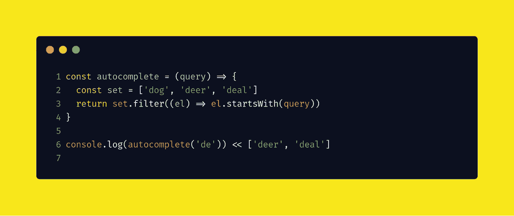
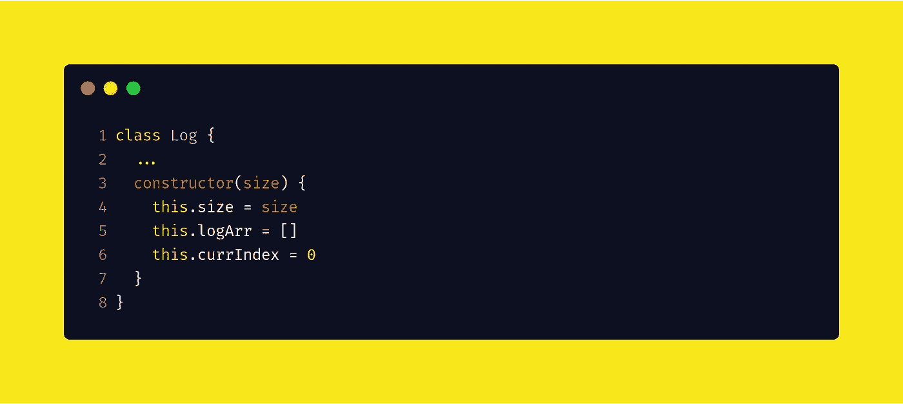
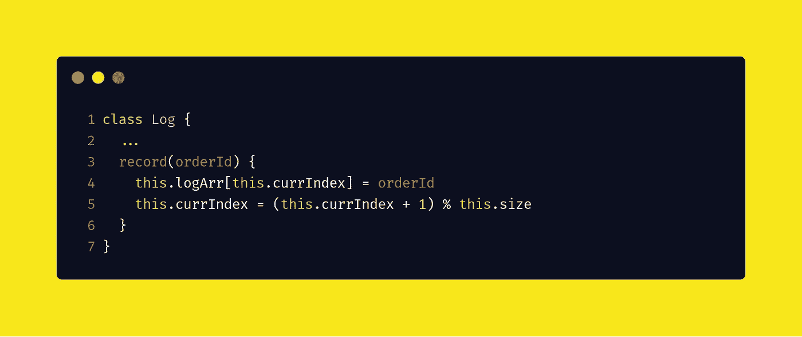
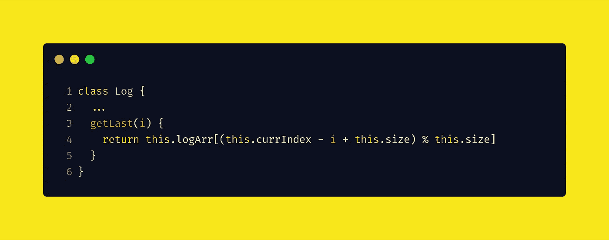

# Twitter 编码面试问题

> 原文：<https://javascript.plainenglish.io/twitter-coding-interview-questions-e5efb2032a?source=collection_archive---------3----------------------->

## 通过每天解决一个问题，变得非常擅长编写面试代码

Photo by [Yucel Moran](https://unsplash.com/@yucelmoran?utm_source=medium&utm_medium=referral) on [Unsplash](https://unsplash.com?utm_source=medium&utm_medium=referral)

# 日常编码问题

它们是受真实编程面试启发的各种各样的问题，带有深入的解决方案，清晰地带您了解每个核心概念。

> 通过每天解决一个问题，变得格外擅长编写面试代码。

我们将一起使用 JavaScript 解决这些问题。

# 问题#1

## 问题

实现一个自动完成系统。也就是说，给定一个查询字符串`s`和一组所有可能的查询字符串，返回该组中以 s 为前缀的所有字符串。

例如，给定查询字符串`de`和字符串集合`[dog, deer, deal]`，返回`[deer, deal]`。提示:尝试将字典预处理成更有效的数据结构，以加快查询速度。

## 解决办法

在 JavaScript 中使用`filter`函数非常简单。

# 问题#2

## 问题

您运行一个电子商务网站，并希望在日志中记录最后 N 个订单 id。用下面的 API 实现一个数据结构来完成这个任务:

*   record(order_id):将 order_id 添加到日志
*   get_last(i):从日志中获取第 I 个最后的元素。I 保证小于等于 n，你要尽可能高效的利用时间和空间。

## 解决办法

我们将创建一个`Log`类。用大小初始化循环缓冲区。

我们将订单 id 添加到`Log`类中。

我们得到最后一个元素。

很简单，对吧？

我会更新 Twitter 在这篇文章中提出的新问题🔖它重新阅读并获得最新的问题和解决方案。

感谢阅读😘

## 简明英语笔记

你知道我们有四种出版物吗？给他们一个 follow 来表达爱意:[**JavaScript in Plain English**](https://medium.com/javascript-in-plain-english)[**AI in Plain English**](https://medium.com/ai-in-plain-english)，[**UX in Plain English**](https://medium.com/ux-in-plain-english)，[**Python in Plain English**](https://medium.com/python-in-plain-english)**—谢谢，继续学习！**

**此外，我们总是有兴趣帮助推广好的内容。如果您有一篇文章想要提交给我们的任何出版物，请发送电子邮件至[**submissions @ plain English . io**](mailto:submissions@plainenglish.io)**，附上您的媒体用户名和您感兴趣的内容，我们将会回复您！****