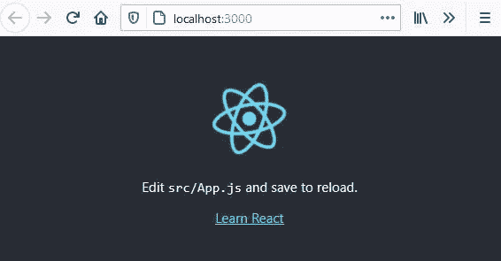
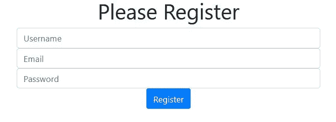

# 在受控反应表单中管理状态的两种方法

> 原文：<https://javascript.plainenglish.io/two-ways-of-managing-state-in-a-functional-react-form-ef0929eefe67?source=collection_archive---------4----------------------->

## 反应提示

## 在注册表单中，对每个输入使用 useState 挂钩，而不是使用一个用户对象和一个 useState 挂钩。


Photo by [Glenn Carstens-Peters](https://unsplash.com/@glenncarstenspeters?utm_source=medium&utm_medium=referral) on [Unsplash](https://unsplash.com?utm_source=medium&utm_medium=referral)

在本文中，我们将探索使用一个简单的注册表单跟踪状态的两种方法。

用户输入他们的名字、电子邮件地址和密码，我们 ***以两种不同的方式记录状态。***

*   第一种方法是对每个输入字段使用 useState 钩子。
*   第二种方法是使用一个用户对象和一个带有用户对象的 useState 钩子。

> 这两种方法都有效，但第二种方法可能更适合较大的表单。

# 我们开始吧

您可以使用现有的 React 项目(我经常保留一个“沙箱”应用程序进行实验)或引导一个新项目。

## 创建新项目

1.  创建一个放置应用程序的目录。
2.  启动 VS 代码(或所需的编辑器)并打开刚刚创建的文件夹。
3.  打开一个终端窗口，输入这段代码来引导我们的 React 应用程序。

```
npx create-react-app usestate-forms
```

接下来，我们需要切换到这个目录并运行 npm start 来启动开发服务器，以验证它正在运行我们的 React 应用程序。默认情况下，这将在本地主机端口 3000 上。

4.应用程序启动后，在终端中键入以下内容。

```
cd usestate-forms
npm start
```

您应该会看到类似下图的内容。



Basic React Application

使用 CTRL +C 停止开发服务器并关闭浏览器选项卡。

我们还将安装 bootstrap 来提供一些简单的样式。

1.在终端窗口中键入以下命令来安装引导程序。

```
npm install bootstrap
```

2.打开 App.js，用下面的简化代码替换默认代码。

```
import React,**{useState}** from 'react'
import './App.css'const App=()=> {return (
    <div className="App">
     <h1>User Registration</h1>
    </div>
  );
}
export default App;
```

2.保存并重新启动开发服务器。

```
npm start
```

你应该在浏览器中只看到“用户注册”的字样。

# 创建注册表单组件

1.  在 src 文件夹中创建一个名为 **RegistrationForm** 的组件。射流研究…
2.  添加以下代码，在表单中创建三个输入字段和一个提交按钮。

```
import React, { useState } from 'react'
import bootstrap from '../node_modules/bootstrap/dist/css/bootstrap.min.css'const RegistrationForm=()=>{return  (

    <div className='row justify-content-center'><div className='col-md-4'>
        <h1>Please Register</h1>
        <form>
            <input
            type="text"
            placeholder="Username"
            name="userName"
            className='form-control'

            />
            <input
            type="email"
            placeholder="Email"
            className='form-control'
            name="email"

            />
            <input
            type="password"
            placeholder="Password"
            name="password"
            className='form-control'

            />

            <input type="submit" value="Register" 
             className='btn btn-primary'/>
        </form></div></div>)}
export default RegistrationForm
```

3.现在将**注册表单**组件导入到**应用**中。射流研究…

```
import React, { useState, useRef , useEffect} from 'react';
import './App.css'**import RegistrationForm from './RegistrationForm';**const App=()=>{

  return (
    <div className="App"> **  <RegistrationForm/>** </div>
  );
}export default App;
```

保存，你的申请应该更新，以显示我们的注册表。



Simple Registration Form

# 管理状态的第一项技术

在第一种技术中，我们将分别跟踪每个输入的状态。这将通过为每个输入设置一个 useState 钩子来实现。

这项技术允许我们单独跟踪每个输入的状态。这样做的好处是我们不必担心输入状态的丢失。*是的，您可以丢失输入状态。如果你不小心的话，第二种方法也会发生这种情况。*

首先，我们将创建三个状态值及其设置器，然后从适当输入的 onChange 事件中调用设置器，并使用箭头函数来设置状态。

```
const [userName, setUserName] = useState("")   
const [email, setEmail] = useState("")  
const [password, setPassword] = useState("")
```

和

```
onChange={ev=>{setUserName(ev.target.value)}}
onChange={ev=>{setEmail(ev.target.value)}}
onChange={ev=>{setPassword(ev.target.value)}}
```

1.  对您的注册表进行以下更改。

```
import React, { useState } from 'react'
import bootstrap from '../node_modules/bootstrap/dist/css/bootstrap.min.css'const RegistrationForm=()=>{

   **const [userName, setUserName] = useState("")   
    const [email, setEmail] = useState("")  
    const [password, setPassword] = useState("")** 

    return  (

    <div className='row justify-content-center'><div className='col-md-4'>
        <h1>Please Register</h1>
        <form>
            <input
            type="text"
            placeholder="Username"
            name="userName"
            className='form-control'
            **onChange={ev=>{setUserName(ev.target.value)}}
            value={userName}**
            />
            <input
            type="email"
            placeholder="Email"
            className='form-control'
            name="email"
            **onChange={ev=>{setEmail(ev.target.value)}}
            value={email}**

            />
            <input
            type="password"
            placeholder="Password"
            name="password"
            className='form-control'
           ** onChange={ev=>{setPassword(ev.target.value)}}
            value={password}**
            />

            <input type="submit" value="Register" 
            className='btn btn-primary'/>
        </form></div></div>)}
export default RegistrationForm
```

当用户输入时，onChange 事件被触发，输入的值在事件(ev)中传递给该输入的状态设置器。如果不想为每次击键设置状态，可以使用 onBlur 事件。

**我们如何真正知道国家正在被占领？**

要验证正在设置状态，请在最后两个 div 之间添加以下内容。

```
</div>
        {JSON.stringify(userName)}
        {JSON.stringify(email)}
        {JSON.stringify(password)}
</div>
```

保存，当您键入并在字段之间移动时，您将在屏幕上看到这些值。

## 试试这个！

注释掉 onChange 事件和每个输入的值={}，现在尝试键入。**你可以打字就好，但是状态不好管理！**

还要注意，您不必为事件处理程序使用箭头函数。你可以有一个 JavaScript 函数，然后把它放在 onChange 中。如果您希望在数据输入时对其执行操作，这将非常有用。然后在函数中设置状态。例如，对于 userName，您可能有这样一个函数。

**const username handler =(ev)=>{
//Do stuff
set username(ev . target . value)
}**

变化在于此。

**onChange = { username handler }**

最后，我们应该通过创建一个处理程序来处理表单的 onSubmit 事件。用粗体项目修改注册表。

```
import React, { useState } from 'react'
import bootstrap from '../node_modules/bootstrap/dist/css/bootstrap.min.css'const RegistrationForm=()=>{
    const [userName, setUserName] = useState("")   
    const [email, setEmail] = useState("")  
    const [password, setPassword] = useState("") 

    **const formHandler=(ev)=>{** **ev.preventDefault();** **if (userName==='' || email==='' || password===''){
            alert('Please fill in all fields')** **}else{
            alert(`Welcome ${userName}`)
            setUserName('')
            setEmail('')
            setPassword('')
        }
    }** 
    return  (

    <div className='row justify-content-center'><div className='col-md-4'>
        <h1>Please Register</h1>
      **  <form onSubmit={formHandler}>**
            <input
            type="text"
            placeholder="Username"
            name="userName"
            className='form-control'
            onChange={ev=>{setUserName(ev.target.value)}}
            value={userName}
            />
            <input
            type="email"
            placeholder="Email"
            className='form-control'
            name="email"
            onChange={ev=>{setEmail(ev.target.value)}}
            value={email}

            />
            <input
            type="password"
            placeholder="Password"
            name="password"
            className='form-control'
            onChange={ev=>{setPassword(ev.target.value)}}
            value={password}
            />

            <input type="submit" value="Register" 
            className='btn btn-primary'/>
        </form></div>

    </div>)}
export default RegistrationForm
```

**formHandler** 的第一行是 **ev.preventDefault** ()。如果您真的要将这些数据发送到某个地方，这对于确保页面不会被重新加载(默认行为)非常重要。

如果你想知道为什么我们有 **value={userName}** 等等。对于每个输入。这样我们就可以在提交后清除表单，例如 setUserName(' ')等。

# 管理状态的第二种技术

在第二种技术中，我们不会使用 useState 钩子来单独捕获每个输入的状态，而是使用一个包含用户名、电子邮件和密码的用户对象 userObj 和一个用于更新该对象的 useState。

*为此，您可以创建一个 RegistrationForm2.js，从 RegistrationForm 复制代码并修改它。如果您这样做，不要忘记导入 App.js 中的 registration form 2*

我将修改现有的 RegistrationForm.js。

1.  在 RegistrationForm 中，我们删除了每个输入的 useState 语句、onChange 事件和 value={}语句以及 formHandler 函数的内容。最后，我们创建一个用户对象 userObj。

```
import React, { useState } from 'react'
import bootstrap from '../node_modules/bootstrap/dist/css/bootstrap.min.css'**const userObj = {
  userName: "",
  email: "",
  password: ""
};**const RegistrationForm=()=>{

    const formHandler=(ev)=>{

    }

    return  (

    <div className='row justify-content-center'><div className='col-md-4'>
        <h1>Please Register</h1>
        <form onSubmit={formHandler}>
            <input
            type="text"
            placeholder="Username"
            name="userName"
            className='form-control'

            />
            <input
            type="email"
            placeholder="Email"
            className='form-control'
            name="email"

            />
            <input
            type="password"
            placeholder="Password"
            name="password"
            className='form-control'

            />

            <input type="submit" value="Register" 
            className='btn btn-primary'/>
        </form></div>

    </div>)}
export default RegistrationForm
```

注意类定义上面的用户对象 userObj。这将用于初始化我们的状态 ***以及在提交后清除表单。***

我们将创建一个单独的 useState 语句，如下所示。

```
const [user, setUser] = useState(**userObj**)
```

**用户**是我们的状态对象。它有三个密钥，用户名，电子邮件和密码。每个初始化设置为空字符串。

我们还将为每个输入设置如下 onChange。注意，我们必须编写函数 **handleInputChange** 。

```
onChange={handleInputChange}
```

我们将设置每个输入的值来对应用户对象和适当的键。

```
value={user.userName}
value={user.email}
value={user.password}
```

2.修改 RegistrationForm 以合并上面的更改，并创建 handleInputChange 存根。

```
import React, { useState } from 'react'
import bootstrap from '../node_modules/bootstrap/dist/css/bootstrap.min.css'const userObj = {
  userName: "",
  email: "",
  password: ""
};const RegistrationForm=()=>{

    **const [user, setUser] = useState(userObj)

    const formHandler=(ev)=>{

    }** ** const handleInputChange=(ev)=> {

    }**

    return  (

    <div className='row justify-content-center'><div className='col-md-4'>
        <h1>Please Register</h1>
        <form onSubmit={formHandler}>
            <input
            type="text"
            placeholder="Username"
            name="userName"
            className='form-control'
         **   onChange={handleInputChange}
            value={user.userName}**
            />
            <input
            type="email"
            placeholder="Email"
            className='form-control'
            name="email"
           ** onChange={handleInputChange}
            value={user.email}**

            />
            <input
            type="password"
            placeholder="Password"
            name="password"
            className='form-control'
           ** onChange={handleInputChange}
            value={user.password}**
            />

            <input type="submit" value="Register" 
            className='btn btn-primary'/>
        </form></div>

    </div>)}
export default RegistrationForm
```

## 重要！

与类组件中的 useState 不同，当只有一个项目被更改时，useState 会自动合并状态中所有被跟踪的项目，use state 不会这样做。这意味着如果我们只对 handleInputChange 中的一个输入(例如 email)进行更改，我们将丢失用户名和密码的状态。**除非……**

> 我们对用户对象使用 spread 操作符

***你现在也会明白为什么我们给每个输入一个名称属性了。***

handleInputChange 将如下所示。

```
const handleInputChange=(ev)=> {

    setUser({
      ...user,
      [ev.target.name]:ev.target.value
    })
}
```

分解这个。在字段中键入数据时，将调用 handleInputChange。我们调用 setUser 并使用 ***spread 操作符为用户对象引入任何现有的状态值。***

然后我们查看输入([ev.target.name])的 **name** 属性，**属性必须与用户对象**中的名称相匹配，并将其设置为输入到输入字段([ev.target.value])中的值。)

3.您的代码将如下所示。我在最后两个 div 之间添加了{JSON.stringify(user)}，这样我们就可以验证状态是否被跟踪。

```
import React, { useState } from 'react'
import bootstrap from '../node_modules/bootstrap/dist/css/bootstrap.min.css'const userObj = {
  userName: "",
  email: "",
  password: ""
};const RegistrationForm=()=>{

    **const [user, setUser] = useState(userObj)

    const formHandler=(ev)=>{

    }** **const handleInputChange=(ev)=> {

    setUser({
      ...user,
      [ev.target.name]:ev.target.value
    })
   }**

    return  (

    <div className='row justify-content-center'><div className='col-md-4'>
        <h1>Please Register</h1>
        <form onSubmit={formHandler}>
            <input
            type="text"
            placeholder="Username"
            name="userName"
            className='form-control'
         **   onChange={handleInputChange}
            value={user.userName}**
            />
            <input
            type="email"
            placeholder="Email"
            className='form-control'
            name="email"
           ** onChange={handleInputChange}
            value={user.email}**

            />
            <input
            type="password"
            placeholder="Password"
            name="password"
            className='form-control'
           ** onChange={handleInputChange}
            value={user.password}**
            />

            <input type="submit" value="Register" 
            className='btn btn-primary'/>
        </form></div>
       {JSON.stringify(user)}
    </div>)}
export default RegistrationForm
```

保存并试用它！

最后，我们将为表单添加 onSubmit。注意我们是如何清除表单的。

```
import React, { useState } from 'react'
import bootstrap from '../node_modules/bootstrap/dist/css/bootstrap.min.css'const userObj = {
    userName: "",
    email: "",
    password: ""
  };const RegistrationForm=()=>{

    const [user, setUser] = useState(userObj)

    **const formHandler=(ev)=>{** **ev.preventDefault();

        if (user.userName==='' || user.email==='' ||   user.password===''){
            alert('Please fill in all fields')** **}else{
            alert(`Welcome ${user.userName}`)
            setUser(userObj)
        }
    }**const handleInputChange=(ev)=> {

        setUser({
          ...user,
          [ev.target.name]:ev.target.value
        })
    }

    return  (

    <div className='row justify-content-center'><div className='col-md-4'>
        <h1>Please Register</h1>
        <form onSubmit={formHandler}>
            <input
            type="text"
            placeholder="Username"
            name="userName"
            className='form-control'
            onChange={handleInputChange}
            value={user.userName}
            />
            <input
            type="email"
            placeholder="Email"
            className='form-control'
            name="email"
            onChange={handleInputChange}
            value={user.email}

            />
            <input
            type="password"
            placeholder="Password"
            name="password"
            className='form-control'
            onChange={handleInputChange}
            value={user.password}
            />

            <input type="submit" value="Register" 
            className='btn btn-primary'/>
        </form></div>
      ** {JSON.stringify(user)}**
    </div>)}
export default RegistrationForm
```

# 结论

在 React 中管理状态可能是一个复杂的过程。然而，对于一个简单的表单或一组输入字段，这并不太难，正如我们所看到的。根据表单的复杂程度，我们现在有几个选项。

第一种技术能够在非常精细的级别上处理输入数据。尤其是当您为每个输入创建处理程序时。

第二种技术允许简化状态管理过程。

**感谢您的阅读和编码！**

*想看就看，加入 Medium 帮我继续写*

[](https://bobtomlin-70659.medium.com/membership) [## 通过我的推荐链接加入灵媒——重力井(罗伯·汤姆林)

### 作为一个媒体会员，你的会员费的一部分会给你阅读的作家，你可以完全接触到每一个故事…

bobtomlin-70659.medium.com](https://bobtomlin-70659.medium.com/membership) 

你也可以享受，

[](https://medium.com/javascript-in-plain-english/creating-your-first-react-application-db9dfe93b4f5) [## 如何在你的第一个 React 应用中使用 Props

### 建立一个产品展示器，而不是简单的 Hello World！

medium.com](https://medium.com/javascript-in-plain-english/creating-your-first-react-application-db9dfe93b4f5) [](https://medium.com/javascript-in-plain-english/react-router-and-spas-made-easy-19fd1db0d6fc) [## 如何使用 React-Router 创建 SPA

### 使用客户端路由创建单页应用程序

medium.com](https://medium.com/javascript-in-plain-english/react-router-and-spas-made-easy-19fd1db0d6fc) [](https://medium.com/javascript-in-plain-english/creating-your-second-react-application-d6d50e3e1e91) [## 如何用 useState 钩子管理 React 中的状态

### 使用功能组件上的 useState 挂钩管理状态

medium.com](https://medium.com/javascript-in-plain-english/creating-your-second-react-application-d6d50e3e1e91) [](https://medium.com/javascript-in-plain-english/using-reacts-useeffect-hook-to-fetch-data-and-periodically-refresh-that-data-2a69b6d44081) [## 使用 React 的 useEffect 钩子获取数据并定期刷新数据

### 使用 useEffect 获取功能组件中的数据，并根据需要使用 setInterval 刷新数据。

medium.com](https://medium.com/javascript-in-plain-english/using-reacts-useeffect-hook-to-fetch-data-and-periodically-refresh-that-data-2a69b6d44081) [](/manage-form-state-with-react-final-form-bdad07b24509) [## 用 React 最终表单管理表单状态

### 没有 useState()钩子的 React 窗体状态管理。

javascript.plainenglish.io](/manage-form-state-with-react-final-form-bdad07b24509) [](/what-is-next-js-and-server-side-rendering-9e24ea21c144) [## 什么是 Next.js 和服务器端渲染

### Next.js 是由 Vercel 创建的 React 框架。与使用客户端渲染的 React 不同，Next.js 使用服务器端…

javascript.plainenglish.io](/what-is-next-js-and-server-side-rendering-9e24ea21c144)