# 在 TypeScript 中键入批注

> 原文：<https://javascript.plainenglish.io/type-annotations-fundamentals-of-typescript-part-6-1-823ab6f62ead?source=collection_archive---------2----------------------->

## 什么是有角？(第 6.1 部分)/什么是 TypeScript？

工作原理… |如何开始…

> 如果*你还没有覆盖到本系列的* [*Part — 5*](https://medium.com/@AnkitMaheshwariIn/angular-version-history-difference-between-angularjs-angular-2-and-angular-4-part-5-of-8ff9913f2964) *，推荐你查看这个链接→* [Angular 版本历史(AngularJS、Angular 2 和 Angular 4 的区别——🤷🏻‍♂️《棱角 3》怎么了🤔)|系列的第 5 部分|什么是角形？](https://medium.com/@AnkitMaheshwariIn/angular-version-history-difference-between-angularjs-angular-2-and-angular-4-part-5-of-8ff9913f2964)

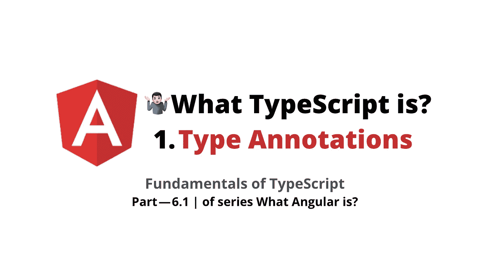

# 打字稿基础👇

1.  **类型标注**
2.  箭头功能
3.  接口
4.  班级
5.  构造器
6.  访问修饰符
7.  性能
8.  模块

# 🤷🏻‍♂️What 打字稿是？

TypeScript 不是一种全新的语言，它是 JavaScript 的超集，这意味着任何有效的 JavaScript 代码也是有效的 TypeScript 代码，但是 TypeScript 具有当前版本的 JavaScript 中不存在的附加功能。


**TypeScript is not an entirely new language it’s a superset of JavaScript**

# 类型脚本概念👇

*   **强类型或静态类型**——比如在 C#和 Java 这样的语言中，当我们定义变量时，我们需要指定变量的类型。
*   **面向对象的特性**——Javascript 中没有。现在我们有了类、接口、构造函数、访问修饰符的概念，比如 Typescript 中可用的 public 和 private。
*   **编译时错误**——我们可以在编译时而不是运行时捕捉错误——不是所有类型的错误，而是很多错误。我们可以在编译时捕捉这些错误，并在部署应用程序之前修复它们。

**任何 JavaScript 代码也是有效的类型脚本代码。现在，浏览器不理解 TypeScript——将来可能会支持。因此，我们需要将我们的类型脚本代码编译或更准确地转换成 JavaScript，这是构建我们的应用程序的一部分，因此每当我们构建应用程序时，类型脚本编译器都会将类型脚本代码转换成浏览器可以理解的 Javascript 代码。**

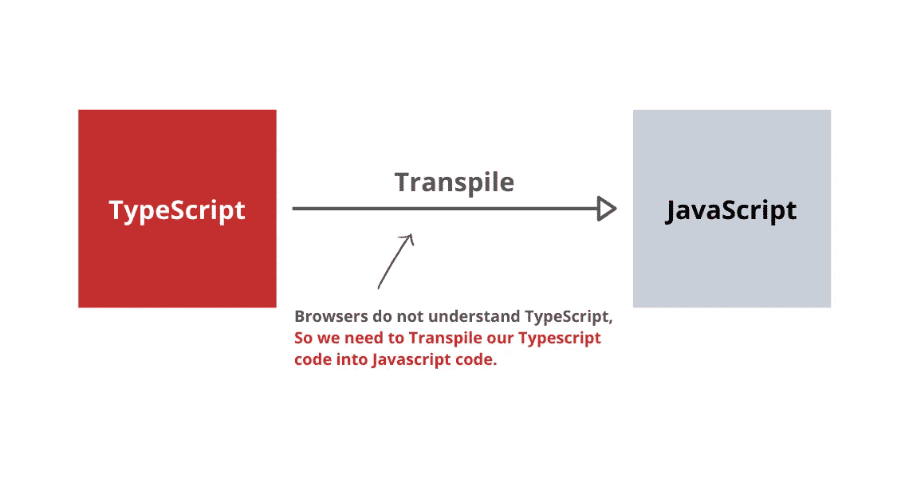

Whenever we build our application TypeScript compiler converts the TypeScript code into JavaScript

(trans file——源到源编译器(source-to-source compiler)或代码转换编译器(transcompiler)是一种编译器，它以用编程语言编写的程序的源代码作为输入，并以相同或不同的编程语言生成等价的源代码。)

# 🛠安装打字稿

*   在我们开始之前，首先在我们的机器上全局安装 typescript 打开 **C** 命令 **P** rompt 或 **T** 终端并输入以下命令:

```
sudo npm install -g typescript
```

(放置`sudo`以管理员身份执行此命令-对于 **Mac/Linux 用户**和 **Windows 用户** *→搜索命令提示符→右键然后单击‘以管理员身份运行’*|`**sudo**`对于 Windows 用户不是必需的)(`-g`代表全局)；(`npm`是 **N** ode 包 **M** 管理器以安装第三方库，如`typescript`

在我的 Mac 电脑上，它显示当前版本的打字稿:`typescript@3.7.2`👇

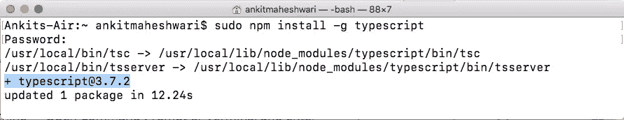

Installed `TypeScript Version 3.7.2`

现在，键入代表 TypeScript 编译器的`tsc --version`。看下面👇

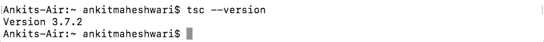

接下来，为 TypeScript 创建新文件夹—键入命令:

```
mkdir ts-hello
ts-hello
```

看下面👇

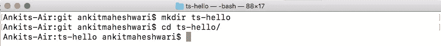

接下来在 VS 代码中打开这个文件夹`ts-hello`。并创建新文件`main.ts`看下面👇

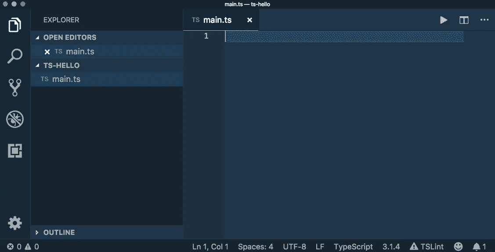

create new file `**main.ts**`

编写一个简单的 JavaScript 函数，以确保 JavaScript 代码是有效的类型脚本代码。请遵循以下步骤:

*   声明函数名→日志(*看下面👇在 4 号线*
*   声明一个全局变量→消息(*看下面👇在 10 号线*
*   调用日志函数(*看下面👇在 13 号线*

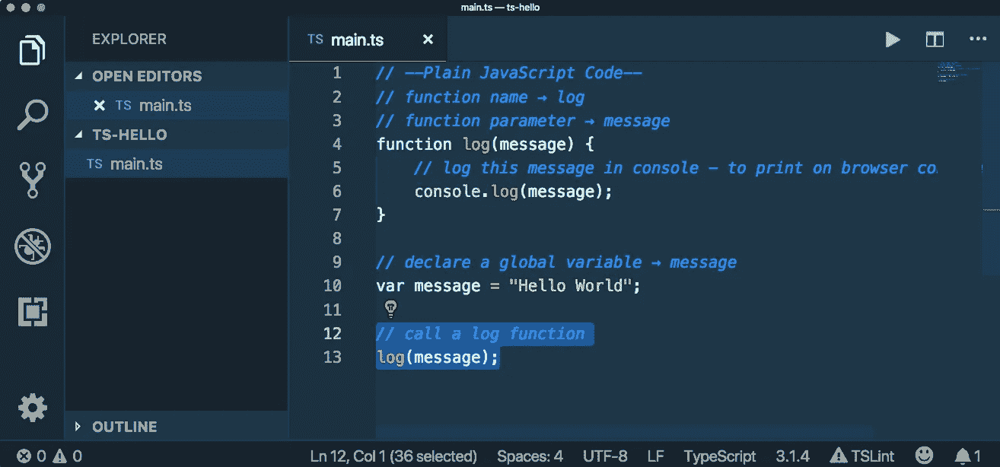

接下来，回到终端，我们需要将这个类型脚本文件转换成 Javascript — *编写一个命令👇*

```
tsc main.ts
ls
```

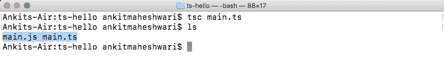

现在，如果我们查看包含两个文件的文件夹，一个是`main.js`文件，另一个是`main.ts`文件——所以当我们构建 Angular 应用程序时会发生这种转换。

*   我们不必手动调用 TypeScript 编译器(就像我们在上面的命令`tsc main.ts` ☝️中所做的)
*   当我们使用`ng serve`运行我们的 Angular 应用程序时，Angular CLI 调用 typescript 编译器自行传输我们所有的 TypeScript 代码。

现在，让我们用 VS 代码打开我们的`main.js`文件。**所以** `**main.js**` **代码与我们在** `**main.ts**` **文件中写的代码完全相同。**看下面👇

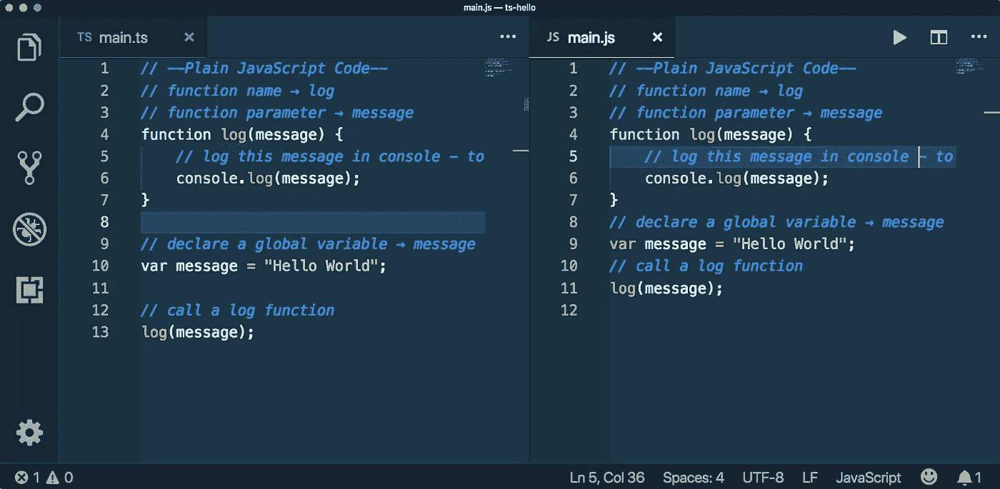

TypeScript compiler has transpiled the TypeScript code to JavaScript Code

接下来使用节点执行这段代码，运行`node main.ts` 看下面👇我们在控制台上收到了`Hello World`消息。

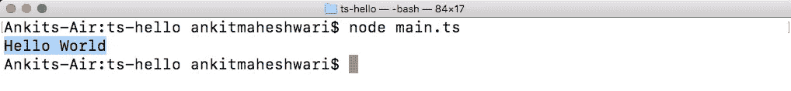

message `**Hello World**` on the console on running `**node main.ts** command`

# 👌我们目前在 JavaScript 中没有的 TypeScript 的特殊特性:

**声明变量** —在 TypeScript 中有两种方法声明变量

*   使用`var`关键字，我们已经在 Javascript 中看到了类似`var number = 1;`的内容
*   或者使用`let number = 2;`这样的`let`关键字——现在，ES5 ( ECMAScript 5)中的 JavaScript 也加入了 let 关键字，这个版本几乎被所有浏览器支持。


# let 和 var 关键字的区别:

*   定义一个`function` → `doCoding()` ( *看下面👇在 2 号线*
*   定义一个`for`循环块，并在控制台上记录编号 1-5(*见下文)👇在 4 号线*
*   然后记录`for`循环块外`i`的值(*见下文)👇在 8 号线*
*   调用函数(*看下面👇在 11 号线*

接下来，使用命令同时编译(`tsc main.ts`)和运行(`node main.js`)文件:

```
tsc main.ts | node main.js
```

看下面👇

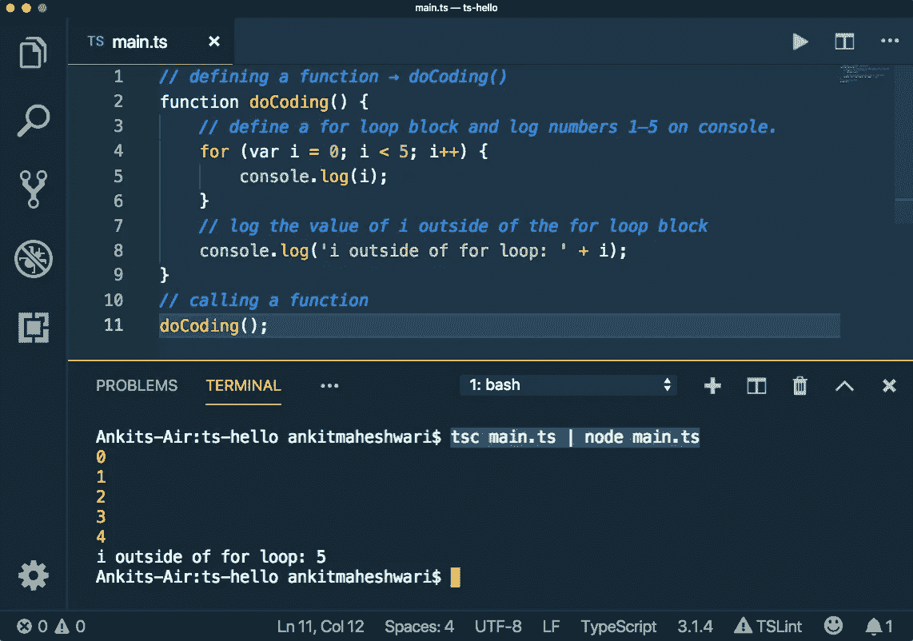

**The value of ‘i’ at the end outside of the for-loop is 5 | Value of ‘i’ is available outside of the for loop block**

**for 循环外结束时的‘I’值为 5。**所以我们在`for`块内声明了变量`i`，但是它在`for`块外也是可用的。这个概念在 C#和 Java 这样的语言中是没有的。

⭐**JavaScript 中声明的变量作用于最近的函数。**所以在上面👆案例(*看上面第 2 行*)最近的功能是`doCoding()`。所以当我们用 in `for`循环块声明变量`i`时，它在函数`doCoding()`中的任何地方都是可用的——这发生在 JavaScript 中。

⭐️:现在，让我们试试这个由`**let**`关键字声明`**i**`的变量。(*看下面👇在`for`回路中的第 4 行*)。

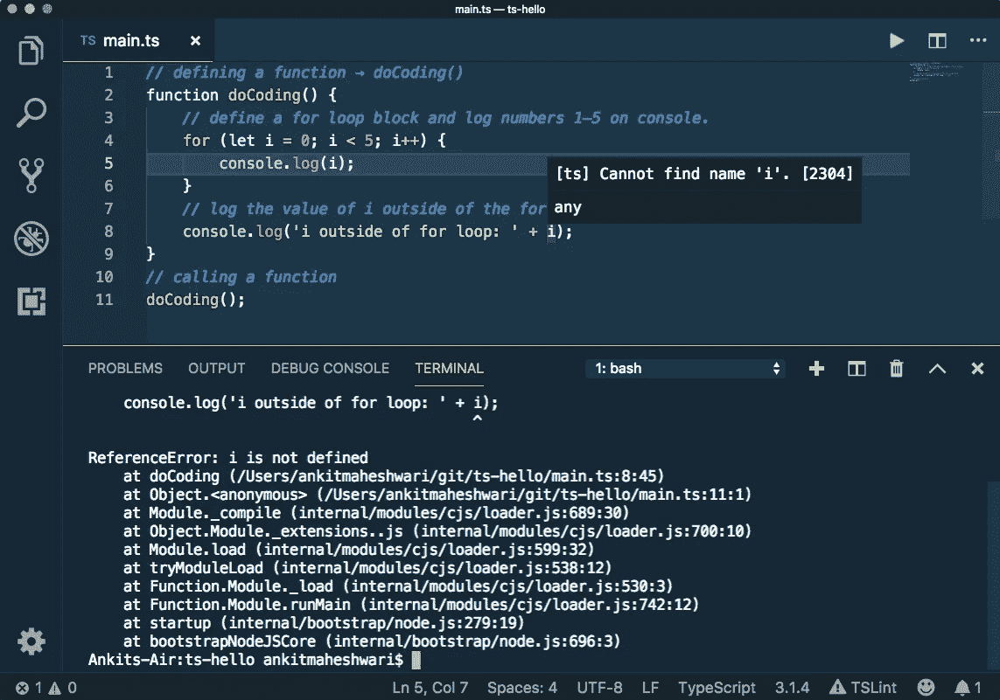

看上面👆在第 8 行— `Cannot find name i`是一个编译错误。这是 typescript 的优点之一，当我们编写 typescript 代码时，我们可以在运行应用程序或部署应用程序之前的编译时捕获这些错误。

我们还可以看到终端显示的错误`ReferenceError: i is not defined`。

⭐️ **所以当我们使用`let`进行变量声明时，** `**i**` **的作用域是最近的块而不是最近的函数**。这是声明变量的正确方法，可以避免很多问题和冲突。

# 6.1 类型注释

# TypeScript 中的不同类型:

**案例 1** —声明一个变量`count`，并将其设置为 5。`let count = 5;`看下面*👇*在*二号线*

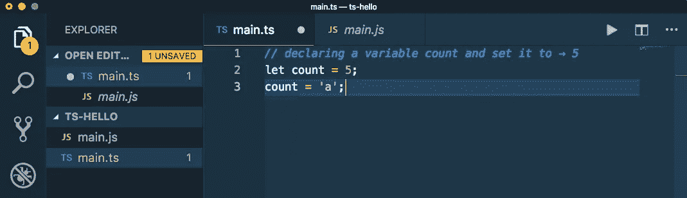

*   如果我们把它设为一个字符或者一个字符串。像`count = 'a';`上面看的那样👆在第 3 行的处，请注意，我们会立即得到一个编译错误，指出类型“a”字符串不可分配给类型号。看下面*👇*在*在*三号线

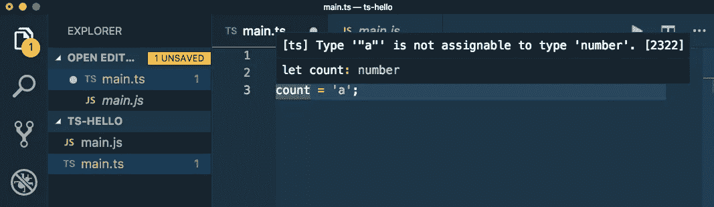

*   我们可以在 Javascript 中这样做，因为在 JavaScript 中我们可以改变变量的类型，但是在 Typescript 中我们会得到一个编译错误。
*   现在我们可以编译这个 Typescript 文件，它可以完美地编译，并在编译后给出有效的 Javascript 代码。
*   看这个`main.js` (下图右侧*👇*)在先前值为数字类型的变量中分配字符或字符串没有任何错误。我们可以毫无问题地完美执行这段代码。这是可行的，因为它是 Javascript。

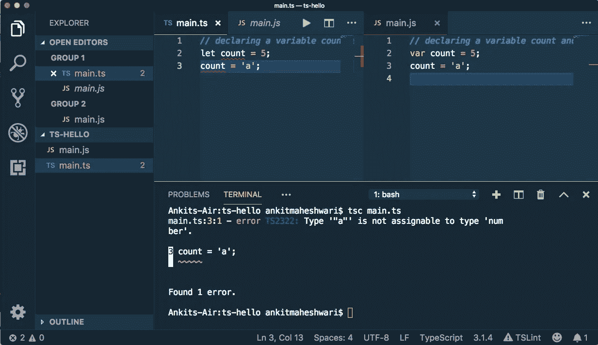

*   现在请看屏幕下方*👇*在工具提示上，将鼠标悬停在`main.ts`文件中的变量`count`上|我们可以看到`let count`后的`: (colon) number`...这表明了我们的程序**中变量的类型，所以这里 Typescript 编译器推断变量的类型是 number，因为我们用数字 5 初始化这个变量。**

```
let count: number
```

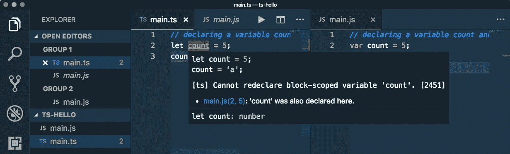

# TypeScript 中的不同类型:

**情况 2** —现在如果我们声明了一个变量而没有初始化它会怎么样。

`let a;`

看下面*👇*在第一行——将鼠标悬停在变量 a 上，工具提示显示该变量的类型为`let a: any;`

这种情况与我们在 JavaScript 中声明的变量完全相同。如果我们在 JavaScript 中或者在 TypeScript 中用`:any`声明变量，我们可以在变量中重新分配任何类型的值。示例:

```
**let a;** // the variable a is of type any**a = 1;** // assign number value**a = 'a';** // assign character or string**a = true;** // assign boolean
```

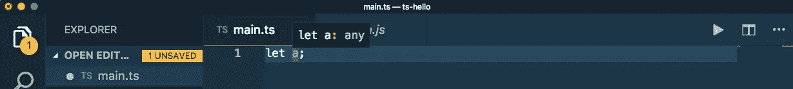

# TypeScript 中的不同类型:

**案例 3**——现在如果我们将它的类型定义为数字`let a: number;`，我们就不能赋其他类型的值，否则 TypeScript 编译器会给出编译错误。因此，我们在 Typescript 中有几种不同的类型:

*   `let a: number;`其中包括数字或浮点数。
*   `let b: boolean;`孰真孰假。
*   `let s: string;`包括引号内的任何内容。
*   `let d: any;`可以有任何类型的值，包括在案例 2 中——向上滚动👆去看。
*   `let e: number[];` number 然后方括号定义了它的一个数组类型 number。我们可以选择将这个数组初始化为`let n: number[] = [1, 2, 3, 4];`
*   `let f: any[];`这个数组可以包含多种类型的值，如`let n: any[] = [1, 'a', true, false];`
*   现在，我们在 TypeScript 中的另一个类型是`enum`。首先我们声明几个`const`变量。

```
const ColorRed = 0;const ColorGreen = 1;const ColorBlue = 2; enum Color { Red = 0, Green = 1, Blue = 2 };let backgroundColor = Color.Red;
```

看下面*👇*TypeScript 和 JavaScript 在`enum`上的区别:

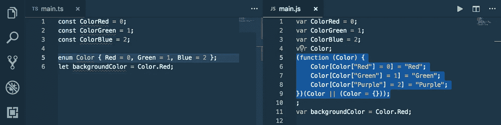

# TypeScript 中的不同类型:

**案例 4** — **类型脚本中的类型断言**

看下面*👇*在第 2 行|我们声明了一个变量，并给它赋值了一个字符串。现在看看工具提示，它显示了我们可以用字符串*做的所有可能的事情👇*在*到*三号线

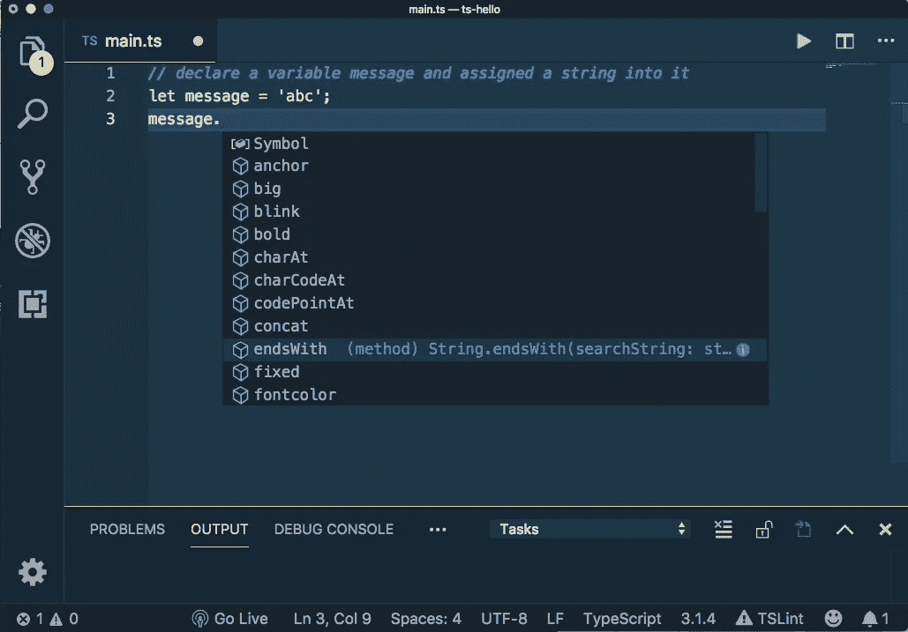

**示例**:我们有一个名为`endsWith()`的函数，我们可以调用这个函数并检查一个字符串是以一个字符还是一个字符串结尾。例如`message.endsWith('c');`，这将返回一个布尔值`true`或`false`。现在，看下面*👇*终端中的输出消息...终端中的输出日志值为`true`。


# 现在是类型断言:

*   当我们在声明类似于`let message;`的变量时不初始化变量，并且该变量被认为是类型`any`时，Typescript 会混乱。
*   **进行类型断言的一种方法是**，将类型放在尖括号内并用圆括号括起来。像这样👉`(<string>message)`这就变成了一个字符串。
*   **另一种做类型断言的方法是** `(message as string)`这样*👇*

```
let message; *// variable of type any*message = 'abc'; *// assigned string value in type any**// do type assertion so that methods on string can be called like
// .endsWith()*let anotherWay = (message as string).endsWith('c');
```

看下面*👇*在*13 号线和 15 号线*

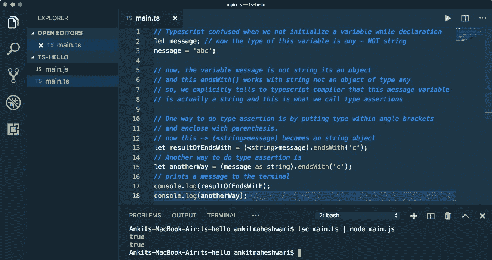

这是关于**类型注释**——下一部分见👋👋为了涵盖另一个概念**箭头功能。**

> 如果*你还没有涉及到本系列的*[*Part—5*](https://medium.com/@AnkitMaheshwariIn/angular-version-history-difference-between-angularjs-angular-2-and-angular-4-part-5-of-8ff9913f2964)*，推荐你查看这个链接→* [Angular 版本历史(AngularJS、Angular 2 和 Angular 4 的区别——🤷🏻‍♂️《棱角 3》怎么了🤔)|系列的第 5 部分|什么是角形？](https://medium.com/@AnkitMaheshwariIn/angular-version-history-difference-between-angularjs-angular-2-and-angular-4-part-5-of-8ff9913f2964)
> 
> 敬请期待第 6.2 部分
> [https://medium.com/@AnkitMaheshwariIn](https://medium.com/@AnkitMaheshwariIn)

如果你不介意的话，请给它一些掌声👏 👏既然有帮助，我会非常感谢:)帮助别人找到这篇文章，所以它可以帮助他们！

永远鼓掌…

