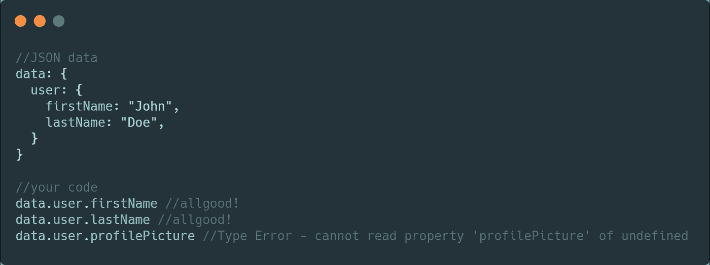
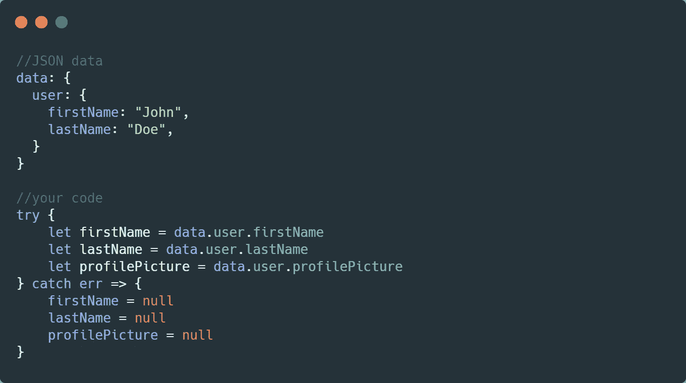
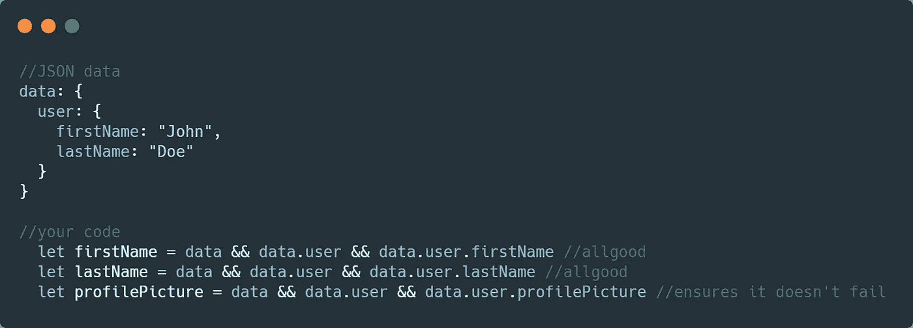
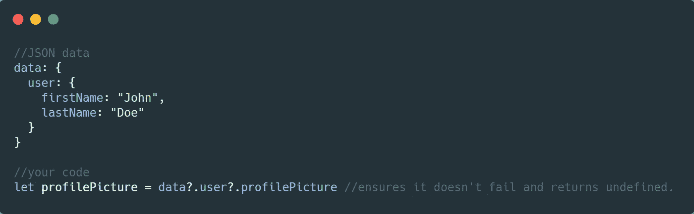

# JavaScript 中使用可选链接的类型检查— ES2020

> 原文：<https://javascript.plainenglish.io/type-checking-with-optional-chaining-in-javascript-es2020-bf3bf59d8f15?source=collection_archive---------11----------------------->

## 在尝试访问数据之前，更容易检查数据中是否存在属性。

Photo by [Danielle MacInnes](https://unsplash.com/@dsmacinnes?utm_source=medium&utm_medium=referral) on [Unsplash](https://unsplash.com?utm_source=medium&utm_medium=referral)

现代 JavaScript 框架严重依赖结构化数据来处理通过 API 传递的信息，或者向用户显示数据繁重的华丽界面。这些信息主要以 JSON 格式存储。只是属性或对象的键值对。

当您打电话获取用户资料，然后在前端开始映射所有不同的属性时，困难是真实的:

Example of what JSON data might look like and what happens when you try access an attribute that doesn’t exist in the data. Note: it won’t fail if it’s typed in like above — but if we are trying to render the profilePicture attribute somewhere.

却发现您的应用程序崩溃了，因为您在代码中映射的属性不存在。

现在，我们在访问数据之前做检查——我们做这些检查的原因是因为 JavaScript 允许不一定有结构的匿名对象。如果对象树中的父对象不存在，我们会得到类型错误。当面临这些问题时，有许多方法可以在访问属性之前检查对象中的属性是否存在:

## 试着接住

Try catches prevent our code from crashing and should be used consistently across out code for good practice — however in a situation where we are setting our data to null this approach can become tedious when looking to maintain code.

## 三元运算符

Ternary operators are easy to understand but to ensure one attribute exists in this example we are checking 3 different times to ensure it all comes together. Another tedious approach, but one that works better then try catch

# 可选链接——魔力

可选链接最终在[阶段 4](https://tc39.github.io/process-document/) ，这意味着它是 ES2020 规范的一部分。操作者检查`?.`左侧**的是`null`还是`undefined`。如果是，那么表达式短路并返回`undefined`。否则表达式继续求值，好像什么都没错。**

> 操作符`**?.**`允许我们读取位于连接对象链深处的属性值，而不必明确验证链中的每个引用都是有效的。`?.`操作符的功能类似于`.`链接操作符，不同之处在于，如果引用是`null`或`undefined`，表达式将使用返回值`undefined`进行短路，而不是导致错误。当与函数调用一起使用时，如果给定的函数不存在，它将返回`undefined`。— [参考](https://developer.mozilla.org/en-US/docs/Web/JavaScript/Reference/Operators/Optional_chaining)

Here we have a small chain referencing profile picture — it simply returns undefined and makes handling rendering much easier in our application.

这是一个简单的工具，但当我们处理有大量 JSON 数据的应用程序时，我们需要*遍历和映射这些数据——可选的链接使事情变得更容易——它使代码更容易阅读，并防止应用程序在前端呈现任何内容时崩溃。*

对于现在想使用可选链接的人来说，要么必须等待 ES2020 通过普通 JavaScript 访问它，要么它可以与 [babel](https://github.com/babel/babel/pull/5813) 一起使用。

## **用简单英语写的便条**

你知道我们有四份出版物和一个 YouTube 频道吗？你可以在我们的主页 [**plainenglish.io**](https://plainenglish.io/) 上找到所有这些——关注我们的出版物并 [**订阅我们的 YouTube 频道**](https://www.youtube.com/channel/UCtipWUghju290NWcn8jhyAw) **来表达你的爱吧！**