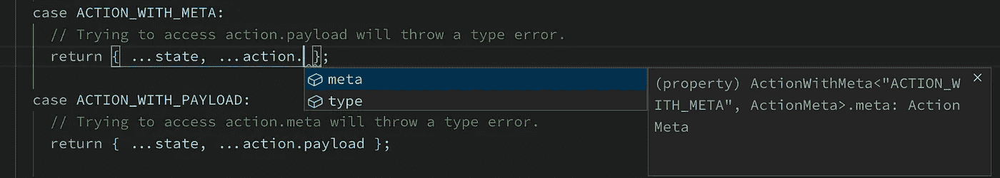
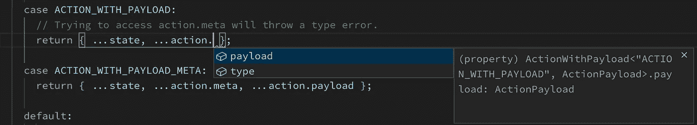
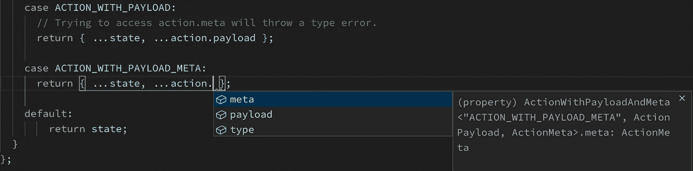

# Redux 中的类型安全操作、操作创建者和减少者

> 原文：<https://javascript.plainenglish.io/type-safe-actions-action-creators-and-reducers-in-redux-22c28013d1c6?source=collection_archive---------8----------------------->

在开发 JavaScript 应用程序时，TypeScript 提供了很好的静态类型检查。当您遍历代码以理解各种组件之间的关系时，TypeScript 的优势尤其明显。当您可以依靠 TypeScript 在编译时捕捉类型错误的能力时，重构代码是轻而易举的事情。最后，它全部编译成普通的旧 JavaScript 并去掉类型信息，这意味着它不会影响您的包的大小！总而言之，它提供了一个简单而高效的开发者体验。

但是有一个条件！

*TypeScript 的好坏取决于它从推理和我们的类型定义中获得的信息。*

因此，让我们看看如何利用 TypeScript 的各种特性，使 Redux 中的 reducers 和 actions 成为类型安全的。

# 动作和动作创建者

“Redux 中一个动作的理想结构是怎样的？”就是主观和固执己见。我将使用 4 种类型的操作来解决我迄今为止在应用程序中遇到的所有用例。让我们定义 4 种类型的操作和操作创建者:

我已经用 [*泛型*](https://www.typescriptlang.org/docs/handbook/generics.html) 用*类型变量*定义了每种类型的动作。注意，每个动作中的`type`字段不是`string`而是`Type extends string`。当我们转向减速器时，原因就显而易见了。

对 Redux 的一个常见抱怨是，它需要很多样板文件，比如动作和动作创建器，用于指定存储上的变化。有一些方法可以减少这种样板文件。其中之一就是*用函数生成动作创建者。*在牢记类型安全的同时实现这个函数的方法之一是:

我使用了 [*函数重载*](https://www.typescriptlang.org/docs/handbook/functions.html#overloads) 到来定义`makeActionCreator`的 4 种不同用法。`makeActionCreator`的实现遵循最后一个重载函数类型，相当简单。它接受`type`字段以及可选的`payload`和`meta`字段，并返回一个元组(动作常量，动作创建者)。

好吧！是时候享受所有细致的类型定义的好处了。

# 还原剂

在创建缩减器之前，让我们使用`makeActionCreator`为每种类型创建一个动作:

`placeholderType`用作虚拟变量，指定有效载荷和元的类型。在 TypeScript 开始支持[部分类型参数推断](https://github.com/microsoft/TypeScript/issues/26242) ( *TypeScript 可以推断所有类型参数或者不推断任何类型参数之前，这是一种变通方法。例如，它不能推断出* `*type*` *的类型，也不能允许* `*makeActionCreator*` *的调用者将* `*meta*` *和* `*payload*` *的类型作为类型参数*。最后，创建一个所有动作的联合类型，以便在 reducer 中使用。

让我们创建一个使用我们刚刚创建的动作的 reducer:

TypeScript 现在可以自动推断每个开关情况中的动作类型，并自动完成它(这就是为什么动作类型被定义为`Type extends string`)！这将有助于开发人员更好地理解代码，给他们信心，在需要的时候轻松地重构动作和 reducers，总之会给开发人员带来极好的体验。

Auto-complete for action with meta

Auto-complete for action with payload

Auto-complete for action with payload and meta

我相信还有其他方法可以给 actions 和 reducers 增加类型安全。我们已经在 [Clumio](https://clumio.com/) 的应用中使用了本文中概述的方法，它很有价值。

## **用简单英语写的 JavaScript 笔记**

我们已经推出了三种新的出版物！请关注我们的新出版物:[**AI in Plain English**](https://medium.com/ai-in-plain-english)，[**UX in Plain English**](https://medium.com/ux-in-plain-english)，[**Python in Plain English**](https://medium.com/python-in-plain-english)**——谢谢，继续学习！**

**我们也一直有兴趣帮助推广高质量的内容。如果您有一篇文章想要提交给我们的任何出版物，请发送电子邮件至[**submissions @ plain English . io**](mailto:submissions@plainenglish.io)**，使用您的 Medium 用户名，我们会将您添加为作者。另外，请让我们知道您想加入哪个/哪些出版物。****