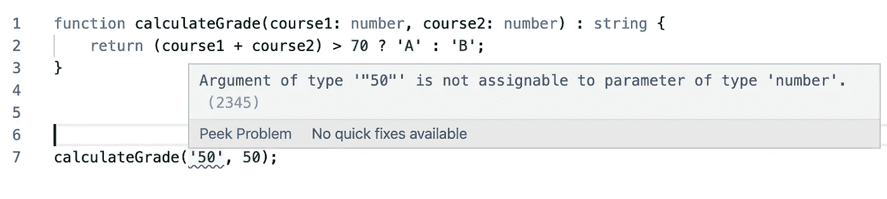
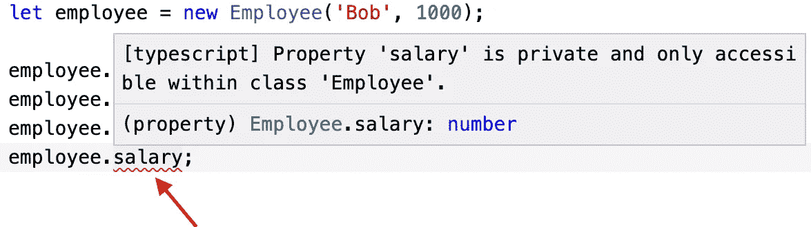

# 打字稿 101:3 分钟理解基础！

> 原文：<https://javascript.plainenglish.io/typescript-101-understanding-the-basics-in-3-minutes-e2113a9c4c5f?source=collection_archive---------4----------------------->

## 学习像类型、类、接口泛型等基础知识！在*【常数* **分钟***:number = 3】*内用 TS 弄脏你的手


Photo by [Fabian Grohs](https://unsplash.com/@grohsfabian?utm_source=medium&utm_medium=referral) on [Unsplash](https://unsplash.com?utm_source=medium&utm_medium=referral)

所以，现在围绕着 typescript 已经有很长一段时间了。尤其是自从 Angular 开始使用 TypeScript 作为其主要语言以来。现在，你可能会想:Angular 是由谷歌开发的，这家公司拥有非常聪明的程序员(有人可能会说是顶尖的 4%)。如果他们选择 TS 而不是 JS，一定有充分的理由！

嗯，你是对的！这里有一些学习 TS 的理由，越快越好！

1.  TypeScript 是 JavaScript 的未来(有些人可能不同意！)
2.  Typescript 代码就像一个有良好文档记录的代码，因此更容易理解。
3.  它有类、接口、泛型等。像任何其他面向对象的编程语言一样。

让我们来看看一个基本的 typescript 函数，然后您就可以做出判断了:

```
function calculateGrade(course1: number, course2: number) : string {
    return (course1 + course2) > 70 ? 'A' : 'B';
}
```

我们学到了什么？函数 **calculateGrade** *接受类型* ***数字*** *的两个参数，最后返回类型* ***字符串*** *的等级。*

这看起来很明显，但是如果是 JavaScript，几乎没有简单的方法知道“当调用这个函数时应该使用什么样的变量？”或者“它将返回什么，数字还是字符串？”因此，最终会导致潜在的错误。

> 现在，如果在阅读了上面的函数之后，你仍然犯了一个错误，并试图将一个字符串作为参数传递给上面的函数，会怎么样呢？好吧，在 JS 的情况下，你只会在已经太晚的时候才知道。然而，我们友好的 TS 会马上让我们知道。如果你不相信我，请看下面:



Hence, fewer bugs!

好吧，好吧，说够了。让我们继续学习一些 TypeScript 的基础知识，这将有助于您入门。

## 类型

顾名思义，TypeScript 有类型！上面我们已经看到了型号*编号*和*串*。还有什么…

## 班级

看看下面的代码，你不觉得这种代码更容易理解，更不容易出错吗？

This code represents an Employee class containing two properties, name and salary.

*代码解释:把“Employee”类想象成一个蓝图。这段代码虽然非常基础，但解释了 typescript 的一些非常重要的概念。还有，注意* ***工资*** *变量是* ***私人。*** *这意味着我们不能直接访问这个变量。请看下面的快照:*



Typescript compiler lets you know these kinds of errors beforehand. Remember OOP concepts?

有关类的更多信息(typescriptlang.org): [类](https://www.typescriptlang.org/docs/handbook/classes.html)。

## 接口:*创建你自己的自定义类型*

我们已经知道可以使用字符串、数字、布尔值等类型。如果我们想在代码中创建自己的自定义类型来执行检查，该怎么办？幸运的是，我们可以为此使用接口！

接口非常有用，在 Angular/React 这样的框架中被大量使用。我们也可以根据用例使用“模型”类或“类型”。

关于接口的更多信息(typescriptlang.org): [接口](https://www.typescriptlang.org/docs/handbook/interfaces.html)。

## 无商标消费品

泛型是 typescript 的一个非常简单但强大的特性。在处理其他开发人员可能会使用的服务/API 时，使用泛型得到了广泛的认可，尤其是开源服务/API。它有助于了解预期的数据类型，从而减少错误和混乱。

A very basic example of the importance/usage of generics in TS.

更多关于仿制药的信息(typescriptlang . org):g[generics](https://www.typescriptlang.org/docs/handbook/generics.html)。

我希望对于那些不熟悉 typescript 的人来说，这篇文章能够帮助您理解在 JS 代码中使用类型的好处。

## 资源

你可以在这里找到本文中的代码:[链接到 Github gists](https://gist.github.com/PranavBhatia) 。

其他资源:[官方打字手册](https://www.typescriptlang.org/docs/handbook/typescript-in-5-minutes.html)。

打字稿操场用:
[https://typescript-play.js.org/](https://typescript-play.js.org/)
[https://www.typescriptlang.org/play/](https://www.typescriptlang.org/play/)

感谢阅读。如果你有任何问题，请随时回复。

查看原文，请[点击此处。](https://immigrantprogrammers.blogspot.com/2020/09/typescript-101-understanding-basics-in.html)

*更多内容请看* [***说白了就是***](https://plainenglish.io/) *。*

*报名参加我们的* [***免费周报***](http://newsletter.plainenglish.io/) *。关注我们关于*[***Twitter***](https://twitter.com/inPlainEngHQ)，[***LinkedIn***](https://www.linkedin.com/company/inplainenglish/)*，*[***YouTube***](https://www.youtube.com/channel/UCtipWUghju290NWcn8jhyAw)*，以及* [***不和***](https://discord.gg/GtDtUAvyhW) ***。***

***有兴趣缩放你的软件启动*** *？检查* [***电路***](https://circuit.ooo?utm=publication-post-cta) *。*

## 进一步阅读

[](/typescript-made-easy-a-guide-to-your-first-type-safe-app-with-next-js-wundergraph-and-prisma-e197a59e2b30) [## 轻松编写类型脚本:使用 Next.js、WunderGraph 和 Prisma 编写第一个类型安全应用程序的指南

### 是时候抛开恐惧，学习 TypeScript 了。让我们给你第一次“发现！”瞬间通过建立一个完整的…

javascript.plainenglish.io](/typescript-made-easy-a-guide-to-your-first-type-safe-app-with-next-js-wundergraph-and-prisma-e197a59e2b30)