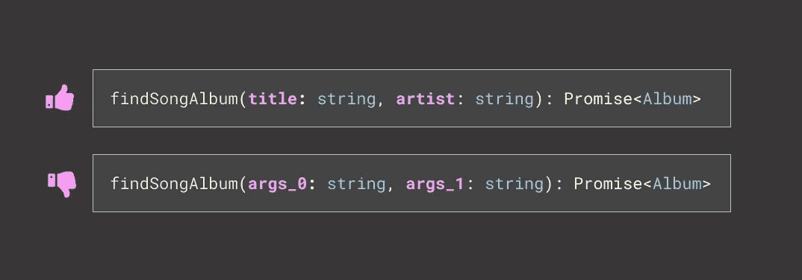
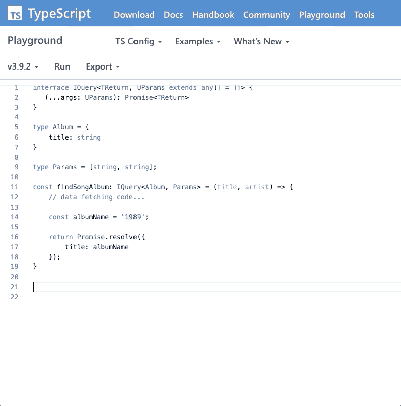
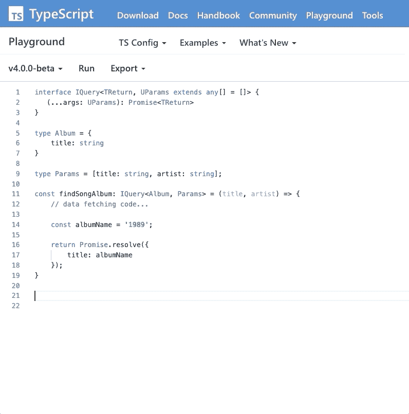

# TypeScript 4.0 最终交付了我一直在等待的东西

> 原文：<https://javascript.plainenglish.io/typescript-4-0-i-want-a-list-of-generic-params-with-good-labels-c6087d2df935?source=collection_archive---------0----------------------->

## 标签良好的通用参数列表！

昨天，微软公布了 TypeScript 4.0 的[发布候选。随之而来的是](https://devblogs.microsoft.com/typescript/announcing-typescript-4-0-rc)[标记的元组元素](https://devblogs.microsoft.com/typescript/announcing-typescript-4-0-rc/#labeled-tuple-elements)，这就是这篇文章标题的答案。



Arguments with useful labels and arguments with useless labels

# 具有未知参数的通用接口

这里有一个人为的例子。`IQuery`。它的意思是描述查询事物的函数的形状。它总是返回一个承诺，并使用一个[泛型](https://www.typescriptlang.org/docs/handbook/generics.html)来描述承诺发出的内容(`TReturn`)。该接口也足够灵活，可以不带任何参数*或未知数量的参数*(`UParams extends any[] = []`)。

```
interface IQuery<TReturn, UParams extends any[] = []> {
  (...args: UParams): Promise<TReturn>
}
```

## 示例函数:findSongAlbum()

利用这个接口，我们将编写一个函数，通过标题和艺术家来查找歌曲专辑。它返回一个发出单个类型为`Album`的对象的承诺。

```
type Album = {
  title: string
}
```

如果没有 TypeScript，该函数可能如下所示:

```
const findSongAlbum = (title, artist) => {
  // data fetching code...

  const albumName = '1989'; return Promise.resolve({
     title: albumName
  });
}
```

使用 TypeScript，并利用`IQuery`接口，您可以将`Album`类型作为第一个泛型参数传入，以确保 promise 发出的形状总是与`Album`类型相匹配。

```
const findSongAlbum: IQuery<Album> = (title, artist) => {
  // data fetching code...

  const albumName = '1989'; return Promise.resolve({
     title: albumName 
  });
}
```

## 在 TypeScript 4.0 之前

您还需要定义参数以及它们的类型。在这种情况下，`title`和`artist`都是字符串。您定义了一个新类型`Params`，并将其作为第二个类型传递给`IQuery`。

在这个例子中，**在 TypeScript 4.0** 之前，`Params`将被定义为一个类型列表。列表中的每一项都按照与参数列表相同的顺序定义类型。这种类型被称为[元组](https://www.typescriptlang.org/docs/handbook/basic-types.html#tuple)类型。

```
type Params = [string, string]const findSongAlbum: IQuery<Album, Params> = (title, artist) => {
  // data fetching code...

  const albumName = '1989'; return Promise.resolve({
     title: albumName
  });
}
```

你可以在上面的`Params`类型中看到，第一个条目类型是`string`，使得第一个参数“title”成为了一个`string`。第二个，当然，遵循同样的模式，是`string`使第二个参数“artist”也是一个`string`。这将为参数列表提供适当的类型安全。



findSongAlbum() showing useless argument labels

不幸的是，以这种方式使用元组类型并不能在使用函数时给出有用的类型安全标签*。相反，它只是将参数列为`args_0: string, args_1: string`。除了知道第一个参数是一个`string`之外，“arg_0”并没有告诉我第一个参数应该是我正在搜索的歌曲的“标题”。*

## 在 TypeScript 4.0 之后

使用 TypeScript 4 候选版本，我们可以获得**标记的元组元素**，我们可以使用它们来获得参数列表中的有用标签。

`Params`类型中的每一项现在都有一个标签，当你使用`findSongAlbum`函数时，它会很好地显示在你的 IDE 中。

```
type Params = [title: string, artist: string]const findSongAlbum: IQuery<Album, Params> = (title, artist) => {
  // data fetching code...

  const albumName = '1989'; return Promise.resolve({
     title: albumName
  });
}
```



findSongAlbum() showing valuable argument labels

现在，代替`arg_0: string`，我们在智能感知中得到`title: string`，它告诉我们 ***需要传入什么*** 字符串。

感谢你阅读❤