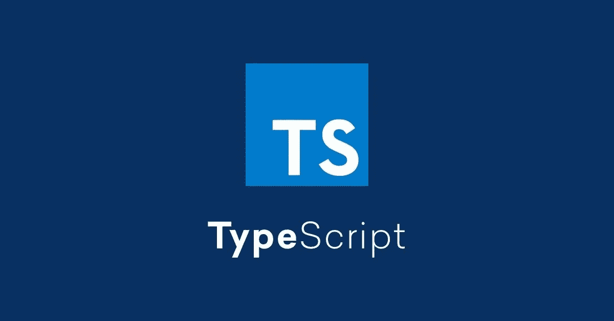

# TypeScript:认识 JavaScript 的父代

> 原文：<https://javascript.plainenglish.io/typescript-61097f3b0dc4?source=collection_archive---------6----------------------->



# 什么是 TypeScript？

TypeScript 是一种面向对象的编程语言，由微软公司开发和维护。它是 JavaScript 的超集，所以它能做 JavaScript 能做的所有事情，甚至更多。因为 TypeScript 是 JavaScript 的超集，所以可以很容易地集成到 JavaScript 项目中。但是，需要用 TypeScript 编译器(TSC)将 TypeScript 代码编译成 JavaScript 代码，以便被浏览器读取和理解。


# 为什么使用 TypeScript？

TypeScript 简化了 JavaScript 代码，使其更容易阅读、理解、编码和调试。TypeScript 提供了 ES6 的所有优点，甚至更多。TypeScript 是为开发大型应用程序而设计的。

# 使用 TypeScript

## 正在安装 TypeScript:

```
npm install -g typescript
```

> 用`-g`标志全局安装 TypeScript。通过删除标志在本地安装。

制作一个类型脚本文件很容易。只需创建一个扩展名为`.ts`的新文件。

## TypeScript 编译器:

```
tsc typescript-file.ts -w
```

在您的终端中运行这个命令，将您的 TypeScript 文件编译成 JavaScript，以便您的浏览器能够阅读和理解您的代码。

使用`-w`标志不断地监视并将类型脚本文件编译成 JavaScript 文件。

# TypeScript 数据类型

TypeScript 变量只能被赋值为声明它的数据类型。例如，`string`变量不能被赋予除字符串以外的任何其他数据类型。如果一个声明为字符串的变量被赋予了一个数字值，那么就会发生错误。

## 字符串:

```
// Declare String
let myString: string;// Assign String
myString = 'Hello World';// Print String
console.log(myString);
```

## 编号:

```
// Declare Number
let myNum: number;// Assign Number
myNum = 5;// Print Number
console.log(myNum);
```

## 布尔型:

```
// Declare Boolean
let myBool: boolean;// Assign Boolean
myBool = true;// Print Number
console.log(myBool);
```

## 任何:

```
// Declare Any
let myVar: any;// Assign Any
myVar = 'I can be anything';// Print Any
console.log(myVar);
```

## 声明+赋值:

也可以在同一行中声明和赋值变量。

```
// Variable Declaration + Assignment Format
let [ variable name ]: [ datatype ] = [ value ];// String Declaration + Assignment Example
let myNewString: string = 'Hello World!!!';
```

## 字符串数组:

```
// Declare String Array
let strArray: string[]; // same as 'let strArray: Array<string>'// Assign String Array
strArray = ['Hello', 'World'];// Print String Array
console.log(strArray);
```

## 数字数组:

```
// Declare Number Array
let numArray: number[]; // same as 'let numArray: Array<number>'// Assign Number Array
numArray = [1,2,3];// Print Number Array
console.log(numArray);
```

## 布尔数组:

```
// Declare Boolean Array
let boolArray: boolean[]; // same as 'let boolArray: Array<boolean>'// Assign Boolean Array
boolArray = [true, false, true];// Print Boolean Array
console.log(boolArray);
```

替代数组声明:

```
// Alternate Array Declaration Format
let [ array name ]: Array<[ datatype ]>// Alternate Array Declaration Examples
let strArray: Array<string>
let numArray: Array<number>
let boolArray: Array<boolean>
```

## 元组:

元组是一种自定义数据类型，包括两组不同的数据类型。

```
// Tuple Declaration Format
let [ tuple name ]: [datatype1, datatype2]// Tuple Example
let myTuple: [string, number];  // declare
myTuple = ['Hello', 4];         // assign
console.log(myTuple);           // print
```

## Void、Null 和未定义:

```
// Declare void, null, and undefined
let myVoid: void;
let myNull: null;
let myUndefined: undefined;// Assign void, null, and undefined
myVoid = null; // or 'undefined'
myNull = null; // or 'undefined'
myUndefined = null; // or 'undefined'// Print All
console.log(myVoid);
console.log(myNull);
console.log(myUndefined);
```

# 类型脚本函数

TypeScript 函数的工作方式与 JavaScript 函数非常相似。如果你有 JavaScript 函数的先验知识，你甚至可以跳过博客的这一部分。

## 数字函数:

```
function getSum(num1:number, num2:number):number {
  return num1 + num2;
}console.log(getSum(1,4));
```

## 字符串函数:

```
function getName(firstname:string, lastname:string):string {
  if (lastname == undefined) {
    return firstname;
  }
  return firstname + " " + lastname;
}console.log(getName('John', 'Doe'));
console.log(getName('John');
```

## 无效函数:

```
function myVoid():void {
  return;
}
```

# 类型脚本接口

## 在 TypeScript 中创建接口:

```
interface ToDo {
  title:string;
  text:string;
}
```

# 类型脚本类

## 在 TypeScript 中创建类:

```
class User implements UserInterface {
  name: string;
  email: string;
  age: number; constructor(name: string, email: string, age: number) {
    this.name = name;
    this.email = email;
    this.age = age; console.log('User Created: ' + this.name);
  } register() {
    console.log(this.name + ' is now registered.');
  } payInvoice() {
    console.log(this.name + ' has paid invoice.')
  }
}
```

## 实例化新类:

```
let john = new User('John Doe', 'jdoe@gmail.com', 34);
```

## 使用类方法:

```
john.register();
john.payInvoice();
```

# 结论

与 JavaScript 相比，使用 TypeScript 的主要好处是 TypeScript 提供了静态数据类型。在 TypeScript 中，每个变量都用其预期的数据类型声明，不能像在 JavaScript 中那样动态更改。对一些人来说，尤其是对新开发人员来说，这似乎是一个麻烦，但是它建立了保持变量的数据类型一致的良好实践。这个原则的一个例子是数字变量应该保持为数字变量。当变量被创建时，很少会改变它们的数据类型。然而，动态数据类型更容易使用，因为您不需要声明特定的数据类型，但是请记住，类型错误可能会因此而更频繁地发生。