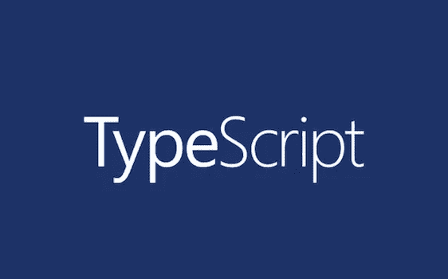

# 了解 TypeScript 配置选项

> 原文：<https://javascript.plainenglish.io/typescript-configuration-options-tsconfig-json-561d4a2ad4b?source=collection_archive---------0----------------------->

## 介绍 TypeScript 配置选项如何工作。



TypeScript

这篇文章将通过一些例子向你展示`tsconfig.json`在你的应用程序中是如何工作的。

# 回购示例

这里有一个完整的示例代码库链接供参考。您可以用一个非常简单的例子来测试这些选项。

[](https://github.com/manakuro/typescript-compiler-options-example) [## manakuro/typescript-编译器-选项-示例

### 测试 TypeScript 编译器选项。为 manakuro/typescript-compiler-options-example 开发做出贡献，创建一个…

github.com](https://github.com/manakuro/typescript-compiler-options-example) 

# 配置选项

我们将在[文档](https://www.typescriptlang.org/docs/handbook/tsconfig-json.html)中介绍以下配置选项:

```
**File Inclusion**
 - files
 - include
 - exclude
 - extends
 - typeAcquisition
 - references**Project Options
** - incremental
 - target
 - module
 - lib
 - allowJs
 - checkJs
 - jsx
 - declaration
 - declarationMap
 - sourceMap
 - outFile
 - outDir
 - rootDir
 - composite
 - tsBuildInfoFile
 - removeComments
 - noEmit
 - importHelpers
 - downlevelIteration
 - isolatedModules**Strict Checks**
 - strict
 - noImplicitAny
 - strictNullChecks
 - strictFunctionTypes
 - strictBindCallApply
 - strictPropertyInitialization
 - noImplicitThis
 - alwaysStrict**Module Resolution**
- moduleResolution
- baseUrl
- paths
- rootDirs
- typeRoots
- types
- allowSyntheticDefaultImports
- esModuleInterop
- preserveSymlinks
- allowUmdGlobalAccess**Linter Checks**
- noUnusedLocals
- noUnusedParameters
- noImplicitReturns
- noFallthroughCasesInSwitch**Experimental**
- experimentalDecorators
- emitDecoratorMetadata
```

# 先决条件

安装`typescript`并生成`tsconfig.json`:

```
$ npm init
$ npm i -D typescript@3.7.5
$ npx tsc --init
```

# 文件包含

## 文件

您可以在程序中直接指定要编译的文件。如果`.ts`被排除，默认自动搜索`.ts`和`.tsx`文件。

```
{
  "compilerOptions": {},
 **"files": [
    "index.ts",
    "hello"
  ]**
}
```

## 包括

您可以使用文件名数组或 glob 模式指定要在程序中编译的文件。

> *匹配零个或多个字符(不包括目录分隔符)
> ？匹配任何一个字符(不包括目录分隔符)
> **/递归匹配任何子目录

默认情况下，TypeScript 搜索带有`.ts`、`.tsx`和`.d.ts`的文件，如果`allowJs`设置为 true，`.js`和`.jsx`将被编译。

```
{
  "compilerOptions": {},
 **"include": [
    "src/**/*"
  ]**
}
```

如果不提供`files`和`include`，TypeScript 将自动编译目录中除`excludes`选项指定的文件以外的所有文件(`.ts, .tsx`)。

你也可以像这样同时使用`files`:

```
{
  "compilerOptions": {},
  "include": [
    "src/**/*"
  ],
  **"files": ["hello"]**
}
```

## 排除

您可以使用文件名数组或 glob 模式指定程序中不编译的文件。通常用作`include`选项的过滤。

```
{
  "compilerOptions": {},
  "include": [
    "src/**/*"
  ],
 **"exclude": [
    "node_modules",
    "src/exclude.ts"
  ]**
}
```

上例中，`node_modules`和`src/exclude.ts`将被排除。但是如果使用`files`选项:

```
{
  "compilerOptions": {},
  "include": [
    "src/**/*"
  ],
  "exclude": [
    "node_modules",
    "src/exclude.ts"
  ],
  **"files": ["src/exclude.ts"]**
}
```

`exclude`将被忽略，TypeScript 将编译`src/exclude.ts`。

在另一种情况下，如果`src/exclude.ts`引用`src/utils/index.ts`:

```
// src/exclude.ts**import util from './utils';**const excluded = "Hey excluded"console.log(util)
console.log(excluded)
```

`src/utils/index.ts`不排除会被编译。您需要显式包含这些文件。

如果`exclude`被禁用，TypeScript 将默认包含这些目录:

```
- node_modules
- bower_components
- jspm_packages
- the files <outDir> option specifies
```

## 延伸

您可以通过继承来扩展另一个配置。

假设我们有`tsconfig.base.json`和`tsconfig.json`。

`tsconfig.base.json`:

```
// tsconfig.base.json{
  "compilerOptions": {},
  "include": ["src/**/*"]
}
```

`tsconfig.json`:

```
{
  "extends": "./tsconfig.base.json"
}
```

TypeScript 将编译`src/`目录下的所有文件，但是如果您想特别包含`hello.ts`，请添加:

```
{
  "extends": "./tsconfig.base.json",
 **"files": ["hello"]**
}
```

它从基本配置文件扩展了`files`。

## 类型获取

如果您的编辑器中有一个 JavaScript 项目，默认情况下，TypeScript 使用`@types`声明为您的`node_moduels`提供类型。您可以使用此选项自定义行为。

如果您想禁用此功能，只需将其关闭:

```
{
  "typeAcquisition": {
    "enable": false
  }
}
```

如果您想指定应该包含但不在`node_modules`中的模块:

```
{
  "typeAcquisition": {
    "include": ["react"]
  }
}
```

如果您想从`node_modules`中明确排除模块:

```
{
  "typeAcquisition": {
    "exclude": ["jquery"]
  }
}
```

通常它会在 JavaScript 项目中用作类型检查。

## 参考

当您使用[项目引用](https://www.typescriptlang.org/v2/docs/handbook/project-references.html)时，您可以启用此选项。项目引用是 TypeScript 3.0+中的新功能。通过使用它，您可以将 TypeScript 项目组织成更小的部分。通过分成多个项目，可以提高类型检查和编译过程的速度。

让我们来看看这个特性。以下是一些文件结构示例:

```
├── app
│   └── src
│       └── index.ts
├── test
│   └── index.test.ts
└── tsconfig.json
```

假设我们有`app`模块、`test`和一个`tsconfig`文件。

`tsconfig.json`只是简单的一个:

```
{
  "compilerOptions": {
    "outDir": "./dist"
  }
}
```

构建完成后，您将在`dist`中看到结果:

```
├── app
│   └── src
│       └── index.ts **├── dist
│   ├── app
│   │   └── src
│   └── test
│       └── index.test.js**
├── test
│   └── index.test.ts
└── tsconfig.json
```

TypeScript 已经在`dist`文件夹中构建了`app`和`test`，但是您可能不想将`test`作为输出，所以您可以使用`include`选项:

```
{
  "compilerOptions": {
    "outDir": "./dist"
  },
  **"include": ["./app/**/*"]**
}
```

这解决了问题，但也意味着编译器和类型检查会忽略所有的测试文件，这是一些人可能没有预料到的。

所以，TypeScript 还有另外一个选择。

让我们改变文件结构:

```
├── app
│   ├── src
│   │   └── index.ts
│   └── **tsconfig.json**
├── test
│   ├── index.test.ts
│   └── **tsconfig.json**
└── **tsconfig-base.json**
```

`tsconfig-base.json`是`/tsconfig.json`和`test/tsconfig.json`可以扩展到的共享选项。

在`test/tsconfig.json`中增加`references`:

```
{
  "extends": "../tsconfig-base.json",
  "compilerOptions": {},
 **"references": [{
    "path": "../app"
  }]**
}
```

并在`app/tsconfig.json`开启`composite`:

```
{
  "extends": "../tsconfig-base.json",
  "compilerOptions": {
    "outDir": "../dist",
 **"composite": true**
  }
}
```

然后，构建它:

```
tsc -b app test
```

输出将是:

```
├── app
│   ├── src
│   │   └── index.ts
│   └── tsconfig.json
**├── dist
│   ├── src
│   │   ├── index.d.ts
│   │   └── index.js
│   └── tsconfig.tsbuildinfo**
├── test
│   ├── index.test.ts
│   └── tsconfig.json
└── tsconfig-base.json
```

现在，你不再需要使用`include`选项，输出已经内置在`dist`中，不包括`test`，也不忽略任何编译错误。

如果运行`tsc`进行测试，TypeScript 将总是首先构建`app`作为被引用的模块，即使不考虑顺序。

```
tsc -b test app
```

更多描述，可以看[文档](https://www.typescriptlang.org/docs/handbook/project-references.html)。

# 项目选项

## 增加的

当`incremental`为真时，TypeScript 将保存最新编译的项目图的信息。它比较前一个文件和当前文件之间的差异，并编译您更改过的文件。第一次构建的时间通常会更长，但之后会节省时间。

```
{
  "compilerOptions": {
    **"incremental": true**
  },
  "include": [
    "src/**/*"
  ]
}
```

运行`tsc`后，TypeScript 将生成`tsconfig.tsbuildinfo`，用于检测类型检查和发出更改的最低成本方式。

如果你想把文件建立到特定的文件夹，你可以使用`tsBuildInfoFile`选项:

```
{
  "compilerOptions": {
    "incremental": true,
    **"tsBuildInfoFile": "./path/my.tsbuildinfo"**
  },
  "include": [
    "src/**/*"
  ]
}
```

## 目标

构建时可以选择生成 JavaScript 文件的版本。所以如果你选择`es2015`:

```
{
  "compilerOptions": {
    **"target": "es2015"**
  }
}
```

下面是一些示例代码:

```
const hi = () => new Promise(resolve => resolve('hi'))
const hey = async () => await hi()
console.log(hey())
```

输出将具有`ES2015`功能:

```
var __awaiter = (this && this.__awaiter) || function (thisArg, _arguments, P, generator) {
    function adopt(value) { return value instanceof P ? value : new P(function (resolve) { resolve(value); }); }
    return new (P || (P = Promise))(function (resolve, reject) {
        function fulfilled(value) { try { step(generator.next(value)); } catch (e) { reject(e); } }
        function rejected(value) { try { step(generator["throw"](value)); } catch (e) { reject(e); } }
        function step(result) { result.done ? resolve(result.value) : adopt(result.value).then(fulfilled, rejected); }
        step((generator = generator.apply(thisArg, _arguments || [])).next());
    });
};
const hi = () => new Promise(resolve => resolve('hi'));
const hey = () => __awaiter(this, void 0, void 0, function* () { return yield hi(); });
console.log(hey());
```

如果选择`es2020`:

```
{
  "compilerOptions": {
    "target": "es2020"
  }
}
```

代码将生成为`ES2020`特征:

```
const hi = () => new Promise(resolve => resolve('hi'));
const hey = async () => await hi();
console.log(hey());
```

## 组件

您可以选择 JavaScript 文件的模块系统，如下所示:

*   `CommonJS`
*   `UMD`
*   `AMD`
*   `System`
*   `ESNext`
*   `ES2015`
*   `NONE`

下面是一些示例代码:

```
// hello.tsexport const hello = 'Hey hello'
console.log(hello)
```

当`CommonJS`出现时:

```
"use strict";
exports.__esModule = true;
exports.hello = 'Hey hello';
console.log(exports.hello);
```

当`UMD`出现时:

```
(function (factory) {
    if (typeof module === "object" && typeof module.exports === "object") {
        var v = factory(require, exports);
        if (v !== undefined) module.exports = v;
    }
    else if (typeof define === "function" && define.amd) {
        define(["require", "exports"], factory);
    }
})(function (require, exports) {
    "use strict";
    exports.__esModule = true;
    exports.hello = 'Hey hello';
    console.log(exports.hello);
});
```

当`AMD`出现时:

```
define(["require", "exports"], function (require, exports) {
    "use strict";
    exports.__esModule = true;
    exports.hello = 'Hey hello';
    console.log(exports.hello);
});
```

当`ESNEXT`出现时:

```
export var hello = 'Hey hello';
console.log(hello);
```

## 解放运动

TypeScript 自动包含一组内置 JavaScript APIs 的类型定义和与您指定的`target`相匹配的特性。例如，如果`target`是`ES3`，而你想使用`Promise`:

```
// hello.tsexport const hello = new Promise(resolve => resolve('Hey hello'))
```

TypeScript 将发出一个错误:

```
hello.ts:1:26 - error TS2585: 'Promise' only refers to a type, but is being used as a value here. Do you need to change your target library? Try changing the `lib` compiler option to es2015 or later.export const hello = new Promise(resolve => resolve('Hey hello'))
```

因为`ES3`没有 Promise API，所以为了使用它，你需要显式包含`ES2015`:

```
{
  "compilerOptions": {
    "target": "ES3",
    **"lib": ["ES2015"]**
  }
}
```

TypeScript 将生成如下 JavaScript 文件:

```
"use strict";
exports.__esModule = true;
exports.hello = new Promise(function (resolve) { return resolve('Hey hello'); });
```

如果想使用特定的 JavaScript 特性，可以查看[源代码](https://github.com/microsoft/TypeScript/tree/master/lib)中的库组件。

## 允许

当`allowJs`为`true`时，TypeScript 将允许编译 JavaScript 文件，但不会进行类型检查。

以下是一些文件结构示例:

```
├── hello.ts
├── helloJavaScript.js
└── tsconfig.json
```

`allowJs`禁用时:

```
{
  "compilerOptions": {
    "outDir": "./dist",
    **"allowJs": false**
  }
}
```

运行`tsc`后，`dist`将不包括`helloJavaScript.js`:

```
dist
└── hello.js
```

当`allowJs`启用时:

```
{
  "compilerOptions": {
    "outDir": "./dist",
    **"allowJs": true**
  }
}
```

`helloJavaScript.js`将在`dist`中:

```
dist
├── hello.js
└── **helloJavaScript.js**
```

## checkJs

您可以将`checkJs`与`allowJs`选项一起使用。当`checkJs`被启用时，TypeScript 将为 JavaScript 文件引发错误。

```
{
  "compilerOptions": {
    "outDir": "./dist",
    "allowJs": true,
    "**checkJs**": **true**
  }
}
```

下面是一些 JavaScript 代码示例:

```
const helloJavaScript = parseInt(10)export default helloJavaScript
```

TypeScript 将报告一个错误:

```
helloJavaScript.js:1:34 - error TS2345: Argument of type '10' is not assignable to parameter of type 'string'.1 const helloJavaScript = parseInt(10)
                                   ~~
Found 1 error.
```

## jsx

您可以选择如何在 JavaScript 文件中发出 TypeScript 控件 JSX 构造。该选项仅在以`.tsx`开始的文件中受影响。

> `*preserve*`:发出`*.jsx*`文件，JSX 不变
> 
> `*react*`:将`*.js*`文件与 JSX 发出的`*React.createElement*`调用进行等效转换
> 
> `*react-native*`:发出`*.js*`文件，JSX 不变

下面是一些 React 代码示例:

```
// hello.tsximport React from 'react'type Props = {
  foo: string;
  bar: string;
}const Hi: React.FC = () => <p>hi</p>export const Hello: React.FC<Props> = ({foo, bar}) =>
  <Hi>{foo} {bar}</Hi>;
```

当`preserve`出现时:

```
{
  "compilerOptions": {
    **"jsx": "****preserve****"**
  }
}
```

输出将是`hello.jsx`:

```
"use strict";
exports.__esModule = true;
var react_1 = require("react");var Hi = function () { return <p>hi</p>; };
exports.Hello = function (_a) {
    var foo = _a.foo, bar = _a.bar;
    return <Hi>{foo} {bar}</Hi>;
};
```

`preserve`保持 JSX 语法不变。使用 Babel 作为编译器时，可以启用这个选项。

如果你想把它编译成 React，就改成`react`:

```
{
  "compilerOptions": {
    **"jsx": "react"**
  }
}
```

编译后的文件将是`hello.js`:

```
"use strict";
exports.__esModule = true;
var react_1 = require("react");
var Hi = function () { return react_1["default"].createElement("p", null, "hi"); };
exports.Hello = function (_a) {
    var foo = _a.foo, bar = _a.bar;
    return react_1["default"].createElement(Hi, null,
        foo,
        " ",
        bar);
};
```

当`react-native`发生时:

```
{
  "compilerOptions": {
    **"jsx": "****react-native****"**
  }
}
```

输出将是`hello.js`,但 JSX 的语法仍然是这样:

```
"use strict";
exports.__esModule = true;
var react_1 = require("react");
var Hi = function () { return <p>hi</p>; };
exports.Hello = function (_a) {
    var foo = _a.foo, bar = _a.bar;
    return <Hi>{foo} {bar}</Hi>;
};
```

## 申报

TypeScript 为项目中的所有 TypeScript 和 JavaScript 文件生成`.d.ts`文件。

以下是一些文件结构示例:

```
.
├── hello.ts
└── tsconfig.json
```

当`declaration`启用时:

```
{
  "compilerOptions": {
    "outDir": "./dist",
    **"declaration": true**
  }
}
```

输出将是:

```
├── dist
│   ├── **hello.d.ts**
│   └── hello.js
├── hello.ts
└── tsconfig.json
```

你可以看到生成的`hello.d.ts`文件。

如果您想要包含 JavaScript 文件:

```
├── hello.ts
├── **helloJs.js**
└── tsconfig.json
```

打开`allowJs`:

```
{
  "compilerOptions": {
    "outDir": "./dist",
    "declaration": true,
    **"allowJs": true**
  }
}
```

输出将是:

```
├── dist
│   ├── hello.d.ts
│   ├── hello.js
**│   ├── helloJs.d.ts
│   └── helloJs.js**
├── hello.ts
├── helloJs.js
└── tsconfig.json
```

可以看到，`helloJs.d.ts`和`helloJs.js`是在`dist`中生成的。

如果你想包括唯一的声明文件，使用`emitDeclarationOnly`:

```
{
  "compilerOptions": {
    "outDir": "./dist",
    "declaration": true,
    "allowJs": true,
    **"emitDeclarationOnly": true**
  }
}
```

输出将是唯一的声明文件:

```
├── dist
**│   ├── hello.d.ts
│   └── helloJs.d.ts**
├── hello.ts
├── helloJs.js
└── tsconfig.json
```

## 声明地图

TypeScript 为声明文件生成一个源映射，它映射到原始的`.ts`源文件。这对于像 VS Code 或 IntelliJ 这样的编辑器在使用`Go to Definition`功能时查找`.ts`文件很有用。

以下是一些文件结构示例:

```
├── hello.ts
└── tsconfig.json
```

`declarationMap` 启用时:

```
{
  "compilerOptions": {
    "outDir": "./dist",
    "declaration": true,
 **"declarationMap": true**
  }
}
```

输出将是:

```
├── dist
│   ├── hello.d.ts
**│   ├── hello.d.ts.map**
│   └── hello.js
├── hello.ts
└── tsconfig.json
```

`hello.d.ts.map`在 dist 文件夹中生成。

```
// hello.d.ts.map{
 "version":3,
 "file":"hello.d.ts",
 "sourceRoot":"",
 "sources":["../hello.ts"],"names":[],
 "mappings":"AAAA,eAAO,MAAM,KAAK,cAAc,CAAA"
}
```

## 源地图

当它为 true 时，TypeScript 生成一个源映射文件。

以下是一些文件结构示例:

```
├── hello.ts
└── tsconfig.json
```

`sourceMap` 启用时:

```
{
  "compilerOptions": {
    "outDir": "./dist",
    **"sourceMap": true**
  }
}
```

输出将是:

```
├── dist
│   ├── hello.js
**│   └── hello.js.map**
├── hello.ts
└── tsconfig.json
```

`hello.js.map`是在`dist`中生成的:

```
// hello.js.map{
 "version":3,
 "file":"hello.js",
 "sourceRoot":"",
 "sources":["../hello.ts"],
 "names":[],
 "mappings":";;AAAa,QAAA,KAAK,GAAG,WAAW,CAAA"
}
```

`dist/hello.js`也有一个源映射路径:

```
"use strict";
exports.__esModule = true;
exports.hello = "Hey hello";
//# sourceMappingURL=hello.js.map
```

## 输出文件

当`outFile`被启用时，TypeScript 将连接输出到一个文件。

如果要使用这个，需要`module`选项为`amd`或`system`:

```
{
  "compilerOptions": {
    "outFile": "./dist/bundle.js",
    **"module": "amd"**
  }
}
```

以下是一些文件结构示例:

```
├── hello.ts
├── hello2.ts
└── tsconfig.json
```

运行`tsc`后，输出将为:

```
├── dist
**│   └── bundle.js**
├── hello.ts
├── hello2.ts
└── tsconfig.json
```

`hello.ts`和`hello2.ts`捆绑成`dist/bundle.js`。

## 户外

TypeScript 将输出结构重定向到特定目录。

以下是一些文件结构示例:

```
├── hello.ts
├── hello2.ts
└── tsconfig.json
```

指定`outDir`时:

```
{
  "compilerOptions": {
    **"outDir": "./dist"**
  }
}
```

输出文件将在`./dist`中:

```
├── dist
**│   ├── hello.js
│   └── hello2.js**
├── hello.ts
├── hello2.ts
└── tsconfig.json
```

原始源文件的目录结构被保留。

## rootDir

您可以指定输入文件的根目录。但是，`rootDir`不影响哪些文件成为编译的一部分，并且与`include`、`exclude`或`files`选项没有交互。

以下是一些文件结构示例:

```
├── src
│   └── index.ts
├── hello.ts
└── tsconfig.json
```

指定`outDir`和`rootDir`时:

```
{
  "compilerOptions": {
    **"outDir": "./dist",**
    **"rootDir": "./src"**
  }
}
```

您希望它已经在`dist`中编译了，但是 TypeScript 将报告一个错误:

```
hello.ts' is not under 'rootDir' ...'rootDir' is expected to contain all source files.
```

因为 TypeScript 在输出目录中保持与输入目录中相同的目录结构，并且当提供了`outDir`时，TypeScript 将永远不会将输出文件写入到`outDir`之外的目录中。

在这种情况下，TypeScript 试图编译`src/index.ts`和`hello.ts`并将它们输出到`dist`文件夹，但是由于设置了`rootDir`，它期望`src`文件夹中有所有要编译的源文件。

要实现此功能，您可以使用`include`:

```
{
  "compilerOptions": {
    "outDir": "./dist",
    "rootDir": "./src"
  },
 **"include": [
    "src/**/*"
  ]**
}
```

输出将是:

```
**├── dist
│   └── index.js**
├── src
│   └── index.ts
├── hello.ts
└── tsconfig.json
```

只有在`src`下面是编译目标和输入文件的根。

如果您想像`hello.ts`一样包含`src`之外的内容，请将`rootDir`改为:

```
{
  "compilerOptions": {
    "outDir": "./dist",
    "rootDir": "."
  }
}
```

输出将是:

```
├── dist
**│   ├── hello.js** │   └── src
│       └── index.js
├── src
│   └── index.ts
├── hello.ts
└── tsconfig.json
```

## 复合材料

使用项目引用时，可以启用此选项。启用复合标志会改变一些事情:

> 如果没有明确设置，`*rootDir*`设置默认为包含`*tsconfig*`文件的目录
> 
> 所有的实现文件必须与一个`*include*`模式匹配，或者列在`*files*`数组中。如果违反了这个约束，`*tsc*`会通知您哪些文件没有被指定
> 
> `*declaration*`必须打开

使用方法见上面的`reference`选项。

## tsBuildInfoFile

您可以指定用于存储增量编译信息的文件的路径，在该路径中，TypeScript 可以跟踪它存储在 dist 上的文件，以指示项目的生成状态。

以下是一些文件结构示例:

```
├── hello.ts
└── tsconfig.json
```

当`increment`为真时，默认情况下它们与发出的 JavaScript 在同一个文件夹中。

```
{
  "compilerOptions": {
    **"incremental": true**
  }
}
```

运行之后，输出将是:

```
├── hello.js
├── hello.ts
├── tsconfig.json
└── **tsconfig.tsbuildinfo**
```

指定`tsBuildInfoFile`时:

```
{
  "compilerOptions": {
    "incremental": true,
    **"tsBuildInfoFile": "./store/tsBuildInfoFile"**
  }
}
```

输出将是:

```
├── hello.js
├── hello.ts
**├── store
│   └── tsBuildInfoFile**
├── tsconfig.json
```

## 删除评论

编译时可以从 TypeScript 文件中去掉所有注释。

```
{
  "compilerOptions": {
    "removeComments": true
  }
}
```

## 诺埃米特

当`noEmit`为`true`时，TypeScript 不会发出输出。当您希望 TypeScript 只进行类型检查而不进行编译时，可以使用它。通常`Babel`或`swc`可以处理打字稿文件的转换。

以下是一些文件结构示例:

```
├── hello.ts
└── tsconfig.json
```

当设置`noEmit`为真时:

```
{
  "compilerOptions": {
    "outDir": "./dist",
    **"noEmit": true**
  }
}
```

构建完成后，输出将是:

```
├── hello.ts
└── tsconfig.json
```

## 重要助手

默认情况下，如果需要，TypeScript 会将助手函数插入到发出的 JavaScript 文件中。当`importHelpers`为`true`时，这些辅助函数从`[tslib](https://github.com/microsoft/tslib)`模块导入。

下面是一些示例代码:

```
export const hello = () => new Promise(resolve => resolve('hello'))
export const say = async () => await hello()
```

当`target`为`es2015`时:

```
{
  "compilerOptions": {
    "target": "ES2015"
  }
}
```

输出文件将是:

```
**var __awaiter = (this && this.__awaiter) || function (thisArg, _arguments, P, generator) {
    function adopt(value) { return value instanceof P ? value : new P(function (resolve) { resolve(value); }); }
    return new (P || (P = Promise))(function (resolve, reject) {
        function fulfilled(value) { try { step(generator.next(value)); } catch (e) { reject(e); } }
        function rejected(value) { try { step(generator["throw"](value)); } catch (e) { reject(e); } }
        function step(result) { result.done ? resolve(result.value) : adopt(result.value).then(fulfilled, rejected); }
        step((generator = generator.apply(thisArg, _arguments || [])).next());
    });
};**export const hello = () => new Promise(resolve => resolve('hello'));
export const say = () => __awaiter(void 0, void 0, void 0, function* () { return yield hello(); });
```

如你所见，`var __awaiter = ...`是一个插入的辅助函数。

当`importHelpers`为`true`且`moduleResolution` 设定为`node`时:

```
{
  "compilerOptions": {
    "target": "ES2015",
    **"moduleResolution": "node",**
    **"importHelpers": true**
  }
}
```

运行`tsc`:

```
This syntax requires an imported helper but module 'tslib' cannot be found.
```

它将尝试在发出的 JavaScript 中导入`tslib`,因此您需要在项目中安装`tslib`:

```
npm i tslib
```

构建完成后，您将看到输出:

```
**import { __awaiter } from "tslib";**
export const hello = () => new Promise(resolve => resolve('hello'));
export const say = () => __awaiter(void 0, void 0, void 0, function* () { return yield hello(); });
```

`tslib`是导入而不是插入代码，这样可以避免在很多不同的模块中重复相同的代码。

## 下行迭代

当`downlevelIteration`启用时，当使用`ES5`或`ES3`时，TypeScript 将完全支持`for-of`、`spread`和`destructuring`中的可重复项。

瞄准`ES5`时:

```
{
  "compilerOptions": {
    **"target": "ES5",**
    "lib": ["es2015"]
  }
}
```

如果您尝试遍历可迭代的数组:

```
const array = ['a', 'b', 'c']
for (let value of array) {
  console.log(value)
}
```

TypeScript 将成功编译它。

但是如果你试图使用`Set`遍历对象:

```
const map = new Set(['a', 'b', 'c'])
const array = []
for (let value of map) {
  array.push(value)
}
```

TypeScript 将报告一个错误，因为除了 Array 或 String 之外，TypeScript 不允许使用这些新的迭代基元(添加了 ES6):

```
- error TS2569: Type 'Set<string>' is not an array type or a string type. Use compiler option '--downlevelIteration' to allow iterating of iterators.
```

当`downlevelIteration`启用时:

```
{
  "compilerOptions": {
    "target": "ES5",
    "lib": ["es2015"],
    **"downlevelIteration": true**
  }
}
```

编译会通过的。

## 孤立模块

当将`isolatedModules`设置为`true`时，如果您编写如下代码，TypeScript 将会警告您:

*   再出口类型
*   `declare const enum`成员
*   非模块文件

再导出类型时:

```
import { MyModuleType, myFunc } from './myModule';myFunc();export { MyModuleType, myFunc }
```

TypeScript 将报告一个错误:

```
error TS1205: Cannot re-export a type when the '--isolatedModules' flag is provided.5 export { MyModuleType, myFunc }
           ~~~~~~~~~~~~
```

TypeScript 不会尝试在发出的文件中导出`MyModuleType`，因为 TypeScript 知道它没有值，但对于其他 transpilers(如 Babel)不知道哪个是值和类型，因此如果 Babel 尝试导出`MyModuleType`，将导致运行时错误。

为了避免这种情况，您可以通过`*`导出模块:

```
import { myFunc } from './myModule';myFunc();export * from "./myModule"
```

当`declare const enum`时:

```
declare const enum MyEnum {
  *Foo* = "foo",
  *Bar* = "bar"
}
```

当非模块文件:

```
const hoge = 'hoge'
```

TypeScript 也会报告一个错误。要解决这个问题，你需要`export`它们来避免警告。

```
export const hoge = 'hoge'
```

# 严格的检查

## 严格的

您可以启用所有严格的类型检查选项，如下所示。

*   `--noImplicitAny`
*   `--noImplicitThis`
*   `--alwaysStrict`
*   `--strictBindCallApply`
*   `--strictNullChecks`
*   `--strictFunctionTypes`
*   `--strictPropertyInitialization`

## 无 ImplicitAny

如果启用了`noImplicitAny`，TypeScript 将在推断出任何错误时报告错误。

下面是一些示例代码:

```
// hello.tsconst hello = (name) => `Hello, ${name}`
```

将`noImplicitAny`设置为`true`:

```
{
  "compilerOptions": {
    **"****noImplicitAny****": true**
  }
}
```

TypeScript 将发出一个错误:

```
error TS7006: Parameter 'name' implicitly has an 'any' type.1 const hello = (name) => `Hello, ${name}`
```

要避免这种情况，请显式应用类型:

```
const hello = (name: **string**) => `Hello, ${name}`
```

## strictNullChecks

当`strictNullChecks`为`true`时，TypeScript 将检查该值是否为 null 和 undefined，如果是这样，则在尝试使用该值之前，会引发一个错误，提示您无法保证该值存在。

下面是一些示例代码:

```
// hello.tstype Hello = {
  greet?: () => string
}const hello: Hello = {}hello.greet()
```

将`noImplicitAny`设定为`true`时:

```
{
  "compilerOptions": {
    **"strictNullChecks": true**
  }
}
```

TypeScript 将引发一个错误:

```
- error TS2722: Cannot invoke an object which is possibly 'undefined'.7 hello.greet()
  ~~~~~~~~~~~
```

为了避免这种情况，可以使用条件语句:

```
type Hello = {
  greet?: () => string
}const hello: Hello = {}if (hello.greet) {
  hello.greet()
}
```

或者就像这样:

```
hello.greet && hello.greet()
```

## strictFunctionTypes

当`strictFunctionTypes`启用时，TypeScript 将更正确地检查函数参数。

下面是一些示例代码:

```
// hello.tstype Hello = (age: string | number) => stringconst hello: Hello = (age: string) => `Hello, my age is ${age}`
```

通常情况下，TypeScript 会编译这段代码，但是当将`noImplicitAny`设置为`true`时:

```
{
  "compilerOptions": {
    **"strictFunctionTypes": true**
  }
}
```

TypeScript 将检测不安全的赋值:

```
error TS2322: Type '(age: string) => string' is not assignable to type 'Hello'.
  Types of parameters 'age' and 'age' are incompatible.
    Type 'string | number' is not assignable to type 'string'.
      Type 'number' is not assignable to type 'string'.3 const hello: Hello = (age: string) => `Hello, my age is ${age}`
        ~~~~~
```

## strictBindCallApply

当`strictBindCallApply`启用时，TypeScript 将检查`call`、`bind`和`apply`是否以正确的参数被调用。

下面是一些示例代码:

```
// hello.tsconst hello = (name: string) => `Hello, my name is ${name}`hello.call(undefined, 100)
```

将`strictBindCallApply`设置为`true`时:

```
{
  "compilerOptions": {
    **"****strictBindCallApply****": true**
  }
}
```

TypeScript 将引发一个错误:

```
- error TS2345: Argument of type '100' is not assignable to parameter of type 'string'.hello.call(undefined, 100)
                      ~~~
```

`hello`应该采用`string`参数，但在这种情况下是`number`。

## strictPropertyInitialization

当`strictPropertyInitialization`被启用时，当声明了一个类属性但没有在构造函数中设置时，TypeScript 会发出一个错误。

下面是一些示例代码:

```
// hello.tsclass Hello {
  name: string
  age: stringconstructor(name: string, age: string) {
    this.name = name
  }
}
```

将`strictPropertyInitialization`和`strictNullChecks`设置为`true`:

```
{
  "compilerOptions": {
 **"strictPropertyInitialization": true,
    "strictNullChecks": true**
  }
}
```

TypeScript 将引发一个错误:

```
error TS2564: Property 'age' has no initializer and is not definitely assigned in the constructor.age: string
~~~
```

`this.age`没有在构造函数中初始化，所以需要设置:

```
class Hello {
  name: string
  age: stringconstructor(name: string, age: string) {
    this.name = name
 **this.age = age**
  }
}
```

## 不影响这个

当`noImplicitThis`启用时，当`this`表达式带有隐含的`any`类型时，TypeScript 将引发错误。

下面是一些示例代码:

```
// hello.tsconst hello= {
  name: 'Tom',
  say: function () {
    return function() {
      return this.name
    }
  }
}
```

将`noImplicitThis`设置为`true`时:

```
{
  "compilerOptions": {
    **"noImplicitThis": true**
  }
}
```

TypeScript 将引发一个错误:

```
- error TS2683: 'this' implicitly has type 'any' because it does not have a type annotation.return this.name
            ~~~~
```

创建`function`时，`this`未定义，因此将其隐式应用于任何类型。

要避免这种情况，您可以使用箭头函数:

```
const hello= {
  name: 'Tom',
  say: function () {
    return **() => {
      return this.name
    }**
  }
}
```

创建 arrow 函数时，`this`被定义为 hello 对象的上下文，因此不会有错误。

## 总是严格

当`alwaysStrict`被启用时，TypeScript 将总是以严格模式解析，并为每个源文件发出`use strict`。

# 模块分辨率

## 模块化解决方案

您可以通过以下选项指定如何解析模块:

*   结节
*   经典(默认)

当`Classic`出现时:

```
{
  "compilerOptions": {
    **"moduleResolution": "classic"**
  }
}
```

当`Classic`时，如果你在源文件`/src/myFolder/app.ts`中写`import myModule from “./myModule”`，TypeScript 将解析一个相对路径如下查找:

```
1\. /src/myFolder/myModule.ts
2\. /src/myFolder/myModule.d.ts
```

对于非相对路径，如果在源文件`/src/myFolder/app.ts`中写入`import myModule from “myModule”`，TypeScript 将按照以下查找方式解析非相对路径:

```
1\. /src/myFolder/myModule.ts
2\. /src/myFolder/myModule.d.ts
3\. /myFolder/myModule.ts
4\. /myFolder/myModule.d.ts
5\. /src/myModule.ts
6\. /src/myModule.d.ts
7\. /myModule.ts
8\. /myModule.d.ts
```

当`Node`出现时:

```
{
  "compilerOptions": {
    **"moduleResolution": "node"**
  }
}
```

当`Node`时，如果在源文件`/src/myFolder/app.ts`中写入`import myModule from “./myModule”`，TypeScript 将解析一个相对路径，如下查找:

```
1\. /src/myFolder/myModule.ts
2\. /src/myFolder/myModule.tsx
3\. /src/myFolder/myModule.d.ts
4\. /src/myFolder/myModule/package.json (use "types" property if provided)
5\. /src/myFolder/myModule/index.ts
5\. /src/myFolder/myModule/index.tsx
5\. /src/myFolder/myModule/index.d.ts
```

TypeScript 总是寻找以扩展名、`.ts`、`.tsx`和`.d.ts`开头的文件。

当`Node`时，如果在源文件`/src/myFolder/app.ts`中写入`import myModule from “myModule”`，TypeScript 将解析不解析相对路径，如下查找:

```
1\. /src/myFolder/node_modules/myModule.ts
2\. /src/myFolder/node_modules/myModule.tsx
3\. /src/myFolder/node_modules/myModule.d.ts
4\. /src/myFolder/node_modules/myModule/package.json (use "types" if provided)
5\. /src/myFolder/node_modules/@types/myModule.d.ts
6\. /src/myFolder/node_modules/myModule/index.ts
7\. /src/myFolder/node_modules/myModule/index.tsx
8\. /src/myFolder/node_modules/myModule/index.d.ts9\.  /src/node_modules/myModule.ts
10\. /src/node_modules/myModule.tsx
11\. /src/node_modules/myModule.d.ts
12\. /src/node_modules/myModule/package.json (use "types" if provided)
13\. /src/node_modules/@types/myModule.d.ts
14\. /src/node_modules/myModule/index.ts
15\. /src/node_modules/myModule/index.tsx
16\. /src/node_modules/myModule/index.d.ts17\. /node_modules/myModule.ts
18\. /node_modules/myModule.tsx
19\. /node_modules/myModule.d.ts
20\. /node_modules/myModule/package.json (use "types" if provided)
21\. /node_modules/@types/myModule.d.ts
22\. /node_modules/myModule/index.ts
23\. /node_modules/myModule/index.tsx
24\. /node_modules/myModule/index.d.ts
```

注意:在 Vue.js 项目中，您可能会在您的 TypeScript 文件中发现那个`error TS2307: Cannot find module`错误。这是上面的解析策略造成的。

例如，如果您在源文件`/src/app.vue`中编写`import Card from “./Card.vue”`，TypeScript 将按照以下查找方式解析相对路径:

```
1\. /src/Card.vue.ts
2\. /src/Card.vue.tsx
3\. /src/Card.vue.d.ts
4\. /src/Card/package.json (use "types" property if provided)
5\. /src/Card/index.vue.ts
5\. /src/Card/index.vue.tsx
5\. /src/Card/index.vue.d.ts
```

然后您需要在`src`目录中创建上述文件之一，否则您将得到`Cannot find module`错误。

这已在 Vue 社区发布。

[](https://github.com/vuejs/vue/issues/5298) [## 无法从一个 typescript Vue 组件导入到另一个 typescript Vue 组件问题#5298 …

github.com](https://github.com/vuejs/vue/issues/5298) 

要解决这个问题，您可以创建如下声明文件:

```
declare module "*.vue" {
    import Vue from "vue";
    export default Vue;
}
```

TypeScript 会将任何以`.vue`结尾的文件解析为 Vue 文件。

但是如果你想为每个`.vue`文件创建一个声明，你可以使用一些库。

[](https://github.com/ktsn/vuetype) [## ktsn/vuetype

### 为生成 TypeScript 声明文件。vue 文件您可以在执行以下命令之一后使用 vuetype 命令…

github.com](https://github.com/ktsn/vuetype) 

## baseUrl

您可以指定一个基目录来解析非绝对模块名。

以下是一些文件结构示例:

```
├── shared
│   └── index.ts
├── src
│   └── index.ts
└── tsconfig.json
```

`src/index.ts`用相对路径引用`shared/index.ts`:

```
// src/index.tsimport { hello } from '../shared';console.log(hello)
```

当`baseUrl`指定时:

```
{
  "compilerOptions": {
    **"baseUrl": "."**
  }
}
```

TypeScript 将从与`tsconfig.json`相同的文件夹开始查找文件，因此您更改了`src/index.ts`中的路径:

```
**import { hello } from 'shared';** // same as "./shared"console.log(hello)
```

## 小路

您可以将导入映射到相对于`baseUrl`的查找。

以下是一些文件结构示例:

```
├── shared
│   └── myModule
│       └── index.ts
├── src
│   └── index.ts
└── tsconfig.json
```

`src/index.ts`用相对路径引用`shared/myModule/index.ts`:

```
// src/index.tsimport { hello } from '../shared/myModule';console.log(hello)
```

`paths`允许您声明 TypeScript 如何解析文件中的导入。

当告诉打字稿`myModule`为`../shared/myModule`时:

```
{
  "compilerOptions": {
    "baseUrl": ".",
    "paths": {
      **"myModule": ["./shared/myModule"]**
    }
  }
}
```

并在`src/index.ts`中更改导入:

```
import { hello } from 'myModule';console.log(hello)
```

如果您想包括`shared`中的所有填充，您可以使用`*`:

```
{
  "compilerOptions": {
    "baseUrl": ".",
    "paths": {
      **"shared/*": ["./shared/*"]**
    }
  }
}
```

`*`将任何文件映射到`shared`下面。

你可以这样在`src/index.ts`写进口:

```
import { hello } **from 'shared/myModule'**;console.log(hello)
```

你可以在[手册](https://www.typescriptlang.org/docs/handbook/module-resolution.html#path-mapping)中看到更多细节。

## 根蒂尔斯

`rootDirs`允许您将相对模块导入解析为单个根。

以下是一些文件结构示例:

```
├── root1
│   └── root1.ts
├── root2
│   └── root2.ts
└── tsconfig.json
```

通常如果你想在`root1/root1.ts`中使用`root2/root2.ts`，你必须像这样导入它:

```
import { root2 } from '../root2/root2'console.log(root2)
```

当您使用`rootDirs`时，您可以创建一个虚拟目录:

```
{
  "compilerOptions": {
    **"rootDirs": ["./root1", "./root2"]**
  }
}
```

您可以在`root1/root1.ts`中更改相对路径:

```
// root1/root1.ts**import { root2 } from './root2'**console.log(root2)
```

它的作用就好像它们被合并到一个目录中。

## 字根

当指定了`typeRoots`时，TypeScript 将只包含`typeRoots`路径下的包。

默认情况下，TypeScript 在`node_modules`中查找所有可见的`@types`包:

```
./src/node_modules/@types
../node_modules/@types
../../node_modules/@typesand so on..
```

以下是一些文件结构示例:

```
├── src
│   └── index.ts
└── tsconfig.json
```

如果你在`src/index.ts`中写代码，你会遇到一个错误:

```
export const hello = window.hello// error occuredProperty 'hello' does not exist on type 'Window & typeof globalThis'.1 export const hello = window.hello
                              ~~~~~
```

要解决这个问题，你需要添加`hello`到窗口对象。您可以在`src/myTypes/index.d.ts`中创建声明文件:

```
// src/myTypes/index.d.tsdeclare global {
  interface Window {
    hello: string,
  }
}
```

注意:如果您遇到错误:

```
error TS2669: Augmentations for the global scope can only be directly nested in external modules or ambient module declarations.1 declare global {
          ~~~~~~
```

向其添加导出:

```
**export {}**declare global {
  interface Window {
    hello: string,
  }
}
```

指定`typeRoots`时:

```
{
  "compilerOptions": {
    "typeRoots": [
      "./node_modules/@types",
      **"./myTypes"**
    ]
  },
  "include": ["src/**/*"]
}
```

不要忘记添加`“./node_modules/@types”`，因为 TypeScript 将在`typeRoots`中搜索唯一的目录。

## 类型

当指定了`types`时，TypeScript 将只包含`types`中列出的包。

默认情况下，TypeScript 会在`node_modules`中查找所有可见的`@types`包:

```
./src/node_modules/@types
../node_modules/@types
../../node_modules/@typesand so on..
```

在`types`中指定`node`时:

```
{
  "compilerOptions": {
    "types": [
      "**node**"
    ]
  }
}
```

TypeScript 将只包含`node_modules/@types`中的`node`包。

如果您想像这样指定自己的声明文件:

```
├── myTypes
│   └── global
│       └── **index.d.ts**
└── tsconfig.json
```

将`./myTypes/global`添加到`types`列表中:

```
{
  "compilerOptions": {
    "types": [
      "node",
      **"./myTypes/global"**
    ]
  }
}
```

## allowSyntheticDefaultImports

当`allowSyntheticDefaultImports`被启用时，TypeScript 将允许您在没有`*`的情况下编写导入:

```
import jquery from "jquery";// instead of import * as jquery from "jquery";
```

## esModuleInterop

当`esModuleInterop`被启用时，TypeScript 将允许您像这样使用导入:

```
import myModule from '../myModule'
```

而不是:

```
import myModule = require('../myModule')
```

当你试图导入`CommonJS`模块时。

如果您有一个用`CommonJS`导出的 JavaScript 文件:

```
// src/myModule1.jsconst myModule1 = () => 'myModule1'module.exports = {
  myModule1
}
```

并使用`src/index.ts`中的`ES Module`将其导入:

```
import myModule from '../myModule'
myModule.myModule1()
```

TypeScript 将报告一个错误，因为没有可以导入的默认对象。

```
- error TS1259: Module /myModule can only be default-imported using the 'esModuleInterop' flag
```

要解决这个问题，您可以像这样编写一个导入:

```
**import myModule = require('../myModule')**
myModule.myModule1()
```

但是当`esModuleInterop`被启用时，TypeScript 会插入一个导入助手来解决默认的导入问题。

```
{
  "compilerOptions": {
    **"esModuleInterop": true**,
    "allowJs": true
  }
}
```

在发出的 JavaScript 中，有一个`__importDefault` helper 函数，它创建一个默认的导入对象。

```
"use strict";
**var __importDefault = (this && this.__importDefault) || function (mod) {
    return (mod && mod.__esModule) ? mod : { "default": mod };
};**exports.__esModule = true;
var myModule_1 = __importDefault(require("../myModule"));
myModule_1["default"].myModule1();
```

## 保留符号链接

当`preserveSymlinks`被启用时，TypeScript 将解析相对于符号链接文件位置的所有模块和包。

## allowUmdGlobalAccess

当将`allowUmdGlobalAccess`设置为`true`时，TypeScript 将允许您在没有`require`或`import`的情况下从模块文件内部以全局方式访问 UMD 导出。

例如，如果您在项目中使用`Foo`，它作为全局变量加载:

```
export const x= Foo
```

声明文件是这样的:

```
declare class Thing {
  foo(): number;
}
export = Thing;
export as namespace Foo;
```

`export as namespace Foo;`表示将`Thing`导出为`Foo`。

TypeScript 将报告一个错误:

```
error TS2686: 'Foo' refers to a UMD global, but the current file is a module. Consider adding an import instead.1 export const x = Foo
                   ~~~
```

你必须导入`Foo`:

```
**import Foo = require("../@types");**export const x = Foo
```

但是当设置`allowUmdGlobalAccess`为`true`时，不需要写导入:

```
{
  "compilerOptions": {
    **"allowUmdGlobalAccess": true**
  }
}
```

# 源地图

## sourceRoot

如果您将源地图移动到某个地方，您可以告诉调试器在哪里可以找到它。

指定`sourceRoot`时:

```
{
  "compilerOptions": {
    "sourceMap": true,
    **"sourceRoot": "https://your-website.com/source/"**
  }
}
```

您将看到地图文件:

```
{
  "version":3,
  "file":"index.js",
  **"sourceRoot":"https://your-website.com/source/",**
  "sources":["index.ts"],
  "names":[],
  "mappings":";;AAAa,QAAA,KAAK,GAAG,OAAO,CAAA"
}
```

## mapRoot

您可以指定生成的映射文件的位置，而不是相对源位置。

```
{
  "compilerOptions": {
    "sourceMap": true,
    "mapRoot": "https://your-website.com/sourcemap/"
  }
}
```

## inlineSourceMap

当`inlineSourceMap`开启时，TypeScript 将在`.js`文件中生成地图内容，而不是在`.js.map`文件中。

以下是一些文件结构示例:

```
// src/index.tsexport const hello= 'Hello'
```

当`inlineSourceMap`被激活时:

```
{
  "compilerOptions": {
    **"inlineSourceMap": true**
  }
}
```

输出文件，`src/index.js`将包含源地图信息:

```
"use strict";
exports.__esModule = true;
exports.hello = 'Hello';
**//# sourceMappingURL=data:application/json;base64,eyJ2ZXJzaW9uIjozLCJmaWxlIjoiaW5kZXguanMiLCJzb3VyY2VSb290IjoiIiwic291cmNlcyI6WyJpbmRleC50cyJdLCJuYW1lcyI6W10sIm1hcHBpbmdzIjoiOztBQUFhLFFBQUEsS0FBSyxHQUFHLE9BQU8sQ0FBQSJ9**
```

## 内嵌资源

当`inlineSources`启用时，TypeScript 会将`.ts`文件的内容包含在生成的`.js`文件中。

以下是一些文件结构示例:

```
// src/index.tsexport const hello= 'Hello' as const
```

当`inlineSources`和`sourceMap`被使能时:

```
{
  "compilerOptions": {
    "sourceMap": true,
    **"inlineSources": true**
  }
}
```

输出文件，`src/index.js.map`将包含`.ts`文件的原始内容:

```
{
  "version":3,"file":"index.js",
  "sourceRoot":"",
  "sources":["index.ts"],
  "names":[],
  "mappings":";;AAAa,QAAA,KAAK,GAAG,OAAgB,CAAA",
  **"sourcesContent":["export const hello = 'Hello' as const\n"]**
}
```

# 棉绒格子

## noUnusedLocals

当`noUnusedLocals`被启用时，TypeScript 将报告一个关于未使用的局部变量的错误。

下面是一些示例代码:

```
// src/index.tsconst hello = () => {
  const name = 'Tom'
  return 'Hello'
}
```

当`noUnusedLocals`启用时:

```
{
  "compilerOptions": {
    **"noUnusedLocals": true**
  }
}
```

TypeScript 将引发一个错误:

```
error TS6133: 'name' is declared but its value is never read.const name = 'Tom'
      ~~~~
```

## nounused 参数

当`noUnusedParameters`被启用时，TypeScript 将报告函数中未使用参数的错误。

下面是一些示例代码:

```
// src/index.tsconst hello = (name: string) => {
  return 'Hello'
}
```

当`noUnusedParameters`启用时:

```
{
  "compilerOptions": {
    **"noUnusedParameters": true**
  }
}
```

TypeScript 将引发一个错误:

```
error TS6133: 'name' is declared but its value is never read.const hello = (name: string) => {
               ~~~~
```

## noImplicitReturns

当`noImplicitReturns`启用时，TypeScript 将检查函数是否在任何代码路径返回值。

下面是一些示例代码:

```
// src/index.tsconst hello = (name: string) => {
  if (name) {
    return `Hello, ${name}`
  }
}
```

当`noImplicitReturns`启用时:

```
{
  "compilerOptions": {
    **"noImplicitReturns": true**
  }
}
```

TypeScript 将引发一个错误:

```
error TS7030: Not all code paths return a value.const hello = (name: string) => {
              ~~~~~~~~~~~~~~~~~~~
```

您需要在所有代码路径中返回一些值:

```
// src/index.tsconst hello = (name: string) => {
  if (name) {
    return `Hello, ${name}`
  }

  **return 'Hello, somebody'**
}
```

## noFallthroughCasesInSwitch

当`noFallthroughCasesInSwitch`被启用时，TypeScript 将在 switch 语句中报告有关失败情况的错误。

下面是一些示例代码:

```
// src/index.tsconst hello = () => {
  const age: number = 10switch (age) {
    case 1:
      return "Hello, age 1"
    case 2:
      return "Hello, age 2"
    case 3:
      console.log('case 3')
    default:
      return 'Hello'
  }
}
```

当`noFallthroughCasesInSwitch`启用时:

```
{
  "compilerOptions": {
    **"noFallthroughCasesInSwitch": true**
  }
}
```

TypeScript 将引发一个错误:

```
error TS7029: Fallthrough case in switch.case 3:
~~~~~~
```

您需要在`case 3`语句中写入`return`或`break`:

```
// src/index.tsconst hello = () => {
  const age: number = 10switch (age) {
    case 1:
      return "Hello, age 1"
    case 2:
      return "Hello, age 2"
    case 3:
      console.log('case 3')
      **return "Hello, age 3"**
    default:
      return 'Hello'
  }
}
```

# 实验的

## 实验解码器

当`experimentalDecorators`启用时，TypeScript 将支持 decorators，这是[TC39](https://github.com/tc39/proposal-decorators)第二阶段的特性。

下面是一些示例代码:

```
// src/index.tsconst classDecorator = (constructor: Function) => {
  console.log('decorator function invoked');
}

@classDecorator
class MyClass {
  method() {}
}
```

当`experimentalDecorators`被禁用时，您将看到以下错误:

```
- error TS1219: Experimental support for decorators is a feature that is subject to change in a future release. Set the 'experimentalDecorators' option in your 'tsconfig' or 'jsconfig' to remove this warning.6 class MyClass {
        ~~~~~~~
```

当`experimentalDecorators`启用且`target`应高于`ES5`时，编写代码:

```
{
  "compilerOptions": {
    **"target": "ES5",**
    **"experimentalDecorators": true**
  }
}
```

你可以在[用 TypeScript 装饰器装饰你的代码中看到 TypeScript 装饰器是如何工作的。](https://codeburst.io/decorate-your-code-with-typescript-decorators-5be4a4ffecb4)

## emitDecoratorMetadata

当`emitDecoratorMetadata`被启用时，TypeScript 将在发出的 JavaScript 文件中为 decorators 发出元数据。元数据与模块[反射-元数据](https://www.npmjs.com/package/reflect-metadata)一起工作。

下面是一些示例代码:

```
// src/index.tsconst myLogger = (target: any, propertyKey: string | symbol, descriptor: PropertyDescriptor) => {
  console.log('log invoked');
}

class MyClass {
  @myLogger
  method() {}
}

new MyClass()
```

当 emitDecoratorMetadata 被禁用时:

```
{
  "compilerOptions": {
    "target": "ES5",
    "experimentalDecorators": true
  }
}
```

输出将没有元数据:

```
var __decorate = (this && this.__decorate) || function (decorators, target, key, desc) {
    var c = arguments.length, r = c < 3 ? target : desc === null ? desc = Object.getOwnPropertyDescriptor(target, key) : desc, d;
    if (typeof Reflect === "object" && typeof Reflect.decorate === "function") r = Reflect.decorate(decorators, target, key, desc);
    else for (var i = decorators.length - 1; i >= 0; i--) if (d = decorators[i]) r = (c < 3 ? d(r) : c > 3 ? d(target, key, r) : d(target, key)) || r;
    return c > 3 && r && Object.defineProperty(target, key, r), r;
};
var myLogger = function (target, propertyKey, descriptor) {
    console.log('log invoked');
};
var MyClass = /** @class */ (function () {
    function MyClass() {
    }
    MyClass.prototype.method = function () { };
    __decorate([
        myLogger
    ], MyClass.prototype, "method", null);
    return MyClass;
}());
new MyClass();
```

当`emitDecoratorMetadata`被启用时:

```
{
  "compilerOptions": {
    "target": "ES5",
    "experimentalDecorators": true,
    **"emitDecoratorMetadata": true**
  }
}
```

输出将包含元数据:

```
var __decorate = (this && this.__decorate) || function (decorators, target, key, desc) {
    var c = arguments.length, r = c < 3 ? target : desc === null ? desc = Object.getOwnPropertyDescriptor(target, key) : desc, d;
    if (typeof Reflect === "object" && typeof Reflect.decorate === "function") r = Reflect.decorate(decorators, target, key, desc);
    else for (var i = decorators.length - 1; i >= 0; i--) if (d = decorators[i]) r = (c < 3 ? d(r) : c > 3 ? d(target, key, r) : d(target, key)) || r;
    return c > 3 && r && Object.defineProperty(target, key, r), r;
};
**var __metadata = (this && this.__metadata) || function (k, v) {
    if (typeof Reflect === "object" && typeof Reflect.metadata === "function") return Reflect.metadata(k, v);
};**
var myLogger = function (target, propertyKey, descriptor) {
    console.log('log invoked');
};
var MyClass = */*** ***@***class**/* (function () {
    function MyClass() {
    }
    MyClass.prototype.method = function () { };
    __decorate([
        myLogger,
 **__metadata("design:type", Function),
        __metadata("design:paramtypes", []),
        __metadata("design:returntype", void 0)**
    ], MyClass.prototype, "method", null);
    return MyClass;
}());
new MyClass();
```

# 结论

这仍在进行中。如果你有任何建议，请告诉我。