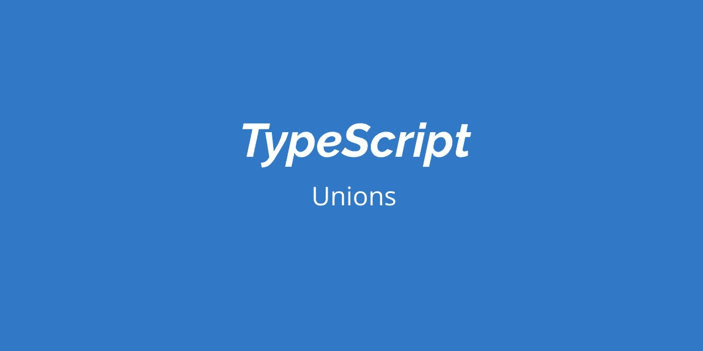

# TypeScript:有区别的联合

> 原文：<https://javascript.plainenglish.io/typescript-discriminated-unions-ebe5dc0a76c7?source=collection_archive---------14----------------------->



## 将另一个错误来源外包给 TypeScript 编译器

## **简介:联合类型**

TypeScript 的一个最简单但最强大的特性是能够将多种类型组合成一个所谓的**联合类型:**一个表示 X 是以下类型之一的类型。例如:

```
type m = ....;
type n = ....;type x = m | n;
```

在上面的例子中，`x` 或者是类型`m`或者是类型`n` *。*你可以用`|`符号连接多个类型，以创建一个联合类型。该功能的一个简单用例是当你有一个函数想要根据输入类型以不同的方式运行时。

这里记载了[的一个实际例子](https://www.typescriptlang.org/docs/handbook/advanced-types.html#union-types)如下:

Unions: Practical Example

在上面的代码中，`padLeft`函数可以与类型`string | number`一起工作。它在运行时检查输入变量的类型，然后评估结果。

但这只是冰山一角。unions 真正闪光的地方是它们在运行时能够被识别，并且能够被彻底检查以发现缺失的用例。

## **受歧视的工会**

这个术语来自集合论，用来表示一个*数据结构，它可以采用几种不同的，但是固定的类型。在 TypeScript 中，我们可以如下使用有区别的联合:*

Discriminated Unions in TypeScript: Fig 2

正如我们所见，基于`kind`属性(称为*判别式*)，我们可以在运行时区分对象的类型，并访问其他属性。
为代码生成的 JavaScript 如下所示:

Generated JavaScript for code in Fig2

除此之外，受歧视工会的另一个强大用例是它们提供如下**详尽检查**的能力:

Discriminated Unions: Exhaustive Checks

我们添加了一个新的命名类型`Dog`。假设开发人员忘记更新 switch 语句；在这种情况下，TypeScript 编译器足够聪明，能够意识到 switch 语句并不详尽，因而无法编译。这是因为我们试图将`Dog`类型分配给`never`类型。

详尽检查的一个更实际的用例如下:

Error Handling using Discriminated Unions in TypeScript

现在我们可以添加任意多的错误类型，而不必担心处理不同类型的所有代码；这项工作已经被卸载到 TypeScript 编译器😃

## **结论**

总而言之，TypeScript 中有区别的联合提供了另一个抽象层，并为开发人员提供了基于公共属性类型处理给定对象的不同用例的能力，同时知道 TypeScript 编译器正在努力防止未经检查的代码进入生产环境，可以安心睡觉。

**参考文献** 【1】:[https://en.wikipedia.org/wiki/Tagged_union](https://en.wikipedia.org/wiki/Tagged_union)

-[https://www . typescriptlang . org/docs/handbook/advanced-types . html](https://www.typescriptlang.org/docs/handbook/advanced-types.html)

## **简明英语团队的笔记**

你知道我们有四种出版物吗？给他们一个 follow 来表达爱意吧:[**JavaScript in Plain English**](https://medium.com/javascript-in-plain-english)[**AI in Plain English**](https://medium.com/ai-in-plain-english)，[**UX in Plain English**](https://medium.com/ux-in-plain-english)，[**Python in Plain English**](https://medium.com/python-in-plain-english)**—谢谢，继续学习！**

**此外，我们总是有兴趣帮助推广好的内容。如果您有一篇文章想要提交给我们的任何出版物，请发送电子邮件至[**submissions @ plain English . io**](mailto:submissions@plainenglish.io)**，并附上您的媒体用户名和您感兴趣的内容，我们将会回复您！****