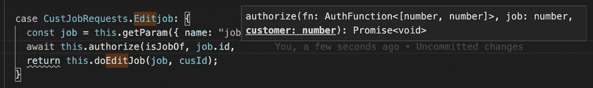

# TypeScript 泛型 Rest 参数和元组类型在实践中

> 原文：<https://javascript.plainenglish.io/typescript-generic-rest-parameters-and-tuple-types-in-practice-edc2bb0bdcb9?source=collection_archive---------2----------------------->

在 [NOWJOBS](http://nowjobs.com) 我们使用 TypeScript 和一个家庭定制的 Node web 框架(基于[科迪](https://github.com/jcoppieters/cody)的核心)让客户创建职位空缺并找到候选人。在这篇文章中，我们将展示如何使用[通用 rest 参数类型](https://www.typescriptlang.org/docs/handbook/release-notes/typescript-3-0.html#generic-rest-parameters)和[元组类型](https://www.typescriptlang.org/docs/handbook/basic-types.html#tuple)来键入我们的授权检查。


# 语境

在我们的框架中，处理编辑作业的请求看起来像这样:

当发出请求时，框架找到正确的控制器，用一些请求上下文实例化它，并调用 doRequest 方法。在处理请求时，我们:

1.  检索请求和发出请求的用户的 id
2.  使用[字符串 enum](https://www.typescriptlang.org/docs/handbook/enums.html#string-enums) JobRequests 检查哪个请求被完成(客户端也使用它来发出请求，因为我们在客户端和服务器之间共享 TypeScript 代码！)
3.  获取请求参数
4.  对参数执行授权检查
5.  在 doEditJob 方法中进行实际编辑并生成响应

# 批准

在本文中，我们将关注如何处理第 4 步，即授权，以及通用 rest 参数类型如何为其提供完整的类型支持。该框架通过提供一个 authorize 方法来方便我们的开发人员，该方法采用一个高阶 auth 函数和一些参数。用这些参数调用 auth 函数。如果返回 false，将抛出一个特定的未授权错误。然后，这被框架捕获，并向客户端返回 403 响应。该方法本身很简单:

如果我们更仔细地看一下 auth 函数，它的调用方式是:

1.  控制器的实例化(允许函数执行 db 操作、日志记录等。在请求的上下文中)
2.  给 authorize 函数的其他参数。这些参数使用 [rest 操作符](https://developer.mozilla.org/en-US/docs/Web/JavaScript/Reference/Functions/rest_parameters)收集，然后使用 [spread 语法](https://developer.mozilla.org/en-US/docs/Web/JavaScript/Reference/Operators/Spread_syntax)应用于 auth 函数调用。基本上，我们将 authorize 函数的所有参数传递给 auth 函数，除了第一个参数。

检查作业是否属于给定用户的验证函数示例可以定义为:

# 类型

现在，我们可以输入 authorize 函数，说明两个 rest 参数都是未知类型的:

但是当调用 authorize 时，我们错过了许多类型检查:

1.  参数的数量是必需的，因为数组类型没有固定的长度。
2.  需要参数的*类型，因为元素被均匀地类型化为 unknown(意思是，它们都有相同的类型，unknown)。*

换句话说，对 rest 参数没有适当的类型检查，因此允许以下调用:

```
await this.authorize(isJobOf, job)
await this.authorize(isJobOf, job, "id")
await this.authorize(isJobOf)
```

我们实际上想要告诉类型系统的是，authorize 的 rest 参数中收集的参数*与 auth 函数中的参数*完全相同。我们可以通过使用[泛型类型](https://www.typescriptlang.org/docs/handbook/generics.html)来尝试，假设 authorize 函数的 rest 参数是 P 类型，auth 函数的 rest 参数是 T 类型。

类型系统会抱怨 args 必须是 array 类型，因为在 rest 参数上使用泛型类型时，这是唯一允许的类型。这可以通过告诉它泛型类型 P 和 T 都扩展了未知的数组类型来解决。

尽管将 rest 参数类型化为数组感觉起来很自然，但它实际上是一个特殊的构造[，其中类型系统将使用](https://www.typescriptlang.org/docs/handbook/release-notes/typescript-3-0.html#generic-rest-parameters)[元组类型](https://www.typescriptlang.org/docs/handbook/basic-types.html#tuple)而不是同类数组类型。元组类型正好解决了我们遇到的问题，也就是说，它们为每个元素键入一个具有*固定长度*和*特定类型的数组。*

当使用 isJobOf 调用 authorize 时，类型系统将:

*   将 isJobOf 的签名类型与 AuthFunction <t>匹配，将 T 设置为 tuple [number，number]以匹配 isJobOf 的第二个和第三个参数的类型。</t>
*   因此，authorize 的通用类型 P 也被设置为[number，number]。
*   因此，现在类型系统强制要求 authorize 的其余参数必须是[number，number]类型，因此第二个和第三个参数必须是 number 类型。

所以现在类型系统做了我们想要它做的事情。此外，令人惊讶的是，当使用 VSCode 时，它甚至会复制 auth 函数的正确参数名称，以在调用 authorize 函数时显示在 authorize 的类型签名中(job: number，customer: number):



这个看似简单的结果都是由 *rest 参数*、*、扩展语法*和*元组类型*与*通用 rest 参数*的内在组合实现的。多酷啊！我们对 TypeScript 团队的惊人工作感到非常高兴，他们最终提出了一个与我们合作而不是与我们作对的类型系统！

# 资源

*   Rest 参数:[https://developer . Mozilla . org/en-US/docs/Web/JavaScript/Reference/Functions/rest _ parameters](https://developer.mozilla.org/en-US/docs/Web/JavaScript/Reference/Functions/rest_parameters)
*   展开语法:[https://developer . Mozilla . org/en-US/docs/Web/JavaScript/Reference/Operators/Spread _ syntax](https://developer.mozilla.org/en-US/docs/Web/JavaScript/Reference/Operators/Spread_syntax)
*   元组类型:[https://www . typescriptlang . org/docs/handbook/basic-types . html # tuple](https://www.typescriptlang.org/docs/handbook/basic-types.html#tuple)
*   Typescript 泛型 Rest 参数类型:[https://github.com/microsoft/TypeScript/pull/2489](https://github.com/microsoft/TypeScript/pull/2489)和[https://github.com/microsoft/TypeScript/pull/24897](https://github.com/microsoft/TypeScript/pull/24897)

*注意:当然你也可以对 authorize 和 AuthFunction 的泛型类型使用相同的变量名(所以都是 T ),因为它们的作用域是类型本身。我们在这里用一个不同的名称来演示它，以清楚地表明它们实际上是两个不同的变量。*