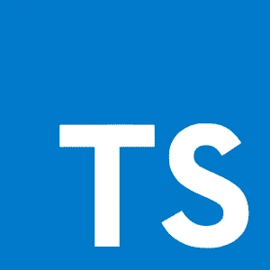

# TypeScript 简介

> 原文：<https://javascript.plainenglish.io/typescript-in-a-few-words-d9f24647ee49?source=collection_archive---------10----------------------->

下面是对 TypeScript 编程语言的一个快速介绍。

在本文中，我将用几个段落解释什么是 TypeScript。注意，这是摘自[我的书](https://www.amazon.com/Learn-TypeScript-Building-Applications-understanding/dp/1789615860/)的引言章节。

# 什么是 TypeScript？

微软开发了[打字稿](http://www.typescriptlang.org)编程语言，后来在 [Apache 2.0 许可](https://www.apache.org/licenses/LICENSE-2.0)下开源。这种语言的源代码可以在 https://github.com/Microsoft/TypeScript 的 GitHub 上找到

# 安全的投资

在撰写本文时，TypeScript 现在在 Github 上有大约 62K 的星星。这比我上次查的，2019 年底左右，多了 25K。TypeScript 不断获得牵引力，其受欢迎程度持续上升，如下所示:[https://red monk . com/sogrady/2018/08/10/language-rankings-6-18/](https://redmonk.com/sogrady/2018/08/10/language-rankings-6-18/)

在 2019 年的 JavaScript 调查中，TypeScript 名列“JavaScript 口味”排行榜之首:[https://2019.stateofjs.com/javascript-flavors/](https://2019.stateofjs.com/javascript-flavors/)

而且，相信我，这种语言一定会继续崛起。我坚信投入时间和精力学习 TypeScript 是值得的。它是一种编程语言，可以在 JavaScript 生态系统的所有主要框架/库上使用。

无论你使用 React、Angular、Vue.js、NestJS 还是其他东西，TypeScript 都可以使用，并且会帮助你写出更高质量、更易维护的代码。

# 将文件转换成 JavaScript 的 JavaScript 超集

如[语言官方网站](https://www.typescriptlang.org/)所述:

> TypeScript 是 JavaScript 的类型化超集，它编译成普通 JavaScript。

这个简单的定义实际上说了很多关于 TypeScript 的内容。让我们一点一点来分析。

首先要意识到的是 TypeScript 代码编译成 JavaScript。这意味着 TypeScript 编译器的输出可以在 JavaScript 代码可以运行的任何地方运行，这实际上意味着，现在，基本上在任何地方；既然 JavaScript 可以运行…

*   在浏览器中
*   在后端(例如，使用 node.js)
*   在桌面上(例如，用电子)
*   在移动设备上使用 React Native、NativeScript、Ionic 等框架
*   在云中使用 Azure Functions、Google Cloud Functions、Firebase 等平台
*   …

如上所述，TypeScript 是由*编译的*，而不是像 JavaScript 那样被解释。实际上，在类型脚本的情况下，人们经常谈论 *transpilation* 而不是编译，因为类型脚本编译器实际上做了源到源的转换。

第二个关键点是，TypeScript 是 JavaScript 的*超集*。这意味着任何有效的 JavaScript 代码也是有效的 TypeScript 代码。这很好，因为这意味着将 TypeScript 引入现有的 JavaScript 代码库非常容易。然而它并没有就此停止！正如我在我的书中展示的[，TypeScript 比普通的 JavaScript/EcmaScript 增加了*很多。*](https://www.amazon.com/Learn-TypeScript-Building-Applications-understanding/dp/1789615860)

# 可选类型

第三点是 TypeScript 是(可选的)类型化的。

如果你熟悉 JavaScript，那么你可能知道它是一种动态类型语言。由于任何 JavaScript 代码也是有效的类型脚本代码，这也意味着您可以在不指定变量类型的情况下声明变量，并在以后为它们分配不同的类型(例如，数字、字符串等)。

尽管在 TypeScript 中默认情况下定义类型是可选的这一事实并不意味着您应该避免定义类型。相反，当你聪明地使用类型系统时，TypeScript 会大放异彩。

TypeScript 允许您清楚地指定变量和函数的类型。此外，它还具有非常强大的类型推断，支持接口/自定义类型、类、泛型、枚举、混合，以及许多其他我在[我的 TS 书](https://www.amazon.com/Learn-TypeScript-Building-Applications-understanding/dp/1789615860)中提到的很酷的东西。

当启用了严格模式时，这种语言得到了最好的利用，这种模式对需要键入的内容和时间实施了更严格的规则。但是在任何情况下，让编译器为我们推断类型通常是可能的。

# 支持静态和结构类型

关于 TypeScript 最酷的事情之一是它对*结构类型*的支持。

在 TypeScript 中，如果某物像鸭子一样嘎嘎叫，那么 TypeScript 认为它是一只鸭子。这种被称为“鸭子打字”的方式已经融入了这种语言..

TypeScript 考虑类型的*兼容性*。

例如，如果某个函数期望接收一个`Foo`类型的对象，但它却被一个`Bar`类型的对象调用，那么只要`Bar`与`Foo`具有相同的结构(即结构相同)，TypeScript 就不会抱怨。也就是说，一个`Bar`对象可以被认为是一个`Foo`，如果它公开了(至少)期望的属性/方法，具有期望的类型。这是一种简化，但离真相不远了。

结构化类型非常有用，因为它有助于避免编写一些样板代码。在不支持 duck typing 的编程语言中，你经常不得不浪费时间将对象转换成不同的数据结构。在 TypeScript 中，如果表单是兼容的，那么就可以使用了。

请注意，TypeScript 还支持一些名义类型(即非结构类型)，如果您希望区分不同类型的对象，即使它们的结构是相同的，这也是很有趣的。巴萨拉特在他的书中有一个关于这个的精彩章节。

# 多才多艺的

使用 TypeScript 的方式不止一种。你可以混合搭配不同的方法。

当然，最好是从一开始就一直使用 TypeScript。

但是您也可以将它添加到现有的 JS 代码库中，而不必一次转换所有内容。即使根本不需要将代码转换为 TypeScript，您也可以使用它；只是受益于编译器的帮助。

事实上，您可能已经在不知不觉中使用 TypeScript 了；例如，如果您使用 Visual Studio 代码(内置于 TypeScript 中)；因为它使用 TypeScript 来帮助你(自动完成，等等)。

# JS 库的类型

围绕 TypeScript 的社区正在成长，并且已经为数以千计的 JavaScript 库贡献了 TypeScript 类型定义。

这意味着您可以在使用许多库时受益于强(更)类型。

它并不总是完美的，但它做得很好！拥有现有库的类型是很好的，因为它有助于更容易理解 API，减少错误，最重要的是，避免许多错误。

# 结论

在这篇简短的介绍性文章中，我解释了什么是 TypeScript。希望它能让你了解为什么学习这门语言很有趣。

我在 2015-2016 年左右一头扎进了 TypeScript，真的没有回头看。我用它为比利时国家银行开发了前端框架，并编写了后端和前端应用程序，取得了很大的成功。我现在也把它作为我即将在 SaaS 成立的公司的支柱，这再好不过了。

我已经在文章中提到过它，但我还写了一本关于这种语言的 800 多页的书[(这告诉我有多喜欢它:p)，涵盖了从非常基础到最先进的概念，以及它与多个现代框架/库(如 React、Angular、Vue、NestJS 等)的结合使用。](https://www.amazon.com/Learn-TypeScript-Building-Applications-understanding/dp/1789615860)

如果您感兴趣，我将继续发布关于 TypeScript 的介绍性材料。还有很多要知道的！

今天到此为止！

# 喜欢这篇文章吗？

如果你想了解关于软件/Web 开发、TypeScript、Angular、React、Vue、Kotlin、Java、Docker/Kubernetes 和其他很酷的主题的大量其他很酷的东西，那么不要犹豫[拿一本我的书](https://www.amazon.com/Learn-TypeScript-Building-Applications-understanding-ebook/dp/B081FB89BL)并订阅[我的时事通讯](https://mailchi.mp/fb661753d54a/developassion-newsletter)！