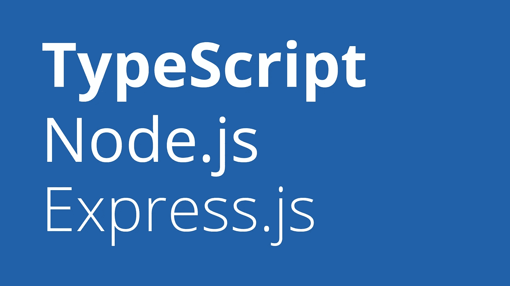

# 如何用 TypeScript、Node.js、Express 构建后端 app

> 原文：<https://javascript.plainenglish.io/typescript-node-js-express-js-create-a-backend-application-f5110dbe5c19?source=collection_archive---------0----------------------->

## 从头开始创建您的后端应用程序



# 介绍

你好。在本文结束时，您将知道如何创建一个简单可靠的后端应用程序，可以作为未来项目的样本。

你可以直接在专用的[库](https://github.com/fairyfingers/ts-node-express-sample)中查看代码。
本教程的每一步都匹配一个特定的提交。

## 要求

*   你最喜欢的 IDE
*   安装 node . js([https://nodejs.org/en/download/](https://nodejs.org/en/download/))
*   使用 *npm* 安装 TypeScript:

```
npm install -g typescript
```

## 摘要

1.  **项目设置** | *快速初始化，npm 包&程序入口点*
2.  **路由设置** | *控制器，路由&路由器*
3.  **错误处理** | *自定义错误&错误处理功能*

# 项目设置

## 初始化

由于您的后端应用程序将使用 TypeScript、Node.js 和 Express.js，因此您需要安装几个包(也称为*依赖项*)。
为此，使用`[npm init](https://docs.npmjs.com/cli/init.html)` [命令](https://docs.npmjs.com/cli/init.html)初始化您的项目:

```
npm init -y
```

💬这将创建一个`package.json`文件，该文件稍后将包含关于您的项目依赖项的所有信息。

一旦完成，您需要指出您的项目是一个 TypeScript 项目。
为此，使用下面的`[tsc](https://www.typescriptlang.org/docs/handbook/compiler-options.html)` [命令](https://www.typescriptlang.org/docs/handbook/compiler-options.html)创建一个 TS 配置文件:

```
tsc --init
```

💬这将创建一个`tsconfig.json`文件，其中包含一些默认选项，我邀请您在它专用的[模式存储](http://json.schemastore.org/tsconfig) *中探索这些选项。*

## 软件包概述

几乎每个项目都依赖于一些外部包。这些包被认为是项目的 [*依赖项*](https://docs.npmjs.com/files/package.json#dependencies) 。
有些是你的项目*始终*需要的，但有些是只在开发时*需要的:这些被称为 [*开发依赖*](https://docs.npmjs.com/files/package.json#devdependencies) 。*

以下是您将要安装的软件包:

```
📦 [**dotenv**](https://www.npmjs.com/package/dotenv) *(dependency)*
📦 [**express**](https://expressjs.com/) *(dependency)*
📦 **@types/express** *(dev dependency)*
📦 **@types/node** *(dev dependency)*
📦 [**ts-node**](https://www.npmjs.com/package/ts-node) *(dev dependency)*
📦 [**ts-node-dev**](https://www.npmjs.com/package/ts-node-dev) *(dev dependency)*
📦 [**typescript**](https://www.npmjs.com/package/typescript) *(dev dependency)*
```

💬所有这些包都有特定的用途，我邀请您通过单击其中的每一个包来快速了解一下。

## 软件包安装

现在让我们使用`[npm install](https://docs.npmjs.com/cli/install.html)` [命令](https://docs.npmjs.com/cli/install.html)安装您的*依赖项*:

```
npm install dotenv express
```

💬这做了两件事。一方面，它在你的项目的`node_modules`文件夹中安装`dotenv`和`express`包，另一方面，在你的`package.json` *依赖*中注册它们。

让我们继续使用相同的命令安装您的*开发依赖项*:

```
npm install -D @types/express @types/node ts-node ts-node-dev typescript
```

💬除了在`package.json` *开发依赖*中注册包的`-D`选项之外，这与之前做的完全一样。

## 环境变量

应用程序配置可能会因部署而异，尤其是在开发人员工作站之间。例如，您可能不想让您的服务器监听与您的同事相同的端口，因为您的服务器已经在使用中。
因此，我们有了所谓的*环境变量*(比如端口)。

它们通常都位于应用程序根目录下的同一个文件中。
这个文件通常被称为`.env`文件，下面是您需要的文件:

💬这里是你的项目的每一个全局变量和可配置变量的位置。您可能想在将来添加一些，但现在已经足够了…

## 程序入口点

干得好，你已经设置了整个项目。现在你需要一个程序*入口点*。一些让你启动你的服务器并向它发送请求的代码。
按顺序，遵循以下步骤:

1.  在项目目录的根目录下创建一个`src`文件夹
2.  在你的`src`文件夹中创建一个`app.ts`
3.  查看并粘贴下面几行到您的`app.ts`文件中:

## 开始脚本

要启动您的服务器应用程序，请在您的`package.json`文件中添加以下行:

然后打开命令提示符，键入以下内容:

```
npm run dev
```

🚀恭喜你。您的服务器正在运行！

# 路由设置

## 控制器

控制器是由主题集合的一组方法，由服务器调用以响应一些特定的客户端请求。
**一个控制器对应一个主题。**

## 路由和路由器

[路由](https://expressjs.com/en/starter/basic-routing.html)基本上告诉你的服务器如何响应*客户端请求*。但是可能有许多不同的客户端请求，那么我们必须做些什么来让我们的服务器处理每一个请求呢？我们创建了我们所谓的*路由*和*路由器*。

> 路由是客户端请求和需要响应调用的正确控制器方法之间的链接。

一个好的做法是按主题划分路线。如果你的项目是一个关于动物的网站，那么你很有可能不会把狗和老虎搞混。所以会有一些狗的特定路线和一些老虎的路线。这就是路由器发挥作用的地方。

> 路由器可以通过主题来区分路由，并为每条路由执行适当的代码。

因此，您将有一个关于狗的路由器，其中包含所有关于狗的路由，还有一个关于老虎的路由器，其中包含所有关于老虎的路由。**一个主题一个路由器**。

## 履行

现在第一步是从创建*控制器*开始。记住:一个控制器对应一个主题。请遵循以下步骤:

1.  在你的`src`文件夹中创建一个名为`controllers`的新文件夹
2.  选择两个独特的主题(保持简单，这只是一个样本)
3.  在文件夹内的单独文件中创建两个唯一的控制器:

💬每个控制器拥有相同的默认方法，您稍后将调用该方法来响应特定的客户端请求，使用特定路由器中的特定路由。

现在，您将实现自己的路由器。记住:一个路由器对应一个主题，一个路由器对应一个控制器主题，一个路由器对应一个控制器。

1.  在你的`src`文件夹中创建一个名为`routers`的新文件夹
2.  在`routers`中创建与主题一样多的子文件夹
3.  按照以下结构，在匹配的文件夹中创建路由器:

💬每台路由器一构建好就配置好了。`_configure()`方法将所有与路由器主题匹配的*路线*集中起来，并给它们一个特定的*控制器方法*,当到达路线的*端点*时调用该方法。

现在，您需要一个主路由器来检测客户端请求所关注的主题，以及它必须将主题传递给哪个路由器。

1.  在你的`routers`文件夹中创建一个`MasterRouter.ts`文件
2.  将以下代码复制/粘贴到您的文件中:

3.编辑你的程序入口点(`app.ts`文件) :

现在使用`npm run dev`启动您的服务器，并尝试访问以下内容:

```
http://localhost:{port}/api/themeA
http://localhost:{port}/api/themeB
```

输出应该是:

```
**{**"text": "You've reached the ThemeAController default method"**}
---- or
{**"text": "You've reached the ThemeBController default method"**}**
```

**恭喜恭喜！**🤙您已经设置了后端应用程序(以最简单的形式)。

# 错误处理

假设您有一个前端应用程序，它使用您的后端应用程序的 API。
你可能想通知你的前端应用程序，以防你的后端应用程序出错，这样它的最终用户也能得到通知…

为此，您必须创建自定义错误处理系统，以及自定义错误对象。
幸运的是 JavaScript 有自己的`Error`对象，所以你要做的就是*扩展*这个对象，并添加你需要的所有道具。

1.  在`src`文件夹中创建一个名为`models`的新文件夹
2.  创建一个`ErrorHandler.ts`文件，并将以下代码复制/粘贴到其中:

3.还要编辑你的`app.ts`:

4.现在你可能想看看这是如何工作的。转到您的一个控制器，并用以下代码替换它:

5.最后，转到它的匹配路由器，用下面的代码替换它的`_configure()`方法:

💬如果控制器在`try`块中抛出任何错误，它会被立即捕获并重定向到下一个应用中间件*，在这个特定的情况下:您刚刚在`app.ts`文件中编写的处理应用错误的代码。*

启动您的服务器，并尝试到达您放置错误的端点。
输出应该和这个一样:

```
**{**"status": "error","statusCode": **501**,"message": "Not implemented method"**}**
```

**搞定！Node.js/Express.js.，这是你的后台应用程序样本，用打字稿做的。如果你有任何问题，请随时提问。**

*特别感谢 Chinedu Orie 用他的* [*条*](https://dev.to/nedsoft/central-error-handling-in-express-3aej) *关于 Express 中的错误处理。*