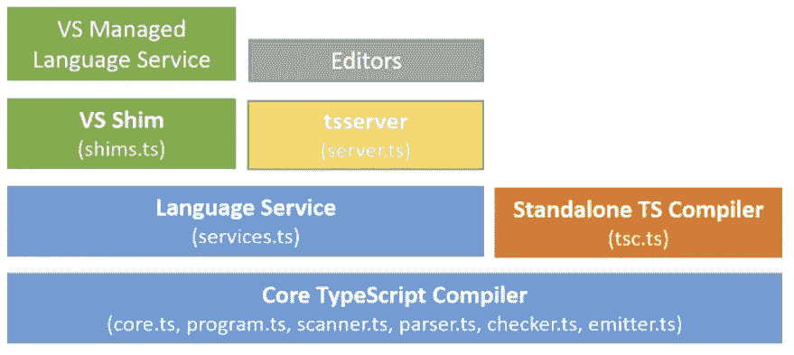

# 打字稿非目标

> 原文：<https://javascript.plainenglish.io/typescript-non-goals-43f47c1ecd84?source=collection_archive---------5----------------------->

从一开始，TypeScript 就有[明确定义的设计目标](https://github.com/microsoft/TypeScript/wiki/TypeScript-Design-Goals)。

但是你知道 TypeScript 也有一套*非目标*吗？让我们逐一讨论，因为它们非常有趣，非常值得了解。

Picture courtesy of [@herrond](https://unsplash.com/@herrond)

# 完全模仿现有语言的设计

TypeScript 的目的不是简单地*复制*EcmaScript/JavaScript 的设计。

虽然它确实严格尊重 JavaScript 的运行时行为，以保持语言的超集，但它*确实*引入了自己的语法，让我们以更强的表达性、更清晰和更安全的类型来实现我们的目标。

例如，EcmaScript 中不存在 TypeScript 泛型，但它为我们提供了创建数据结构、类型和函数的方法，这些数据结构、类型和函数可以安全地处理各种类型。

事实上，TypeScript 的这个非目标实际上是该语言所有伟大之处的基础:充分尊重运行时，但提高代码的可读性、健壮性和开发者体验。

TypeScript 带来了无数令人惊叹的特性和语法优势，极大地改善了开发人员的体验(DX)。

# 积极优化程序的运行时性能

TypeScript 不会尝试发出超级优化的 JavaScript 代码。

这个非目标的意思是，TypeScript 编译器生成的代码旨在成为*惯用的* JavaScript 代码；也就是说，代码保持与 JS 最佳实践一致，并且人类仍然能够破译。

但是不要误解这一点；性能[显然不会被 TypeScript 团队忽视](https://github.com/microsoft/TypeScript/wiki/Performance)，最近的 [3.9 beta 发行说明](https://devblogs.microsoft.com/typescript/announcing-typescript-3-9-beta/)再次证明了这一点。

# 应用一个健全的或“可能正确的”类型系统

TypeScript 试图在正确性和开发人员生产力之间找到一个平衡，而不是仅仅关注于创建一个可证明的(从数学上看)正确的类型系统。

当然，随着时间的推移，类型系统变得越来越强大，但同时，开发者体验是最前端和中心的，这让我想起了为什么我马上就爱上了 Kotlin。

对我来说，TypeScript 和 Kotlin 是我一直在使用的两种最令人愉快的编程语言。

# 提供端到端的构建管道

TypeScript 并不打算自己做所有的事情。相反，它试图开放和易于扩展，以便其他工具可以轻松地使用编译器，并将其集成到编辑器、ide 和构建链中。

从一开始，TypeScript 的架构就被定义为能够与尽可能多的构建/开发工具/ide 很好地集成。

这是由两部分主要架构实现的:

第一个令人感兴趣的部分是语言服务，它通过提供对熟悉的代码编辑器特性的支持，如自动完成、彩色化、代码格式化、代码重构、调试/断点等等，补充了核心编译器管道。你可以在这里了解更多信息。

这个难题的第二个非常重要的部分是 TSServer，它包装了核心编译器和语言服务，并通过基于 JSON 的协议公开它们。

通过直接在 JSON 上公开编译器+语言服务特性，IDE 集成实际上对编辑器/IDE 开发者来说变得轻而易举。此外，通过将编译器管道直接集成到 ide 中，它们都可以立即受益于强大的特性集。

如果没有这种架构，每个编辑器/ IDE 都必须付出更多的努力来增加对该语言的支持，并且编辑器之间会有巨大的差异，由于 TypeScript 的设计，今天不会出现这种情况。N-e-a-t！

如果你想看一个例子，那么看看[VSCode 如何集成 TypeScript 支持](https://github.com/microsoft/vscode/tree/master/extensions/typescript-language-features)(顺便说一句，vs code 本身是使用 TypeScript 编写的，这是“自食其果”原则的一个很好的例子:p)。

当然，TSServer 也使得在构建工具/构建链中与编译器交互变得容易，这打开了一个可能性的世界。

# 在程序中添加或依赖运行时类型信息，或者根据类型系统的结果发出不同的代码

这是 TypeScript 的非目标之一，对此我感到有点难过。

这意味着 TypeScript 不打算将其类型信息推送到运行时，甚至不打算让我们在运行时保存类型元数据。

TypeScript 的设计选择是为了在开发时尽可能地帮助我们开发人员，并限制/试图消除我们对运行时类型安全的需要。我猜想这个想法是“简单的”,如果我们在编译时有足够的确定性，那么运行时类型安全就没那么重要了。

然而在实践中(IMHO)，在一些场景中，运行时类型安全确实是有益的。首先，当我们从后端或外部客户端接收数据时，能够断言类型是预期的通常是有用的。这不是 TypeScript 语言想要帮助我们的。

但这并不意味着这是不可能的。稍后我会写一些类似于 [io-ts](https://github.com/gcanti/io-ts) 的解决方案(提示:有很多)。

# 提供额外的运行时功能或库

TypeScript 不通过扩展/库提供特定的运行时功能。

TypeScript 专门关注编译时。从那里，它生成 EcmaScript 兼容的代码，但是发出的代码在运行时不依赖于 TypeScript 特定的元素；它只是可以在任何 ES 运行时运行的 JavaScript。

# 介绍可能让用户感到惊讶的行为

哦，我多么喜欢这个非目标！它实际上是我的最爱之一。

总结这一条，假设 TypeScript 不是数学家用的语言，像 Scala 可以(哎呀，那里，我刚写的，不好意思，不是不好意思！).

对一些人来说，这听起来可能很悲伤，但对我来说，这是*太棒了*。编程语言不应该(仅仅)是为真正的科学家制造的。代码读起来应该像散文，而不是方程式。

一种语言的可读性和可访问性越强，就越有可能增加软件开发对最大人群的可访问性。晦涩的语法对任何人都没有帮助。

既然我已经开始教我的儿子编程，我当然不打算给他介绍像 Scala 这样只会让他尝到苦果并迫使他放弃而不是享受*乐趣*的语言。相反，我会教他 Python(为了易用和简单)，Kotlin，当然还有 TypeScript！

TypeScript 在这方面很棒。只要看看一些打字稿代码，享受其中的美妙！

# 结论

在本文中，我们快速回顾了 TypeScript 的非目标，这些目标与我们今天所见证的语言的成功紧密相关。

通过关注可读性、开发人员体验、工具集成以及应用最小惊奇原则，TypeScript 已经取得了很少编程语言所拥有的东西:伟大和开发乐趣。(无处不在正在路上，但请再给它一些时间！；-))

今天到此为止！

# 喜欢这篇文章吗？点击下面“喜欢”按钮查看更多内容，并确保其他人也能看到！

PS:如果你想了解大量关于软件开发、Web 开发、TypeScript、Angular、React、Vue、Kotlin、Java、Docker/Kubernetes 和其他很酷的主题的其他很酷的东西，那么不要犹豫[去拿一本我的书](https://www.amazon.com/Learn-TypeScript-Building-Applications-understanding-ebook/dp/B081FB89BL)并订阅[我的简讯](https://mailchi.mp/fb661753d54a/developassion-newsletter)！