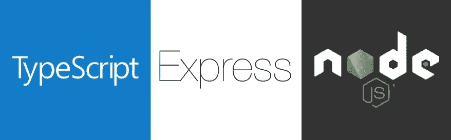
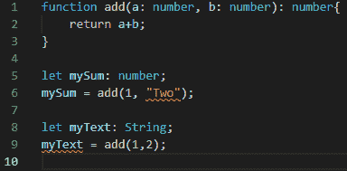
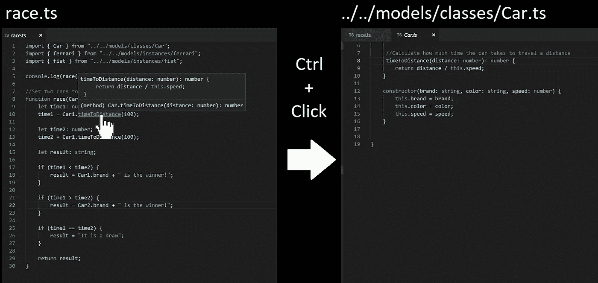
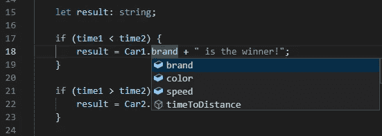
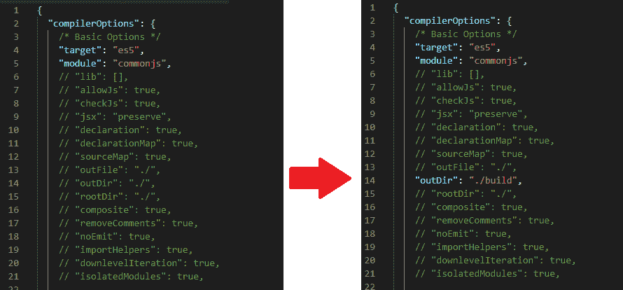
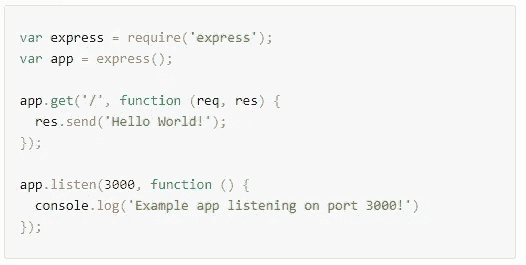
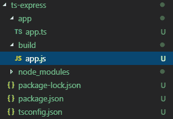
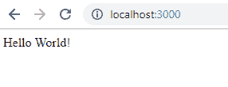

# 如何(以及为什么)将 TypeScript 用于 Node 和 Express。

> 原文：<https://javascript.plainenglish.io/typescript-with-node-and-express-js-why-when-and-how-eb6bc73edd5d?source=collection_archive---------0----------------------->



在我职业生涯的初期，我是一名桌面开发人员，强类型语言主导着市场。

当我转向 web 开发时，我对 JavaScript 和 Python 等语言的每一个新特性都很着迷。我不必声明变量类型的事实给我带来了生产力，我的工作变得更加有趣。

所以当我第一次听说 TypeScript 的时候，这个想法似乎是语言发展的一个倒退。


## 我改变主意了吗？

可以，但是要看情况。对于我独自工作的个人项目，我仍然更喜欢普通 JavaScript 的生产力。但是，对于更大的项目，在团队中工作，我推荐使用 TypeScript。在这篇文章中，我将解释如何和为什么。


# 以打字打的文件

如果你还不知道什么是 TypeScript，我推荐你阅读这篇概述:[https://www . tutorialspoint . com/TypeScript/TypeScript _ overview . htm](https://www.tutorialspoint.com/typescript/typescript_overview.htm) 和官方 5 分钟教程:
[https://www . typescriptlang . org/docs/handbook/TypeScript-in-5-minutes . html](https://www.typescriptlang.org/docs/handbook/typescript-in-5-minutes.html)

但我们可以说，从表面上看，它是强类型的 ECMAScript 6。

# 生产力与维护

根据定义，“TypeScript 是用于应用程序规模开发的 JavaScript”。也就是说，复杂项目的可维护性补偿了我们在项目初始设置时所做的工作。让我们指出为什么会发生这种情况:

## 类型安全=错误更少

通过在代码中定义类型，您可以允许 IDE 确认在使用类和函数时出现的错误，这些错误只能在运行时被发现。

**举例:**



这里我用 Visual Studio 代码指出了两个错误:

**第 6 行:**我们试图将一个字符串参数传递给一个只接受数字的函数。
**第 9 行:**我们试图将一个返回数字的函数的结果赋给一个字符串。如果没有 Typescript，这两个错误不会被注意到，从而导致最终应用程序出现一些 bug。

## IDE 更容易公开项目模块

在复杂的项目中，我们有数百个类分布在多个文件中。当我们定义类型时，IDE 能够将对象和函数与产生它们的文件联系起来。

当使用 control +单击从另一个文件导入的方法或类时，IDE 将自动导航到导入的文件，突出显示定义引用的行。



我们可以在从其他文件导入的类中使用 autocomplete。



维护的困难是 Java 和 C #开发人员避免将大型项目迁移到 JS 的主要原因之一。我们可以说 Typescript 是一种克服了这一障碍的企业语言。

# 如何用 Typescript 设置 Express 项目

现在让我们一步一步地在 Express.js 项目中创建一个使用 Typescript 语言的环境。

```
npm init
```

现在让我们安装`typescript`包。

```
npm install typescript -s
```

## 关于 Typescript 节点包

Node.js 是一个运行 Javascript 而不是 Typescript 的引擎。节点类型脚本包允许你把你的`.ts`文件转换成`.js`脚本。Babel 也可以用于 transpile Typescript，然而市场标准是使用官方的微软软件包。

在我们的`package.json`里，我们会放一个叫做`tsc`的脚本:

```
"scripts": {
    "tsc": "tsc"
},
```

这一修改允许我们从项目文件夹中的命令行调用 typescript 函数。所以我们可以使用下面的命令:

```
npm run tsc -- --init
```

这个命令通过创建`tsconfig.json`文件来初始化 typescript 项目。在这个文件中，我们将取消对`outDir`选项的注释，并为传输文件选择一个位置。要交付的 js 文件:



## 安装 express.js

```
npm install express -s
```

Express 和 Typescript 包是独立的。这样做的结果是，Typescript 不“知道”Express 类的类型。Typescript 有一个特定的 npm 包来识别 Express 类型。

```
npm install @types/express -s
```

## 你好世界

为了得到尽可能简单的应用程序，我将使用 express.js 教程中的 hello world 示例:

[https://expressjs.com/pt-br/starter/hello-world.html](https://expressjs.com/pt-br/starter/hello-world.html)



在我们的项目中，我们将创建一个名为`app`的文件夹。在这个文件夹中，我们将创建一个名为`app.ts`的文件，其内容如下:

## 编译我们的第一个应用程序:

```
npm run tsc
```

如您所见，该命令自动创建了构建文件夹和。js 文件。



## 跑快车:

```
node build/app.js
```

这样，我们就有了一个已经在端口 3000 上运行的服务器:



## 运行 TypeScript 而不传输文件

可以直接在带有`ts-node`包的节点上运行 typescript。

这个包仅推荐用于开发。要在生产中进行最终部署，请始终使用项目的 javascript 版本。

`ts-node`已经作为另一个包 t `ts-node-dev`的依赖项包含在内。安装之后，`ts-node-dev`我们可以运行命令，每当一个项目文件改变时就重启服务器。

```
npm install ts-node-dev -s
```

在我们的`packege.json`中，我们将添加另外两个脚本:

```
"scripts": {
    "tsc": "tsc",
    "dev": "ts-node-dev --respawn --transpileOnly ./app/app.ts",
    "prod": "tsc && node ./build/app.js"
},
```

要启动开发环境:

```
npm run dev
```

要在生产模式下运行服务器:

```
npm run prod
```

最终项目可以在 github 资源库中找到:

[](https://github.com/andregardi/ts-express) [## 安德烈加迪/ts-express

### 为带有 node 和 Express 的 Typescript 创建的存储库。媒体中的 Js 文章。开始一个…

github.com](https://github.com/andregardi/ts-express) 

*更多内容请看*[***plain English . io***](https://plainenglish.io/)*。*

*报名参加我们的* [***免费每周简讯***](http://newsletter.plainenglish.io/) *。关注我们关于* [***推特***](https://twitter.com/inPlainEngHQ)[***LinkedIn***](https://www.linkedin.com/company/inplainenglish/)*[***YouTube***](https://www.youtube.com/channel/UCtipWUghju290NWcn8jhyAw)*[***不和***](https://discord.gg/GtDtUAvyhW) ***。*****

*****对缩放您的软件启动感兴趣*** *？检查* [***电路***](https://circuit.ooo?utm=publication-post-cta) *。***

# **进一步阅读**

**[](/typescript-made-easy-a-guide-to-your-first-type-safe-app-with-next-js-wundergraph-and-prisma-e197a59e2b30) [## 轻松编写类型脚本:使用 Next.js、WunderGraph 和 Prisma 编写第一个类型安全应用程序的指南

### 是时候抛开恐惧，学习 TypeScript 了。让我们给你第一次“发现！”瞬间通过建立一个完整的…

javascript.plainenglish.io](/typescript-made-easy-a-guide-to-your-first-type-safe-app-with-next-js-wundergraph-and-prisma-e197a59e2b30)**