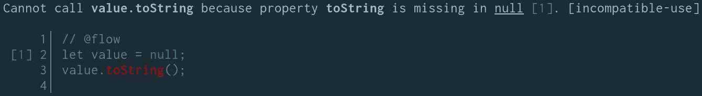
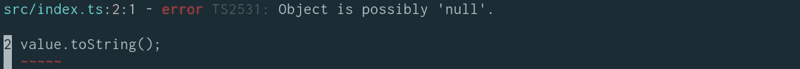
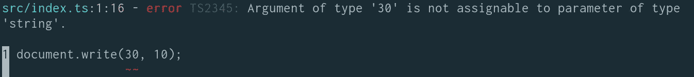
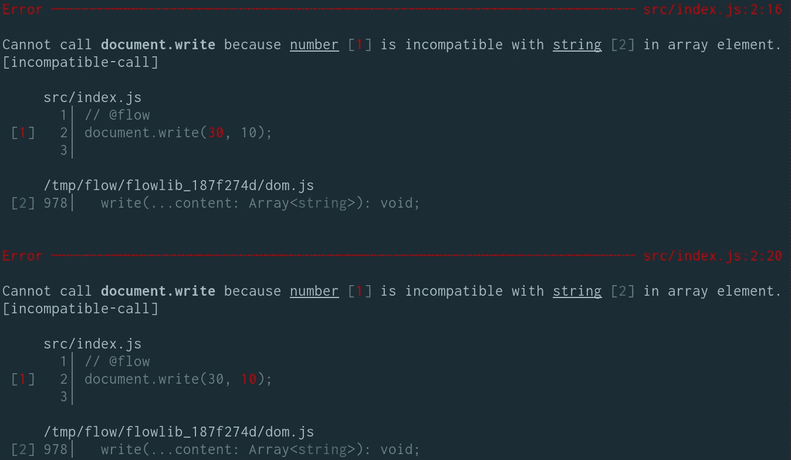

# 在 JavaScript 中键入—流与类型脚本

> 原文：<https://javascript.plainenglish.io/typing-in-javascript-flow-vs-typescript-849ace77db7?source=collection_archive---------2----------------------->

在 [Sulu](https://sulu.io/) 我们已经决定使用 [Flow](https://flow.org/) 进行静态类型检查，我仍然相信当时的决定是正确的。然而，今天的[打字稿](https://www.typescriptlang.org/)似乎是[更受欢迎的选择](https://www.npmtrends.com/flow-bin-vs-typescript)。这种说法也可以得到更早的[博客文章](https://mariusschulz.com/blog/typescript-vs-flow)和[演示的支持](https://djcordhose.github.io/flow-vs-typescript/2016_hhjs.html#/)更多的是关于选择什么，而[更近的](https://sobolevn.me/2019/03/from-flow-to-typescript)是关于如何转换。所以我认为是时候重新考虑这个决定了，因此我将在这篇博文中比较这些类型检查器。

# 什么是静态类型检查？

静态类型检查的目标是在你运行代码之前发现错误。这将为您捕获大量的错误，并有助于交付更高质量的代码。让我们来看一个简短的例子:

```
console.log(5**/**"5");
```

这段代码在语法上是正确的，所以 JavaScript 不会抱怨这一点，直到它执行了那一行代码。因为很明显你不能用一个字符串除一个数，你可能会说你无论如何也不会这样做，但是想象一下`"5"`的值存储在一个变量中，而这个变量的值并不完全清楚，因为它是由 100 行代码决定的。在这种情况下，很容易以某种方式把事情搞砸，而不会马上意识到这一点。**静态类型检查器会在你引入错误的时候告诉你这个错误**，比起一年后在运行时发现这个错误，你更有可能知道哪里出了问题。

现在有不同的方法来应用静态类型检查。许多**编译语言在编译步骤**中会这样做，这意味着如果你的项目中有任何类型错误，程序根本不会编译。这是一个有效的方法，你也将很快知道这个错误。但是你正在失去以稍微不同的方式快速测试做某事的机会，因为你可能必须在编译程序之前调整大量的类型。

JavaScript 不是编译语言，因此它只能在被解释时检查代码，即在运行时。这正是 TypeScript 和 Flow 的用武之地:这些工具允许用类型注释来注释您的 JavaScript 代码，并基于它们检查一切是否能如预期那样工作。然而，您不再编写纯 JavaScript，而是必须以某种方式将其转换为纯 JavaScript，以便浏览器能够理解您的代码。为此，TypeScript 自带编译器，因此 Flow 只需依靠 Babel 来为您去除注释。TypeScript 对于它实现的某些功能需要这个编译步骤，因为严格地说，它不仅仅是一个静态类型检查器。

后一种方法的优点是**你可以用一种类型会失败**的方式来调整代码，但是你可以暂时忽略这一点，如果你只是想快速测试一些东西的话。在编译语言中，你必须首先修复所有的类型错误。现在你可以说程序无论如何都不会像预期的那样运行(虽然这并不完全正确，因为你可能会以一种类型错误无关紧要的方式使用它)，但至少它可以运行到某个点，在那里你可能已经能够做一个`console.log`来检查一些东西。这是我真正喜欢的事情。

另一方面，也有像 PHP 这样的语言，它们在过去的几年里显著地改进了它们的类型系统，但是感觉还是有点奇怪。PHP 可以在许多不同的地方用类型来注释你的代码，但是它不允许在运行前检查这些错误。例如，你可以在一个函数中定义参数必须是一个字符串，但是如果你用一个错误的类型调用这个函数，在这个代码执行之前你不会意识到这一点，在这种情况下你会得到一个运行时错误。在我看来，这是两个世界中最糟糕的，因为在实际运行代码之前你无法判断错误，而且它不允许你快速测试不同类型的东西。公平地说，有像 [PHPStan](https://phpstan.org/) 和 [Psalm](https://psalm.dev/) 这样的工具，它们的工作方式与 TypeScript 和 Flow 类似，但是 PHP 仍然不允许执行错误类型的代码。

# 为什么我们决定使用心流？

我们在 2017 年年中开始重写 Sulu 2.0，并决定使用 Flow 作为我们的静态类型检查器。对我来说很清楚，我们必须使用静态类型检查器，因为它将允许我们更快地发现错误，就好像我们不会使用一样。当时我们可以在 Flow 和 TypeScript 之间选择，但是 TypeScript 有一些缺点。

首先，我们觉得 TypeScript 更像是一种独立的语言，因为它除了类型检查之外还增加了一些特性，比如`[const enum](https://www.typescriptlang.org/docs/handbook/enums.html#const-enums)`。这也是 TypeScript 需要编译器的原因:像这样的特性需要将代码转换成其他东西，并且不能简单地删除它。然而，在玩了一会儿 TypeScript 之后，我不得不说这些特性是可选的，并且在实践中并没有我想象的那么麻烦。此外，Flow 也不是标准的 JavaScript，尽管它可能(可以忽略不计)更接近它。但是远离流会更容易，因为“编译”只是简单地移除类型注释，所以代码甚至会保持其可读性，并且可以使用编译后的版本来代替带注释的版本。

更重要的是， **TypeScript 有自己的生态系统**。例如，没有办法将 TypeScript 与 [ESLint](https://eslint.org/) 集成，但是他们有自己的工具，名为 [TSLint](https://palantir.github.io/tslint/) 。也不支持 Babel，所以你不能轻易添加任何新的 JavaScript 特性，而必须等待 TypeScript 团队在他们的编译器中实现它们。

**虽然这些是我们在 2017 年开始时不使用 TypeScript 的有效理由，但我今天不再认为它们是有效的理由。** TSLint 已经被弃用，取而代之的是 [typescript-eslint](https://github.com/typescript-eslint/typescript-eslint) ，它是将 typescript 的林挺集成到 eslint 中。这太棒了，因为它允许将整个 ESLint 生态系统与 TypeScript 结合使用，就像我最喜欢的 ESLint 插件之一:`[eslint-plugin-jsx-a11y](https://github.com/jsx-eslint/eslint-plugin-jsx-a11y)`。 [Babel 现在也可以用于 TypeScript](https://iamturns.com/typescript-babel/) ，尽管这种使用 TypeScript 的方式并不完善。但是，你仍然可以很容易地将 [CSS 模块](https://github.com/css-modules/css-modules)与 TypeScript 结合使用，这使得 React 的集成更加容易。

# 比较捕获的错误和错误消息

当比较 TypeScript 和 Flow 的默认设置和显示的错误消息时，我仍然支持 Flow，尽管这似乎不再是一个非常流行的观点…让我用几个例子来解释一下:

```
**let** value **=** **null**;
value.toString();
```

很明显，上面的代码将在运行时失败，因为在值`null`上不存在`toString`方法。所以我希望静态类型检查器能警告我类似这样的错误。TypeScript 无法做到这一点，除非在命令行上用`--strictNullChecks`参数调用它(仍然想知道为什么这不是默认的)。但是，即使激活该选项以使 TypeScript 识别该更改，我还是更喜欢 Flow 提供的错误消息:



在比较中检查 TypeScript 错误信息:



流提供了更多有助于定位实际错误的信息。我认为 TypeScript 错误可能会引起误解，因为对象不是“可能为空”，但在我的例子中它肯定为空。这可能有点吹毛求疵，但仍然会把你引向错误的道路。虽然这一点可能有争议，但心流无疑更善于给出更多的上下文。它不仅仅显示错误发生的位置(方法调用`toString`)；此外，它还显示了哪个赋值导致了错误(`let value = null;`)。同样，在这样一个小例子中，这可能不是那么重要，但对于更大的代码片段肯定会有帮助。

对于直接内置在浏览器中的函数也是如此。让我们用下面的例子来看看 TypeScript 是如何处理`document.write`方法的:

```
document.write(30, 10);
```

TypeScript 显示以下错误:



我当时正在为一门课程准备这个简单的例子，这听起来可能很愚蠢，但我确实被这个错误消息绊倒了。我不知道`document.write`在 TypeScript 中被类型化为只接受字符串，我认为这有点令人困惑，因为数字也是以你期望的方式输出的。公平地说， **Flow 以完全相同的方式键入了这个函数，但是仅仅因为它在错误消息中给出了更多的上下文，所以更容易发现错误:**



在它的错误消息流中显示,`document.write`方法被定义为只能用字符串调用，这使得错误更加明显。如果你正在处理的代码库比几行代码大，这种优势会变得更加重要。

# 使用第三方类型

除了类型系统的**严格性(我想确保我的代码没有错误)和错误消息**的**质量(如果代码中有错误，我想尽快找到它们)，我认为查看第三方类型如何集成到类型系统**中是非常重要的。如果你从 NPM 安装一个软件包，这是必要的。如果没有任何类型信息，类型检查器就无法判断您是否正确调用了包的函数。

Flow 和 TypeScript 都有添加库定义文件的机制，但我不想对此深究，因为对我来说重要的是，我不必为我手动使用的每个包编写这些库定义。在这两个类型检查器中，向您的库中添加可以在依赖于这些库的项目中使用的类型不是一个大问题，但是认为每个库都会发生这种情况是非常不现实的。因此，对于大多数 NPM 包类型必须以不同的方式提供。这也是 TypeScript 优于 Flow 的地方。

对于流，有一个`[flow-typed](https://github.com/flow-typed/flow-typed)` [项目](https://github.com/flow-typed/flow-typed)，它是流库定义的中央存储库。我认为“中央”这个词是有问题的。你在某种程度上依赖于一些人来维护这个库(你可以创建 PRs，但是人们必须找到时间来同意你并合并那些东西)，并且以一种好的方式说，集成到你的项目中有点奇怪。`flow-typed`有一个 CLI 工具，它将类型定义从它们的中央存储库中复制到您项目中的一个`flow-typed`文件夹中，您必须将它提交到您的版本控制系统中。

这感觉非常麻烦，特别是因为已经有一个名为 NPM 的中央存储库。我真的不明白为什么不把类型创建成简单的 NPM 包，这样就可以安装和使用，而不需要提交任何东西到我自己的库中。并且**将第三方类型安装为单独的包正是 TypeScript 正在做的事情**。这也是我认为 TypeScript 在这方面更好的原因。

# 结论

我仍然不太确定，这两种类型的系统我应该更喜欢哪一个。TypeScript 已经做了很多改进，特别是关于几年前我们决定反对 TypeScript 的大部分原因。然而， **Flow 似乎仍然更严格，有更好的错误消息，这是类型系统**的两个非常重要的方面。另一方面， **TypeScript 更受欢迎，有更大的社区，处理第三方类型更好。当使用大量第三方包时，Flow 的更严格的优势不知何故失去了。这是因为如果不存在流类型，则流会认为整个第三方代码是无类型的。**

直到最近我还会说 TypeScript 是明显的赢家，但后来我看到 [**流仍在进行**](https://github.com/facebook/flow/commits/master) 。但是他们继续经常引入突破性的变化，这使得更新它成为一项单调乏味的工作(尽管从我的角度来看，大多数变化是有意义的)。TypeScript 仍然是更活跃的项目，并且在所有其他种类的工具中有更好的集成。由于这些原因，我认为 Flow 比 TypeScript 更有可能走到它的生命尽头。

总之，我目前的建议是:

*   不要仅仅为了把你的项目从 Flow 切换到 TypeScript。心流也有一些优势，除非有非常具体的原因，否则这项事业可能不值得。
*   对于新项目，我会选择打字稿。尽管有缺点，但存活的可能性比流量大得多。