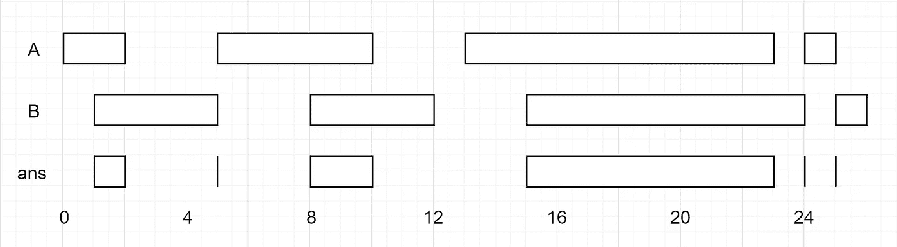

# 优步面试—初级开发人员电话面试技术问题

> 原文：<https://javascript.plainenglish.io/uber-junior-dev-phone-interview-technical-questions-4dd4b43cf1e8?source=collection_archive---------3----------------------->


Source: theladders.com

我最近和一位初级网站开发人员聊过，他在优步的电话面试中经历了一段艰难的时间。我想我会分享我们解决的问题，看看媒体社区是怎么想的！

因为这是针对全栈角色的，所以让我们坚持使用 Javascript 解决方案。类似于我的其他由技术问题组成的博客帖子，在你们中的一些人有机会尝试之后，我将在评论中发布我的解决方案。

## 中等

给定表示分数的分子和分母的两个整数，以字符串格式返回分数。

如果小数部分重复，请用括号将重复部分括起来。

**例 1:**

```
**Input:** numerator = 1, denominator = 2
**Output:** "0.5"
```

**例 2:**

```
**Input:** numerator = 3, denominator = 1
**Output:** "3"
```

**例 3:**

```
**Input:** numerator = 2, denominator = 3
**Output:** "0.(6)"
```

有些人一直在寻求一些提示:

*   这里没有疯狂的高级数学，只要回忆起你漫长的除法日子
*   试着举几个例子来认识一种模式。用 1/3 的重复部分很容易，但是用 4/333 怎么样？你看到模式了吗？
*   在尝试了这些之后，你还会注意到一旦余数开始重复，除法的结果也开始重复。
*   边缘案例会在这里伤害你。认真思考你的测试用例，尽可能多地列出来。测试，测试，测试你的代码！

## 中等

给定两个**闭**区间列表，每个区间列表是成对不相交的，并且是有序的。

返回这两个区间列表的交集。

*(形式上，一个封闭区间* `*[a, b]*` *(用* `*a <= b*` *)用* `*a <= x <= b*` *表示一组实数* `*x*`。两个闭区间的交集是一组实数，要么是空的，要么可以表示为闭区间。比如[1，3]和[2，4]的交集是[2，3]。)

**例 1:**



```
**Input:** A = [[0,2],[5,10],[13,23],[24,25]], B = [[1,5],[8,12],[15,24],[25,26]]
**Output:** [[1,2],[5,5],[8,10],[15,23],[24,24],[25,25]]
**Reminder:** The inputs and the desired output are lists of Interval objects, and not arrays or lists.
```

**注:**

1.  `0 <= A.length < 1000`
2.  `0 <= B.length < 1000`
3.  `0 <= A[i].start, A[i].end, B[i].start, B[i].end < 10^9`

**我在脸书也见过这个问**

试试这两个，看看你在优步的初级开发人员电话面试中表现如何！在我之前的博客文章中，开发人员[在谷歌面试-Javascript 评估](https://medium.com/javascript-in-plain-english/interviewing-at-google-javascript-assessment-questions-f9bf0c0df157?source=your_stories_page---------------------------)、[微软在线评估](https://medium.com/javascript-in-plain-english/microsoft-online-assessment-questions-js-f68ecdb6e927)和[在脸书面试-现场 JavaScript](https://medium.com/javascript-in-plain-english/facebook-on-site-technical-interview-1264cacad263) 都非常有帮助，评论中有一些很好的讨论/解决方案。

祝你好运，评论里见！