# 使用 GraphQL Nexus 的终极身份验证

> 原文：<https://javascript.plainenglish.io/ultimate-authentication-using-graphql-nexus-ec01f79dff2c?source=collection_archive---------1----------------------->

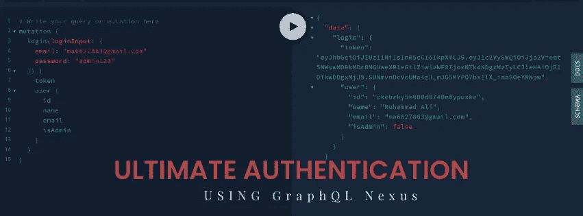

## 如何为您的应用程序制作最终的身份验证样板。我们将使用 graphql-nexus 和 prisma 作为我们的 ORM。

本教程要求您了解 GraphQL 查询、变异和上下文。

## 本教程涵盖以下内容:

1.  注册用户
2.  帐户激活
3.  登录用户
4.  密码重置
5.  脸书登录
6.  谷歌登录
7.  管理员角色(删除用户，获取所有用户)
8.  获取当前用户

## 身份验证和授权需要以下软件包:

1.  bcrypt:这个包用来散列我们密码
2.  jsonwebtoken:这个包使用加密有效载荷，返回用于认证的令牌，我们还可以配置这个令牌持续多长时间。
3.  node-fetch:这个包用来发出一个获取请求
4.  nodemailer:这个包用来发送电子邮件
5.  graphql-middleware:这个包使用中间件来管理多个解析器上附加功能。
6.  graphql-shield:这个包有助于为您的应用程序创建一个权限中间件。

## **安装这些软件包**

```
yarn add bcrypt jsonwebtoken node-fetch nodemailer graphql-middleware graphql-shield google-auth-library
```

## **在这个用户模式中**

1.  id 和电子邮件是唯一的
2.  不像 facebook 和 google 那样每个用户都需要密码。
3.  ResetPasswordToken 用于在重置密码时检查令牌是否过期
4.  isAdmin 默认设置为 false

```
type User {
  id: ID! @id
  name: String!
  email: String! @unique
  password: String
  isAdmin: Boolean @default(value: false)
  resetPasswordToken: String @default(value: "")
  createdAt: DateTime! @createdAt
  updatedAt: DateTime! @updatedAt
} 
```

## **在 GraphQL 服务器中定义上下文**

我们必须为它创建一个上下文类型

```
import { Prisma } from "./generated/prisma-client";

export interface Context {
  prisma: Prisma;
  request: {
    request: {
      headers: {
        authorization: string;
      };
    };
    connection: {
      context: {
        Authorization: string;
      };
    };
  };
}
```

定义上下文类型后，将全局上下文设置为 prisma 和 request，这样我们就可以使用 prisma 方法和请求对象来获取授权令牌。

```
const server = new GraphQLServer({
  context: (req) => {
    return {
      request: req,
      prisma,
    };
  },
});
```

## **为注册创建消息有效负载和注册输入**

为了定义变异，我们需要提供解析器返回负载和参数类型，对于注册，我们必须将 messagePayload 定义为我们的负载，将 signupInput 定义为我们的输入参数。

```
import { inputObjectType, objectType } from "nexus";
export const signupInput = inputObjectType({
  name: "signupInput",
  definition(t) {
    t.string("name", { nullable: false });
    t.string("email", { nullable: false });
    t.string("password", { nullable: false });
  },
});
export const messagePayload = objectType({
  name: "MessagePayload",
  definition(t) {
    t.string("message", { nullable: false });
  },
});
```

因为消息有效负载仅返回字符串形式的成功消息，所以 signpInput 接受由用户名、电子邮件和密码提供的 3 个参数。

## **使用 nodemailer 创建电子邮件服务**

你可以定义任何你想要的提供商，我使用 gmail 作为发送电子邮件的提供商。它只需要电子邮件、gmail 帐户密码和创建传输层的提供商名称。

如果您使用 gmail，请在 gmail 设置中启用不太安全的应用程序。对于激活电子邮件，它需要一个令牌和一个 html，所以当用户可以获得激活电子邮件时，它会看起来很好。ResetPassword 也需要相同的密码，但它用于忘记密码功能。SendEmail 用于实际发送电子邮件。

```
import { createTransport } from "nodemailer";
type Token = string;

const transport = createTransport({
  service: "gmail",
  auth: {
    user: process.env.GMAIL_USER,
    pass: process.env.GMAIL_PASSWORD,
  },
});

export default {
  activationEmail(token: Token) {
    // Compose email
    const html = `Hi there,
      <br/>
      Thank you for registering!
      <br/><br/>
      Please verify your email by clicking the following link:
      <br/>
      On the following page:
      <a target="_blank" href="${
        process.env.CLIENT_URL
      }/auth/activate/${token}">${
      process.env.CLIENT_URL
    }/auth/activate/${token}</a>
      <br/><br/>
      Have a pleasant day.`;
    return html;
  },
  resetPassword(token: Token) {
    const html = `
    <h1>Please use the following link to reset your password</h1>
    <a target="_blank" href="${
      process.env.CLIENT_URL
    }/auth/password/reset/${token}">${
      process.env.CLIENT_URL
    }/auth/password/reset/${token}</a>
    `;
    return html;
  },
  sendEmail(from: string, to: string, subject: string, html: string) {
    return new Promise((resolve, reject) => {
      transport.sendMail({ from, subject, to, html }, (err, info) => {
        if (err) reject(err);
        resolve(info);
      });
    });
  },
};
```

## **创建 generateHashPassword 实用函数**

我们必须从 bcrypt 导入 hash，generatHashPassword 需要一个 arg 密码，首先它检查 8 个字符的有效性，如果无效，它抛出一个错误，如果有效，它散列密码并返回

```
import { hash } from "bcrypt";
const generateHashPassword = (password: String) => {
    if (password.length < 8) {
        throw new Error("Password should be greater than 8 characters");
    }
    return hash(password, 10);
};

export default generateHashPassword;
```

## **创建注册和账户激活突变**

首先，我们必须检查用户传递的电子邮件是否已经与一个帐户相关联，如果是，我们必须抛出一个错误，如果不是，我们必须生成散列密码。在这之后，我们必须创建一个 jwt 令牌。它需要有效载荷、密钥和过期时间。我们在有效载荷中传递电子邮件、姓名和 hashPassword。我们给 token 10 分钟的过期时间。我们必须发送一封帐户激活邮件，为此我们使用了我们之前创建的 sendEmail 服务，最后我们返回消息有效负载。

```
t.field("signup", {
      type: "MessagePayload",
      nullable: false,
      args: {
        signupInput: arg({ type: "signupInput", required: true }),
      },
      resolve: async (_, { signupInput: { name, email, password } }, ctx) => {
        try {
          const isUserExist = await ctx.prisma.$exists.user({ email });
          if (isUserExist) {
            throw new Error("Email is already associated with another user");
          }
          const hashPassword = await generateHashPassword(password);
          const token = sign(
            {
              name,
              email,
              password: hashPassword,
            },
            process.env.JWT_ACCOUNT_ACTIVATION,
            {
              expiresIn: "10m",
            }
          );
          const html = mailService.activationEmail(token);
          await mailService.sendEmail(
            process.env.EMAIL_FROM,
            email,
            "Account activation",
            html
          );
          return {
            message: `Email has been sent to ${email}. Follow the instruction to activate your account`,
          };
        } catch (error) {
          throw new Error(error.message);
        }
      },
    });
```

向用户成功发送电子邮件后，激活用户的时间到了，accountActivation 也有一个 messagePayload 解析器返回类型，它需要 token 作为参数。首先，我们使用 verify jwt 方法检查令牌是否过期，如果没有过期，我们解码名称、电子邮件和 hashPassword 以成功创建用户并返回消息有效负载。

```
t.field("accountActivation", {
      type: "MessagePayload",
      nullable: false,
      args: {
        token: stringArg({ required: true }),
      },
      resolve: async (_, { token }, ctx) => {
        try {
          if (!token) {
            throw new Error("No token for activation");
          }
          const decoded = verify(token, process.env.JWT_ACCOUNT_ACTIVATION);
          const { name, email, password } = decode(token) as {
            name: string;
            email: string;
            password: string;
          };
          await ctx.prisma.createUser({
            name,
            password,
            email,
          });
          return {
            message: "Signup success. Please signin.",
          };
        } catch (error) {
          throw new Error(error.message);
        }
      },
    });
```

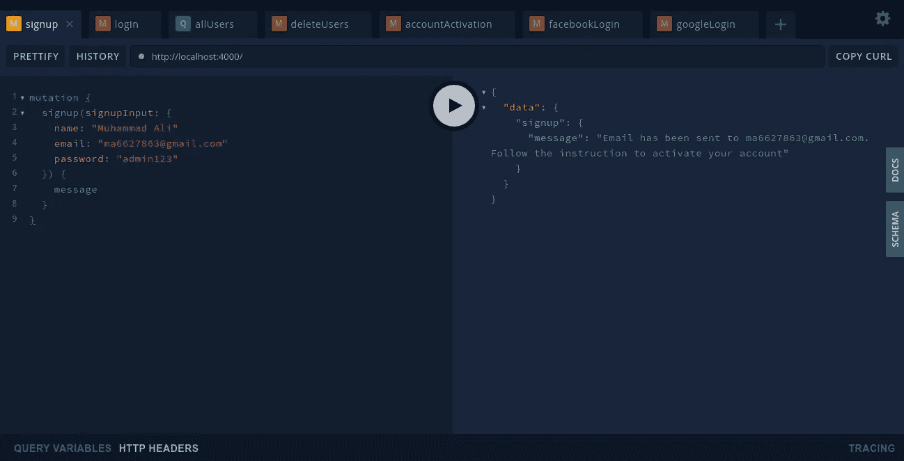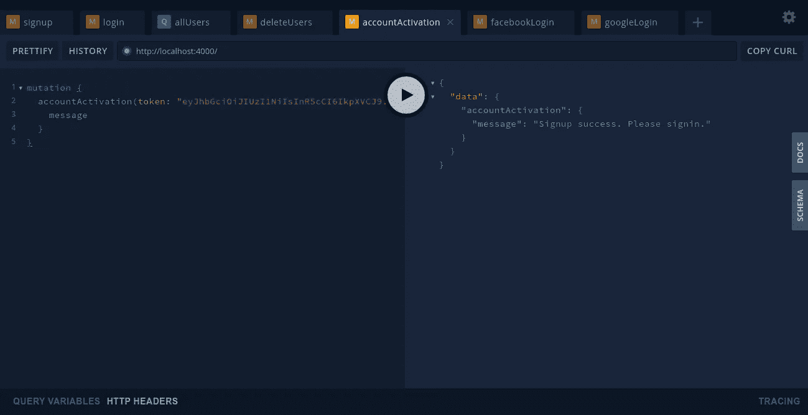

## **为登录突变创建 LoginInput，AuthPayload】**

我们必须创建 loginInput，它以字符串形式定义电子邮件和密码。接下来，我们为解析器返回类型创建一个 AuthPayload。AuthPayload 返回一个令牌和一个用户。我们还将用户类型定义为只返回这些字段。

```
export const User = prismaObjectType<"User">({
  name: "User",
  definition(t) {
    t.prismaFields(["id", "email", "name", "isAdmin"]);
  },
});export const loginInput = inputObjectType({
  name: "loginInput",
  definition(t) {
    t.string("email", { nullable: false });
    t.string("password", { nullable: false });
  },
});export const AuthPayload = objectType({
  name: "AuthPayload",
  definition(t) {
    t.string("token", { nullable: false });
    t.field("user", {
      type: "User",
      nullable: false,
    });
  },
});
```

## **创建一个 generateToken 实用函数**

我们必须提供一个 userId 作为有效负载、一个密钥和一个生成令牌的过期时间。

```
import { sign } from "jsonwebtoken";
const generateToken = (userId: String) => {
    const token = sign(
        {
            userId,
        },
        process.env.JWT_SECRET,
        {
            expiresIn: "7d",
        }
    );
    return token;
};

export default generateToken;
```

## **创造登录变异**

我们必须检查所提供的电子邮件是否与帐户相关联，然后我们将 hashPassword 与所提供的密码进行比较。我们检查验证，如果失败，抛出一个错误，如果不返回 AuthPayload。

```
t.field("login", {
      type: "AuthPayload",
      nullable: false,
      args: {
        loginInput: arg({ type: "loginInput", required: true }),
      },
      resolve: async (_, { loginInput: { email, password } }, ctx) => {
        const user = await ctx.prisma.user({
          email,
        });
        if (!user) {
          throw new Error("User not exist");
        }
        const isPasswordMatch = await compare(password, user.password);
        if (!isPasswordMatch) {
          throw new Error("Password not correct");
        }
        return {
          user,
          token: generateToken(user.id),
        };
      },
    });
```

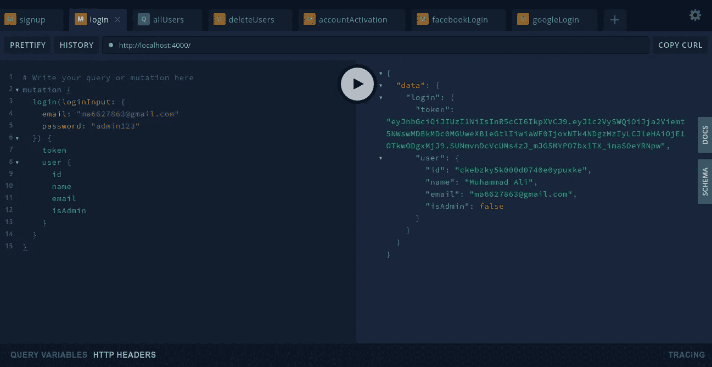

## **创建忘记密码突变**

它还返回一个 messagePayload，并需要一个用户电子邮件作为输入参数。我们必须检查用户提供的电子邮件是否与帐户相关联，然后我们为有效负载生成一个带有用户 id 和名称的令牌。这个令牌持续 10 分钟。之后，我们向用户发送一封电子邮件，并将 resetPasswordToken 更新为生成的令牌。最后我们返回 messagePayload。

```
t.field("forgotPassword", {
      type: "MessagePayload",
      nullable: false,
      args: {
        email: stringArg({ required: true }),
      },
      resolve: async (_, { email }, ctx) => {
        try {
          const user = await ctx.prisma.user({
            email,
          });
          if (!user) {
            throw new Error("User not exist");
          }
          const token = sign(
            {
              _id: user.id,
              name: user.name,
            },
            process.env.JWT_RESET_PASSWORD,
            {
              expiresIn: "10m",
            }
          );
          const html = mailService.resetPassword(token);
          await ctx.prisma.updateUser({
            where: {
              id: user.id,
            },
            data: {
              resetPasswordToken: token,
            },
          });
          await mailService.sendEmail(
            process.env.EMAIL_FROM,
            email,
            "Password Reset",
            html
          );
          return {
            message: `Email has been sent to ${email}. Follow the instruction to reset your password`,
          };
        } catch (error) {
          throw new Error(error.message);
        }
      },
    });
```

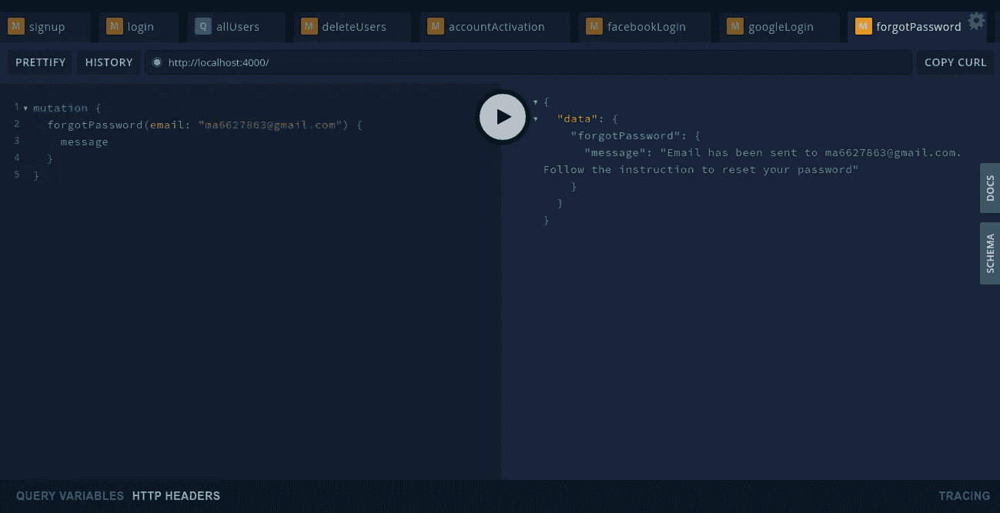

## **创建重置密码输入和变异**

ResetPassword 输入将两个字段 resetPasswordToken 和 newPassword 作为字符串类型。

```
export const resetPasswordInput = inputObjectType({
  name: "resetPasswordInput",
  definition(t) {
    t.string("resetPasswordToken", { nullable: false });
    t.string("newPassword", { nullable: false });
  },
});
```

ResetPassword 变异返回消息负载，并要求将 resetPassword 输入作为参数。首先，我们必须检查用户提供的 resetPasswordToken 是否与用户相关联，如果不是，它将抛出一个错误，如果存在，它将返回一个用户。我们对新密码进行哈希运算，并将用户密码和 resetPasswordToken 更新为空字符串。最后我们返回一个消息负载。

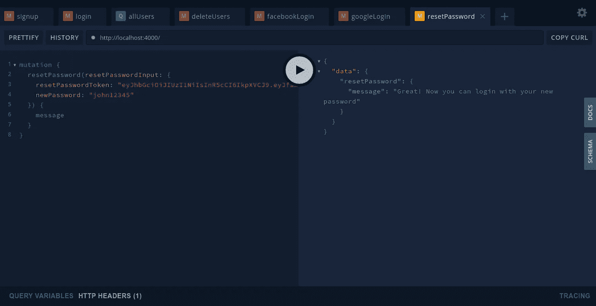

## **创建脸书登录输入和变异**

脸书登录输入将 accessToken 和 userId 定义为字符串类型。变异将 AuthPayload 作为解析器返回类型返回。用于测试目的的 AccessToken 和 userId 可以从 [Graph api explorer](https://developers.facebook.com/tools/explorer/) 获得，在此之前你必须在 [facebook 开发者控制台](https://developers.facebook.com/)上创建一个应用

```
export const facebookLoginInput = inputObjectType({
  name: "facebookLoginInput",
  definition(t) {
    t.string("userId", { nullable: false });
    t.string("accessToken", { nullable: false });
  },
});
```

我们必须将 userId 和 accessToken 传递给 graph api，并从中获取数据。姓名和电子邮件应该从响应中返回，我们必须首先检查电子邮件是否已经与帐户相关联。如果它已经存在，返回授权有效负载，如果不是，我们创建一个新用户的电子邮件和密码，并返回授权有效负载。

```
t.field("facebookLogin", {
      type: "AuthPayload",
      nullable: false,
      args: {
        facebookLoginInput: arg({ type: "facebookLoginInput", required: true }),
      },
      resolve: async (
        _,
        { facebookLoginInput: { userId, accessToken } },
        ctx
      ) => {
        try {
          const url = `https://graph.facebook.com/v2.11/${userId}/?fields=id,name,email&access_token=${accessToken}`;
          const response = await fetch(url, {
            method: "GET",
          });
          const data = (await response.json()) as {
            name: string;
            email: string;
            // error: {
            //   message: string;
            // };
          };
          if (response.status !== 200) {
            throw new Error("Something went wrong");
          }
          const { email, name } = data;
          const user = await ctx.prisma.user({
            email,
          });
          if (!user) {
            const newUser = await ctx.prisma.createUser({
              name,
              email,
            });
            return {
              user: newUser,
              token: generateToken(newUser.id),
            };
          }
          return {
            user,
            token: generateToken(user.id),
          };
        } catch (error) {
          throw new Error(error.message);
        }
      },
    });
```

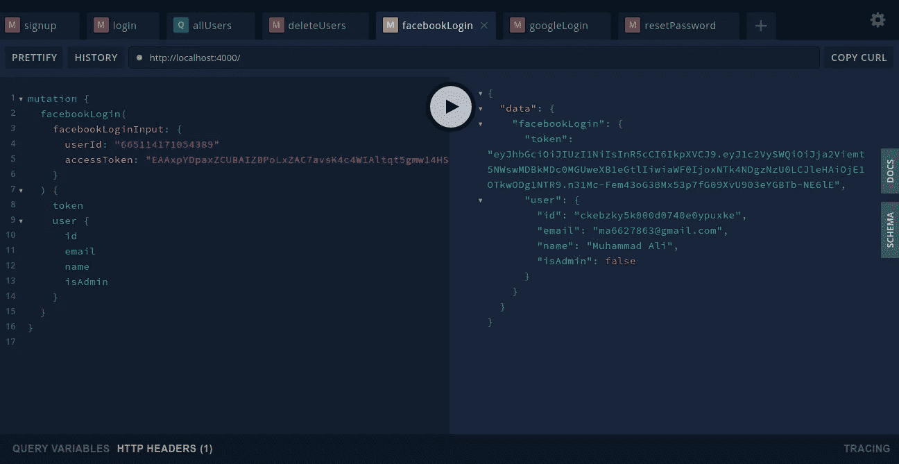

## **创建一个谷歌登录输入和变异**

对于google 登录，我们使用 google-auth-library npm 包。它需要一个客户端 id 进行设置。从谷歌云平台获取客户端 id 很简单，按照这个[https://support.google.com/cloud/answer/6158849?hl=en](https://support.google.com/cloud/answer/6158849?hl=en)

```
import { OAuth2Client } from "google-auth-library";
const client = new OAuth2Client(process.env.GOOGLE_CLIENT_ID);
```

我们将 idToken 定义为 google 登录输入的字符串。

```
export const googleLoginInput = inputObjectType({
  name: "googleLoginInput",
  definition(t) {
    t.string("idToken", { nullable: false });
  },
});
```

Google 登录突变也返回一个 AuthPayload，它与 facebook 登录突变相同。

```
t.field("googleLogin", {
      type: "AuthPayload",
      nullable: false,
      args: {
        googleLoginInput: arg({ type: "googleLoginInput", required: true }),
      },
      resolve: async (_, { googleLoginInput: { idToken } }, ctx) => {
        try {
          const { email_verified, email, name } = (await client.verifyIdToken({
            idToken,
            audience: process.env.GOOGLE_CLIENT_ID,
          })).getPayload();
          if (email_verified) {
            const user = await ctx.prisma.user({
              email,
            });
            if (!user) {
              const newUser = await ctx.prisma.createUser({
                name,
                email,
              });
              return {
                user: newUser,
                token: generateToken(newUser.id),
              };
            }
            return {
              user,
              token: generateToken(user.id),
            };
          }
        } catch (error) {
          throw new Error(error.message);
        }
      },
    });
```

由于 google 不像 facebook 那样提供测试用户，如果您的客户端是基于 react 构建的，那么您必须为它设置一个客户端，使用 [react-google-login](https://www.npmjs.com/package/react-google-login) 作为响应返回 idToken。

## **创建一个 getUserId util 和当前用户查询**

对于 getUserId 实用程序，它只需要上下文。从请求头中获取授权令牌，并使用 jwt verify 方法检查它是否有效。如果超过 7 天，它可能会过期，因为我们设置令牌在登录时应该持续 7 天。如果您的应用程序有订阅，请取消对这 3 行的注释。

```
import { verify } from "jsonwebtoken";
import { Context } from "../types";
interface Token {
  userId: string;
}
export const getUserId = (context: Context) => {
  // const authTokenWithBarer = context.request.request
  //   ? context.request.request.headers.authorization
  //   : context.request.connection.context.Authorization;
  const authTokenWithBarer = context.request.request.headers.authorization;
  if (authTokenWithBarer) {
    const token = authTokenWithBarer.split(" ")[1];
    const user = verify(token, process.env.JWT_SECRET) as Token;
    return user && user.userId;
  }
};
```

对于当前用户查询，我们将用户定义为解析器返回类型。用户仅返回 id、姓名、电子邮件和 isAdmin，因为我们之前定义了这些 prisma 字段。从实用函数中获取 userId，并从这个 Id 中获取用户。

```
t.field("currentUser", {
      type: "User",
      nullable: false,
      resolve: async (parent, args, ctx) => {
        const userId = getUserId(ctx);
        const user = await ctx.prisma.user({ id: userId });
        return user;
      },
    });
```

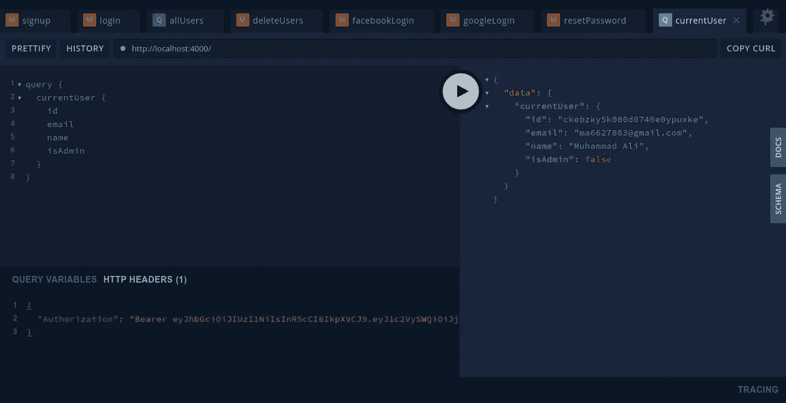

## **创建获取所有用户和删除用户功能**

所有用户的查询和变异只能由管理员访问。对于 admin，您必须在数据库中手动将 isAdmin 设置为 true。所有用户查询返回用户列表，您可以传递用户名进行过滤，但它是一个可选参数。我们将所有用户解析器类型设置为用户。

```
t.list.field("allUsers", {
      type: "User",
      nullable: false,
      args: {
        searchNameString: stringArg({ nullable: true }),
      },
      resolve: (parent, { searchNameString }, ctx) => {
        return ctx.prisma.users({
          where: {
            name_contains: searchNameString,
          },
        });
      },
    });
```

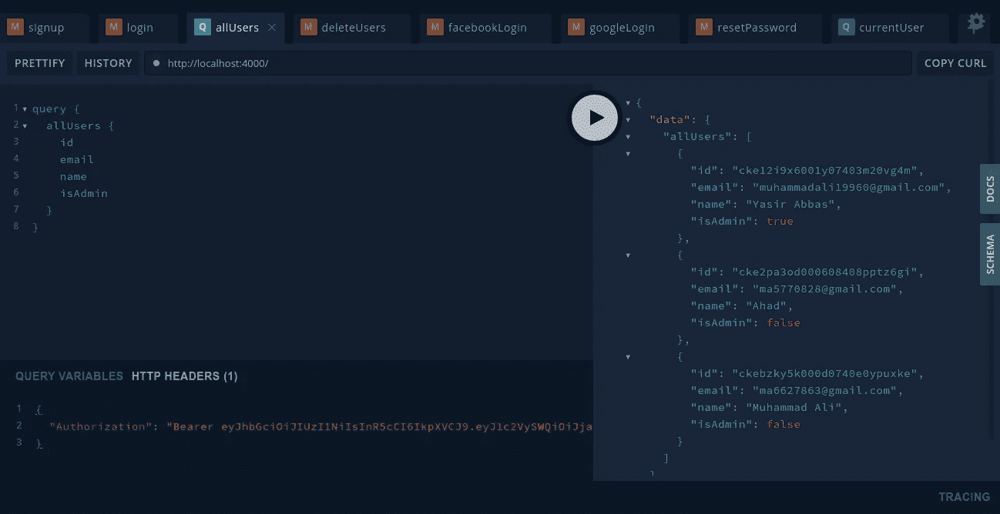

对于删除用户，我们将删除用户输入定义为在一个数组中获取用户 id

```
export const deleteUserInput = inputObjectType({
  name: "DeleteUserInput",
  definition(t) {
    t.list.id("id", { required: true });
  },
});
```

我们将删除用户解析器返回类型定义为消息有效负载。这种变异需要一个删除用户输入，因为它是一个用户 id 数组。

```
t.field("deleteUsers", {
      type: "MessagePayload",
      nullable: false,
      args: {
        ids: arg({ type: "DeleteUserInput", required: true }),
      },
      resolve: async (parent, { ids }, ctx) => {
        await ctx.prisma.deleteManyUsers({
          id_in: ids.id,
        });
        return {
          message: "Delete users successfully",
        };
      },
    });
```

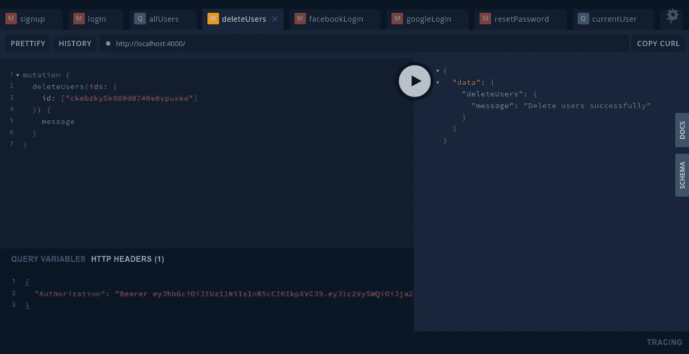

## **定义授权规则**

我们必须为查询和变异定义规则，因此只有管理员或经过身份验证的用户才能访问它。我们使用 graphql-shield 来定义规则。我们定义了两个规则 isUserAuthenticated 和 isAdmin，并为查询和变异创建了一个屏蔽。对于 currentUser 查询，它只需要 isAuthenticatedUser，但是对于 get all users，它还需要 isAdmin。对于突变删除，用户只需要 isAdmin 角色

```
import { rule, shield } from "graphql-shield";
import { getUserId } from "../utils/getUserId";
import { Context } from "../types";

const rules = {
  isAuthenticatedUser: rule()((parent, args, ctx: Context) => {
    const userId = getUserId(ctx);
    return Boolean(userId);
  }),
  isAdmin: rule()(async (parent, args, ctx: Context) => {
    const userId = getUserId(ctx);
    const isAdmin = await ctx.prisma.$exists.user({
      id: userId,
      isAdmin: true,
    });
    return isAdmin;
  }),
};
export const middlewares = shield({
  Query: {
    currentUser: rules.isAuthenticatedUser,
    allUsers: rules.isAdmin,
  },
  Mutation: {
    deleteUsers: rules.isAdmin,
  },
});
```

定义许可标准后，将这个中间件传递给全局 graphQL 服务器。为此，我们使用了 [graphql 中间件](https://www.npmjs.com/package/graphql-middleware)

```
import { applyMiddleware } from "graphql-middleware";
import { middlewares } from "./middlewares";const server = new GraphQLServer({
  schema: applyMiddleware(schema, middlewares),
  context: (req) => {
    return {
      request: req,
      prisma,
    };
  },
});
```

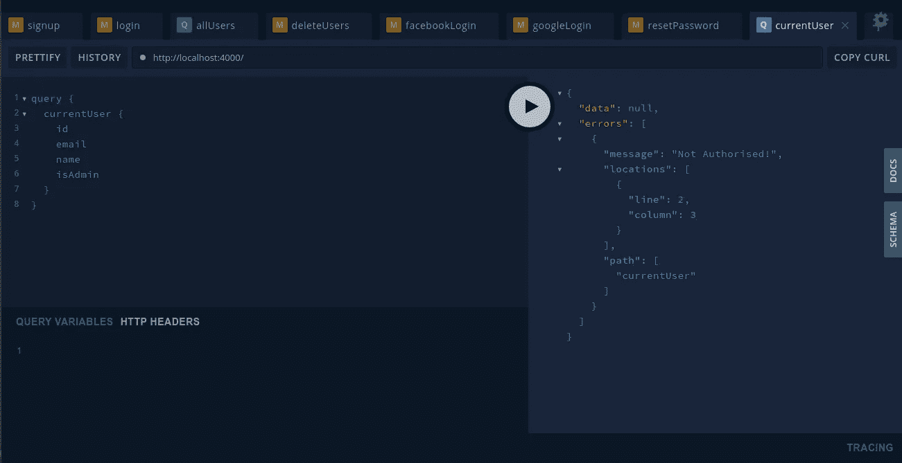

## **结论**

在本教程中，我们介绍了 GraphQL Nexus 中的认证和授权。了解许多图书馆 JWT，bcrypt，graphQL 盾。这将有助于您实现身份验证。我的主要目的是建立一个终极的生物模板，我希望它有所帮助。

下面是这个终极认证【https://github.com/muhammadali448/ultimate_auth
的完整代码的链接

我想知道你对最佳方法的反馈，因为有这么多的方法，如果我们可以进一步改善它。