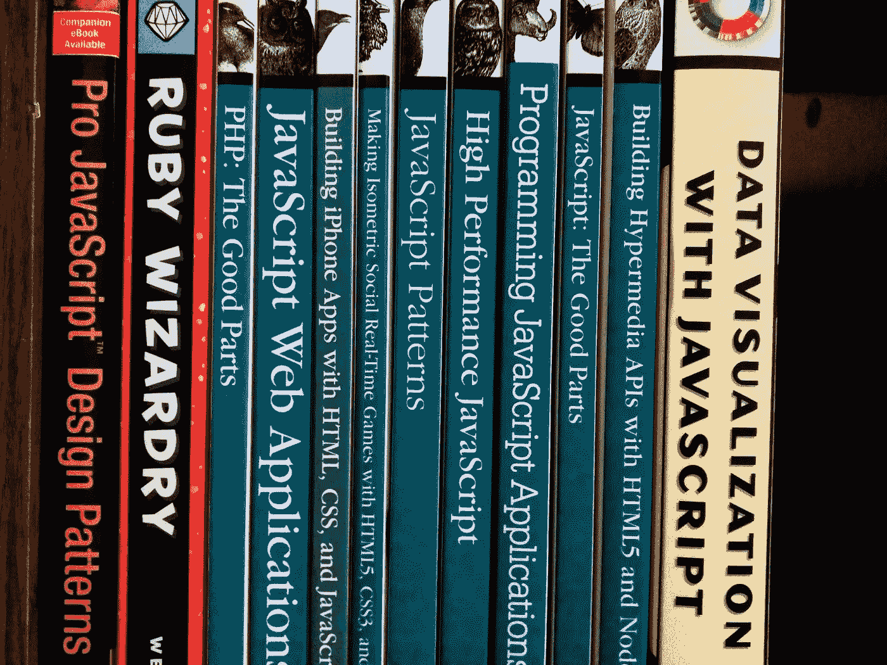

# 每个程序员都应该知道的终极 JavaScript 资源！

> 原文：<https://javascript.plainenglish.io/ultimate-javascript-resources-that-every-programmer-should-know-9889d4fd691?source=collection_archive---------0----------------------->

Random Collection of JavaScript Books

# 0 级:-婴儿阶段

> JavaScript 的基本概念

## **理解语法:-**

> 这个阶段的目标是 JavaScript 的语法和基本特性。

> 要理解一个语法，选择一个*视频课程*，你可以很容易地选择语法的&阅读这些书(只为了理解 JavaScript 的基本性质):-

1.  [***JavaScript 与 JQuery:交互式前端 Web 开发***](https://www.wiley.com/en-us/JavaScript+and+JQuery%3A+Interactive+Front+End+Web+Development-p-9781118531648)***——****作者 Jon Duckett****{ { * * * }***

2. [***JavaScript:好的部分***](http://shop.oreilly.com/product/9780596517748.do)***——****作者道格拉斯·克洛克福特****{ { * * }***

> ***视频课程*** :-在[**上完成**初级**水平的 JavaScript 课程 PluralSigh *t***](https://www.pluralsight.com/) (最受欢迎){ { {*但是包月费用很高}}或者选择另一个我们在本文中提到的在线视频课程。*

## *深入理解基本概念:-*

> *主题:*JavaScript 的基本概念，如变量、类型、循环、函数、数组、模板字符串&等(JavaScript 语言的所有基本概念)**

*   **书籍**

> */*星代表强烈推荐的书籍*/*

1.  *[***说 JavaScript —程序员的深入指南***](http://speakingjs.com/es5/)***—****作者:博士* *阿克塞尔·劳施迈尔****{ { * * }****
2.  *[***为缺乏耐心的程序员编写的 JavaScript***](http://exploringjs.com/impatient-js/)***——****作者 Axel raushmayer***{ { * * * * } }
    (****基础概念巨著&排除第 1 级的高级概念* ***)*****
3.  *[***You-don-know-Js***](https://github.com/getify/You-Dont-Know-JS)***—****作者凯尔·辛普森****{ * * * } }
    (****为****0 级*** *— Ydkj- Up &走，类型&语法* ***，****
4.  **[***探秘 ES-2015、16、17、18***](http://exploringjs.com/index.html)***——****作者阿克塞尔·劳施迈尔博士****{ { * * }
    (****涵盖话题按级别***
5.  ***[***雄辩的 JavaScript******——****作者马金****{ { * * }
    (****封面第 1-5 章为 0 级&其余章节为下一级****)***](https://eloquentjavascript.net/)***
6.  ***[***JavaScript CookBook***](http://shop.oreilly.com/product/9780596806149.do)***——****作者 Shelley Powers****{ { * * * } }
    (****这本书对 JavaScript****)***最复杂的问题都有非常简化的答案***
7.  ***[***JavaScript:权威指南***](https://www.amazon.com/JavaScript-Definitive-Guide-Activate-Guides/dp/0596805527/ref=as_li_ss_tl?ie=UTF8&redirect=true&linkCode=ll1&tag=eejs-20&linkId=11a79cf9e89a54625cb3a8e8ff2dc8d5) *作者大卫·弗拉纳根****{ { * * }******
8.  ***[***JavaScript 启蒙***](http://www.javascriptenlightenment.com/)——*作者科迪林德利* ***(****封面第 1-5 章为 0 级&其余章节为下一级* ***)******

*   ****视频教程****

> ***一些视频教程涵盖了 0 级和 1 级***

1.  ***[***ES6 给大家—学习现代 JavaScript 的最佳途径***](https://es6.io/)—*By WesBos****{ * * * * } }******
2.  ***[***JavaScript:理解怪异的部分***](https://www.udemy.com/understand-javascript/)***——****作者安东尼·阿里恰****{ { * * * }******
3.  ***[***完整 JavaScript 课程 2019:搭建真实项目！***](https://www.udemy.com/the-complete-javascript-course/)——*乔纳斯·施梅特曼****{ { * * * * } }******
4.  ***[***ES6 Javascript:完全开发者指南***](https://www.udemy.com/javascript-es6-tutorial/)***——****作者斯蒂芬·格里德****{ { * * }******

*   ****网站(供参考)****

1.  ***[***JavaScript | MDN***](https://developer.mozilla.org/bm/docs/Web/JavaScript)***(Mozilla 开发者网){{*}}******
2.  ***[***【现代 Javascript 教程】***](https://javascript.info/)***

*   ****网站(练习用)****

1.  ***[***CoderByte***](https://www.coderbyte.com/)***(****费用高昂:* ***)******
2.  ***[***FreeCodeCamp***](https://www.freecodecamp.org/)***(****free****)******
3.  ***[***leet code***](https://leetcode.com/)***(****费用高昂:* ***)******
4.  *******(****自由* ***)*******
5.  ***[***web training center***](http://www.webtrainingcentre.com/javascript-exercises/)***(****free****)******
6.  ***[***特大项目清单***](https://github.com/karan/Projects)***(***[*卡兰*](https://github.com/karan) */* [*项目*](https://github.com/karan/Projects) *: 100 个 JavaScript 项目* **)*****
7.  ***[***Pramp***](https://www.pramp.com/#/)***(*******)*******
8.  ***[***JavaScript-geek 4 geek***](https://www.geeksforgeeks.org/javascript-tutorial/)***(****免费* ***)******

# ***级别 1:子阶段***

> ***JavaScript 的高级概念***

> ***主题: *DOM、作用域&闭包、异步/等待、回调、映射、深层对象、承诺、垃圾收集、代理、生成器、集合、代码质量&其他一些高级概念。****

*   ****书籍****

1.  ***[***JavaScript 忍者的秘密***](https://www.manning.com/books/secrets-of-the-javascript-ninja)***——****作者约翰·雷西格和贝尔·比贝奥特****
2.  ***[***编程 JavaScript 应用***](https://www.oreilly.com/library/view/programming-javascript-applications/9781491950289/)***——****作者 Eric Elliott****{ * * * } }******
3.  ***[***多姆启蒙***](http://domenlightenment.com/)——*科迪林德利* ***{{***}}******
4.  ***[***JavaScript&DOM 技巧、诀窍和技术***](https://www.impressivewebs.com/javascript-dom-tips-tricks-techniques-ebook/)***——****作者:路易拉扎****{ { * * }******
5.  ***[***DOMscripting***](https://domscripting.com/book/)***——****作者杰瑞米·凯斯****{ { * * }******
6.  ***[***面向 Web 开发者的专业 JavaScript***](http://www.wrox.com/WileyCDA/WroxTitle/Professional-JavaScript-for-Web-Developers-3rd-Edition.productCd-1118222199.html)**—作者 Nicholas c . Zakas****{ { * * * }*******
7.  ***[***高性能 JavaScript:构建更快的 Web 应用程序接口***](http://shop.oreilly.com/product/9780596802806.do) *—作者 Nicholas c . Zakas****{ { * * }******
8.  ***[***Pro JavaScript 性能:监控与可视化***](https://www.apress.com/in/book/9781430247494) *—作者 Tom Barker****{ * * * * } }******
9.  ***[***JavaScript _ Challenges _ Book***](https://github.com/tcorral/javascript-challenges-book)***—****By***[*t corral*](https://github.com/tcorral)****{ { * * }*********
10.  *****[***有效 JavaScript: 68 种驾驭 JavaScript 力量的具体方法***](https://www.amazon.com/Effective-JavaScript-Specific-Software-Development/dp/0321812182/ref=as_li_ss_tl?ie=UTF8&redirect=true&linkCode=ll1&tag=eejs-20&linkId=4c5500843ce7dc958e290bdaeebd739b)****{ { * } }*********

*   ******视频教程******

1.  *****[***高级 JavaScript***](https://www.udemy.com/javascript-advanced/)*—由阿西姆·侯赛因****{ * * * } }********
2.  *****[***全 JavaScript & ES6 教程***](https://www.udemy.com/es6-in-depth/)*——(包括 ES7&React)——作者大卫·约瑟夫·卡茨****{ { * * }********
3.  *****[***清洁代码:为人类编写代码***](https://www.pluralsight.com/courses/writing-clean-code-humans)***——****由科里屋****{ { * * } }********

# *****第二阶段:青少年阶段*****

> *****JavaScript 最佳实践和设计模式*****

> *****主题:面向对象的 JavaScript(OOPS)，函数式编程(FP)，异步 JavaScript(AJAX)，JavaScript 最佳实践，JavaScript 设计模式&使用 JavaScript 的数据结构。*****

*   ******书籍******

1.  *****[***【面向对象的 JavaScript 原理】***](https://nostarch.com/oojs) *—作者尼古拉斯·c·扎卡斯* ***{{***}}********
2.  *****[***学习 JavaScript 设计模式***](https://addyosmani.com/resources/essentialjsdesignpatterns/book/)*-By Addy Osmani****{ { * * * } }********
3.  *****[***测试驱动的 JavaScript 开发***](https://github.com/aisuhua/books-1/blob/master/tdd%20%2B%20bdd/Test-Driven%20JavaScript%20Development.pdf)*****
4.  *****[***JavaScript 模式***](http://shop.oreilly.com/product/9780596806767.do) *—作者斯托扬·斯特凡诺夫******
5.  *****[***面向对象 JavaScript***](https://www.packtpub.com/web-development/object-oriented-javascript) *—由斯托扬·斯特凡诺夫* ***{{***}}********

*   ******视频教程******

1.  *****[***高级-Js-定制-图表***](https://frontendmasters.com/courses/d3-js-custom-charts/)**—作者:吴雪莉****{ { * * }*********
2.  *********高级 JS {{***}}*********
3.  *****[***JavaScript 设计模式专家代码***](http://JavaScript Design Patterns: 20 Patterns for Expert Code) *—由 Packt 出版******
4.  *****[***JavaScript 中的硬核函数式编程***](https://frontendmasters.com/courses/functional-javascript/)**—作者布莱恩·朗斯多夫*******
5.  *****[***Pentesters 的 Javascript***](https://www.pentesteracademy.com/course?id=11)*—Pentesters Academy******
6.  *****[***设计模式库***](https://www.pluralsight.com/courses/patterns-library)**—plural sight****{ { * * * }*********

> *****注意:阅读 Diff 开发人员的最佳实践*****

# *****第三级:成人阶段*****

> *****根据需要选择框架。*****

> *****对于前端— Angular.js，React。Js，Vue。Js。
> 用于后端—节点。Js，Express.Js.
> 数据库— MongoDB，PostgreSQL。
> 其他——一饮而尽。Js，Web-pack，不同库的使用*****

# *****JavaScript 开发人员的其他资源:*****

> *****对 JS 程序员来说很重要的网站和 GitHub 库。*****

1.  *****[***mbeaudru***](https://github.com/mbeaudru)***/***[***modern-js-cheat sheet***](https://github.com/mbeaudru/modern-js-cheatsheet)*{ { cheet sheet for JavaScript } }。******
2.  *****[***micro mata***](https://github.com/micromata)***/***[***awesome-javascript-Learning***](https://github.com/micromata/awesome-javascript-learning)**{ {一份小小的清单仅限最好的 JavaScript 学习资源}}。*******
3.  *****[***免费 JavaScript 图书库***](https://jsbooks.revolunet.com/)**{*[*revolunet*](https://github.com/revolunet)*/*[*JSbooks*](https://github.com/revolunet/JSbooks)*} }。*******
4.  *****[***JavaScript 状态***](https://stateofjs.com/)*{ { JavaScript 状态}}。******
5.  *****[***trekhleb***](https://github.com/trekhleb)***/***[***JavaScript-algorithms***](https://github.com/trekhleb/javascript-algorithms)*{ { JavaScript s algorithms } }。******
6.  *****[***13 游戏 in ≤ 13kB 的 JavaScript js13k Games 2018***](https://github.blog/2018-10-05-js13kgames-highlights-2018/)*{ {带 JavaScript 的游戏}}。******
7.  *****[***30 秒***](https://github.com/30-seconds)***/*【[***30 秒代码***](https://github.com/30-seconds/30-seconds-of-code) *{{一个精选的有用的 JavaScript 片段集合，你可以在 30 秒或更短的时间内理解}}。********
8.  *****[***dypsilon***](https://github.com/dypsilon)***/***[***frontend-dev-bookmarks***](https://github.com/dypsilon/frontend-dev-bookmarks)*{ {为前端 web 开发者手动精选的资源集合。}}.******
9.  *****[***sorrycc***](https://github.com/sorrycc)***/***[***牛逼-javascript***](https://github.com/sorrycc/awesome-javascript)*{ {一个牛逼的浏览器端 JavaScript 库、资源和闪亮的东西的集合}}。******
10.  *****[***super hero . js***](http://superherojs.com/)*{ {网站资源满}}。******
11.  *****[***【jnv】***](https://github.com/jnv)***/***[***列表***](https://github.com/jnv/lists)*{ { GitHub 上始乱终弃的最终列表列表}}。******
12.  *****[***归档为‘JavaScript’类别***](https://www.phpied.com/category/javascript/)*{ { JavaScript 文章}}。******
13.  *****[***redom***](https://github.com/redom)***/***[***redom***](https://github.com/redom/redom)*{ { Tiny(2kb)turbo boosted JavaScript 库用于创建用户界面。}} .******
14.  *****[***ericdouglas***](https://github.com/ericdouglas)***/***[***ES6-学习***](https://github.com/ericdouglas/ES6-Learning)**{ {学习 ECMAScript 6 的资源列表！}} .*******
15.  *****[***MTD VIO***](https://github.com/mtdvio)***/***[***每个程序员都应该知道的***](https://github.com/mtdvio/every-programmer-should-know) *{{每个软件开发人员都应该知道的(大部分)技术东西的集合}}。******
16.  *****[***JavaScript 运算符优先级和结合性表。***](https://medium.com/@js_tut/javascript-operator-precedence-and-associativity-table-71ee154079c)*****
17.  *****[***leonardomso***](https://github.com/leonardomso)***/***[***33-js-concepts***](https://github.com/leonardomso/33-js-concepts)*{ {每个 JavaScript 开发者都应该知道的 33 个概念}}。******

**********

*****Photo by [dhe haivan](https://unsplash.com/@dhehaivan?utm_source=medium&utm_medium=referral) on [Unsplash](https://unsplash.com?utm_source=medium&utm_medium=referral)*****

> *****最后，请分享你对这篇文章的看法，并分享你用来练习 JavaScript 的书籍、网站和教程等资源。*****
> 
> *****你的简报会帮助更多的程序员。:)*****

> *****找到有用的东西了？按住👏来支持和帮助别人找到这篇文章。感谢阅读！！
> 在 Instagram 上关注我[@ hypnosiss _ _](https://www.instagram.com/hypnosisss___/?hl=en)*****