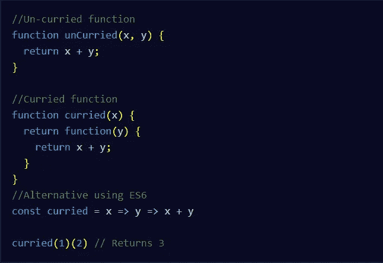

# 理解 JavaScript 中的函数式编程

> 原文：<https://javascript.plainenglish.io/understand-functional-programming-in-javascript-57840c4edc8?source=collection_archive---------3----------------------->

## JavaScript 中的函数式编程

Photo by [Clément H](https://unsplash.com/@clemhlrdt?utm_source=medium&utm_medium=referral) on [Unsplash](https://unsplash.com?utm_source=medium&utm_medium=referral)

# 什么是函数式编程？

**函数式编程**是一种基于函数评估的软件开发方法。它将程序分成小的、可测试的部分。你可以用多种方式组合基本功能来构建越来越复杂的程序。函数式编程也使得调试和维护程序变得更加容易。

Photo by [Shahadat Rahman](https://unsplash.com/@hishahadat?utm_source=medium&utm_medium=referral) on [Unsplash](https://unsplash.com?utm_source=medium&utm_medium=referral)

# 函数式编程原则

**函数式编程**遵循几个核心原则，其中一个原则是函数独立于程序的状态或全局变量。它们依赖于传递给它们的参数。函数式编程的另一个原则是函数在程序中的副作用最小。除此之外，他们试图限制对程序状态的任何更改，避免对保存数据的全局对象的更改。

Photo by [Luca Bravo](https://unsplash.com/@lucabravo?utm_source=medium&utm_medium=referral) on [Unsplash](https://unsplash.com?utm_source=medium&utm_medium=referral)

# 了解命令式代码的使用

在人类说的语言中，祈使句用于发出命令。类似地，编程中的命令式风格是给计算机一组执行任务的语句。函数式编程是声明式编程的一种形式。你通过调用一个方法或函数来告诉计算机你想做什么。JavaScript 提供了许多方法来完成所有这些工作，例如，一个 **filter** 方法接受一个函数，在这个函数中你告诉这个方法你想从一个数组中过滤什么，或者一个 **map** 方法返回一个新数组。

Photo by [Caspar Camille Rubin](https://unsplash.com/@casparrubin?utm_source=medium&utm_medium=referral) on [Unsplash](https://unsplash.com?utm_source=medium&utm_medium=referral)

# 固化和局部应用

**Currying** 一个函数就是把它从一个有几个参数的函数转换成几个只有一个参数的函数。看看下面的例子:

Currying a function in JavaScript

如果你不能一次给一个函数提供所有的参数，Currying 在你的程序中是有用的。

现在我们来看一下**部分应用**，可以描述为一次对一个函数应用几个参数，返回另一个应用到更多参数的函数。这里有一个例子:

Partial Application.

# 结论

**函数式编程**是个好习惯。它使您的代码易于管理，并使您免于偷偷摸摸的错误。当使用 JavaScript 或其他编程语言时，这是一种强大的方法。所以这只是一个了解函数式编程如何工作的介绍，你可以从网上的其他资源中了解更多。