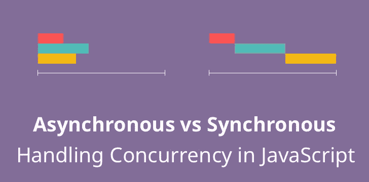

# 通过文件读取了解 JavaScript 中异步和同步方法的区别

> 原文：<https://javascript.plainenglish.io/understand-how-asynchronous-and-synchronous-methods-differ-in-javascript-through-file-reading-fa90134a990c?source=collection_archive---------3----------------------->

大多数 JavaScript 方法包括`setTimeout`、`process.nextTick`异步工作**。**不过，有些方法可以同时**和**使用(即 fs 模块)

> 让我们比较 JavaScript 中的异步和同步方法，以及何时使用异步和同步方法



# >首先，让我们使用 fs 模块读取一个文件

*   让我们来读一个名为 **readme.txt** 的文件

*readme.txt*

```
please read me many times!
```

*   让我们制作一个 **readFile.js** 文件来读取文件 3 次

readFile.js

*   让我们运行代码

```
$ node readFile
```

*   查看它的输出

```
start
end
first please read me many times!
third please read me many times!
second please read me many times!
```

> ?????

```
start
end
third please read me many times!
first please read me many times!
second please read me many times!
```

> ?????

```
start
end
third please read me many times!
second please read me many times!
first please read me many times!
```

***以上所有输出正确***

*   除了`start` & `end`之外，输出的顺序可以不同
*   每次运行时，输出都不同

# 异步读取文件


*   输出是不同的，因为上面的代码使用异步方法
*   异步方法要求**后台**读取文件并继续下一个任务。换句话说，它 3 次请求读取文件并执行`console.log('end')`
*   然后**后台**通知**主线程**，这时**主线程**最终执行注册的回调方法

**异步方法的优势**

*   异步方法有利于处理数百个 I/O 请求，因为**主线程**将其任务委托给**后台**
*   **一旦**后台**完成每个 I/O 请求，主线程**就可以完成它的工作

# 非阻塞、阻塞、异步、同步的定义


```
In node.js, Sync method often pairs with Blocking method **(Sync - Blocking)** Async method often pairs with NonBlocking method **(Async - NonBlocking)**Sync - Blocking method keeps checking whether the background task is completed or not and returns **only** when the background work is doneAsync - NonBlocking method does not care whether the background task is completed or not and a called function returns immediately to move on to the next task
```

# 同步读取文件

使用**readfilesync()**而不是 **readFile()** 读取文件

readFile.js

*   让我们运行代码

```
$ node readFile
```

*   查看它的输出

```
start
first please read me many times!
second please read me many times!
third please read me many times!
end
```

**异步方法的区别**

*   使用 readFileSync()而不是 readFile()
*   **console.log** 返回值代替使用回调函数
*   输出按顺序打印

**同步方法的问题**

*   对于数百个请求有一个性能问题，因为下一个任务需要**等待**前一个任务完成，并且只能在前一个任务完成后**执行**
*   换句话说，**主线程**除了等待什么也不做，而**后台**在工作**【低效】**


Photo by [Product School](https://unsplash.com/@productschool?utm_source=medium&utm_medium=referral) on [Unsplash](https://unsplash.com?utm_source=medium&utm_medium=referral)

> 您:我想使用异步方法提高效率，但也想按顺序打印(console.log)

readFile.js

*   让我们运行代码

```
$ node readFile
```

*   查看它的输出

```
start
end
first please read me many times!
second please read me many times!
third please read me many times!
```


**解决方案—回调**

*   如你所料，解决方案是回调。放置下一个 **readFile()** 作为对前一个 **readFile()** 的回调
*   ES6 引入**承诺** & **异步/等待**解决回调地狱(左图)