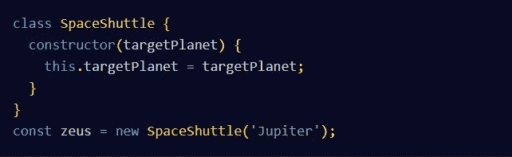
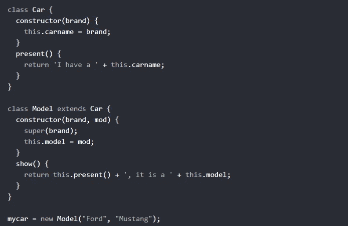
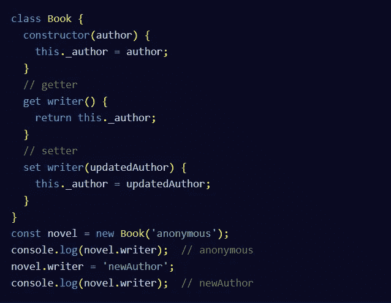

# 了解 JavaScript 类

> 原文：<https://javascript.plainenglish.io/understand-javascript-classes-fc6c7dc30949?source=collection_archive---------11----------------------->

## 用实际例子理解 JavaScript 类

Image by Mehdi Aoussiad.

# 什么是 JavaScript 类？

按照 **MDN** 的说法，JavaScript 类就是创建对象的模板。它用处理数据的代码封装数据。JavaScript 中的类是建立在原型之上的，它们有简单的语法。在 **ECMAScript 2015** 版本中引入的类。

Photo by [Christopher Gower](https://unsplash.com/@cgower?utm_source=medium&utm_medium=referral) on [Unsplash](https://unsplash.com?utm_source=medium&utm_medium=referral)

# 创建一个 JavaScript 类:

为了创建一个 JavaScript 类，我们声明了一个**类**关键字，其中包含一个**构造函数**方法。当调用`**new**`创建一个新对象时，这个构造函数被调用。看看下面的例子:

JavaScript Class.

*注意，按照惯例，对于 ES6 类名应该使用 UpperCamelCase，就像上面使用的* `***SpaceShuttle***` *一样。*

# 类继承

在 JavaScript 中，如果一个类有一个子类，它将被称为**超类**，子类将被称为**子类**。因此子类可以从超类继承方法和属性。让我们创建一个名为“Model”的类，它将继承“Car”类的方法:

Class Inheritance.

注意，我们使用了**扩展**关键字来确保我们想要继承父类的属性和方法。`**super()**`方法是指父类。通过在构造函数方法中调用它，我们可以调用父类的构造函数方法，并访问父类的属性和方法。

# Getters 和 Setters

使用 Getters 和 Setters，您可以设置或获取对象中的属性值。下面的例子解释了一切。

Getters and Setters inside a JavaScript Class.

*注意，在私有变量的名字前加下划线(* `***_***` *)是一种约定。但是，这种做法本身并不会使变量成为私有变量。你现在可以通过使用* `*#*` *在类中创建私有变量——我建议你在使用之前进一步阅读这方面的内容。*

# 结论

JavaScript 中的类非常有用，因为它们有漂亮且易于理解的语法。使用它们会比使用 ES5 构造函数更有效。所以这篇文章只是介绍如何在 JavaScript 中使用类，你可以从其他资源中学到更多。