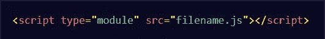
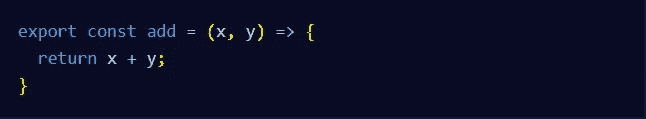
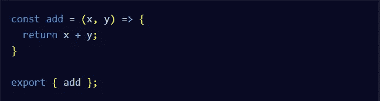
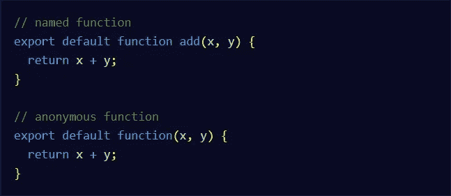

# 理解 JavaScript 模块:导入和导出语法

> 原文：<https://javascript.plainenglish.io/understand-javascript-modules-import-and-export-syntax-f231c5e2fafd?source=collection_archive---------6----------------------->

## 通过实际例子理解 JavaScript ES6 模块

Photo by [Danial RiCaRoS](https://unsplash.com/@ricaros?utm_source=medium&utm_medium=referral) on [Unsplash](https://unsplash.com?utm_source=medium&utm_medium=referral)

# 什么是 JavaScript 模块？

今天，由于技术的进步以及庞大的用户数量，万维网变得巨大而复杂。许多网站几乎完全是用 JavaScript 构建的。所以为了让 JavaScript 更模块化，更干净，更易维护；ES6 引入了一种在 JavaScript 文件间轻松共享代码的方法。我们可以通过使用 **JavaScript 模块**来实现这一点，它有助于导出一个文件的一部分，以便在一个或多个其他文件中使用，并且能够将您的代码部分导入任何其他文件。

Photo by [Christopher Robin Ebbinghaus](https://unsplash.com/@cebbbinghaus?utm_source=medium&utm_medium=referral) on [Unsplash](https://unsplash.com?utm_source=medium&utm_medium=referral)

# 创建模块脚本:

为了使用 JavaScript 模块，您必须告诉浏览器您正在使用 JavaScript 文件内部的模块。你可以通过把下面的脚本放在你的 HTML 的 head 标签里面来实现。

Module Script.

# 使用导出来共享代码块:

假设您想要在几个不同的文件中使用一个代码块，您可以通过导出该代码块，然后将其导入其他文件来实现。看看下面的例子，我们在其中导出了 add 函数。

Exporting the add function.

您也可以通过下面的示例实现同样的目的:

Exporting the add function.

# 使用导入重用 JavaScript 代码:

假设您想要导入我们刚刚导出到另一个名为:( **math_functions.js)的 JavaScript 文件中的 add 函数。**你可以通过下面的例子做到这一点:

Importing the add function.

# 使用*从文件导入所有内容:

假设您有一个文件，并希望将其所有内容导入到当前文件中。这可以用`**import * as**`语法来完成。下面是一个例子，名为`**math_functions.js**`的文件的内容被导入到同一目录下的一个文件中:

Import Everything from a file.

上面的`**import**`语句将创建一个名为`**myMathModule**`的对象。这只是一个变量名，你可以给它起任何名字。该对象将包含从`**math_functions.js**`导出的所有内容，因此您可以像访问任何其他对象属性一样访问这些函数。

# 导出默认值:

仅当从文件中导出一个值或一个函数时，才可以使用导出默认值。

Export Default.

# 导入默认导出:

您可以使用 import 语法导入默认导出。以下示例从 **math_functions.js** 文件导入默认导出。

Import a Default Export.

# 结论:

如您所见，模块化 JavaScript 允许您导入和导出 JavaScript 代码。它将你的代码分解成更小粒度的文件，这样可以节省时间并使你的代码更容易理解。这就是这篇文章，我希望你今天学到了一些新的东西。