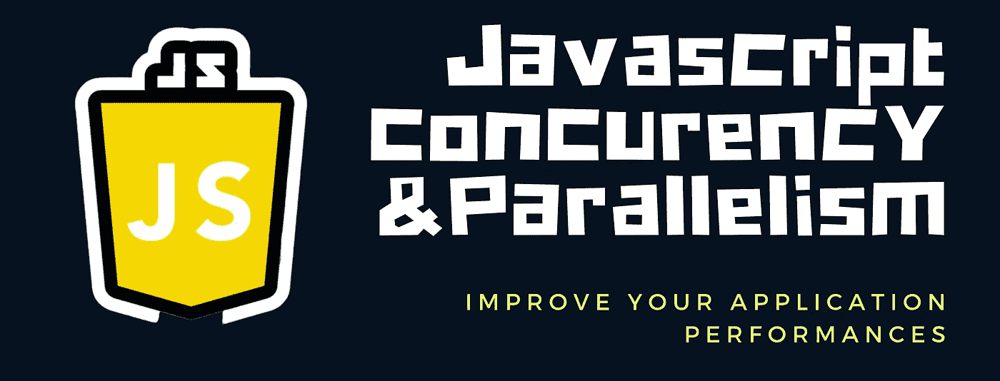
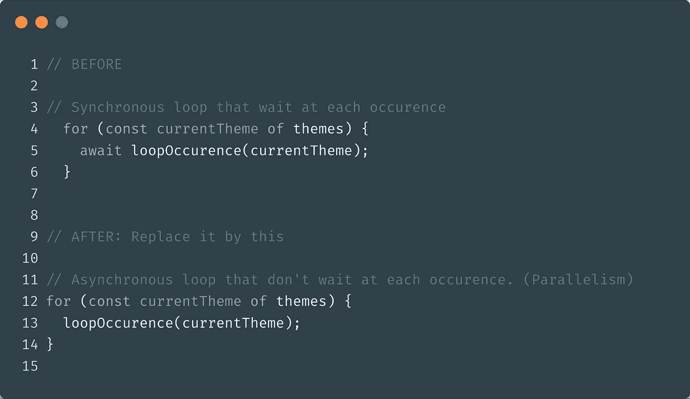
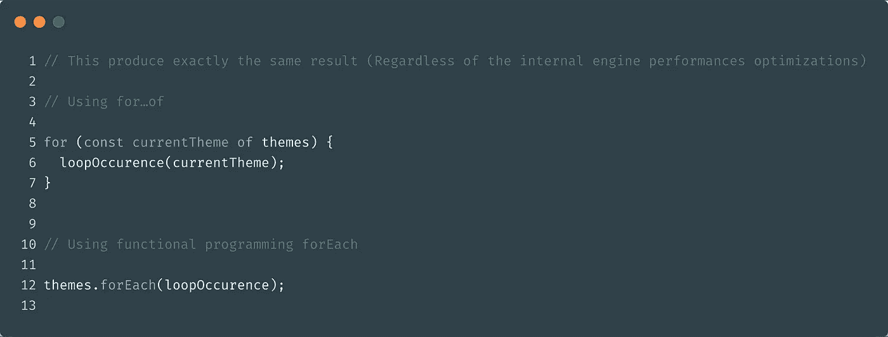

# 理解 JavaScript 排序和异步行为，以利用代码并行性。

> 原文：<https://javascript.plainenglish.io/understand-javascript-sequencing-and-asynchronous-behaviors-to-leverage-code-parallelism-1e381fa8d33c?source=collection_archive---------4----------------------->

## Javascript 的基础知识

## 关于异步性以及如何利用 JS 并发模型提高应用程序的性能和响应能力的小指南。



JavaScript 使用的是单线程并发模型，本文将给出一些想法和例子来理解 JS 中并发的基础。

我们将通过两个演示来研究这一点:第一个是顺序的同步循环执行，然后是并行的异步循环。

# 🗓摘要

1.  **🛫线程和并发的基础知识**
2.  **📌JavaScript 并发模型和代码并行的异步行为**
3.  **🚀示例:JavaScript 中的异步循环与同步循环**

# 🛫线程和并发基础

**简短扼要:**使用 C 或 Java 等传统语言时，有时你会做一些需要 CPU 计算时间的事情。

**在此期间，您不能执行当前指令之外的其他代码。当这个操作完成时，你的程序可能会冻结，UI 可能根本没有响应。**

这是完全正常的，你将不得不处理它。

**➡️如何避免 UI 冻结？**

为了解决这个问题，你可以使用一个叫做**的线程**，它允许你在子进程中委托一些代码执行。由于多线程，这导致了非阻塞操作和并行代码执行。

**这是标准/以前语言中代码并行性和并发性的基础。**

**并发是编程的一个复杂章节**，尤其是对于初学者。在这里我就不深究了。上面的例子足以理解后面的内容，因为 JavaScript 不是多线程语言。

**所以:**

> ***❓How 用 JavaScript 处理并发问题？***

# 📌代码并行的 JavaScript 并发模型和异步行为

正如你在上面看到的，JavaScript 使用的是单线程语言，这适用于任何 JS 引擎实现，比如 Chrome 的 [V8](https://en.wikipedia.org/wiki/V8_(JavaScript_engine)) 、苹果 Safari 的 [JavaScriptCore](https://en.wikipedia.org/wiki/JavaScriptCore) 或脸书 React native 的 [Hermes](https://hermesengine.dev/) 。

> ***❓What 是什么意思？***

这意味着 JavaScript 一次只能执行一个任务，并且每个任务都要排队等待处理。

但是正如我们在上面看到的，有时你需要一次做多件事情，或者你会有一些指令需要花费很多秒来处理，这将导致由于线程阻塞而导致的冻结。

## **⚙️但 Javascript 没有多线程**

所以处理这个问题的唯一方法是**以某种方式将代码执行委托给一个外部处理程序，继续执行脚本，然后在执行完成后执行一个回调代码。**

这就是引擎在事件循环中实现的功能。

**JavaScript 可以使用内核提供的一些原生函数将异步行为委托给 OS** 。

大多数情况下，这些都是 IO 指令，但也可能是其他指令。

*   对于网络浏览器，你有`fetch`或`setTimeout`作为例子。
*   对于 NodeJS，有`readFile`或`writeFile`作为例子，它们代表系统 IO。

一旦调用这样的动作，系统就接受命令，在子进程中执行自己命令的所有指令…

## JavaScript 事件循环⚙️

一旦完成，系统将调用你的程序:**这是著名的 JS 事件循环的一部分。**

如果你不知道这是怎么回事，你可以查看这里:[https://medium . com/front-end-weekly/JavaScript-event-loop-explained-4c d26 af 121d 4](https://medium.com/front-end-weekly/javascript-event-loop-explained-4cd26af121d4)。

**💣快速&简而言之:**事件循环是程序运行时无限循环的引擎序列，它将按照给定的特定顺序执行队列中的语句。

这些语句由代码函数和回调指令提供。

**回调指令**提供一些在系统完成异步代码执行后需要执行的代码，比如读取系统上的一个文件。

我们说回调指令，但事实上，它可以是:

*   **回调函数**，一旦被调用，将从操作系统接收参数
*   或者 **JavaScript 承诺**解决或拒绝(以 async-await 为例)

✋🏻⚠️ *我不会在这里展开什么承诺，你可以看看这个写得非常好的指南:*[***https://developers . Google . com/web/fundamentals/primers/promises***](https://developers.google.com/web/fundamentals/primers/promises)

# 🚀示例:JavaScript 中的异步循环与同步循环

在下面的例子中，我们将通过一系列主题来演示使用异步行为的阻塞循环和非阻塞循环之间的区别。

该数组包含主题，对于每个主题，我们需要:

1.  从远程 API 获取数据…
2.  然后在文件中写一些东西。

**✋🏻⚠️ *下面所有的代码都提供了存根函数，它们只是使用 JS Promise 延迟了函数返回语句。这产生了与将代码执行推迟到系统相同的行为。***

[**你还可以看看什么是**](https://developer.mozilla.org/en-US/docs/Web/JavaScript/Reference/Statements/async_function)`[**async**](https://developer.mozilla.org/en-US/docs/Web/JavaScript/Reference/Statements/async_function)` [**/**](https://developer.mozilla.org/en-US/docs/Web/JavaScript/Reference/Statements/async_function)`[**await**](https://developer.mozilla.org/en-US/docs/Web/JavaScript/Reference/Statements/async_function)`[**这里的**](https://developer.mozilla.org/en-US/docs/Web/JavaScript/Reference/Statements/async_function)

为了使用下面的代码片段，您需要创建一个`index.js`文件，将代码片段复制到其中，并运行一个`npm init -y && npm install chalk`，以获得这个小的实用程序库，它在控制台中提供文本颜色。

简单地用`node ./index.js`运行脚本

## ❶第一方法:同步代码执行

我们从同步方法开始，只要被调用的函数没有返回，这个方法就会使用带有`await`关键字的异步函数来阻塞循环内的执行。

**💡提示:** *其实这并不是你所期待的真正同步。使用* `*await*` *只会确保代码在函数中按顺序执行。每当你* `*await*` *时，你就让其他事情发生，然后在某个时候继续你等待的事情。*

这导致以下假设:

*   顺序程序执行
*   不存在的代码并行性
*   保证对于每个主题，在进入下一个迭代之前，API 调用已经返回，并且文件已经尝试写入成功/失败。

Synchronous behavior using async

虽然对于某些用例来说，当内容对彼此有副作用时，这有时可以很好地保证排序，但是在下面的用例中，这不是实现这个目标的最佳方式。

通过在 NodeJS 程序中运行以下脚本，您可以看到，与延迟持续时间相比，总的脚本执行时间相当长，但是随着我们进行链接，花费的时间呈线性增长。

## ❷第二种方法:异步代码执行和并行

由于我们的每个主题值在依赖性和副作用方面互不相关，**我们的** **回调** `**loopOccurence**` **几乎是一个纯函数**，**因为它对我们的应用程序没有副作用。**(作为一个真正的纯函数，它不应该有任何副作用)

> ***👨🏻‍🔬*** 纯函数是指采用相同参数的函数，每次都会产生并返回相同的结果。这个函数也不会在其范围之外产生任何副作用。

正因为如此，我邀请您看看如果您删除前面代码片段中的关键字`await`会发生什么，如下所述。



Enabling and leveraging parallelism thanks to our pure function loopOccurence

💡`async` / `await`关键字是**控制函数执行流程的工具。**删除`await`关键字告诉解释器在进入下一个循环迭代之前不要等待函数响应。

**这种方法利用了并行性**，因为 JS 引擎同时发送三个请求。

**💡提示:** *哦对了，我忘了，你没有在循环内部使用* `*await*` *但是这并不意味着你根本不需要*`*await*`****事实上，你需要处理错误并确保一切顺利完成。我们将在下一节看到这一点。****

*这些都是很好的工具，尽可能多地使用它们。*

*➡️欢迎异步和并行。*

***应用程序的性能和响应能力得到了极大的提高**，我们仍然可以通过首先等待获得 API 调用返回状态，然后创建文件，来保持每个主题循环内部的顺序。*

*从执行时间来看，这比我们的第一种方法要好得多。*

*为什么？因为 JS 委托并行执行，所以脚本可以更快地访问其他指令(在我们的例子中是循环迭代)，这导致了更好的性能。*

## *🎁好处:对每个指令使用函数式编程*

*我们也可以用函数式编程中的一个名为`forEach`的函数来替换我们的`for…of`循环。结果将与您在这里看到的完全一样。*

***💡** [**想了解更多关于 forEach 函数的知识？点击这里！**](https://developer.mozilla.org/en-US/docs/Web/JavaScript/Reference/Global_Objects/Array/forEach)*

**

*Using functional programming we are achieving the same goal of parallelism*

## *⚡️🔓最安全、最有效的方式:地图+承诺*

*事实上，我忽略了一些真正重要的东西，比如确保一切正常运行和处理错误。*

*您可以使用函数式编程`map`函数和`Promise.all`函数的组合来改进上面的代码片段。*

*第一个将有助于映射将传递给第二个的承诺。第二个将接收一个承诺数组，如果给定数组中的任何承诺失败，它将快速失败。这是您的错误处理场景。*

```
*const everythingOk = await Promise.all(themes.map(loopOccurence));*
```

# *🚛外卖/TLDR；📦*

*JavaScript 应用程序运行在单线程上。您将需要使用异步机制来处理这个单线程属性。*

*异步机制利用 JavaScript **回调**和**承诺**。*

*`async` / `await`关键字是**控制函数内执行流程的工具。***

*通过使用**并行**，使用异步可以**极大地提高应用程序的性能和响应能力**。*

*在循环指令中:你可以使用`forEach`或者`for…of`语句来获得异步迭代。另一方面:您可以将`for…of`与`await`关键字或`[generators](https://medium.com/javascript-in-plain-english/how-i-used-javascript-generators-to-create-a-casino-game-cards-shuffler-fef4f796110f)` [一起使用，以在函数](https://medium.com/javascript-in-plain-english/how-i-used-javascript-generators-to-create-a-casino-game-cards-shuffler-fef4f796110f)中同步执行代码。*

## *🙏🏻感谢*

*Reddit 的人们帮助我改进了这篇开始有点笨拙的文章。*