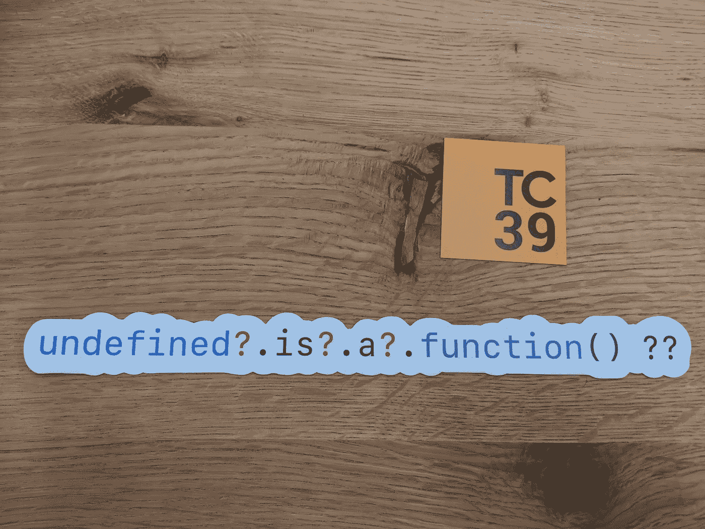

# 理解 JavaScript 中可选链接的强大功能

> 原文：<https://javascript.plainenglish.io/understand-the-superpower-of-optional-chaining-in-javascript-fbc569244471?source=collection_archive---------1----------------------->

## 了解如何使用即将推出的 JavaScript 特性可选链接

`?.` → **可选链接运算符**



Image from twitter by [**Daniel Rosenwasser**](https://twitter.com/drosenwasser) **(@**[Daniel Rosenwasser](https://medium.com/u/4cc5dbe0f6cc?source=post_page-----fbc569244471--------------------------------)**).**

# 可选链接

可选链接将消除手动检查属性在对象中是否可用的需要。使用可选的链接，检查将在内部完成。

没有可选链接的示例。

```
function sayHi(user) { let name = user.name.toUpperCase(); console.log(`Hi Mr. ${name}`);}
```

考虑上面的函数，它将打印带有用户名的`hi`消息

```
var user1 = { name : "John"};sayHi(user1); // Hi Mr.JOHN.
```

当我们传递一个没有属性的`user`对象时

```
sayHi({}); // TypeError: Cannot read property 'toUpperCase' of undefined.sayHi();// TypeError: Cannot read property 'name' of undefined.
```

为了解决以上问题我们所做的是，我们将添加检查`name`属性是否在用户对象中可用

# 使用可选链接

可选的链接将检查留给操作符的对象是否有效(非空和未定义)。如果该属性有效，则执行操作符的右边部分，否则返回`undefined`

基本示例

```
function sayHi(user) {
   let name = ( **user?.name?.toUpperCase()** ) || "unKnown";
   console.log(`Hi Mr. ${name}`);
}
```

上述可选链接操作符的本地 JavaScript 等价代码是

```
**(property == undefined || property == null) ? undefined : property**
```

# 使用变量作为属性名

我们可以在可选链接中使用变量作为属性名

```
var user = {name : "John", age : 20};var Age = "age";**user?.[Age];**// We can also use with expressions **user?.["a"+"ge"]**
```

# 具有可选链接的函数调用

您可以使用可选的链接来调用可能不存在的方法。

```
var user = {
    name : "John",
    getName() {
      return this.name;
    }
}**user?.getName?.();**
```

参考: [MDN](https://developer.mozilla.org/en-US/docs/Web/JavaScript/Reference/Operators/Optional_chaining) 。

跟随 [Javascript Jeep🚙💨](https://medium.com/u/f9ffc26e7e69?source=post_page-----fbc569244471--------------------------------)。

[](https://sitepoint.tapfiliate.com/p/payout-methods/new/) [## 登录|站点点

### 不支持的浏览器虽然我们的跟踪技术支持旧的浏览器，不幸的是我们的网站不支持…

sitepoint.tapfiliate.com](https://sitepoint.tapfiliate.com/p/payout-methods/new/)