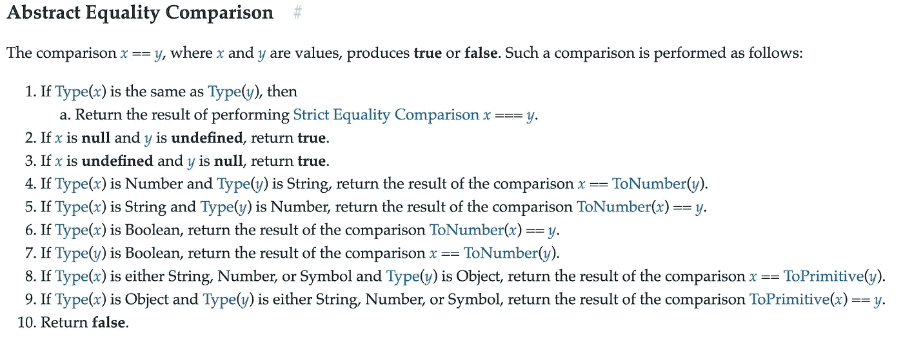
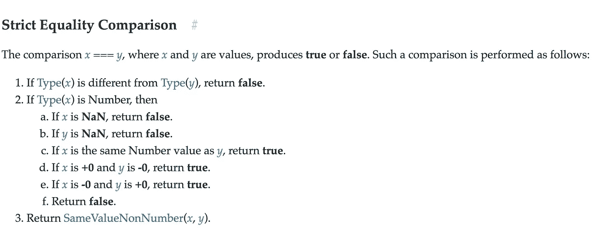
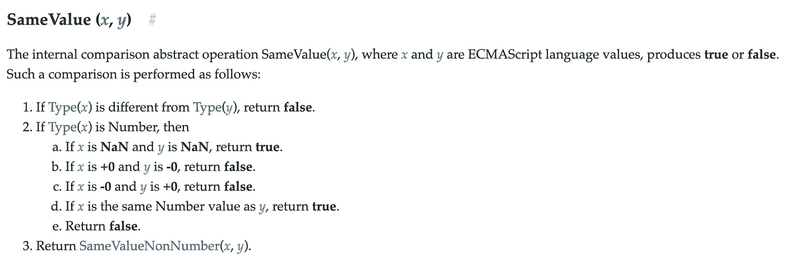

# 了解 JavaScript 中三种不同的值相等比较算法。

> 原文：<https://javascript.plainenglish.io/understand-the-three-different-value-equality-comparison-algorithm-in-javascript-718f421b5549?source=collection_archive---------3----------------------->

## 了解 JavaScript 中不同类型的等式检查。


Image from [Coffee Geek](https://unsplash.com/@coffeegeek?utm_source=unsplash&utm_medium=referral&utm_content=creditCopyText).

在 JavaScript 中，有三种不同的值比较操作

*   抽象的平等比较(`loose equality` || `==` || `double equals`)。
*   严格平等(`triple equals` || `===`)。
*   同值相等(`Object.is()`)。在`ES2015`中介绍。

# 抽象相等比较(==)。

```
a == b;
```

Double Equals 比较两个值(a 和 b)是否相同。

在比较过程中，`a`和`b`的类型被转换为相同的类型。

该比较不检查`a`和`b`的类型。

如果`a`和`b`是不同的类型，那么我们可以使用`==`比较。

转换后，它将检查两个值是否相同

示例 1:

```
// **here there is no type conversion**var a = 10;
var b = 10;
var c = 20;a == b; // trueb == c; // false
```

示例 2:

```
// with type conversionvar a = 10;
var b = '10';
var c = new String(10);a == b; // true
```

在上面的代码中`a == b`被评估为真，因为`b`被转换为数字，并且比较发生。

变量的类型是如何转换的，

基本比较

## 数字和字符串。

```
**a → number , b → string****b converted to number .**Example '1' == 1;  will be converted to Number(**1) == 1 → 1 == 1 → true**
--------
```

**例题**

```
**'' == 0;  // true because Number('') → 0**10' == 10.1; //false
```

## 一个布尔值和一个非布尔值

```
**a → boolean , b → non-boolean****a is converted to number, then comparison will be performed.**Example'1' == true ;this will changed as **'1' == Number(true)** **→ '1' == 1** Now string and number comparison '1' == 1 **→ will be converted to 1 == 1 → true.**
```

**例题**

```
0 == false  // true[] == false ; // true because **Number([]) → 0 & Number(false) → 0**'' == false; // true because **Number('')** **→ 0 & Number(false) → 0**1 == true; // true
```

## 对象的字符串或数字

```
a **→ string|number , b → object****b is converted to respective(a) primitive type and comparison will be performed**var a = '1';var b = Number(1);**a == b;**Here , **a → String & b → Number Object** b is converted to String, **'1' == 1 → '1' == String(1) → '1' == '1' → true**
```

**例题**

```
1 == String(1); // true10 == Number(10); //true
```

# 比较 NaN

`**NaN**`不等同于任何东西——包括`**NaN**` **。**

```
NaN == NaN; // falseNaN == 0; // false
```

# 与无穷大的比较

`Infinity|| -Infinity`是真理。但是，当与`true or false`比较时，它总是返回`false`。

```
**Infinity == Infinity; // true****Infinity == - Infinity; // false****if(-Infinity)**
    console.log("will be printed")**if(Infinity)**
    console.log("will be printed");**Comparing with true and false.****Infinity == true ; // false.**Infinity == true **→ Number(Infinity) == Number(true) → Infinity == 1→ false.****Infinity == false; // false.**
```

# 比较空数组

```
if([])
   console.log("This is printed");
```

空数组是`true`，因为数组是对象，没有任何属性的对象总是真的。

但是

```
[] === true
```

当我们比较空数组([])和布尔型时，当比较布尔型和非布尔型时，两个值都被转换成数字，然后进行比较。

```
**Number([]) == Number(true)****0 == 1; // false**
```

# 比较对象

JavaScript 有两种不同的方法来测试相等性。像`strings`和`numbers`这样的原语通过它们的值进行比较，而像`arrays`、`dates`和`objects`这样的对象通过它们的引用进行比较。如果两个对象指向相同的内存位置，则认为引用是相同的。这对于三重等于和二重等于都是一样的

```
var a = {};
var b = {};a == b; // false
a === b; // false
```

结束`==`比较

```
**// all true**
false == 0;
0 == '';
null == undefined;
[] == false;
[0] == false;
[1] == true;**// all false**
false == null;
NaN == NaN;
Infinity == true;
[] == true;
[0] == true;
[1] == false; 
```

# 严格平等

```
a === b
```

严格相等比较两个值和类型是否相等。

如果两个变量`a`和`b`的类型不同，那么 a 和 b 不相等。

示例 1:

```
var a =10; 
var b =10;a ===b; // true
```

示例 2:

```
10 == '10'; // true10 === '10'; //false
```

示例 3:

```
10 === Number('10'); // true 
```

示例 4:

```
10 === new Number(10);//false because 
  - 10 in Left side is Primitive 
  - 10 in Right side is Object Both types are different 
```

示例 5:

```
var a = {};var b = {};a === b; // **false , different reference**a === a; // **true**
```

完全平等

```
* undefined === undefined; // true* null === null; // true* +0 === -0; // true* NaN === NaN; // false* Infinity === Infinity // fale* Infinity === -Infinity // false* null === undefined; // false
```

# Object.is()

`**Object.is()**`方法确定两个值是否相同。

```
In object is similar to triple equals comparison, exceptObjects.is(+0, -0) // falseObject.is(NaN, NaN) // trueObject.is(NaN, 0/0);// true; Because 0/0 is NaN
```

# 结论



[Abstract Equality Algorithm](https://www.ecma-international.org/ecma-262/7.0/#sec-abstract-equality-comparison)



[Strict Equality Comparison](https://www.ecma-international.org/ecma-262/7.0/#sec-strict-equality-comparison)



[Same value comparison](https://www.ecma-international.org/ecma-262/7.0/#sec-samevalue)

 [## JS 对照表

### 当使用两个等号进行 JavaScript 等式测试时，会发生一些奇怪的转换。当使用三个等号时…

dorey.github.io](https://dorey.github.io/JavaScript-Equality-Table/) 

感谢阅读📖。希望你喜欢这个。如果你发现任何错别字或错误给我一个私人说明📝谢谢🙏 😊。

关注我 [JavaScript Jeep🚙💨](https://medium.com/u/f9ffc26e7e69?source=post_page-----98efbae5e8aa----------------------)。

**请捐款** [**此处**](https://www.paypal.com/paypalme2/jagathishSaravanan) **。你捐款的 98%都捐给了需要食物的人🥘。提前感谢。**