# 理解和应用 JavaScript 中的数组方法

> 原文：<https://javascript.plainenglish.io/understanding-and-applying-array-methods-in-javascript-df7873ad611?source=collection_archive---------10----------------------->

## 赋值函数、访问函数和迭代器组。


> [以黑暗模式](https://devjavu.space/post/understanding-and-applying-array-methods-in-javascript/)阅读本文，轻松复制粘贴代码示例，在 [Devjavu](https://devjavu.space/) 上发现更多这样的内容。

[](https://devjavu.space/post/understanding-and-applying-array-methods-in-javascript/) [## 理解和应用 JavaScript | Devjavu 中的数组方法

### 在 JavaScript 中，数组是类似列表的对象，其原型具有执行批量操作的函数和方法…

devjavu.space](https://devjavu.space/post/understanding-and-applying-array-methods-in-javascript/) 

在 JavaScript 中，数组是类似列表的对象，其原型具有执行批量操作、突变和遍历的函数和方法。JavaScript 中的数组是动态的，可以包含混合类型的元素集合，包括字符串、数字、对象:

```
const mixedTypes = [‘Martins’, ‘🐮’, ’Sam’, [1, 2, 3], { name: ‘David’ } ];
```

JavaScript 中的数组只使用数字作为元素索引。关于 JavaScript 中的数组，有一点需要注意:它们不是密集的数据结构，因为数组的长度可以随时改变，并且数据可以存储在数组中不连续的位置。与静态类型语言相反，静态类型语言的长度和元素类型是在初始化时定义的。

也就是说，让我们深入了解 JavaScript 中的一些数组方法及其用例:

数组方法分为三种主要类型:

*   **增变器**方法，
*   **迭代**方法和
*   **访问器**方法。

# 赋值函数方法:

这些方法修改数组。

## **按下**

JavaScript 中的 Array push 方法将指定的元素追加到数组的末尾。它接受一个参数，然后传递的参数被添加到数组的末尾:

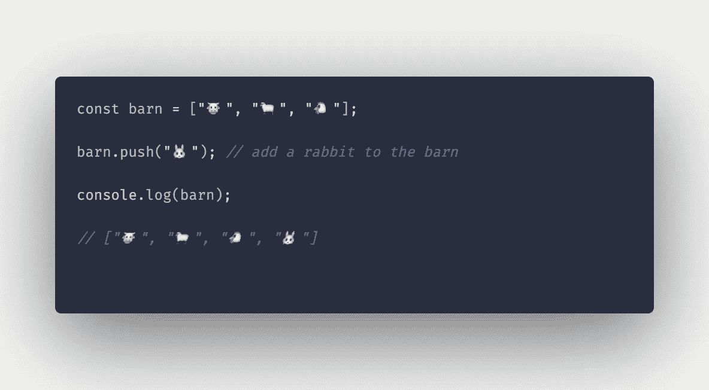

array push method example

## **未换档**

与 push 方法不同，unshift Array 方法用于将元素添加到数组的开头。它还接受一个参数—要在数组开头插入的元素:


array unshift example

## **弹出**

有时我们决定从数组末尾删除最近添加的元素。pop Array 方法移除数组中的最后一个元素。它遵循后进先出法:

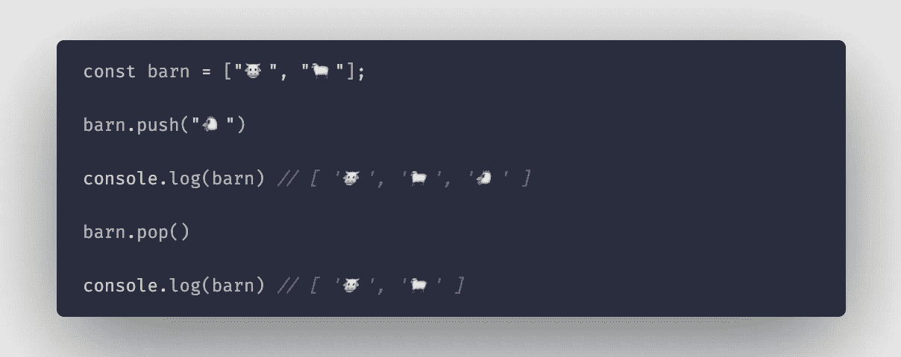

## **换档**

我们同样可以从数组的开头移除元素(FIFO 方法)。shift array 方法不带参数，它移除数组中的第一个元素。

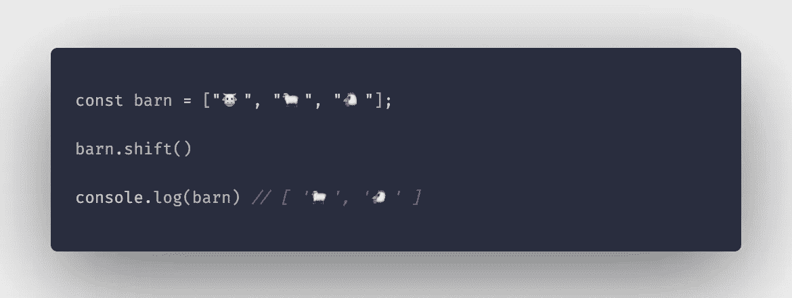

## **反转**

在 中颠倒数组 ***中元素的顺序(第一个变成最后一个，最后一个变成第一个)。此方法不接受任何参数。***

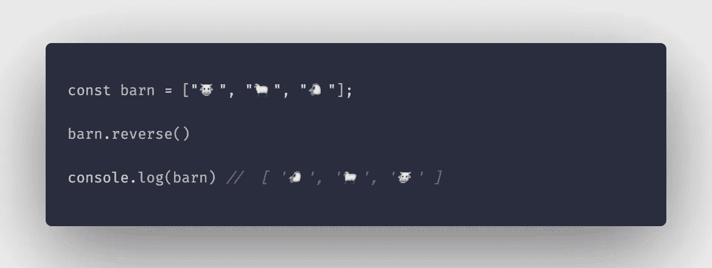

## **排序**

数组排序函数对数组的元素进行排序，并返回排序后的数组。它修改初始数组。在下面的示例中，使用 sort 方法对数组按字母顺序排列元素。

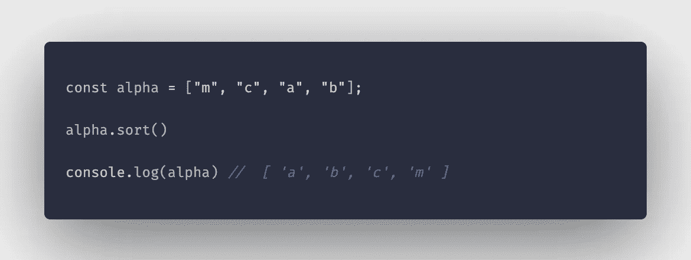

## **在**内复制

copyWithin array 方法将指定索引处的数组元素浅层复制到另一个指定索引中。复制的值将替换该位置先前存在的值。要理解这一点:

给定一个数字数组[1，2，3，4，5]，元素 1 位于索引 0 处。元素 4 在索引 3 处如果我们调用数组上的 *copyWithin(…)* 函数，用索引 3 处的元素替换索引 0 处的元素，我们得到的将是:[4，2，3，4，5]。

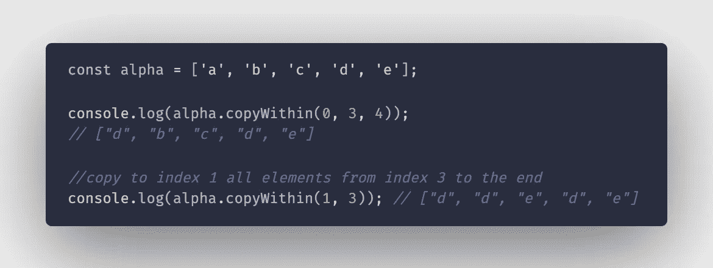

## **填充**

fill 方法将数组中具有指定值的所有元素从一个特定索引改变为另一个，*不包括结束索引*。给定谷仓变量，这里有一个类比:


如果我们用完了牛羊，决定用兔子来代替它们，我们就需要用兔子来填满谷仓里以前被牛羊占据的空间。

> 由…改编**填充**(值，开始，结束)

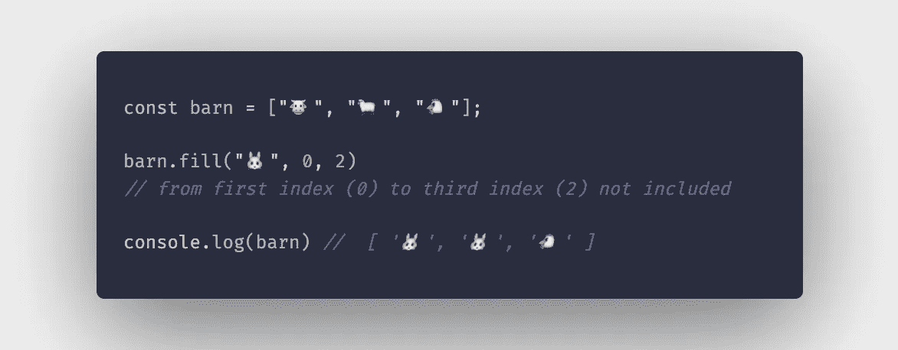

## **拼接**

splice 方法将元素插入到数组中的特定索引处。它需要三个参数。第一个参数(start)是开始插入元素的位置(index ),第二个参数(deleteCount)是要从起始索引替换/删除的元素的数量。如果设置为 0，则不会移除或删除任何元素，新元素只是插入到指定位置。

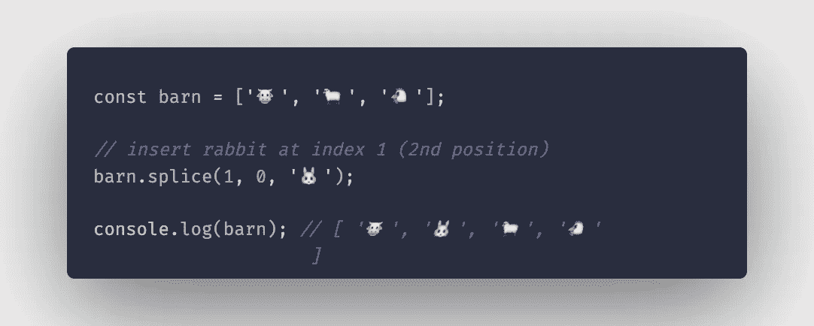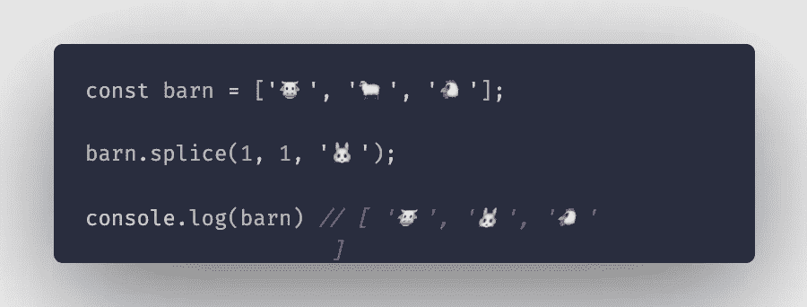

# 存取方法:

这些方法不修改原始/现有数组，而是基于原始数组返回一个新的*修改的*数组。

## **串联**

concat 方法用于将两个或多个数组连接/合并成一个数组。

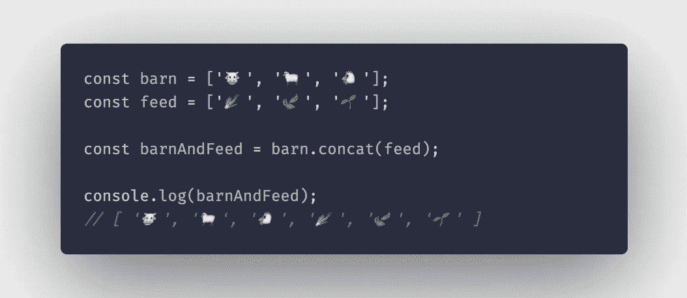

## **过滤器**

filter 方法将函数作为参数，所提供的函数作为测试每个元素的条件。创建一个只包含通过测试的元素的新数组。

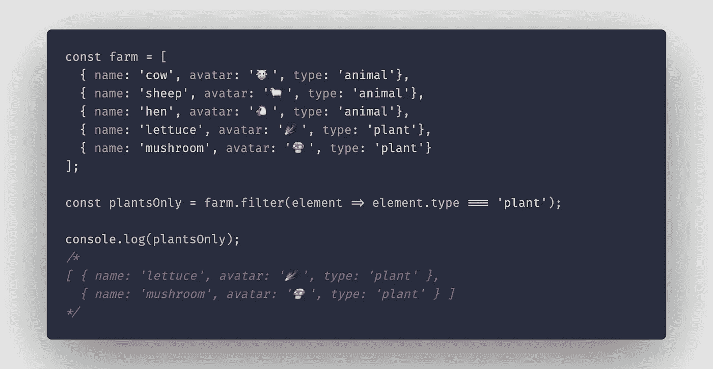

## **包括**

此方法检查数组的元素中是否包含某个值。如果找到值，则返回 true，如果没有找到匹配的元素，则返回 false。

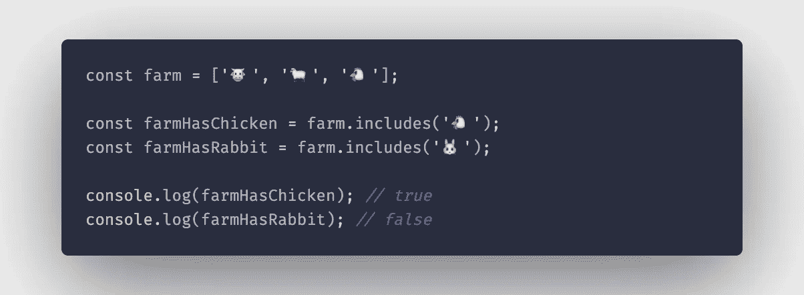

## **索引 Of**

此方法返回在任何给定数组中找到给定元素的第一个索引。如果没有找到元素，这个方法返回-1。


## **加入**

Array **join()** 方法创建并返回一个新字符串，方法是将数组中的所有元素连接成一个用逗号分隔的元素。这些元素也可以由您选择的任何分隔符(而不是逗号)分隔，只需传入一个可选的参数即可。

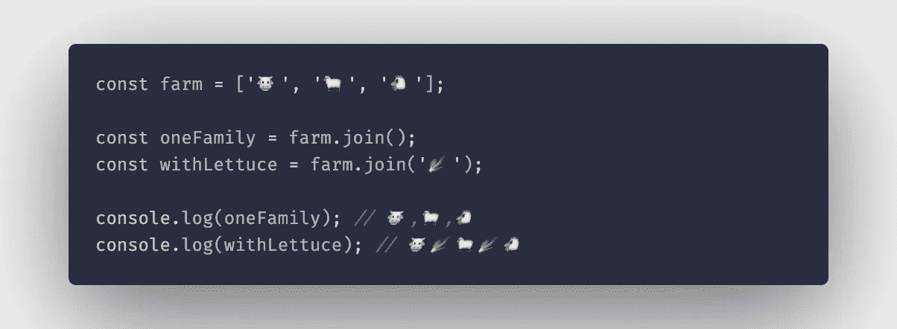

## **切片**

数组。 **slice()** 方法返回原数组一部分的浅层副本。其中副本仅包含指定的开始和结束索引内的元素(不包括结束)。slice 方法接受两个可选参数，开始索引和结束索引。如果没有提供参数，则返回数组的浅表副本。

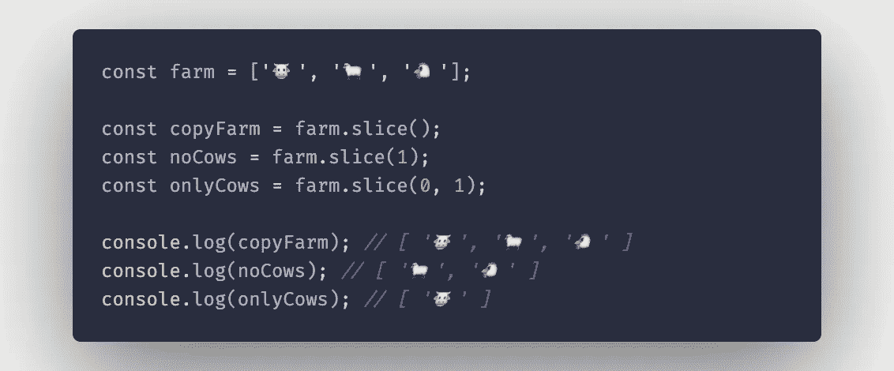

## **托串**

此方法返回数组及其元素的字符串表示形式。

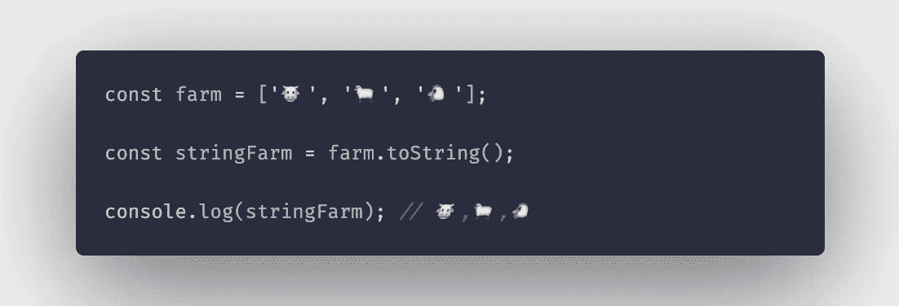

# 迭代方法

**迭代方法**用于遍历一个数组并动态访问该数组的元素。

## **每隔**

**every()** 方法测试数组中的**所有**元素是否通过了由提供的回调函数实现的测试。它返回一个布尔值(真/假)。

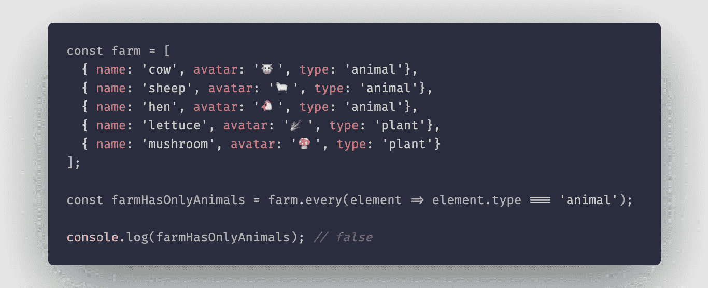

## **forEach**

**forEach()** 方法用于循环数组的元素，它接受一个回调函数作为参数，该函数又接受 3 个参数(item，index，array)。

> **项**是迭代中的当前元素。
> 
> **索引**是当前元素在迭代中的位置。
> 
> "**数组**"是被遍历的数组

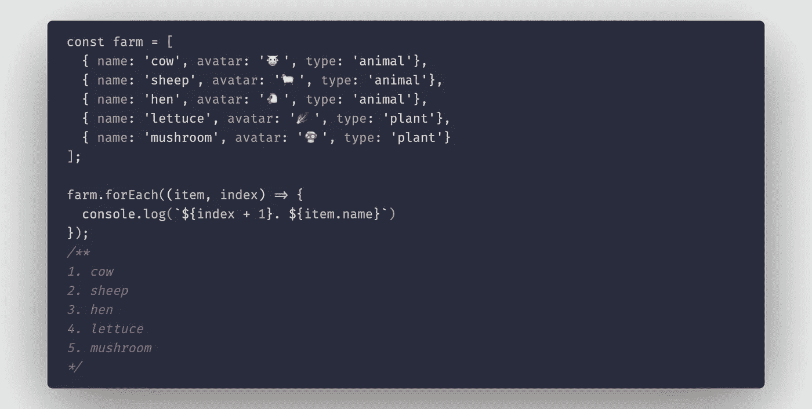

## **找到**

**find()** 方法返回所提供数组中满足所提供测试函数的**第一个元素**的**值**。它接受一个回调函数作为参数。

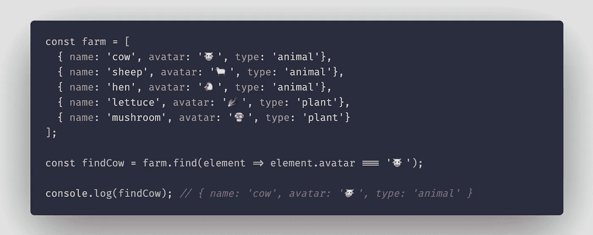

## **地图**

**map()** 方法将回调函数作为参数，并返回一个新数组，该数组包含对原始数组的每个元素调用回调函数的结果。

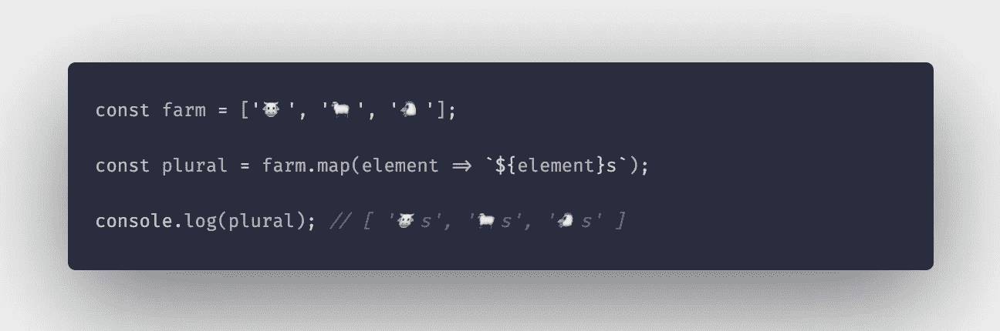

这些是 JavaScript 中最常见的数组方法，其中大部分可以在实践中使用，其他的可以一起使用来对 JavaScript 数组对象执行复杂的数据操作。

您可以找到这里使用的所有示例:

[](https://github.com/MartinsOnuoha/javascript-array-methods) [## MartinsOnuoha/JavaScript-数组-方法

### 赋值函数、取值函数和迭代组。为 MartinsOnuoha/JavaScript-array-methods 开发做出贡献，创建一个…

github.com](https://github.com/MartinsOnuoha/javascript-array-methods) 

## **用简单英语写的 JavaScript 笔记**

我们已经推出了三种新的出版物！请关注我们的新出版物，表达对它们的爱:[**AI in Plain English**](https://medium.com/ai-in-plain-english)[**UX in Plain English**](https://medium.com/ux-in-plain-english)[**Python in Plain English**](https://medium.com/python-in-plain-english)**——谢谢，继续学习！**

**我们也一直有兴趣帮助推广高质量的内容。如果您有一篇文章想要提交给我们的任何出版物，请发送电子邮件至[**submissions @ plain English . io**](mailto:submissions@plainenglish.io)**，使用您的 Medium 用户名，我们会将您添加为作者。另外，请让我们知道您想加入哪个/哪些出版物。️****