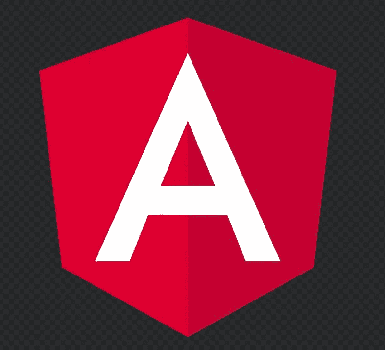
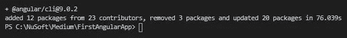
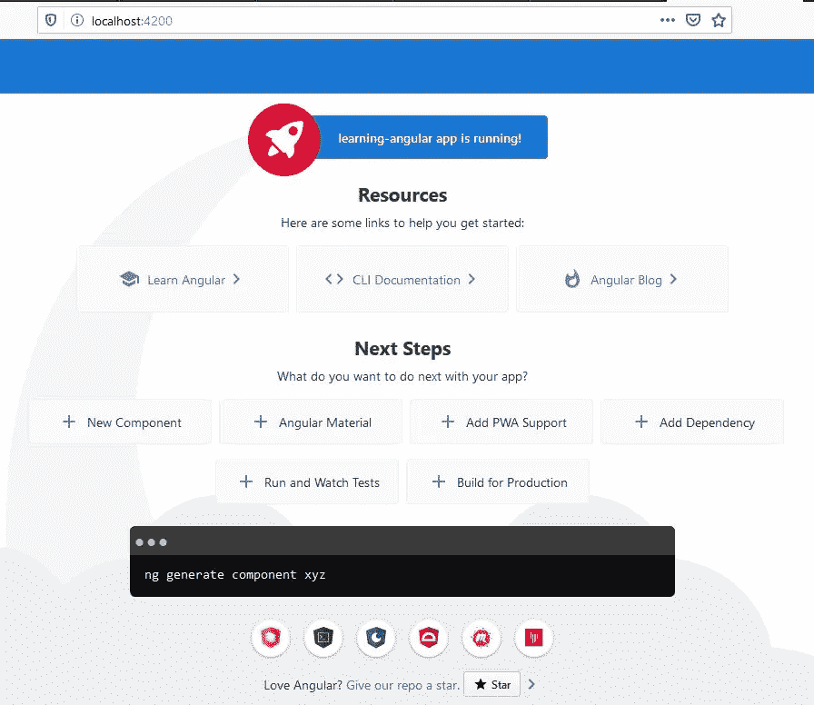
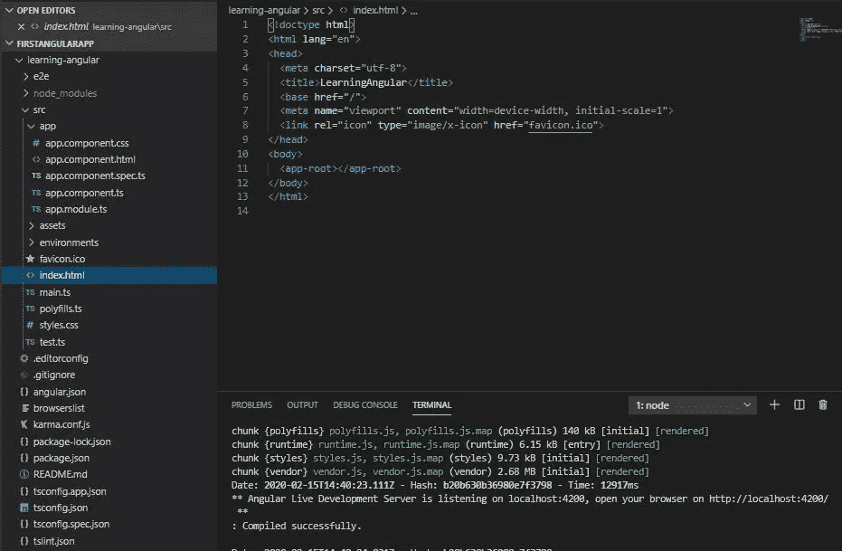
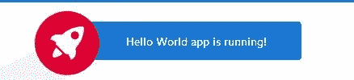
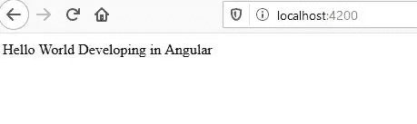

# 了解角度并创建您的第一个应用

> 原文：<https://javascript.plainenglish.io/understanding-angular-and-creating-your-first-application-4b81b666f7b4?source=collection_archive---------3----------------------->

## 基于组件的开发入门

## 第一部分-开始使用 Angular



Image courtesy of [wikipedia](https://en.wikipedia.org/wiki/Angular_(web_framework))

如果您从未接触过 Angular，并且想要构建您的第一个简单应用程序，那么您来对地方了。谢谢你加入我。

我会有意识地保持每个部分尽可能的短，同时实现一个新的目标。

在本文中，我们将开始了解 Angular 应用程序结构的基础，并开始构建我们的第一个应用程序。

# 什么是有角？

> Angular 是一个基于类型脚本的开源 web 应用程序框架，由 Google 的 Angular 团队和一个由个人和公司组成的社区领导。Angular 是来自构建 AngularJS(维基百科)的同一个团队的完全重写

虽然这是一个很好的描述。它真的没有告诉我们太多。我们可以挑选一些东西。

*   它是基于打字稿的。这很重要。这意味着在某些时候你需要学习 TypeScript。这是一本[初学者指南。](https://www.valentinog.com/blog/typescript/)
*   它是开源的(免费的)。
*   它用于构建 web 应用程序。
*   它是一个框架(不同于由库组成的 React)。区别？控制反转。好的讨论可以在[这里](https://www.geeksforgeeks.org/software-framework-vs-library/)找到。最终，这意味着我们有了一个添加功能的框架。

我们也可以通过阅读 Angular 和 React 之间的区别来获得更好的想法。

> **Angular** 和 **React** 都有基于组件的架构，这意味着它们有内聚的、可重用的和模块化的组件。但是，不同之处在于技术堆栈。 **React** 使用 JavaScript，而 **Angular** 使用 Typescript 进行 web 开发，这样更紧凑，更无错误。

我们能从这里挑出什么？**基于组件的架构。**

> 因此，我们有一个工作框架，允许我们构建模块化的、可重用的组件。
> 
> 这构成了我们的角度应用。

Angular 应用程序也倾向于用于构建单页面应用程序(SPA)。)

> 一个**单个** - **页面应用** (SPA)是一个 web **应用**或网站，它通过动态重写当前**页面**来与用户交互，而不是从服务器加载整个新的**页面**。

换句话说，单个 HTML 页面的文档对象模型或 DOM 是动态变化的。

# 我们开始吧

## 设置

我们将使用 Visual Studio 代码或 VSCode 作为我们的开发环境。如果你没有，可以在这里下载。

我们还需要安装 node.js。这个可以从[这里](https://nodejs.org/en/)下载。我们不会编写任何节点代码，但它将帮助我们捆绑和优化我们的代码，并让我们能够访问节点包管理器 npm。

## 发展

## 第一步-安装 Angular CLI

安装好工具后，我们将使用 Angular 命令行界面或 CLI 启动我们的应用程序。这是启动新项目的推荐方法。

我们需要在您的计算机上有一个目录来存储应用程序。你可以随心所欲地创建它，但我的将被简单地命名为 **FirstAngularApp。** *这是你的应用的文件夹，不是应用名*。那是以后的事。

打开 VSCode 并打开您想要的应用程序所在的文件夹( **FirstAngularApp)。)**

打开一个新的终端窗口。

如果您全局安装了 node，我们只需要安装 CLI，键入

```
npm install -g [@angular/cli](http://twitter.com/angular/cli) or npm install -g [@angular/cli@latest](http://twitter.com/angular/cli)
```

如果没有全局安装 node，首先在终端中键入。

```
npm install
```

然后安装 CLI，

```
npm install -g [@angular/cli](http://twitter.com/angular/cli) or npm install -g [@angular/cli@latest](http://twitter.com/angular/cli)
```

我们所寻求的是一个成功的安装。它看起来会像这样，



CLI and version number

## 步骤 2-创建您的应用程序

要在 FirstAngularApp 文件夹中创建应用程序，只需在终端窗口中键入以下内容。

```
ng new learning-angular
```

其中 **learning-angular** 是我们的应用程序的名称。

你会被问到两个问题。一个是要不要装角路由。默认为否。只需按回车键。

路由非常重要，它允许我们加载不同的组件来创建一个 SPA，但是可以在以后安装，而且通常是在以后安装。

关于角度路由的更多信息可在[这里](https://angular.io/guide/router)找到。

另一个问题是你想使用什么类型的造型。默认为 CSS。我们将使用这个默认值。只要按下回车键。

注意在安装时，许多文件都有扩展名， **ts** 。这是打字稿。下面一个注释。

> 实际上 **typescript 不会**直接在**浏览器**上运行。它首先被编译成 java 脚本代码。所以你**可以**说 **Typescript** 支持所有支持 java 脚本的**浏览器**。(Quora)

安装后，您会在终端窗口中看到这样的消息。

√软件包安装成功。

## 在浏览器中打开应用程序

安装成功后，导航到应用程序目录， **learning-angular** ，输入:

```
cd learning-angular
```

然后我们编译我们的应用程序，并通过输入，

```
ng serve
```

编译完成后，我们可以在浏览器中输入，

```
http://localhost:4200
```

端口 4200 是默认端口。

你会看到这样的东西。您知道这是您的应用程序，因为它会在顶部显示“learning-angular app 正在运行”并且“learning-angular”是我们应用程序的名称。

> 成功。您已经构建了您的第一个角度应用程序！



Note the message in the upper middle

## 快速浏览 Angular 项目文件

在 VSCode 中，查看文件资源管理器，您将看到 Angular 应用程序的框架结构。

在未来的部分中，我们将添加文件夹和我们自己的组件。但是现在，让我们检查一些默认值。

展开 **src** 和 **app** 文件夹，点击**index.html。**



它将在这个 HTML 页面(app-root)中呈现组件。index.html 是 SPA 中的单页。

找到 **app.components.ts** 文件并点击它。注意" **Title ="** 行。

这会将您在浏览器屏幕上看到的标题设置为您的应用程序的名称。

```
import { Component } from '[@angular/core](http://twitter.com/angular/core)';[@Component](http://twitter.com/Component)({
  **selector: 'app-root',**
 ** templateUrl: './app.component.html',**
  styleUrls: ['./app.component.css']
})
export class AppComponent {
 ** title = 'learning-angular';**
}
```

还要注意**模板 Url** 和**选择器。**选择器指的是 index.html 的 app-root。

现在找到并点击**app.component.html**(这个文件可能很大。)它是被渲染到 index.html 的 app-root 中的东西。

还有更多的事情要做，但现在已经足够了。

在 app.component.html 输入 CTRL+F 并搜索 **{{ title }}。**简单来说，**app.component.html**文件就是来自 **app.component.ts** 的**标题**被传入的模板，然后在**index.html**中被渲染，这样你就可以在浏览器中看到了。

## 开玩笑地

在 **app.component.ts** 中，修改**title = ' learning-angular '；**到**title = ' Hello World '；，**保存，如果需要，刷新浏览器。你应该看看，



Altering a component.

*这是一个微小的变化，但它让我们开始看到应用程序组件之间的关系。还有很多其他的关系。*

现在，

在 **app.component.ts** 中，在 title=( **phrase = '以角度发展'下面添加一行；**，

```
import { Component } from '[@angular/core](http://twitter.com/angular/core)';[@Component](http://twitter.com/Component)({
  selector: 'app-root',
  templateUrl: './app.component.html',
  styleUrls: ['./app.component.css']
})
export class AppComponent {
  title = 'Hello World';
  **phrase = 'Developing in Angular';**
}
```

现在*删除 app.component.html*的全部内容并键入，

```
<div>
  {{title}}
  {{phrase}}
</div>
```

如果需要，保存并刷新浏览器。因为我们去掉了所有的造型，所以没有那么漂亮了，但是看！这是你的说法。酷！



Our changes

## 打扫

我们应该通过关闭或浏览器页面并停止我们的开发服务器来进行清理。

要停止开发服务器，请在 VSCode 的终端中键入 CTRL+C，然后按 Y 键并回车。它看起来会像这样。

^CTerminate 批处理作业(是/否)？y
PS C:\ NuSoft \ Medium \ FirstAngularApp \ learning-angular>

记住，您总是可以通过键入， **ng serve 来重新启动开发服务器。**并通过键入 http://localhost:4200 浏览到它。

# 结论

我们做了很多。我们构建了 Angular 应用程序的基础，并开始了理解事物如何组合在一起的过程。我们甚至修改了代码。

在以后的文章中，我们将进一步阐述这一点。

**但现在，感谢阅读。我希望这让你开始，并享受探索！**

*在 Medium 上阅读所有你想要的文章，并通过成为 Medium 会员来帮助我继续写作，每月只需 5 美元。*

[](https://bobtomlin-70659.medium.com/membership) [## 通过我的推荐链接加入灵媒——重力井(罗伯·汤姆林)

### 作为一个媒体会员，你的会员费的一部分会给你阅读的作家，你可以完全接触到每一个故事…

bobtomlin-70659.medium.com](https://bobtomlin-70659.medium.com/membership) 

**资源:**

[官方角网站](https://angular.io/)

**第二部分**

[](https://medium.com/javascript-in-plain-english/understanding-angular-and-creating-your-second-application-baecdc4ed2e9) [## 了解 Angular 并创建您的第二个应用

### 第二部分-进一步移动角度

medium.com](https://medium.com/javascript-in-plain-english/understanding-angular-and-creating-your-second-application-baecdc4ed2e9) 

你也可以享受，

[](https://medium.com/javascript-in-plain-english/creating-your-first-react-application-db9dfe93b4f5) [## 创建您的第一个 React 应用程序

### 建立一个产品展示器，而不是简单的 Hello World！

medium.com](https://medium.com/javascript-in-plain-english/creating-your-first-react-application-db9dfe93b4f5)