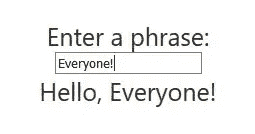

# 了解 Angular 并创建您的第二个应用

> 原文：<https://javascript.plainenglish.io/understanding-angular-and-creating-your-second-application-baecdc4ed2e9?source=collection_archive---------1----------------------->

## 基于组件的开发入门

## 第二部分-带角度的进一步移动


Courtesy of [Wikipedia](https://en.wikipedia.org/wiki/Angular_(web_framework))

如果你读了[第一部](https://medium.com/javascript-in-plain-english/understanding-angular-and-creating-your-first-application-4b81b666f7b4)，你就来到了另一个角度。谢谢你加入我。

我会有意识地保持每个部分尽可能的短，同时实现一个新的目标。

在本文中，我们将继续使用默认组件 **app.component.ts** ，但是更详细地研究组件的概念。我们还将从**数据绑定**、注入**的概念**开始，并探索一个以前未探索过的名为 **app.module.ts** 的文件；学习如何导入我们需要使用的**模块**(子包)。

# 创建项目

让我们从创建一个项目开始，重温前一篇文章中的一些内容，然后对它们进行扩展。

请随意从第一部分打开项目。它可以用于本文。

如果你想重新开始，

1.  创建一个存储应用程序的文件夹。
2.  打开 VSCode 并打开刚刚创建的文件夹。
3.  (可选)安装角度 CLI。*如果您从第一部分*开始全局安装它，则没有必要。打开终端窗口并键入，

```
npm install -g [@angular/cli@latest](http://twitter.com/angular/cli)
```

4.创建新项目。我将使用与第一部分相同的名字， **learning-angular** 。类型

```
ng new learning-angular
```

5.导航到应用程序文件夹，编译并启动开发服务器，

```
cd learning-angular
ng serve
```

6.使用端口 4200 上的本地主机打开浏览器。

```
http://localhost:4200
```

回想一下上一篇文章，Angular 应用程序是从您创建的执行各种任务的组件中创建的。在基本层面上，这些组件最终被**注入**到**index.html**文件的 **app-root** 中。

> **组件**就像**角度**应用中的基本构件。**组件**使用@ **组件**装饰器定义。一个**组件**有一个选择器、模板、样式和其他属性，用它们来指定处理**组件**所需的元数据

在 VSCode 中，重新检查以下文件

*   index.html。注意应用程序根。这是注入默认组件 app.component.ts(及其元数据)的地方。
*   默认的 TypeScript 组件。请特别注意选择器和模板。选择器是 app-root。在哪里注射。
*   app.component.html。默认组件的 HTML。这是我们刚刚打开浏览器时默认看到的所有内容。

这一切是如何组合在一起的并不难，但对于本文来说有点难。但是，您可能也想开始检查这些文件。

*   app.modules.ts(我们稍后会用到这个。)
*   主页面

通过这种追踪，您可以对引导过程有所了解。

# 使用我们的项目

## 做出一些改变

请注意默认应用程序在浏览器中运行时的 css 样式。这都存储在【app.component.html】的 **<样式>** 标签中。样式不应该在 app.component.css 里吗？让我们看看。

仔细选择并剪切**app.component.html**中 < style >和< /style >之间的所有样式数据*，并粘贴到 **app.component.css** 中。*

您可以从 app.component.css 中删除标记(确保**在 app.component.css 中也不存在**

保存并注意你的浏览器，它看起来是一样的。

这是因为 app.component.ts 和它的 **styleUrls** 属性。

```
import { Component } from '[@angular/core](http://twitter.com/angular/core)';[@Component](http://twitter.com/Component)({
  selector: 'app-root',
  templateUrl: './app.component.html',
 ** styleUrls: ['./app.component.css']**
})
export class AppComponent {
  title = 'learning-angular';
}
```

请记住，此处的标题将传递给 app.component.html 中的{{ title }}。在 app.component.html 使用 CTRL+F 并搜索
{{ title }}。

{{ }}的用途是用于[插值](https://angular.io/guide/template-syntax)(这是一种数据绑定的形式，例如从 app.component.ts 到 app.component.ts 的标题)和[模板文字](https://angular.io/guide/template-syntax)。

在 app.component.html 将{{ title }}更改为{{ phrase }}，并将 title = ' learning-angular '；在应用程序组件中，

```
import { Component } from '[@angular/core](http://twitter.com/angular/core)';[@Component](http://twitter.com/Component)({
  selector: 'app-root',
  templateUrl: './app.component.html',
  styleUrls: ['./app.component.css']
})
export class AppComponent {
 ** phrase = 'Angular Dev';**
}
```

保存并注意浏览器中的更改。

**注意**:在 TypeScript 中，等号(=)前后必须有一个空格。

让我们进一步修改 app.component.html，删除所有内容，只键入，

```
<div class="content">
    <span>Hello {{ phrase }}</span>
</div>
```

保存并注意浏览器中的更改。所有的造型，除了在**内容里的**类都没了。

在 app.component.css 中使用 CTRL+F，搜索 **content** 类。

如下添加字体大小，

```
.content {
    display: flex;
    margin: 32px auto;
    padding: 0 16px;
    max-width: 960px;
    flex-direction: column;
    align-items: center;
   ** font-size: 25px;**
  }
```

保存并注意浏览器中的更改。

## 使用指令

> **角度 9 指令**。**指令**是 DOM 中的指令。它们指定如何在**角度**中放置组件和业务逻辑。**指令**是 js 类，声明为@ **指令**。

我们将使用的指令是 ngModel。

> Angular **NgModel** 是一个内置的**指令**，它从域模型创建一个 FormControl 实例，并将其绑定到一个表单控件元素。 **ngmodel 指令**将 HTML 控件(输入、选择、文本区域)的值绑定到应用程序数据。

或者不太正式，

> ngModel 是一个指令，它绑定了 input、select 和 textarea，并将所需的用户值存储在一个变量中，我们可以在需要该值的任何时候使用该变量。它也用于表单的验证过程中。

更不正式的是，

> **ngModel 是**负责:**将视图**绑定到模型中，这是 input、textarea 或 select 等其他指令所需要的。

*最后一个定义更详细地指出了“绑定”以及“视图”和“模型”这两个词。你会听说 Angular 采用了一种*[*MVC*](https://en.wikipedia.org/wiki/Model%E2%80%93view%E2%80%93controller)*(模型视图控制器的设计模式。)*

我想做的是有一个 HTML ，其中用户可以输入一个短语，并让它实时显示在页面上。

修改你的 app.component.html 如下:

```
<div class="content">
Enter a phrase: <input type='text' [(ngModel)]='phrase' />
Hello, {{ phrase }}
</div>
```

这里我们已经告诉 **ngModel** 指令**监听**对**短语**的更改并显示它们。

然而，仅此还不够。即使 ngModel 是 Angular 内置的，我们也必须导入它并告诉 Angular 使用它。这在 **app.model.ts** 中完成。

*我们将包含一个 TypeScript****import****语句，并将导入的内容添加到 Angular* ***imports 数组中。***

打开 **app.model.ts** ，添加新的导入语句，并将 **FormsModule** 添加到导入数组(粗体。)

```
import { BrowserModule } from '[@angular/platform-browser](http://twitter.com/angular/platform-browser)';
import { NgModule } from '[@angular/core](http://twitter.com/angular/core)';
**import { FormsModule } from '**[**@angular/forms**](http://twitter.com/angular/forms)**';**import { AppComponent } from './app.component';[@NgModule](http://twitter.com/NgModule)({
  declarations: [
    AppComponent
  ],
  imports: [
    BrowserModule,
   ** FormsModule**
  ],
  providers: [],
  bootstrap: [AppComponent]
})
export class AppModule { }
```

你可以在这里阅读更多关于 FormsModule [的内容。](https://angular.io/api/forms/FormsModule)

保存，您应该能够在输入时在浏览器上看到输出。



Result if using ngModel and binding it to phrase

## 打扫

我们应该通过关闭或浏览器页面并停止我们的开发服务器来进行清理。

要停止开发服务器，请在 VSCode 的终端中键入 CTRL+C，然后按 Y 键并回车。

记住，你总是可以通过输入，
**ng serve 来重启开发服务器。**并通过键入 [http://localhost:4200 浏览到它。](http://localhost:4200.)

# 结论:

在本文中，我们学习了一些关于绑定、指令和模块的知识，这使我们第一次接触到 app.modules.ts。

有了这些知识和更多的阅读，您就可以开始为我们的简单应用程序添加额外的功能了。

在以后的文章中，我们将进一步阐述这一点。

但是现在，感谢你的阅读，享受探索吧！

*在 Medium 上阅读所有你想要的文章，并通过成为 Medium 会员来帮助我继续写作，每月只需 5 美元。*

[](https://bobtomlin-70659.medium.com/membership) [## 通过我的推荐链接加入灵媒——重力井(罗伯·汤姆林)

### 作为一个媒体会员，你的会员费的一部分会给你阅读的作家，你可以完全接触到每一个故事…

bobtomlin-70659.medium.com](https://bobtomlin-70659.medium.com/membership) 

**资源**:

[官方角网站](https://angular.io/)

**第一部分**

[](https://medium.com/javascript-in-plain-english/understanding-angular-and-creating-your-first-application-4b81b666f7b4) [## 了解角度并创建您的第一个应用

### 第一部分-开始使用 Angular

medium.com](https://medium.com/javascript-in-plain-english/understanding-angular-and-creating-your-first-application-4b81b666f7b4) 

你也可以享受，

[](https://medium.com/javascript-in-plain-english/creating-your-first-react-application-db9dfe93b4f5) [## 创建您的第一个 React 应用程序

### 建立一个产品展示器，而不是简单的 Hello World！

medium.com](https://medium.com/javascript-in-plain-english/creating-your-first-react-application-db9dfe93b4f5)