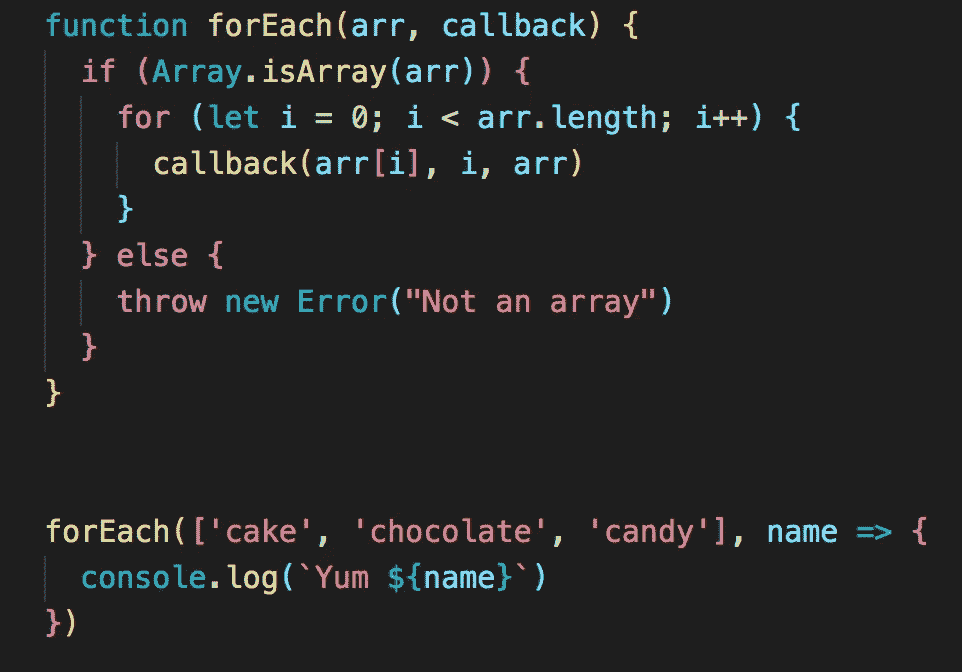

# 理解 JavaScript 中的数组方法

> 原文：<https://javascript.plainenglish.io/understanding-array-methods-in-javascript-267f5b7561f0?source=collection_archive---------7----------------------->

使用数组方法非常方便，让生活变得更容易，直到你遇到一个 bug，不明白我们的方法为什么没有“魔力”，我们调试代码的时候会困难得多。我想回顾一下我一直在使用的最常见的数组方法，并看一看幕后发生了什么。

1.  ***【forEach()****——允许我们遍历数组，并在执行回调函数时对每个元素执行特定的操作。 *forEach()* 将默认返回 undefined。*

**

*2.***【map()***——允许我们在执行回调函数时返回原始数组的副本，以对数组中的每个元素执行特定的操作。*

**

*3.***【filter()***——允许我们返回一个新数组，其中包含所有与回调函数中的条件匹配的元素。*

**

*感谢阅读*