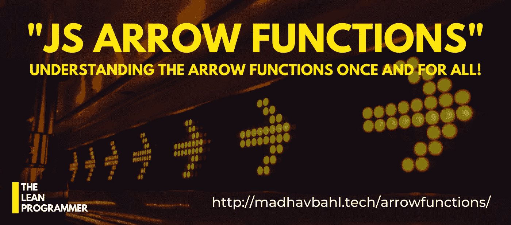
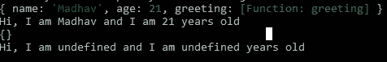

# 一劳永逸地理解箭头功能！

> 原文：<https://javascript.plainenglish.io/understanding-arrow-functions-once-and-for-all-ad5b55fa42e?source=collection_archive---------1----------------------->

## JavaScript 中的箭头函数并不是一个新概念，仍然有许多人在为它而挣扎，让我们一劳永逸地理解它吧！



Arrow 函数在 JavaScript 开发人员社区中被广泛使用，但是对于新开发人员来说，理解完整的概念有点困难。所以在这篇博客中，我们将澄清你可能对箭头函数的概念和困惑。

希望你看完这篇博客后从`no clue`转到`I know this thing`:)

请注意，你可以在下面提到的 GitHub repo 中找到我将在这篇博客中使用的所有代码和示例。请访问知识库以了解更多信息，如果您留下一颗:D 星，我会非常高兴

[](https://github.com/MadhavBahlMD/dailyjs) [## MadhavBahlMD/dailyjs

### 编码很好玩！每天都做💯 💯掌握最牛逼的语言，一天一个概念！

github.com](https://github.com/MadhavBahlMD/dailyjs) 

好了，不再废话，让我们开始吧！

# 大概念

ES6 中引入的 arrow 函数允许我们用更短的语法编写函数。

如果你在 ES6 之后开始学习 JavaScript，你一定会经常遇到箭头函数，它们可能会让你困惑。不要害怕，今天，让我们消除所有的疑虑！

如果你是从其他语言进入 JS 的，arrow 函数的语法可能看起来有点新，但是一旦你理解了它，我敢肯定，你就再也不会回到普通的`functions`(除非必要)。

语法上更容易理解。典型的箭头函数如下所示:

```
(arg1, arg2) => {
  ...
  ...
}
```

如您所见，语法看起来像普通函数的简短版本，关键字`function`已经被删除，取而代之的是，在花括号前添加了一个粗箭头。

## 不要害怕！

不，吓到程序员的不是语法，是别的东西！

语法不会吓到你，用例会。举个例子，

*   一行程序函数，
*   在单个参数的情况下不需要括号，
*   `this`的用法。

让我们在接下来的部分中讨论它们！

# 句法

如上所述，删除 function 关键字，并在参数后放置一个粗箭头。

**正常功能**

```
function myFunc (arg1, arg2, arg3) {
    ...
    ...
}
```

**箭头功能**

```
let myFunc = (arg1, arg2, arg3) => {
    ...
    ...
}
```

我希望语法没有吓到你，因为令人困惑的事情还在后面:')

在此之前，让我们看一些例子。

## 示例 1

**写一个函数，接受 2 个数字作为参数，并返回它们的和**

**输出:**

```
Normal: 10 + 40 = 50
Arrow: 10 + 40 = 50
One Liner: 10 + 40 = 50
```

## 让我们看另一个简单的例子

**创建一个函数，该函数接受一个数字数组并返回总和**

**输出:**

```
Normal: Sum of elements of 1,2,3,4,5 = 15
Arrow: Sum of elements of 1,2,3,4,5 = 15
One-Liner: Sum of elements of 1,2,3,4,5 = 15
```

你可能已经从上面的两个例子中清楚地理解了语法，现在让我们来看两个变化。

# 变化

基于用例的语法有这些变化，可以进一步减少箭头功能。同样，在这些用例中并不强制使用它们，但话说回来，这样做是有好处的。

-> Arrow Functions <-

## 1.俏皮话

即使箭头函数比普通函数更简洁，它们仍然可以被简化。

如果 arrow 函数内部只有一条语句，它可以进一步简化为一行。

**示例**

```
const add = (a, b) => a+b;
```

一行程序遵循隐式返回的概念，即执行写在粗箭头(没有花括号)后面的单个语句，并返回结果。

## 2.单一参数优势

我们可以进一步简化箭头函数。如果只有一个参数，就不需要括号。

**示例**

```
const square = a => a*a;
```

# 让大家困惑的事情，wtf 就是“这个”？

与普通功能相比，箭头功能对`this`的处理不同。很简单的话，在箭头函数中，没有`this`的绑定。

在常规函数中，`this`代表**调用函数**的对象。

但是，在箭头函数中，`this`关键字总是代表**定义箭头函数**的对象。

## 概念 1:箭头函数不绑定”`this"`

正如我所说，箭头函数不绑定`this`。所以在箭头函数中使用`this`时你必须非常小心。

**在正常功能的情况下，您可以这样做—**

```
// Normal function
const student1 = {
    name: 'Madhav',
    age: 21,
    greeting: function () {
        console.log (this);
        return `Hi, I am ${this.name} and I am ${this.age} years old`;
    }
}
/**
 * Output should be 
 * **"Hi, I am Madhav and I am 21 years old!"**
 */
console.log (student1.greeting ());
```

**在箭头功能**时不起作用

```
// Arrow function
const student2 = {
    name: 'Madhav',
    age: 21,
    greeting: () => {
        console.log (this);
        return `Hi, I am ${this.name} and I am ${this.age} years old`;
    }
}
/**
 * Arrow functions don't bind `this`
 * **"Hi, I am undefined and I am undefined years old"**
 */
console.log (student2.greeting ());
```



## 概念 2:“这”代表什么？

**在常规函数中，** `**this**` **代表调用该函数的对象。因此，在这种情况下我们不会得到想要的结果-**

```
// Using Normal Function
const students1 = {
    names: ['Madhav', 'John', 'Amanda'],
    team: "JS Enthusiasts",
    greeting: function () {
        return this.names.map (function (name) {
            return `Member - ${name} - belongs to team - ${this.team}`;
        });
    }
};
console.log (students1.greeting());
```

**输出:**

```
**[ 'Member - Madhav - belongs to team - undefined',
  'Member - John - belongs to team - undefined',
  'Member - Amanda - belongs to team - undefined' ]**
```

为了解决这个问题，我们可以使用 `**.bind()**` **方法**

```
// How to fix? .bind(this)
const students2 = {
    names: ['Madhav', 'John', 'Amanda'],
    team: "JS Enthusiasts",
    greeting: function () {
        return this.names.map (function (name) {
            return `Member - ${name} - belongs to team - ${this.team}`;
        }.bind(this));
    }
}
console.log (students2.greeting ());
```

**输出:**

```
**[ 'Member - Madhav - belongs to team - JS Enthusiasts',
  'Member - John - belongs to team - JS Enthusiasts',
  'Member - Amanda - belongs to team - JS Enthusiasts' ]**
```

**这里，箭头功能进入画面…**

在箭头函数中，`this`关键字总是代表定义箭头函数的对象。因此，我们可以在`map`帮助器内部使用箭头函数。

```
const students3 = {
    names: ['Madhav', 'John', 'Amanda'],
    team: "JS Enthusiasts",
    greeting: function () {
        // Arrow function inside map()
        return this.names.map ((name) => {
            return `Member - ${name} - belongs to team - ${this.team}`;
        });
    }
}
console.log (students3.js);
```

**输出:**

```
**[ 'Member - Madhav - belongs to team - JS Enthusiasts',
  'Member - John - belongs to team - JS Enthusiasts',
  'Member - Amanda - belongs to team - JS Enthusiasts' ]**
```

我希望这些例子澄清了你的概念。但这还没有结束，你不会得到信心，直到你亲自尝试，所以这里有一些练习题给你。

# 给你的作业

我同意很难做出只与箭头函数相关的问题，所以对于你的练习来说，试试这些一般的问题**但是问题是，你必须使用箭头函数。**

所以为所有这些程序写一个函数，那一定是一个箭头函数。

1.  写一个函数打印卢卡斯级数直到`n`项
2.  给定一个句子，写一个函数使其大小写一致。
3.  编写一个接受参数`n`的函数，并打印如下模式- (n=4)

```
*      *
**    **
***  ***
********
***  ***
**    **
*      *
```

1.  写一个函数，按字母顺序对列表中的名字进行排序。
2.  写一个函数来打印数组中所有重复的元素。

> *以上只是为了练习，随时补充更多！*

就是这样！希望这篇文章对你有所帮助。如果你喜欢这个博客，请留下一些掌声。


如果你想讨论什么，随时联系我，:D

如果您能给我反馈、建议或询问，我会非常高兴。此外，我喜欢交新朋友，我们可以成为朋友，只要给我发邮件。

> 非常感谢你一直读到最后。如有需要可以联系我以防万一:
> 邮箱:theleanprogrammer@gmail.com
> 网页:[*http://madhavbahl.tech/*](http://madhavbahl.tech/) *Github:*[*https://github.com/MadhavBahlMD*](https://github.com/MadhavBahlMD) *LinkedIn:*[*https://www.linkedin.com/in/madhavbahl/*](https://www.linkedin.com/in/madhavbahl/) *insta gram:*[*https://www.instagram.com/theleanprogrammer/*](https://www.instagram.com/theleanprogrammer/)