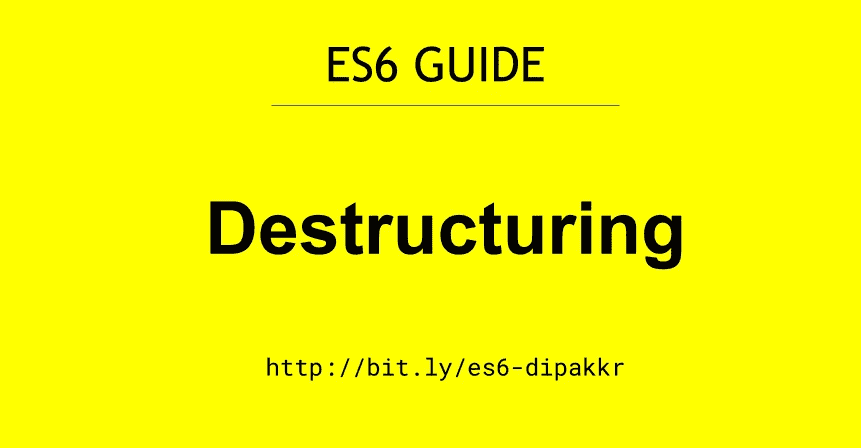

# 了解解构|ES6 指南

> 原文：<https://javascript.plainenglish.io/understanding-destructuring-es6-guide-2aa6953fa770?source=collection_archive---------6----------------------->



析构是 ES6 中引入的新特性，用于解包数组中的值或对象中的属性。它有助于提高代码的可读性和性能。

有两种类型的析构:

1.  数组析构
2.  对象析构

让我们通过代码来理解，析构是如何工作的！

首先，我们将使用 JavaScript ES5 语法解决一个问题。然后稍后使用`destructuring`这个概念来比较两个代码。

> **ES5 实施**

```
// Example 1 - Object Destructuring

    var user = {
    	name : 'Deepak',
      username : 'dipakkr',
      password : 12345
    }

    const name = user.name; // Deepak
    const username = user.username; // dipakkr
    const password = user.password // 12345

    //Example 2 - Array Destructing

    *c*onst fruits = ["apple", "mango", "banana", "grapes"];

    const fruit1 = fruits[0];
    const fruit2 = fruits[1];
    const fruit3 = fruits[2];
```

> **使用析构语法的 ES6 实现**

```
// Example 1 - Object Destructuring

    var user = {
    	name : 'Deepak',
      username : 'dipakkr',
      password : 12345
    }

    const {name, username, password} = user;
    console.log(name);
    console.log(username);
    console.log(password);

    //Example 2 - Array Destructing

    const fruits = ["apple", "mango", "banana", "grapes"];

    const [fruit1, fruit2, fruit3] = fruits;

    console.log(fruit1); // apple
    console.log(fruit2); // mango
    console.log(fruit3); // banana
```

ES6 有很多新特性，比如[模板文字](https://github.com/dipakkr/ES6-Guide#2-template-literals)、[默认参数](https://github.com/dipakkr/ES6-Guide#3-default-arguments)、[箭头函数](https://github.com/dipakkr/ES6-Guide#4-arrow-functions)、[映射、减少和过滤](https://github.com/dipakkr/ES6-Guide#6-map-reduce-and-filter)、[剩余和扩展操作符](https://github.com/dipakkr/ES6-Guide#8-rest-and-spread-operator)、[对象文字](https://github.com/dipakkr/ES6-Guide#9-object-literals)、[类](https://github.com/dipakkr/ES6-Guide#10-classes-in-es6)等等。

*如果您用 javascript 编写代码，但仍然不熟悉 ES6 概念。你应该考虑谷歌一下这些话题。*

在这里我写了一篇*[***学习 ES6***](https://github.com/dipakkr/ES6-Guide) 的综合指南，请大家考虑查阅。*

*如果你喜欢这篇文章，请鼓掌！！*

**更多类似内容请关注我->*[*Twitter*](https://twitter.com/diipakkr)|[insta gram](http://instagram.com/diipakkr)|[LinkedIn](https://www.linkedin.com/in/dipakkr/)*