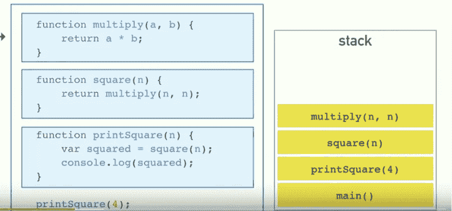
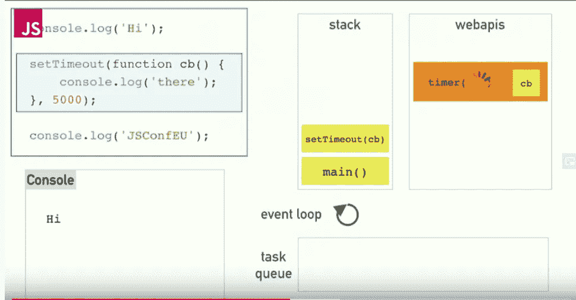

# 了解 JavaScript 调用堆栈、任务队列和事件循环

> 原文：<https://javascript.plainenglish.io/understanding-javascript-call-stack-task-queue-and-event-loop-2d586d5ad4db?source=collection_archive---------6----------------------->

## 如果 JavaScript 是单线程的，异步函数是如何工作的？

> 声明:这篇文章很大程度上受到了 Phillip Roberts 在 2014 年 EUConf 上的一次会议[演讲](https://www.youtube.com/watch?v=8aGhZQkoFbQ&t=635s)的启发。

JS 的批评者喜欢指出的一点是，它是单线程的。当我开始用 JS 编码时，这让我很困惑。那 JS 是怎么处理异步函数的呢？我们怎样才能让像`setTimeout()`这样的东西独立于主线程工作呢？希望在这篇文章结束时，你能找到所有这些问题的答案。本文的另一个目标是解释 JS 的一些核心高级概念:调用栈、任务队列和事件循环，它们是理解 JS 如何在浏览器中工作的基础。

假设您为一个 web 应用程序编写了一些 JS 代码，并发布了这些代码。JS 代码在浏览器上运行。浏览器怎么知道该怎么处理？浏览器能够运行 JS 代码，因为它有一个 JS 引擎，对于 Chrome 来说就是 [V8](https://en.wikipedia.org/wiki/V8_(JavaScript_engine)) JavaScript 引擎。简单来说，V8 知道如何把 JS 代码转换成机器码。

浏览器不仅仅是 JavaScript 引擎。它有自己的一套 API，称为 Web APIs。`setTimeout()`是这套 API 的一部分。当你调用像`setTimeout()`这样的函数时，你使用的是浏览器向你展示的 API 函数。

*浏览器能够运行 JS 代码，因为它有一个 JS 引擎，对于 Chrome 来说就是*[*V8*](https://en.wikipedia.org/wiki/V8_(JavaScript_engine))*JavaScript 引擎。*

我们已经讨论了浏览器的两个关键部分:JS 引擎和 Web APIs。现在让我们继续讨论 JS 的单线程特性。当我们说 JS 是单线程的时候，我们的意思是 JS 有**一个调用栈**。调用栈是一个简单的数据结构，它有两个功能:它只能从顶部添加(推入)或移除(弹出)项目。想象一下你洗完碗碟后放在一个桶里。您只能从顶部添加或移除一道菜。当一个函数被调用时，它被添加到调用栈中，当它返回时，它被弹出。这就是 JS 跟踪何时运行哪些函数的方式。一个直观的例子:

Screenshot taken from [https://www.youtube.com/watch?v=8aGhZQkoFbQ&t=635s](https://www.youtube.com/watch?v=8aGhZQkoFbQ&t=635s) .

当我们说 JS 是单线程的时候，我们的意思是 JS 有**一个调用栈**。调用堆栈是一个简单的数据结构，它有两个功能:它只能从顶部添加(推入)或移除(弹出)一个项目。

假设 JS 只有一个调用栈，栈底的函数依赖于它们上面的函数:在它们上面的所有函数执行完之前，它们不会运行。如果我们在堆栈上放置一个进行网络调用的异步函数，它将冻结浏览器直到完成，因为网络调用可能相对较慢。这样会让用户体验苦不堪言。那么，我们如何解决这个问题呢？输入任务队列。

一张图胜过千言万语:

Screenshot taken from [https://www.youtube.com/watch?v=8aGhZQkoFbQ&t=635s](https://www.youtube.com/watch?v=8aGhZQkoFbQ&t=635s) .

因为`setTimeout()`是一个异步调用，在我们的例子中，它将在 5 秒钟后完成。当`setTimeout()`被点击时，它被推到堆栈上，并触发 web apis 的`timer()` 功能。当`timer()`完成时，它将回调函数推送到**任务队列**，这是一个基于队列的数据结构，保存回调函数。

然后是**事件循环**，它的任务是查看任务队列中是否有项目，如果有，它等待调用堆栈清空，然后将项目从任务队列推到调用堆栈。这就完成了一个异步函数的完整周期。

**有趣的花絮:**如果你想让一段代码在调用栈为空时运行，把它包装在一个 setTimeout()中，延迟 0 秒。即使它是 0，它也将被事件循环从任务队列中取出，并在堆栈为空时被推送到调用堆栈。

**有趣花絮 2:** [工作队列](http://www.ecma-international.org/ecma-262/6.0/#sec-jobs-and-job-queues)是留给承诺的。*【then-able】承诺代码存储在作业队列中。*

## *让我们回顾一下:*

*   *JS 是单线程的，这意味着它只有一个调用栈。*
*   *当调用函数时，它们被推到调用堆栈上。当它们返回/完成时，它们被弹出。*
*   *异步函数不是 JS 引擎的一部分。它们由 Web APIs 公开。当您使用 setTimer(callback，timeInMs)时，它被推送到调用堆栈上，触发 Web API 中的一个方法，即 Timer(callback，timeInMs ),并从调用堆栈中弹出，释放调用堆栈。*
*   *当 Web API 栈中异步调用触发的函数完成时，即 timer(callback，timeInMs)，异步方法的回调函数被推送到回调队列。*
*   *事件循环的工作是将东西从回调队列中移出，并放回调用堆栈。只有当调用堆栈为空时，它们才会这样做。*